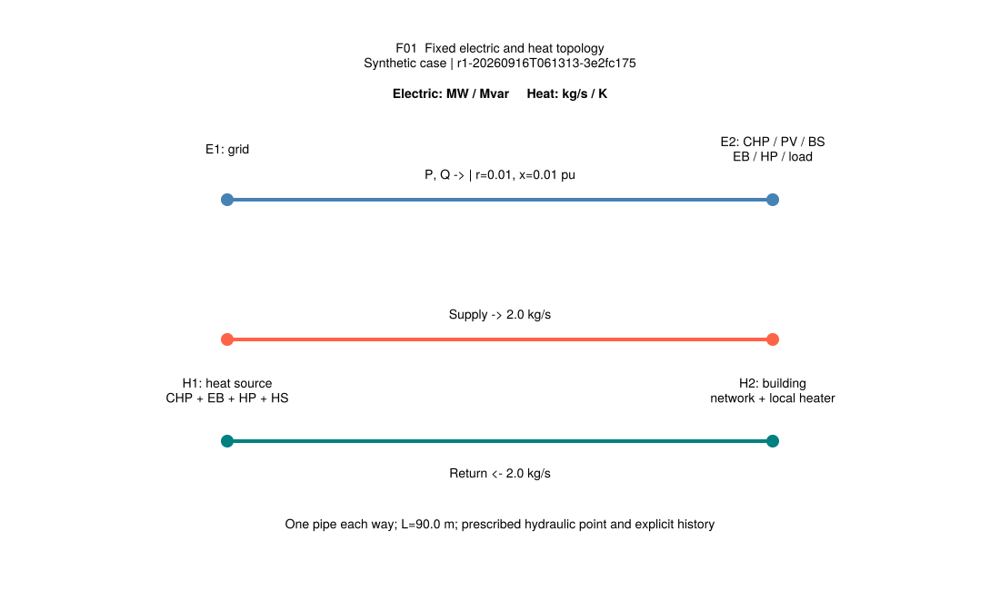
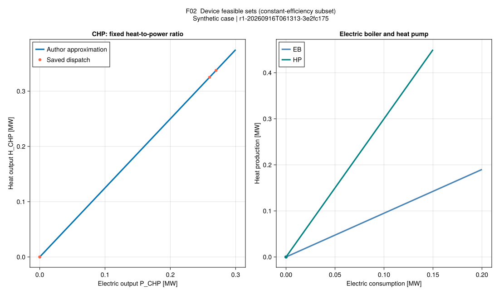
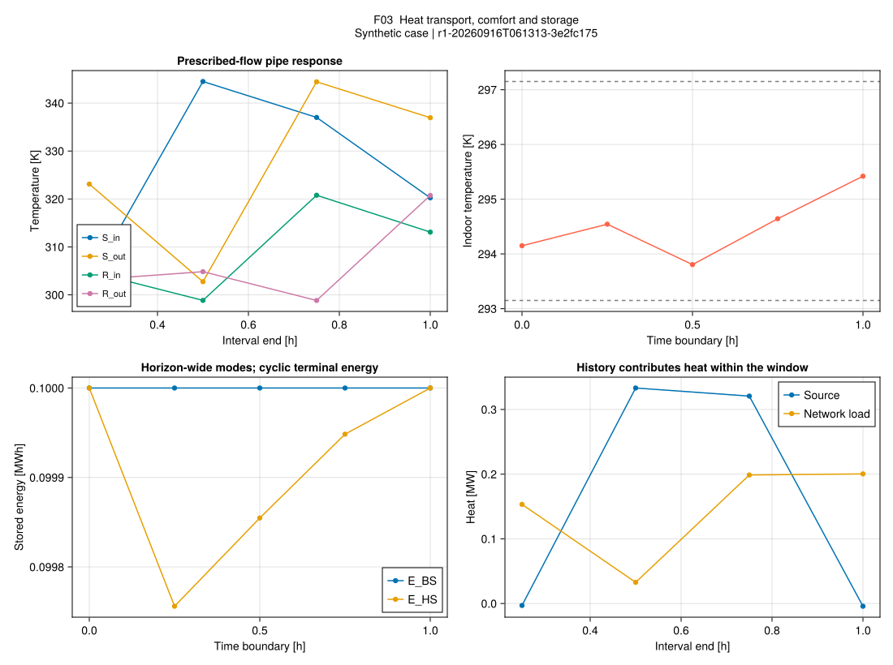
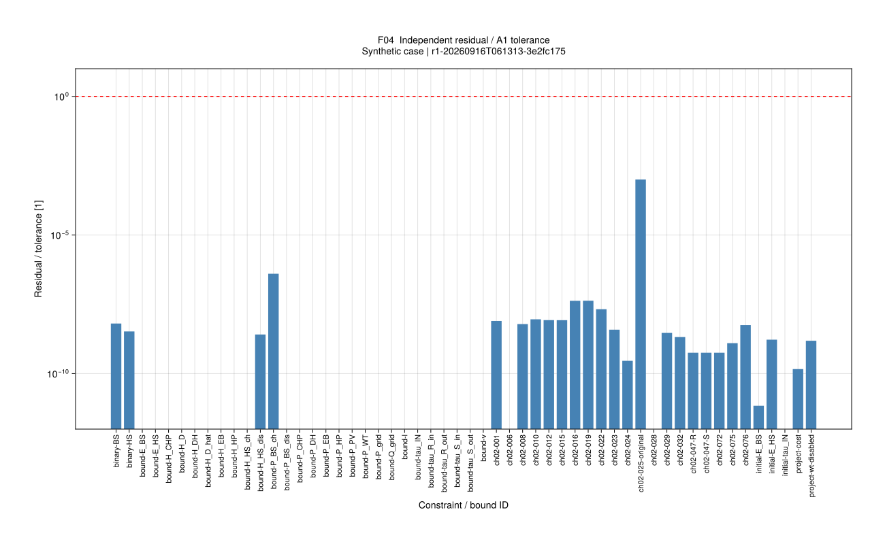

# [R1 微型案例：运行与本批状态](@id ch02-status)

## 先明确这个例子证明什么

例子为两个电节点、一条配电支路、两个热节点、一对供回水管、四个 15 分钟时段。
所有参数来自 `configs/r1/micro.toml`，明确标为 **synthetic**；没有从作者图表反推后冒充原始输入。
它用于检查方程转录、单位、索引、求解和保存/重读流程，不能证明论文中的经济性或韧性提升。

本批已登记全部 **76 个第 2 章编号公式**，并解释 PDF 40–41 没有编号公式的交易机制。
未解原式疑点、一般模型与已实现特例见 [模型详解](@ref ch02-models)。
R0 只完成这组原页的核读和可实施边界划分；全论文 R0 与全部 R1 仍未完成。

## 从零走一次闭环

在 VS Code 打开项目根目录，终端使用项目 Julia 版本。运行命令也有 `PaperRebuild: R1 ...` 任务入口。

```sh
julia +1.12.6 --startup-file=no --project=. scripts/bootstrap.jl
julia +1.12.6 --startup-file=no --project=. scripts/check_ch02.jl
julia +1.12.6 --startup-file=no --project=. scripts/test.jl
julia +1.12.6 --startup-file=no --project=. scripts/run_r1.jl
```

最后一条打印独立运行目录，例如 `results/runs/r1-<UTC时间>-<随机ID>`。复制这条路径替换下文 `<run>`：

```sh
julia +1.12.6 --startup-file=no --project=. scripts/validate_r1.jl <run>
julia +1.12.6 --startup-file=no --project=. scripts/report_r1.jl <run>
julia +1.12.6 --startup-file=no --project=docs scripts/plot_r1.jl <run>
julia +1.12.6 --startup-file=no --project=docs docs/make.jl
```

首次安装会下载/预编译，耗时不算科学模型求解时间。普通包导入没有求解、写结果、加载 CairoMakie 或申请 Gurobi 许可。
代码修改后，先执行 `scripts/check_ch02.jl --sync` 更新公式、符号与实现测试映射，再执行只读检查。

### 一条手算到图表的路线

1. 读 [CHP 热电关系](@ref eq-ch02-001)：0.2 MW 电、40% 电效率、10% 损耗，应得到0.25 MW热。
2. 在 Julia REPL 输入 `using PaperRebuild; chp_heat(0.2, 0.4, 0.1)`，结果0.25；同一算例有 doctest。
3. 查看 `build_r1_model` 的 `ch02-001` 约束，确认两个功率来自同一时段。
4. 运行微型案例，在 `timeseries.csv` 读取 `P_CHP/H_CHP`，每个调度点应在 F02 的可行线段上。
5. 从 `residuals.csv` 查看 `ch02-001` 的 MW 残差及门槛；不要只凭图上“差不多重合”认定通过。

### 保存内容

| 文件 | 用途 |
| --- | --- |
| `case.toml` | 本次规范化输入副本；独立哈希，与原始输入哈希分别保存 |
| `solution.toml` | 求解状态、预算、目标、可得的界、每个模式状态和数值解 |
| `metadata.toml` | UTC run ID、Julia/源码/锁文件信息、原始与副本输入哈希、合成来源 |
| `validation.toml` / `residuals.csv` | 独立重算后的总体判定与逐项残差 |
| `timeseries.csv` / `states.csv` | 时段功率温度与边界状态，保留单位映射 |
| `figures/` | F01–F04 的 SVG/PNG、每图源数据和生成配置 |

新运行不覆盖旧目录。重绘只读保存结果；默认写其 `figures/`，如需保留旧图版本，传入新的第二个目录参数。
原始运行目录忽略 Git，核查后的摘要与教学图放 `results/summaries/`、文档资产目录。

## 已实施与仍未实施

| 组件 | 本批可运行范围 | 保留边界 |
| --- | --- | --- |
| CHP | 常效率热电比与上下界；三次效率单独求值 | 变效率耦合分母待澄清；启停爬坡未纳入 |
| PV/WT | 光伏可用式与调度界；风电原式反例 | 风电调度阻断，案例为零 |
| EB/HP | 常 COP 与电容量；显式电热耦合 | 温度/部分负荷效率未建模 |
| BS/HS | 状态、互斥、损耗、初值、周期末值 | z 按全窗口；HS非单位效率不接入耦合模型 |
| 电网 | 两节点固定径向 SOCP，另算原等式残差 | 一般树与动态重构未实现 |
| 热网 | 恒定正流、两管热传输、混合函数、历史 | 水压可行性、变流量/逆流与完整 PDE 未实现 |
| 建筑 | 隐式状态、舒适界、户用电热 | 系数为合成离散标定，未恢复作者建筑参数 |
| 市场/重构 | 完整位置说明与公式登记 | 无市场出清、开关/阀决策实现 |

## 本地验收证据

2026-09-16，Julia 1.12.6：正式 `Pkg.test` **66/66**（含3项既有骨架测试、63项本批科学/接口断言）；
本机 Gurobi 与 Clarabel 同模型对照 **4/4**。Documenter 严格构建及手算 doctest 通过。
开放运行 `r1-20260916T061313-3e2fc175`，4种全窗口模式中2种可行、2种不可行；目标 **24.332358893** 教学货币单位，
报告界 **24.332358851**。全部独立残差相对门槛的最大比例约 **0.00101**，原支路等式也通过。

Gurobi 默认容差运行 `r1-20260916T055237-75fa9f65`：求解器最优、松弛残差通过，
原支路等式最大残差 **8.9889e-6**，超过 **1e-6** 门槛，因此原式验收失败。
更严求解参数的新运行 `r1-20260916T061409-316ae2bf` 通过两类残差与目标对照；旧失败记录保留。
这是求解精度差异的局部证据，不是 SOCP 在所有算例精确的证明。

权威运行与失败摘要在工作区 `results/summaries/r1-first-batch/comparison.toml`，
对应子目录包含配置、元数据、解、残差、图源；本批未提交，远程站点暂不含这些改动。

## 本批科学图

图中英文标签用于避免跨平台字体缺失；本页提供中文解释。每幅均标明合成来源与运行ID。
SVG为可缩放版本；同一运行摘要目录还有PNG、CSV与`figure-config.toml`。

### F01：电热拓扑

电节点2容纳设备及用电负荷；CHP、EB、HP与HS在热源H1注入热网，供回水方向相反。
热流运行点已给定，不能从此图推断水压约束通过。



### F02：设备可行域

CHP常效率近似是一条有界热电比线段，EB/HP的斜率为COP。圆点是保存解，线来自同一运行配置。



### F03：热响应、建筑与储能

供回水出口有显式历史与滞后，不能逐时要求热源功率等于负荷功率。
电池在全窗口固定互斥且周期约束下基本静止；热储能充热补偿损耗。
室温在舒适界内，但其具体轨迹可能因最优解不唯一而变化；此处不以单条温度曲线作为求解器一致性标准。



### F04：独立残差

柱高是“残差/预先给定A1门槛”，无量纲；红线1是验收线。
原支路等式单列，不能被锥约束通过掩盖。对数图中零值以1e-12显示，原始CSV仍保留实际零值。


