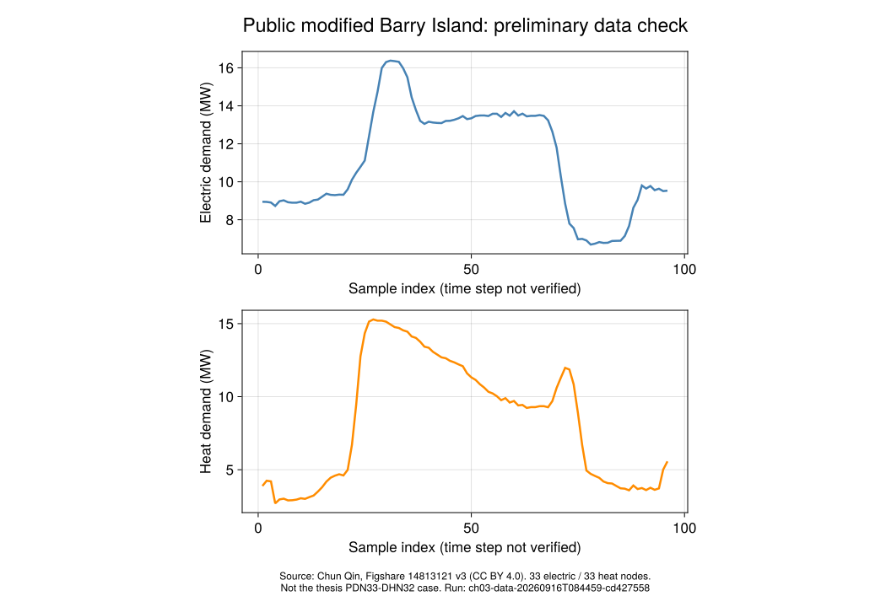

# [第3章数据搜集与初步验证](@id ch03-data)

本批已经取得 **3个公开数值来源**，并将论文原页中的设备、电价和拓扑转录为可检查记录。
当前结果是“来源和数据结构已核验，存在未解决的差异”，**尚不能运行作者的完整第3章算例**。

## 1. 我们拿到了什么

| 来源 | 实际取得的内容 | 与论文的关系 |
| --- | --- | --- |
| 论文PDF55–56，印刷38–39 | 表3-2至3-5，33电/32热系统描述，图3-2热网31条连接 | 原文转录；未补写逐管参数和负荷曲线 |
| [MATPOWER 8.1 case33bw](https://github.com/MATPOWER/matpower/blob/1a828c7af590714499284e36ee9c81273388c594/data/case33bw.m) | 33节点、32投入支路和5条常开联络线，P/Q、阻抗、基值 | IEEE33公开基准，不能直接称为作者10kV修改版 |
| [Xin Qin等作者入口](https://xinqin-site.github.io/codes/) | `electricity`、`heat` 两张表；33电节点、33热节点、33管段、96个P/H样本 | 2021公开modified Barry测试床；不是学位论文PDN33-DHN32 |
| [Chun Qin的Figshare v3](https://doi.org/10.6084/m9.figshare.14813121.v3) | modified Barry与工业园工作簿；本批验证Barry表 | 衍生修改版，署名与上行作者不同；CC BY 4.0 |

文献[25] [Liu等公开PDF](https://orca.cardiff.ac.uk/id/eprint/73462/1/Liu%20et%20al.%202015.pdf)
网页已定位附录A表4，但 Julia 下载返回HTTP403，本地字节尚未取得；不算作下载成功。
工业园数据本批只确认sheet存在，未宣称完成验证。

来源版本、许可证和完整SHA-256见 `docs/reading/ch03/sources.toml`。
MATPOWER许可证明确排除了算例数据；本项目仅保存本地下载，不将其重新标为BSD或MIT。
原工作簿、PDF和派生全量CSV默认不进入Git。经核验摘要及Figshare派生图保留来源署名。

## 2. 初步验证结果

### 电网基准

- 33个唯一节点，37条支路端点合法；32条投入支路构成连通径向树。
- 总静态负荷为 **3.715 MW + 2.300 Mvar**；由总P/Q得到视在功率约 **4.36935 MVA**。
  这是该静态工况的合计值，不是论文的日峰值10.33 MVA。
- 标称电压12.66kV，基准容量10MVA；作者工作簿采用100MVA。
  以MATPOWER版本计算，阻抗基值为16.02756Ω。转换脚本明确使用
  `Z_base = V_base_kV^2 / S_base_MVA`，不混用标幺基值。
- 37条支路的`rateA`均为0，按MATPOWER语义表示未给限额；不能解释成零容量。

### 公开电热测试床

- 两份工作簿的热网都是33节点、33管段、1个独立环，管长逐行求和 **4485.3m**。
- 论文图3-2转录得到32节点、31条连接、0环。公开表的节点编号不能直接套进论文图。
- 论文只写管道全长12.58km，其供回双侧统计口径尚未核清。因此不能直接按长度比放大公开管道。
- P/H各有 **96×33** 个有限非负数。作者工作簿总P范围6.69373–16.37880MW，
  总H范围2.68481–15.28776MW。时间步长还未由对应论文确认，横轴用“样本序号”，不计算MWh。
- 工作簿中的温度80–100、流量界和传热字段缺少足够的表头单位说明。
  原值保留，温度暂不自动加273.15，流量暂不宣称已经转为kg/s。

### 跨来源差异不是舍入噪声

| 检查项 | 结果 | 处理 |
| --- | --- | --- |
| 两份工作簿的P序列 | 全部相同 | 可以共享来源关系，不能因此认定其他字段相同 |
| H序列 | 6个单元格被增加0.01MW | 保留两版本；差异CSV给出具体坐标 |
| 管长、直径等前6列 | 全部相同 | 仅这些列通过比对 |
| 管道流量下限 | 11处从0改为−200 | 影响是否允许反向流，不合并成一份输入 |
| Figshare静态Pd/Qd | 作者数值的1/1000，原表仍写kW/kvar | 单位冲突；阻止自动物理换算 |
| 作者bus表与MATPOWER | 2个单元格不同，branch表相同 | 不把“同为IEEE33”当成完整表相同 |

论文自身的“正文3台CHP，表3-3两台”仍为Q01阻断项。两台各3MW与PV3.5MW加总为9.5MW，
只能说明表格与装机合计相符，不能据此删掉正文疑点。

## 3. 数据图



图源为Chun Qin的Figshare v3（CC BY 4.0）；图表示96个输入样本，**不是优化调度结果**。
运行ID、源CSV、配置和脚本哈希与图一起保存。图中不存在论文原始PV可用出力的信息。

## 4. 初学者怎么复跑

在VS Code选择“终端 → 运行任务”，依次执行：

1. `PaperRebuild: Ch03 restore data tools`：恢复独立的数据工具环境。
2. `PaperRebuild: Ch03 collect data`：下载3个固定来源，核验已有缓存和登记SHA。
3. `PaperRebuild: Ch03 data tests`：用小型合成输入测试解析器的拒错行为，不需要论文原件或联网。
4. `PaperRebuild: Ch03 validate data`：创建独立运行目录，保存规范化CSV、差异表、哈希和检查报告。
5. `PaperRebuild: Ch03 data plots`：从最后一次检查结果绘图；不会重新求解。若最后一次检查失败，明确报错。

终端等价命令：

```sh
julia +1.12.6 --startup-file=no --project=tools/data scripts/bootstrap_data.jl
julia +1.12.6 --startup-file=no --project=tools/data scripts/collect_ch03_data.jl
julia +1.12.6 --startup-file=no --project=tools/data test/ch03_data.jl
julia +1.12.6 --startup-file=no --project=tools/data scripts/validate_ch03_data.jl
julia +1.12.6 --startup-file=no --project=docs scripts/ch03_task.jl plot
```

输出在`data/processed/ch03/<run-id>/`。先打开`validation.toml`看状态，再看`source-differences.csv`定位差异。
`preliminary_checks_passed_with_open_issues`只表示本页列出的结构检查完成；
`ready_for_thesis_dispatch = false`仍是有效判定。对同一个运行重复绘图会拒绝覆盖，重新预检会生成新运行。

## 5. 下一步的输入门槛

1. 继续恢复作者PDN33-DHN32的管道修改映射、节点P/Q/H/PV序列和初始热状态。
2. 核查公开测试床对应论文中的采样间隔、温度/流量/导热单位与设备映射，解决Figshare单位冲突。
3. 如果选择公开替代路线，建立独立命名的`public-barry33`案例，并明确网络、设备和时序变更。
   保留论文设备表作为另一来源，不随意拼接两套互不对应的节点和容量。
4. 通过输入门槛后，再接入一般电网/热网模型及独立潮流回代。
   当前两节点R1教学模型不能直接承担这个含热网环路的大案例。

本批没有运行论文调度、经济性或灵活性实验，不宣称论文数值已经复现。
