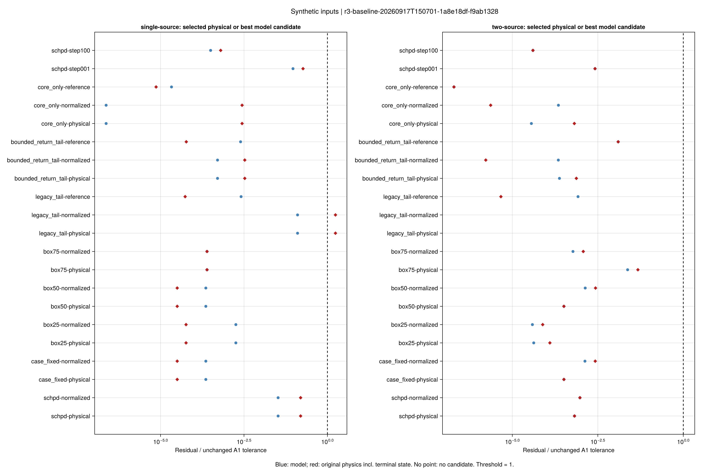
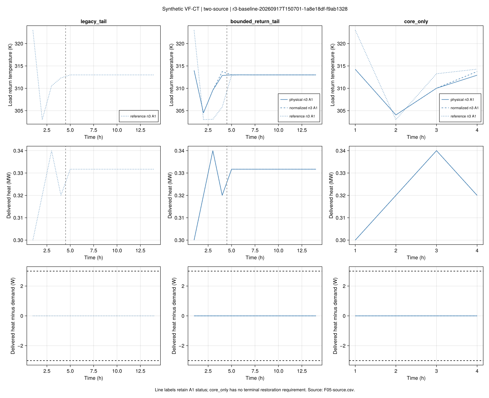
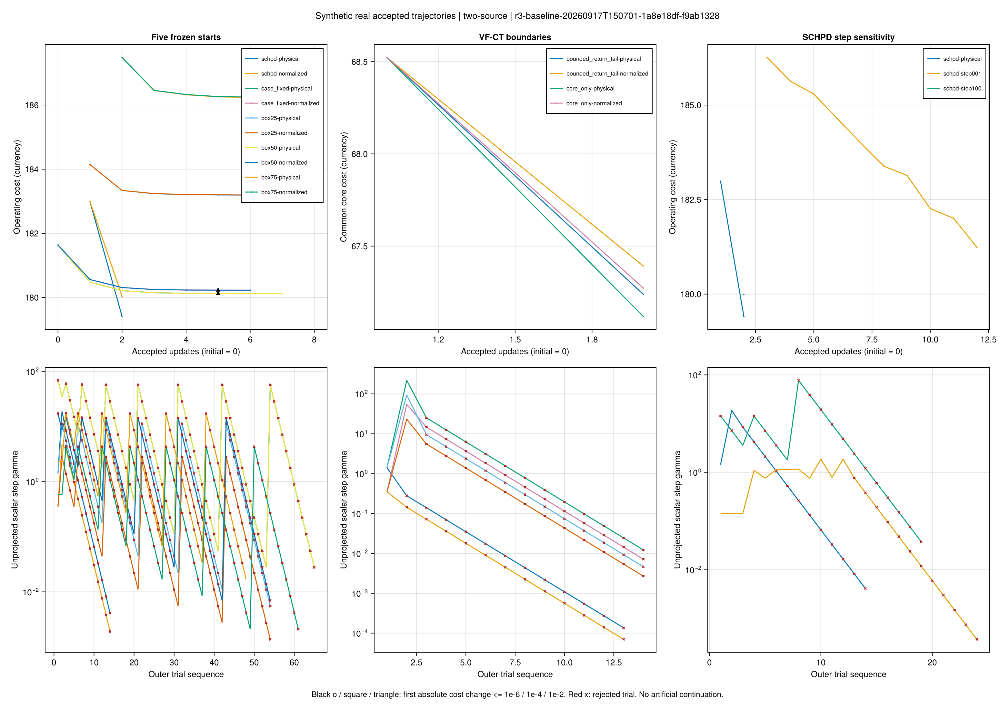

# R3第五批结果：可比基线与差异归因

本批完成 **R3可比基线与差异归因**。36次论文结构基线、6次详细参考全部保存并独立重读；
另审计24项历史v3主实验，没有重跑或修改旧判定。全部输入仍为合成小系统。
算法源码节点8e6b00b，批次r3-baseline-20260917T150701-1a8e18df。
方法、公式和命令见[基线教程](ch03-r3-baseline.md)。

**结果支持：尾段固定回温参与形成算法困难；停止口径影响结束判定；
初值、投影几何和步幅影响最终费用。结果不能确定作者实际成功的原因。**

## 1. 完成程度与证据入口

| 组别 | 数量 | 找到模型候选 | 物理A1通过 | 至少一个原等式重调度通过 | 项目外层停止 |
|---|---:|---:|---:|---:|---:|
| 五初值×两几何 | 20 | 20 | 20 | 20 | 0 |
| 三边界×两几何 | 12 | 10 | 8 | 8 | 0 |
| 步幅补充对照 | 4 | 4 | 4 | 4 | 0 |
| 独立详细参考 | 6 | 不适用基线候选池 | 6 | 6 | 不适用 |

基线共有32/36物理A1通过；28次因回溯无可接受改善停止，8次因灵敏度不可信停止。
没有将停滞改写为收敛。最终所选候选有13/36来自已完成费用求解的原等式调度；
另一些运行保留了费用略低的A1合格SOCP候选，同时也保存了原等式合格候选。
这就是“原等式检查成功”与“所选候选费用优化完成”计数不同的原因。
6次详细参考均有通过A1的求解器最优状态，其界只属于各自采用模型。

完整入口：
[比较表](assets/r3-baseline/r3-baseline-20260917T150701-1a8e18df-f9ab1328/comparison.csv)、
[冻结设计](assets/r3-baseline/r3-baseline-20260917T150701-1a8e18df-f9ab1328/frozen.toml)、
[候选与严格检查](assets/r3-baseline/r3-baseline-20260917T150701-1a8e18df-f9ab1328/candidates.csv)、
[输入/源码/运行哈希](assets/r3-baseline/r3-baseline-20260917T150701-1a8e18df-f9ab1328/provenance.toml)、
[26组配对检查](assets/r3-baseline/r3-baseline-20260917T150701-1a8e18df-f9ab1328/pairing.toml)。
每个运行的完整逐式残差以“运行ID-F04.csv.gz”保存在同一目录；压缩没有采样或删去失败行。

## 2. 尾段：解除一个等式后发生了什么？

下面使用物理坐标投影；归一化投影的通过/失败分类相同。费用单位沿用合成输入。

| 系统与边界 | 基线最终物理费用 | 独立详细参考费用 | 基线末端热状态 |
|---|---:|---:|---|
| 单源 legacy_tail | 无物理候选；模型费用146.03258 | 145.16091 | 模型候选末端通过，其他物理关系失败 |
| 单源 bounded_return_tail | 145.53860 | 145.02000 | 通过 |
| 单源 core_only | 32.26676 | 31.84621 | 不要求恢复 |
| 双源 legacy_tail | 未找到模型可行调度 | 455.18200 | 未决 |
| 双源 bounded_return_tail | 456.15567 | 454.63820 | 通过 |
| 双源 core_only | 67.11910 | 65.78853 | 不要求恢复 |

**单/双源、两种投影共4组配对，解除尾段固定回温后均从无物理候选变为物理与原等式检查通过。**
有尾段的合格候选同时通过有效记忆窗口和独立输运回放检查，因此该变体缓解了既有冲突，
且没有牺牲本项目声明的末端恢复标准。它仍不是对任意系统都正确的修复证明。

物理原因可以从端口守恒理解。给定源温、流量及历史后，供水温度由输运决定；
负荷不变要求回温随供温变化：

```math
\tau^{\mathrm R}_{j,t}
=\tau^{\mathrm S}_{j,t}
-\frac{10^6 H^{\mathrm{load}}_{j,t}}{c_{\mathrm w}m_{j,t}}.
\tag{R3-B4}
```

H为MW、比热为J/(kg·K)、m为kg/s。若另强制回温等于稳态参考值，就对有热记忆的尾段
增加了一个可能不兼容的要求。B4是项目从精确热功率关系导出的解释，不冒用论文式号。
原始历史保持不变；本批也没有把尾段反送电或放宽A1作为补救。
代码字段对应tau_S_port、tau_R_port、m_port、H_MW及cp_J_kgK；
独立检查入口为[`validate_r3_solution`](@ref)，边界测试为test/r3_boundary.jl。
四个项目公式的API及测试映射登记在docs/reading/ch03/r3-baseline-equations.toml。

**旧尾段两项独立详细参考成功，排除了“整个旧VF-CT模式无解”的解释。**
更准确的归因是：固定回温与热记忆收紧了可行流量集合，梯度路径容易在其附近停滞。
未将不同流量下的候选费用差说成同一固定流量问题的最优性间隙。

跨时域只比较共同核心。双源物理投影在bounded_return_tail的核心/尾段费用为
67.23872/388.91695，core_only核心费用为67.11910；
不能把456.15567与67.11910的总额差称为收益。core_only不参与周期收益排名。

## 3. 停止条件：21次费用接近并不等于收敛

按真实“初始点＋接受更新”序列审计。诊断值、重求和拒绝点不进入相邻费用差。

| 绝对费用阈值 | 36次基线中首命中次数 | 首命中候选原等式检查通过 |
|---|---:|---:|
| 1e-6 | 0 | 不适用 |
| 1e-4 | 0 | 不适用 |
| 1e-2 | 21 | 19 |
| 项目原停止条件 | 0 | 不适用 |

1e-2命中位置在第5至9次接受更新之间。命中后继续本批轨迹，最大的剩余模型费用改善
约0.004776；这是有限轨迹的后续改善，不是全局最优误差上界。
另有两个首命中候选没有通过独立原等式检查，说明仅用费用稳定不能替代物理核验。
这两个都是单源core_only的两种几何：首命中模型费用32.26141，但该流量的原等式重求报告不可行；
运行保留了另一流量下费用32.26676的物理候选。低模型费用没有覆盖已经验证的调度。
本项目不知道作者实际采用的ε，这三个数值只是预先声明的敏感性分析。

[逐点停止证据](assets/r3-baseline/r3-baseline-20260917T150701-1a8e18df-f9ab1328/stopping.csv)、
[真实拒绝步](assets/r3-baseline/r3-baseline-20260917T150701-1a8e18df-f9ab1328/F06-trials.csv)、
[历史24项v3审计](assets/r3-baseline/r3-baseline-20260917T150701-1a8e18df-f9ab1328/historical-v3.csv)
保留原始状态。v3与本批多项算法机制同时不同，只作组合对照，不能归因于单一机制。

## 4. SCHPD初值是不是一定更好？

物理坐标、默认位移0.1的五初值结果如下；固定计划与box50的近重复如实保留。

| 初值 | 单源初始诊断值 | 单源最终物理费用 | 双源初始诊断值 | 双源最终物理费用 |
|---|---:|---:|---:|---:|
| SCHPD | 0.002128 | 78.30542 | 0.007753 | 179.40943 |
| 固定计划 | 初始即模型可行 | 78.13318 | 初始即模型可行 | 180.12292 |
| box25 | 0.040502 | 80.13684 | 0.054518 | 183.19062 |
| box50 | 初始即模型可行 | 78.13318 | 初始即模型可行 | 180.12292 |
| box75 | 0.029648 | 80.05848 | 0.033263 | 186.22759 |

SCHPD初始点都不是详细子问题可行点，但诊断目标小于box25、box75，且均在一次接受更新后
获得模型可行流量。双源费用优于其余冻结初值；单源略差于固定计划。因此支持“SCHPD可提供
有用初值”，不支持“每个系统中必然最好”。诊断值已归一化，只在同输入内比较。
五初值不是随机独立样本；本批不作统计显著性或端到端加速结论。

## 5. 投影几何与步幅

单源可更新分量的跨度相同，两种几何经统一位移规则后轨迹一致，构成预期的对照。
双源跨度不等，几何影响路径：SCHPD初值模型费用为179.40943（物理）和180.03565（归一化），
但两者都以回溯停滞结束，几何改变没有解除停止问题。

| SCHPD初始归一化位移 | 单源最终物理费用 | 双源最终物理费用 |
|---|---:|---:|
| 0.01 | 79.82709 | 181.23998 |
| 0.1 | 78.30542 | 179.40943 |
| 1 | 77.99110 | 179.98667 |

步幅影响质量，但不存在两系统共同的单调排序。本批报告全部事先冻结值，
不事后挑一个最优值冒充作者参数。无改善的试探和不可信对偶均保留。

## 6. 图表怎样读？

F04蓝点为采用模型残差，红点为原物理检查，均除以原A1阈值；虚线1是判定界。
优先显示最终物理候选，无物理候选时显示最低模型费用的κ重构副本；没有模型候选则留空。
CSV保留原始解及重构解，辅助变量重构不意味着所有物理关系都已修复。



F05的竖线标识核心与尾段，分别绘回温、交付热量和误差；曲线标注A1状态。
双源legacy图只有直接参考曲线，因为两种基线没有调度候选。



F06显示真实接受更新与回溯拒绝，黑色标记对应费用阈值首次命中。
边界面板使用共同核心费用，停止命中仍依据各自完整目标；主表单列尾段费用。



单源图、SVG与[图形配置和输入哈希](assets/r3-baseline/r3-baseline-20260917T150701-1a8e18df-f9ab1328/figures/figure-config.toml)
随同交付；重绘没有求解步骤。

## 7. 归因结论与下一步

**实验支持：**项目新增固定尾段回温影响可行性恢复；费用停止口径影响结束判定；
初值、几何、步幅影响路径与候选质量；模型可行与原物理可行确实不同。

**已排除：**旧VF-CT整体没有可行调度；只改几何就能消除停滞；
SCHPD在所有冻结输入中必然最好；费用稳定足以证明物理可行。
排除范围仅限本批输入与已经执行的对照。

**仍未决：**作者完整数据、初始热历史、终端边界、真实步长/ε、约束缩放和实现细节；
八次不可信灵敏度的具体数值来源，以及详细可行域边界对回溯方向的限制。
本批解释了项目设定及成功口径的影响，不替作者证明成功原因。

下一批优先把bounded_return_tail作为**单独命名的边界候选**回到物理推导检查，
利用已保存失败轨迹区分边界方向不足与对偶数值问题，再决定是否改算法。
论文规模数据与性能扩展后置；本批归因任务完成不代表整个R3或第三章同输入复现完成。
