# R3 投影梯度实验结果

合成案例；运行批次 `r3-pg-20260917T071031-7eafbab9`。本页由保存数值生成，不重新求解。

初值、局部试探开关和预算在计算前冻结。五初值统计包含近似重复投影结果；首例含编译开销、后续为同进程运行，耗时不是受控性能比较。不据此宣称论文同输入复现、全局最优或速度优势。

| 案例 | 物理A1 | 停止原因 | 轮数/接受步 | 首个可行费用 | 最终费用 | 秒 |
|---|---|---|---|---|---|---|
|single-source-schpd|true|untrusted_sensitivity|17/16|80.98155518474674|78.33546385619212|30.56|
|single-source-case_fixed|true|untrusted_sensitivity|10/9|80.18286341908787|78.13787851759247|1.12|
|single-source-box25|true|line_search_stalled|13/12|81.24535242579154|80.28254845691377|2.99|
|single-source-box50|true|untrusted_sensitivity|10/9|80.18286364359955|78.1378781115549|1.1|
|single-source-box75|true|untrusted_sensitivity|19/18|81.43663415179648|80.32923654815337|1.97|
|two-source-schpd|true|line_search_stalled|5/4|182.98760537864405|181.040640552009|0.91|
|two-source-case_fixed|true|untrusted_sensitivity|18/17|181.63539796104027|180.1302686881154|3.02|
|two-source-box25|true|line_search_stalled|8/7|184.14025938671958|183.18845429221952|2.39|
|two-source-box50|true|untrusted_sensitivity|23/22|181.6353979901378|180.0163435666185|4.04|
|two-source-box75|true|untrusted_sensitivity|11/10|187.11094547090866|185.7265002114475|1.85|
|single-no-halfspace|true|untrusted_sensitivity|7/6|80.29874783275116|80.23141811798737|1.1|
|two-no-halfspace|true|line_search_stalled|4/3|180.60844536002574|180.49199043617568|0.67|
|single-low-flow|true|line_search_stalled|12/11|81.13210991123299|80.86090892881776|2.36|
|single-impossible-heat|false|line_search_stalled|25/24|missing|missing|2.47|
|single-loose-electric|true|smooth_numeric_stop|4/3|-9.235949399561394e-12|0.0|0.5|
|single-delay-switch|false|line_search_stalled|7/6|missing|missing|1.65|

## 五初值汇总

统计只覆盖schpd、case_fixed、box25、box50、box75；最坏/中位/最好费用只在物理通过的运行中计算，同时保留失败数量。

- **single-source**：物理通过 5/5；不同初值哈希 5，按原有流量A1区分为 4 组（固定初值与box50近似重复）；费用最好/中位/最坏 78.1378781115549 / 78.33546385619212 / 80.32923654815337；耗时最小/中位/最大 1.1004371999879368 / 1.9732988000032492 / 30.562112400017213 s。
- **two-source**：物理通过 5/5；不同初值哈希 5，按原有流量A1区分为 4 组（固定初值与box50近似重复）；费用最好/中位/最坏 180.0163435666185 / 181.040640552009 / 185.7265002114475；耗时最小/中位/最大 0.9057863999914844 / 2.387087100010831 / 4.039635699999053 s。

## 未恢复案例与局部半空间对照

- **single-impossible-heat**：末次诊断最大超限比对应式3-17，实体2，时段1；残差9.708989311181506 MW，A1阈值3.0e-6。
- **single-delay-switch**：末次诊断最大超限比对应式3-17，实体2，时段1；残差3.846880219721323e-6 MW，A1阈值3.0e-6。

容量反例的10 MW需求超过端口输入上界0.315 MW，这是解析不可行证据；PG本身仅报告停滞。时延切换例未恢复可行，不能由局部停滞推出全局无解，也不能因剩余残差接近阈值就改判通过。

单源、双源有/无局部半空间运行的初始流量已逐元素核对完全相同。费用对照见上表：半空间在本批不表现为一致改善，不能单凭一组结果宣称它总是有效。

## 如何评价

物理可行、费用下降与外层停止条件满足是三项独立事实。`line_search_stalled`、`untrusted_sensitivity`、时限或轮数上限都不等于收敛或已证明无解。费用比较从首个详细子问题可行解开始，不能把不可执行的SCHPD低费用当作基准收益。

原始对偶、所有试探、模型残差及源码快照在本地运行保留；公开摘要包括案例、最终数值、轨迹、来源哈希及图源CSV。结果摘要目录：`results/summaries/r3-pg/r3-pg-20260917T071031-7eafbab9-fb56a669`。

### single-source-schpd · F04-residuals.svg

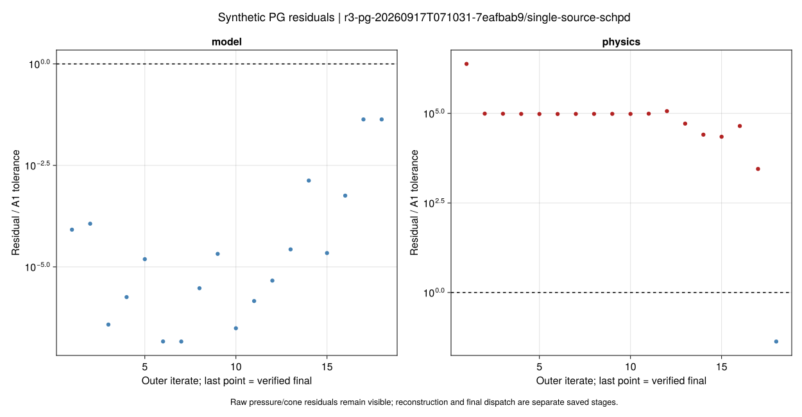

### single-source-schpd · F05-trajectories.svg

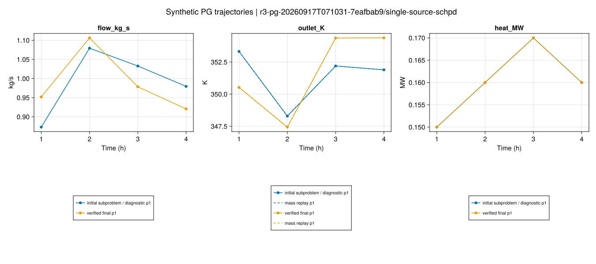

### single-source-schpd · F06-iterations.svg

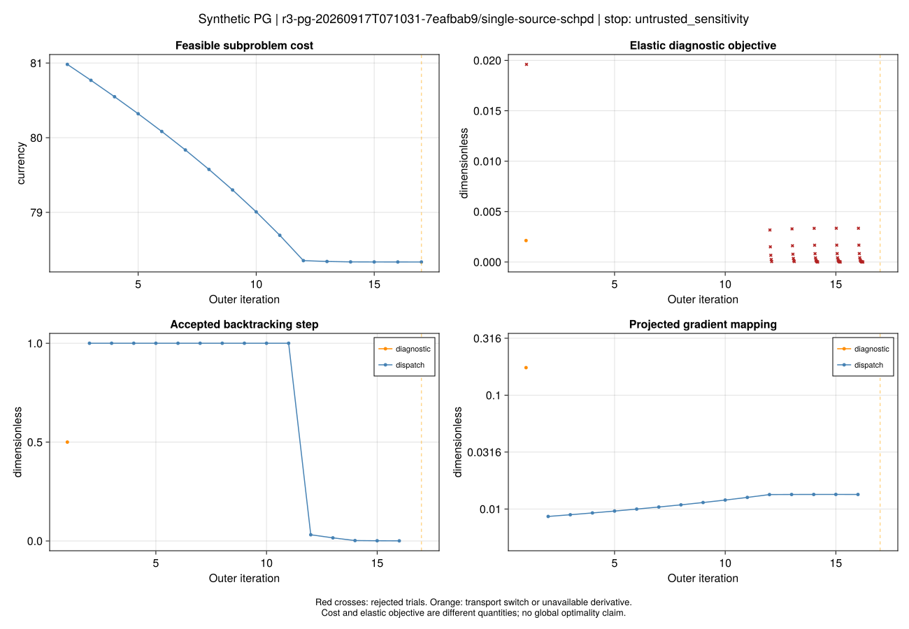

### two-source-schpd · F04-residuals.svg

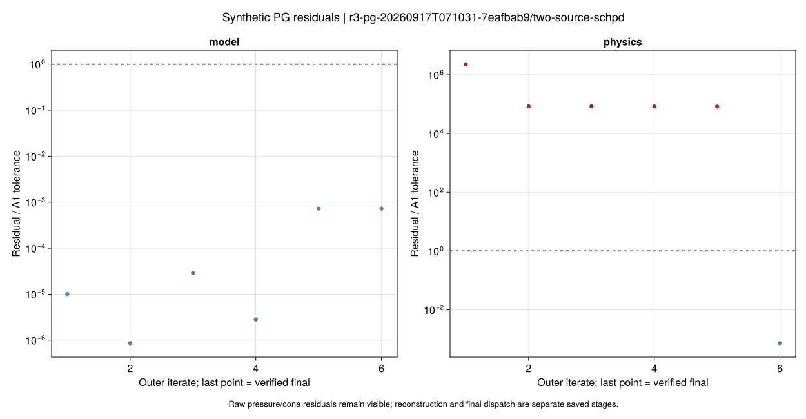

### two-source-schpd · F05-trajectories.svg

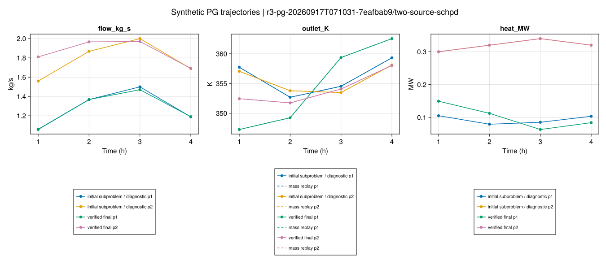

### two-source-schpd · F06-iterations.svg

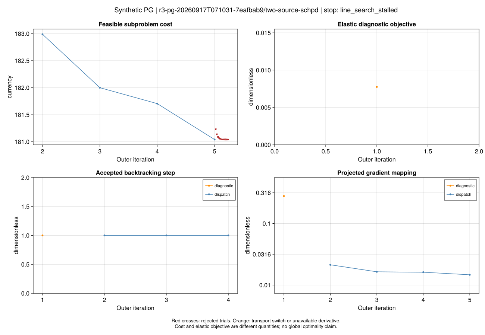

### single-low-flow · F04-residuals.svg

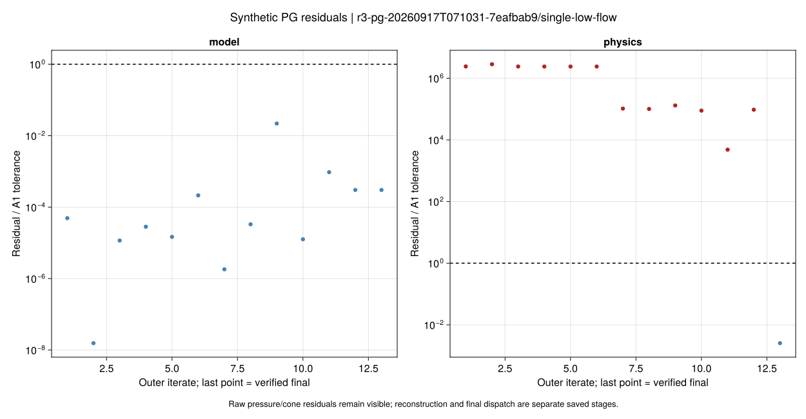

### single-low-flow · F05-trajectories.svg

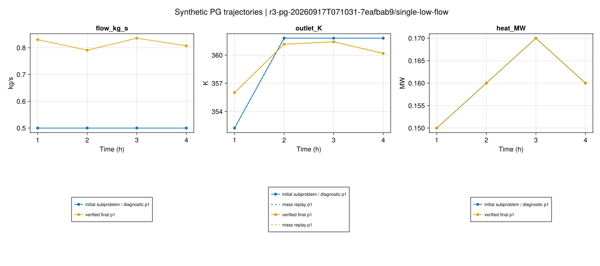

### single-low-flow · F06-iterations.svg

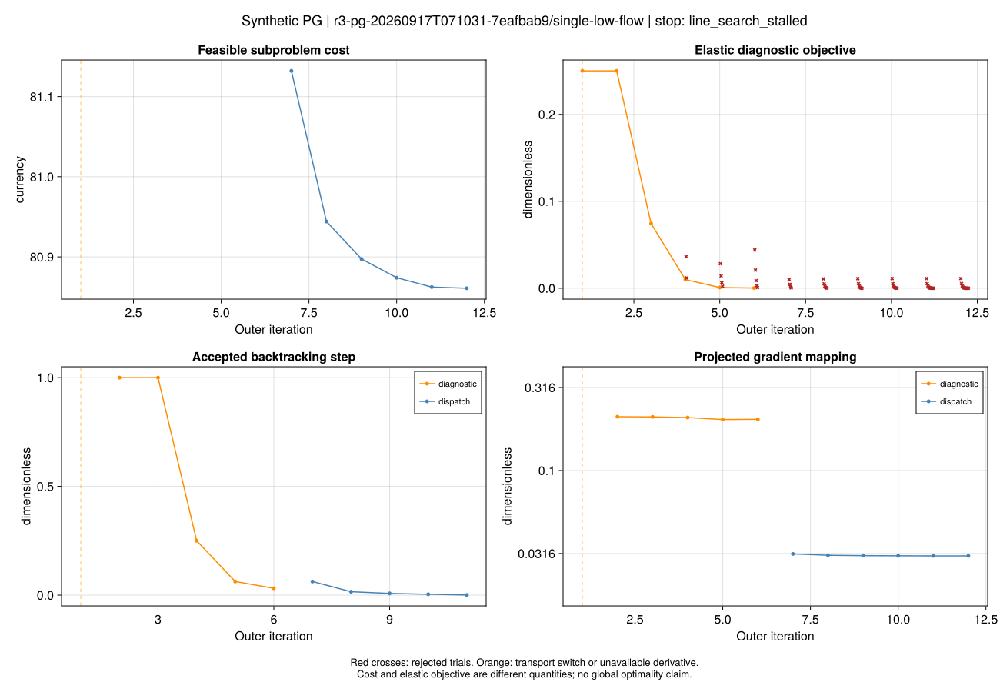

### single-delay-switch · F04-residuals.svg

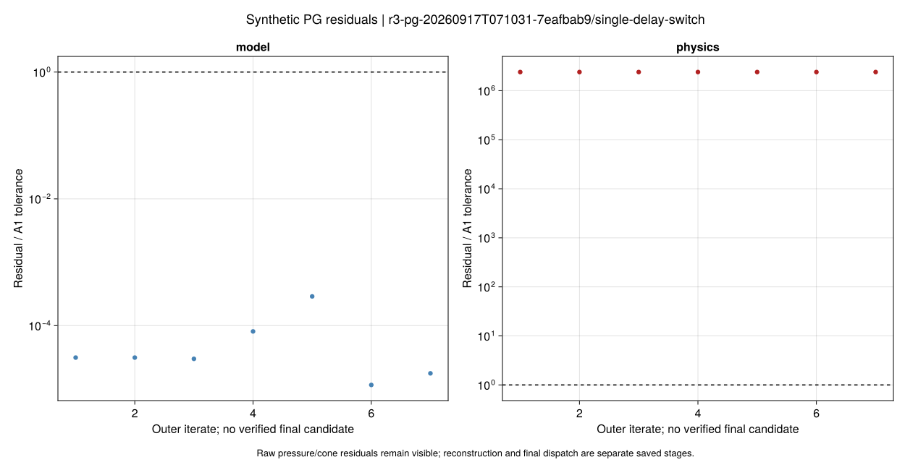

### single-delay-switch · F05-trajectories.svg

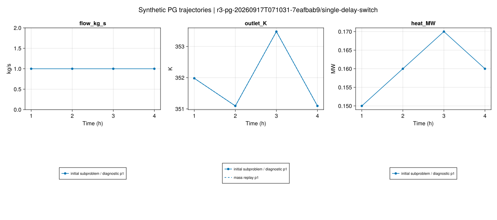

### single-delay-switch · F06-iterations.svg

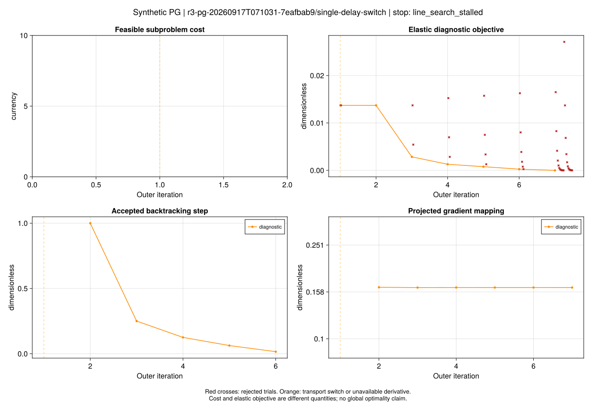
