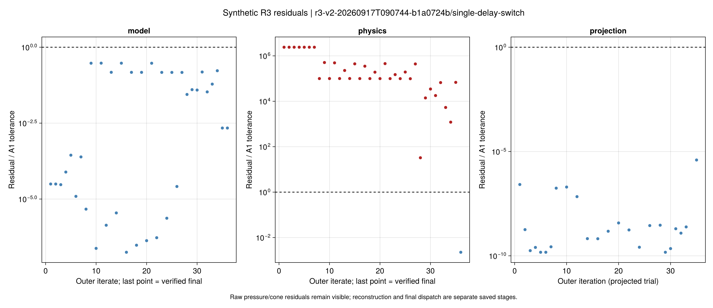
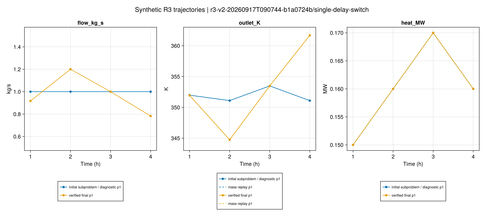
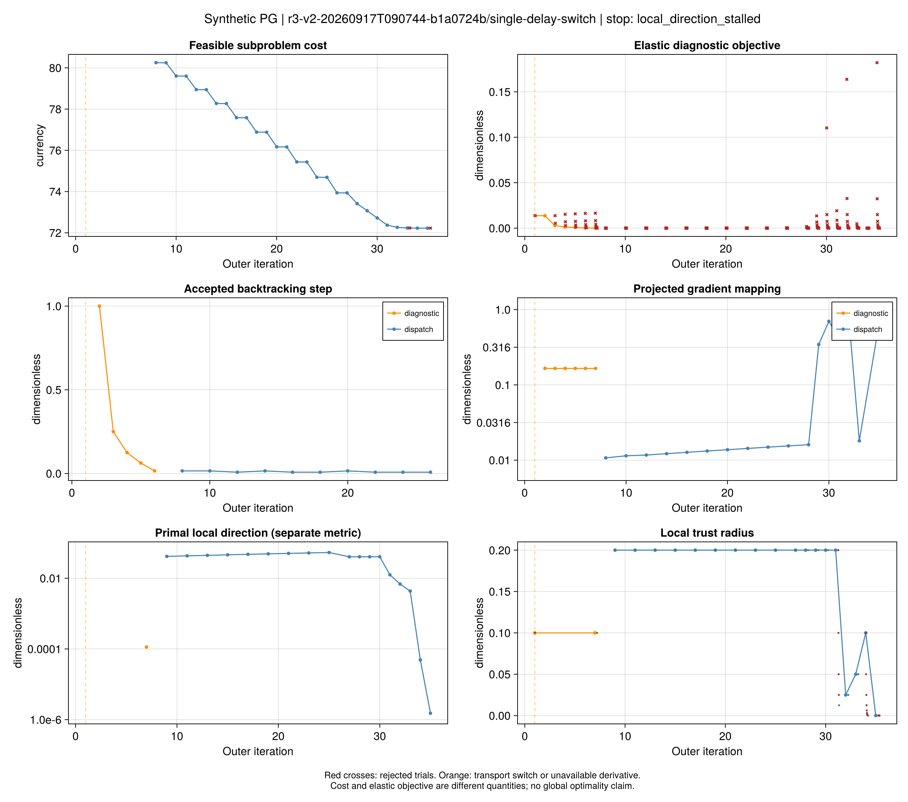
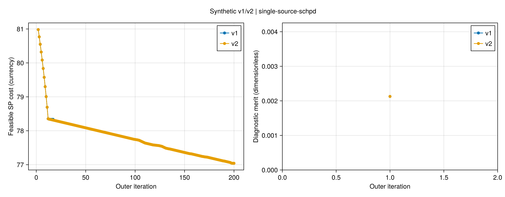
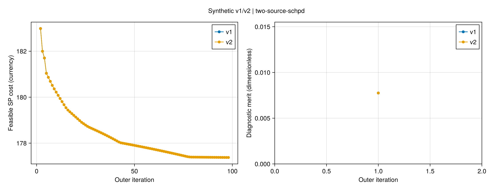
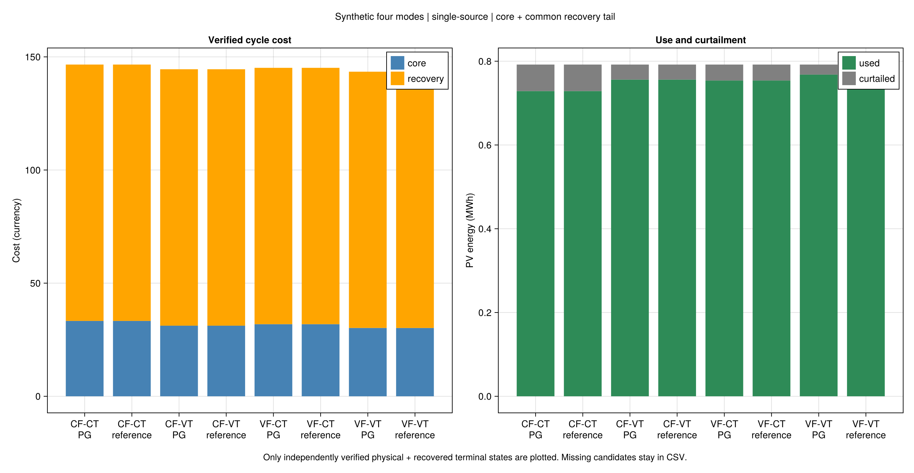
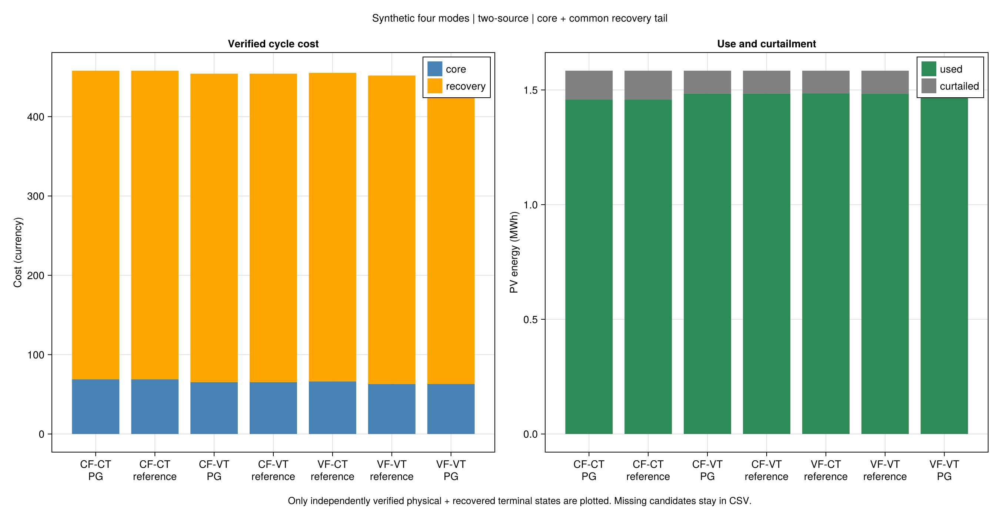
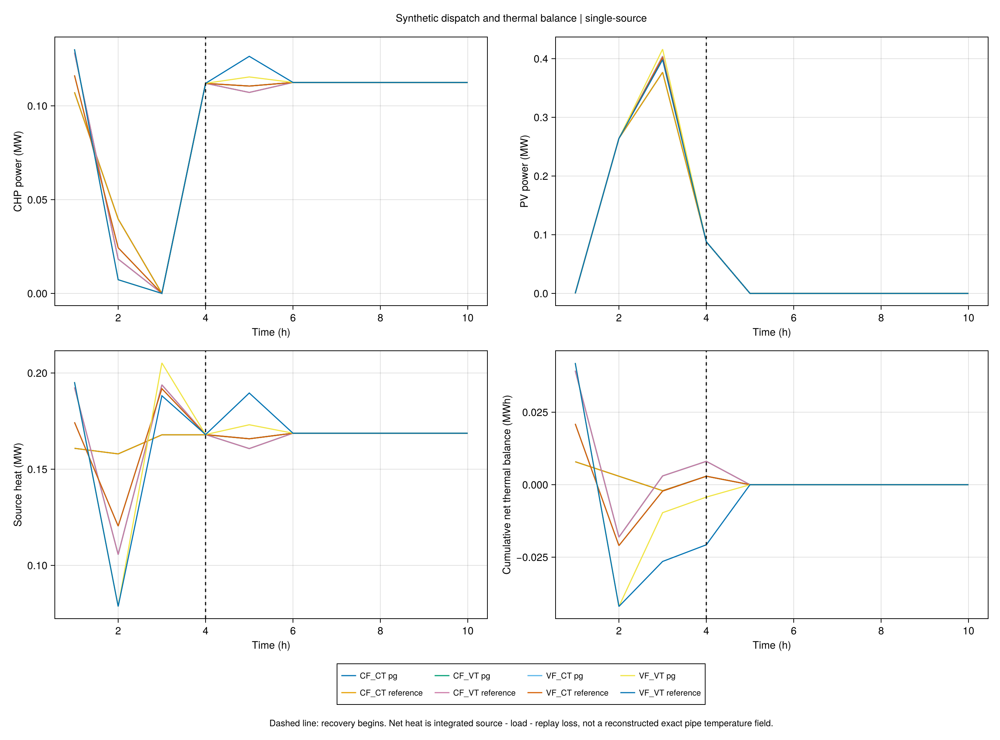
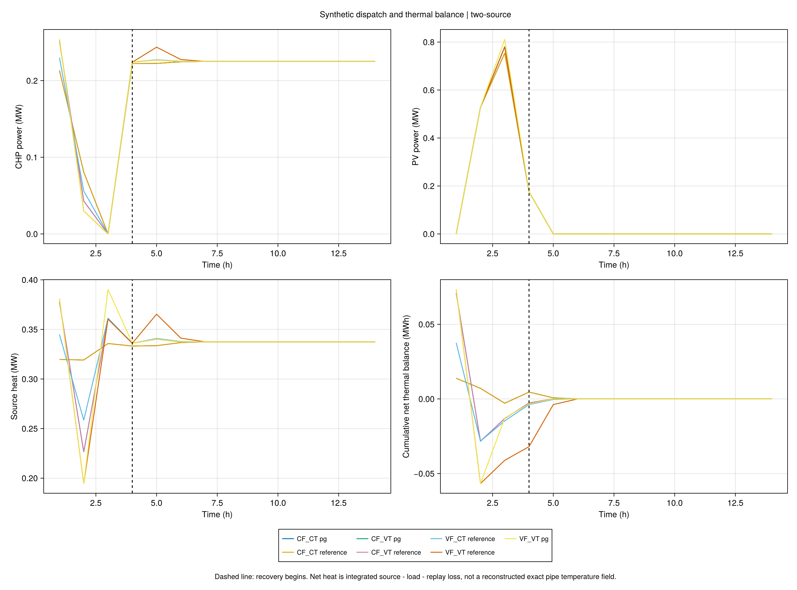

# R3 第三批结果：稳健性与四模式

本页记录 **R3 稳健性与小系统四模式验证**。对象是明确标注的合成小系统；
采用的模型、局部方向规则和四模式含义见[推导记录](ch03-r3-robustness.md)。
正式计算包括16例稳健性对照与16例四模式运行，已保存并重读验证；
合并批次为 `r3-v2-combined-20260917T095056`。

## 如何读本批结果

本批分别回答四个问题，不能用一个“成功”概括：

1. 固定流量子问题能否调度，或通过外层调整恢复可行？
2. 最终候选能否通过电网原等式、热功率、混合及独立输运回放的 A1 检查？
3. 费用是否改善，算法是否满足事先定义的数值停止条件？
4. 在共同初始历史和恢复尾段下，流量、源温度的自由度是否改变总费用和弃光？

v2 的局部凸方向是项目补充。它仍需在详细子问题上验证实际改善，不等同于作者完整算法的证明。
直接详细参考与 PG 分开保存，前者的成功不记到 PG 名下。

## 数据与比较口径

稳健性组重用上一批十六例的输入及保存初始流量，包括重复初值、容量反例和时延切换例。
两套四模式新输入在求解前冻结：单源 4 核心时段加 6 恢复时段，双源为 4 加 10；每步 1 h。
两套光伏峰值分别为 0.44 MW、0.88 MW，核心可用比例为 `[0, 0.6, 1, 0.2]`。
每个案例内四模式共用设备、负荷、价格、历史、温度和流量边界。

主指标是核心与恢复尾段的总费用。末端有效记忆中的入口温度、流量和独立回放出口均需恢复；
只比较核心四小时的费用会忽略恢复热状态的代价。
CT 只固定热源供水温度；新案例的负荷回水允许在边界内优化，旧案例仍采用固定回水。

## 稳健性结果

旧十六例在 v1 中 14 例通过物理 A1，v2 为 **15/16**。新增通过的是时延切换例；
容量反例仍失败，10 MW 需求超过冻结端口的 0.315 MW 上界，提供独立的解析不可行证据。
算法在该反例上只报告局部方向停滞，解析证据与算法停止事实分开记录。

| 五初值组 | v1 最好／中位／最坏费用 | v2 最好／中位／最坏费用 | v2 物理通过 | v2 数值停止 |
|---|---|---|---|---|
| 单源 | 78.13788／78.33546／80.32924 | 77.04112／77.04791／78.96134 | 5/5 | 0/5 |
| 双源 | 180.01634／181.04064／185.72650 | 177.37625／177.40496／177.60279 | 5/5 | 0/5 |

每组保留全部五个预定条目；固定流量与 box50 在原 A1 下近乎重复，实际可区分初值仍为四组。
十个逐初值对照的 v2 费用均低于 v1，但九例达到 200 轮上限，一例局部方向停滞。
计算时间增加，且批次含不同编译、并行运行与证据处理开销，不据此作受控性能比较。

时延切换例最终费用 **72.22625**，状态是 `local_direction_stalled`。
初始整步切换处拒绝任意选段的 Taylor 方向，沿守恒域中的邻段真实试探降低诊断目标，
进入可行分支后继续下降；最终温度、热功率和电网原关系通过 A1。
它支持“这个冻结案例恢复成功”，不支持“所有非光滑点均已解决”。

低流量例恢复成功，最终费用 **76.84614**；免费购电边界例满足光滑数值停止，费用为0。
有／无局部半空间的单源费用为77.04112／77.87470，双源为177.37625／177.40991；
这是本批结果，不能把该试探半空间提升为全局有效割或通用优越性结论。

## 四模式结果

四模式组共16次完整运行，PG／固定流量调度 **7/8** 通过物理与恢复检查，独立直接参考 **8/8** 通过。
通过不意味着外层收敛；CF本身没有外层迭代。

下表先列已经完整保存的独立直接参考，单位为案例配置中的费用单位，均含恢复尾段。

| 模式 | 单源费用 | 双源费用 |
|---|---:|---:|
| CF-CT | 146.60611 | 457.88915 |
| CF-VT | 144.53193 | 454.15484 |
| VF-CT | 145.16091 | 455.18200 |
| VF-VT | 143.32252 | 451.77133 |

两案例中，释放源温度的 CF-VT 均比只释放流量的 VF-CT 便宜；同时释放两者的参考费用最低。
CF-VT 与 VF-CT 彼此没有可行域包含关系，所以不预设它们之间的次序。
双源 VF-VT 直接参考用满 600 秒，保存的可行费用451.77133、有效界451.70908，
相对间隙约 **0.013779%**；这是该采用模型的界，不是作者原始输入的结论。

双源 VF-CT 的 PG **未通过最终物理检查**。外层停在 `untrusted_dual_local_stalled`，
κ重构后仍存在原物理违反，固定所选流量的详细求解报告不可行。
其原支路等式最坏残差约 `4.10147e-4 pu`，高于 `1e-6 pu` 的 A1 门槛；
保留该失败，不以较小的松弛目标或较好的热网残差替代电网物理验收。
同输入直接参考已经可行，说明该模式本身有可行解，暴露的是当前 PG 的候选选择及恢复局限。
不能把松弛候选费用用于四模式物理收益排名，也不能用直接参考代替 PG 成功。

单源、双源 VF-VT 的 PG 可行费用分别为 **143.45133、451.84787**，均因200轮上限停止。
对应直接参考为143.32252、451.77133；这些候选费用差不叫最优性间隙。
VF的固定流量子问题间隙只适用于所选流量；CF松弛调度的界标为松弛下界。
`cost_optimization_complete` 表示记录中的内层费用求解结束状态，不能用它替代外层的 `outer_converged`。

### 费用最低是否也意味着消纳最多？

不一定。两案例核心光伏可用能量分别为0.792 MWh、1.584 MWh。下表是直接参考的弃光量：

| 模式 | 单源弃光／MWh | 双源弃光／MWh |
|---|---:|---:|
| CF-CT | 0.063288 | 0.125852 |
| CF-VT | 0.035957 | 0.099496 |
| VF-CT | 0.038038 | 0.098483 |
| VF-VT | 0.041919 | 0.100119 |

VF-VT 的参考费用最低，但没有取得最小弃光量。本模型优化运行费用，未将最大光伏利用设为
首要或次级目标；这些候选说明费用与消纳应分别报告，不能据此证明二者存在不可消除的冲突。
单源、双源 VF-VT 的 PG 弃光分别为0.023962、0.068197 MWh，比对应直接参考少，费用却略高。
本批没有达到100%消纳，也没有要求四模式在全部指标上严格排序。

F09中，供热出力可以偏离当时负荷，独立回放损耗计入累计热收支；共同恢复尾段使
有效输运记忆重新回到初始稳态。它支持热量时序调节机制的检查，不是独立储能容量估算。

## 证据与失败保留

首个开发批次因发现切换点的局部导数使用边界而主动停止，旧文件保留，不进入正式表。
第二次四模式组完成十二例后，Gurobi 在末次物理求解中无法提供 `ObjBound`，属性读取使批次中断。
已完成的十二例保留；中断尝试没有完整根运行，不能据此判断最终物理可行性或不可行性。
补丁只将不可取得的可选界记为缺失并保留错误原因，随后沿用相同输入和预算重跑未完成条目。

`ObjBound` 不可读取的含义是该属性当时不可用，不能解释为模型不可行。
依据：[Gurobi 错误码说明](https://docs.gurobi.com/projects/optimizer/en/current/reference/numericcodes/errors.html)。
每个运行保存自己的源码和输入快照，合并清单只收录每个预定条目的完整结果，不挑选重复运行中的最好值。
后两项PG的 `optional_bound_failures` 还包括 Clarabel 不支持 `objective_bound` 时的属性回退，
不是数千次模型求解失败。早期记录没有同等详细的回退计数，不跨版本比较该计数的“失败率”。

## 表格、图源与科学图

摘要目录为 `results/summaries/r3-v2/r3-v2-combined-20260917T095056-767e69d2`。
完整原始对偶与试探留在本地运行目录，下面的摘要不冒充完整 `read_r3_run` 证据。
F04逐公式、节点、时段的图源以CSV.gz无损保存；压缩后重读逐列比较，不删除失败行。

- [32例状态、费用与失败位置](assets/r3-v2/r3-v2-combined-20260917T095056-767e69d2/comparison.csv)
- [五初值统计](assets/r3-v2/r3-v2-combined-20260917T095056-767e69d2/five-initial-statistics.csv)
- [四模式费用、消纳、界和嵌入核查](assets/r3-v2/r3-v2-combined-20260917T095056-767e69d2/modes.csv)
- [输入与来源冻结清单](assets/r3-v2/r3-v2-combined-20260917T095056-767e69d2/frozen.toml)
- [精确初值与独立案例清单](assets/r3-v2/r3-v2-combined-20260917T095056-767e69d2/inputs/manifest.toml)
- [原生对偶最小反例](assets/r3-v2/r3-v2-combined-20260917T095056-767e69d2/dual-minimal-examples.toml)
- [运行和源码哈希](assets/r3-v2/r3-v2-combined-20260917T095056-767e69d2/evidence-hashes.toml)
- [图形配置](assets/r3-v2/r3-v2-combined-20260917T095056-767e69d2/figure-config.toml)、[压缩重读核验](assets/r3-v2/r3-v2-combined-20260917T095056-767e69d2/packed-sources.toml)

### F04–F06：时延切换例

原始子问题的κ／电网锥残差与最终物理解分开显示；大原始残差不自动推翻可行的等价κ重构。
实线与独立累计质量回放对照；橙线标记切换，红色试探点表示未接受步骤。
费用、诊断目标、投影梯度指标与局部方向指标具有不同含义。







图源：[逐式残差](assets/r3-v2/r3-v2-combined-20260917T095056-767e69d2/single-delay-switch/F04-source.csv.gz)、
[输运](assets/r3-v2/r3-v2-combined-20260917T095056-767e69d2/single-delay-switch/F05-source.csv)、
[迭代](assets/r3-v2/r3-v2-combined-20260917T095056-767e69d2/single-delay-switch/F06-source.csv)、
[拒绝与接受试探](assets/r3-v2/r3-v2-combined-20260917T095056-767e69d2/single-delay-switch/F06-trials.csv)、
[局部信赖域试探](assets/r3-v2/r3-v2-combined-20260917T095056-767e69d2/single-delay-switch/F06-local-trials.csv)。

### F06：v1/v2 同初值对照





### F08：周期费用与光伏消纳

蓝色为核心费用，橙色为恢复费用；绿色为实际利用的光伏，灰色为弃光。
未通过物理检查的PG候选不画成可行费用柱，但仍在完整CSV和失败讨论中保留。





### F09：调度与恢复尾段

虚线后进入共同恢复；曲线包含恢复过程，不只截取收益明显的核心时段。
热量转移应结合出力、供热和恢复费用一起读，不把累计净热量当成额外安装的储能设备。





图源：[单源逐时数据](assets/r3-v2/r3-v2-combined-20260917T095056-767e69d2/single-source-F09-source.csv)、
[双源逐时数据](assets/r3-v2/r3-v2-combined-20260917T095056-767e69d2/two-source-F09-source.csv)。

## 结论边界

本批可以评价合成系统上的算法行为及四种运行机制。尚不能据此声称复现论文规模系统、
论文报告的收益百分比、运行速度优势或一般非凸问题的全局收敛。
全部图表从保存结果生成，不重新求解；F09 的累计热量是注热减负荷、回放损耗的积分收支，
不是额外假定的独立储热设备，也不是重建出的连续管温场。

## 复跑与本批检查

根目录执行以下命令。输入检查不申请商业许可；实际完整运行使用可选Gurobi环境。
稳健性组复用保存初值，四模式按原实验流程重新初始化；新运行使用新ID，不覆盖本批结果。

```powershell
julia +1.12.6 --project=. scripts/replay_r3_v2_input.jl results/summaries/r3-v2/r3-v2-combined-20260917T095056-767e69d2/inputs/manifest.toml all --check-only
julia +1.12.6 --project=tools/solvers scripts/replay_r3_v2_input.jl results/summaries/r3-v2/r3-v2-combined-20260917T095056-767e69d2/inputs/manifest.toml single-delay-switch
julia +1.12.6 --project=. scripts/test_r3_v2.jl
```

已有本地完整运行时，可用 `scripts/redraw_r3_v2_case.jl <study.toml> <ID> <新输出目录>`
在docs环境重绘单例；完整报告用 `scripts/report_r3_v2.jl <study.toml>`。
公开摘要提供图源和精确输入，不包含本地全部对偶/试探记录，不能直接冒充完整运行重读。

完整R1–R3回归 **1048项通过**，其中包含新局部方向、模式、二次KKT和物理单位缩放检查。
映射覆盖第2章76式/92符号、第3章69式/55符号。工程检查与上述科学判定分开记录。
Julia格式、严格Documenter构建与doctest通过。32项公开输入检查通过；新复跑入口另存的
免费购电例 `r3-v2-replay-single-loose-electric-6bea48d5` 通过保存后重读和物理A1，
它只验证操作入口，未替换正式32例中的任何结果。
