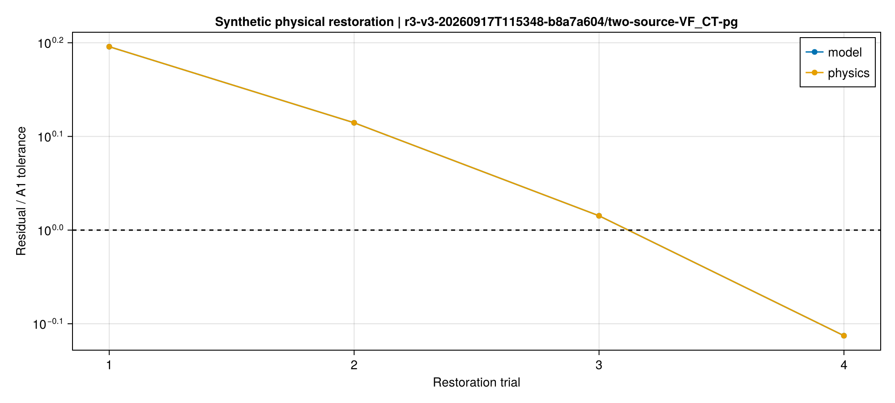
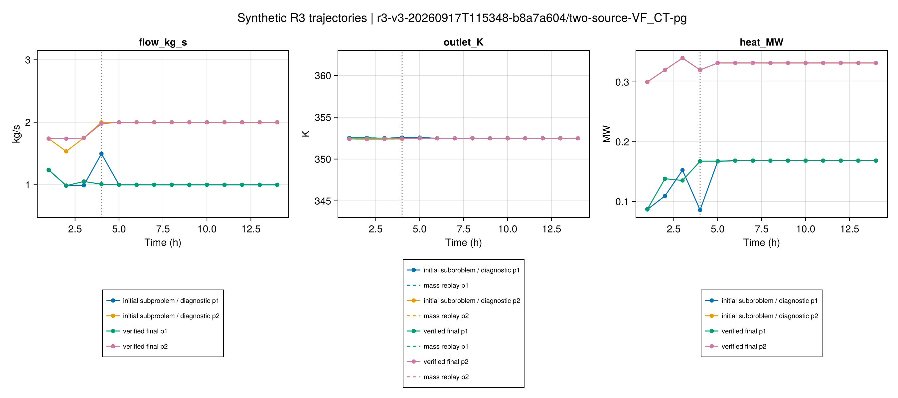
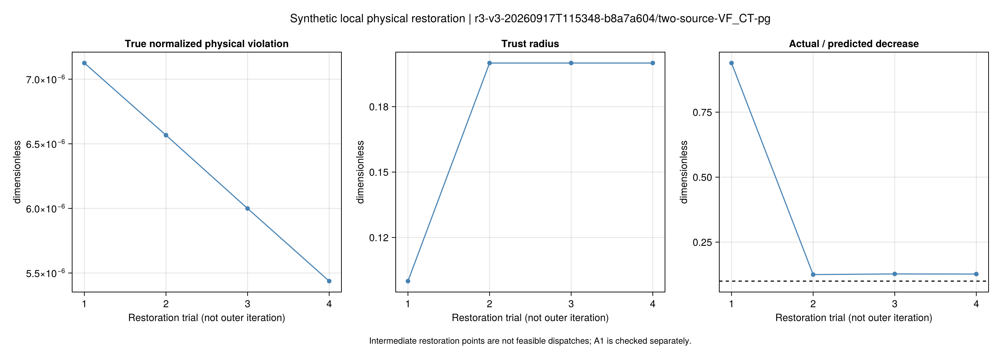
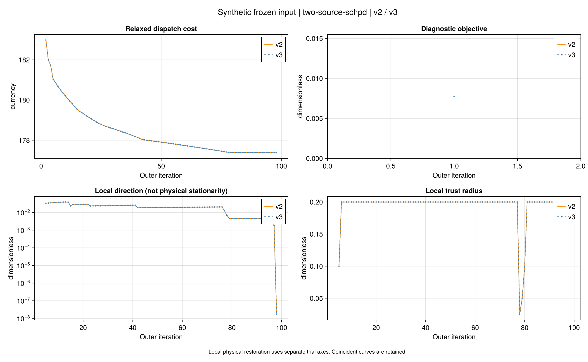
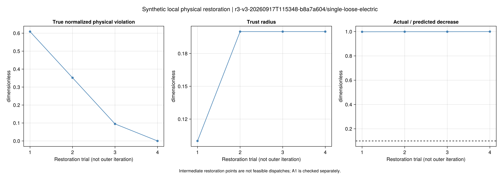
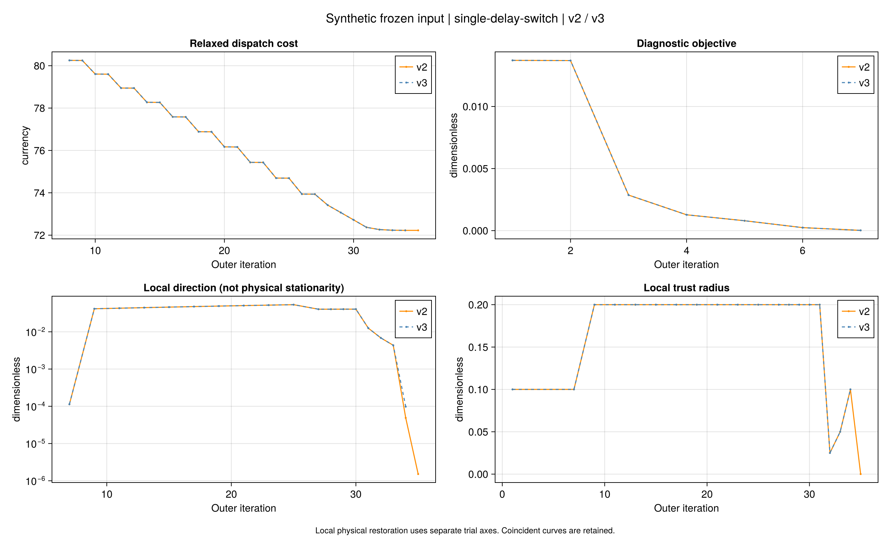

# R3 第四批结果：物理可行性与停止判据

本批交付 **R3 物理可行性与停止判据收尾**。冻结24项主实验及6项消融，均使用已有合成输入，
不扩展论文规模，不改A1、A2和KKT门槛。算法显式命名为`r3_pg_checked_v3`；
推导、手算解释和运行入口见[方法教程](ch03-r3-v3.md)。

**主要结论：双源VF-CT恢复到A1容差内，但严格原等式费用重调度仍失败；
部分旧停滞得到独立局部驻点证据，其余轮数上限没有改判为收敛。**

## 1. 本批究竟解决到哪一步？

| 对象 | 历史v2物理A1 | v3物理A1 | v3原停止条件 | v3新增局部驻点核验 |
|---|---:|---:|---:|---:|
| 16例稳健性 | 15/16 | 15/16 | 1/16 | 3/16 |
| 8项四模式调度/PG | 7/8 | 8/8 | 0项；其中4项CF不适用外层停止 | 1/8 |

历史v2判定保留。v3增加消去端口辅助热量后的直接交付检查，使用原MW门槛；
不是放宽门槛后统计“成功”。两组23/24通过A1，容量反例仍失败。
原停止与新增驻点各自计数，不能相加当成作者算法的收敛率。

- **反例成因：**固定尾段热量冲突与电网松弛吸收微量多余电力，分别有可回放证据。
- **物理恢复：**双源VF-CT、免费购电边界例均通过4次局部恢复更新达到A1；中间点不计成功。
- **费用：**未形成普遍费用改善；大多数同初值费用与v2一致或仅有很小数值差。
- **停止：**双源SCHPD、低流量、时延切换、单源VF-CT四项通过新增驻点核验。
- **仍开放：**双源VF-CT的严格原等式重调度与经济性，以及多数主要初值的200轮停止。

## 2. 双源VF-CT：为什么“通过A1”仍不是全部解决？

### 原失败已分解为两个可检查问题

固定CT源温、保存流量和历史后，沿树结构回放供水，历史失败流量在恢复尾段第6小时
形成约5.5144e-6 MW（5.5144 W）的交付冲突。未缩放SOCP将它分摊到两个辅助等式，
各约2.7566e-6 MW；等价缩放SOCP和原等式模型报告不可行。不能仅凭求解状态认定实现正确或错误。

另取第3时段并冻结设备出力：SOCP可行，非负购电的原等式模型报告不可行；
只在诊断中允许反送时得到约-3.5543e-6 MW购电，损耗差约3.60 W。
这支持此固定出力下的松弛网损机制，不证明完整模式不可行，也没有把反送加入正式案例。
27条可查询冲突约束保留；不支持查询的二次等式/SOC另记为缺失。

共同恢复尾段是项目新增的公平比较边界，不能用这里的固定流量反例断言论文原算例不可行。
细节及原始哈希见[审计清单](assets/r3-v3/r3-v3-20260917T115348-b8a7a604-73ffdff8/audit/manifest.toml)
和[补充反例](assets/r3-v3/r3-v3-20260917T115348-b8a7a604-73ffdff8/audit-addendum-v1/manifest.toml)。

### v3保留了什么？

四个候选角色仍指向同一个流量，单靠多候选策略没有解决此例。4次局部物理更新后，
全部采用关系通过A1，保留费用 **468.44156586** 的恢复候选。
局部求解器报告ALMOST_OPTIMAL；其原始硬约束见证通过后才提出方向，并用真实非线性回放决定接受，
不将这些乘子用于可信梯度或驻点结论。

随后两次固定流量原等式求解均报告不可行，记录明确保留：

- `physical_pass=true`：通过预先规定的有限容差；
- `final_objective_kind=physical_violation`：保留的是恢复候选；
- `cost_optimization_complete=false`：费用优化未完成；
- `outer_status=untrusted_dual_local_stalled`：外层没有收敛。

因此不能把本例说成“精确方程可行且最优”。重新消去下游供水自由变量后的
[固定流量尾段回放](assets/r3-v3/r3-v3-20260917T115348-b8a7a604-73ffdff8/fixed-flow-tail-audit.csv)
与[末次状态](assets/r3-v3/r3-v3-20260917T115348-b8a7a604-73ffdff8/final-attempts.csv)
提供下一阶段继续定位的数值，而非通过调节求解器参数挑选有利状态。
其中第6小时的因果交付误差从5.5144 W降至2.3117 W，低于该例3 W的A1门槛，仍不为零；
这解释了为什么“容差内合格”与更严格的原等式求解结果可以不同。

独立直接参考费用为455.18200486，沿用已保存结果；加入v3直接交付检查后的
[参考回代](assets/r3-v3/r3-v3-20260917T115348-b8a7a604-73ffdff8/reference-recheck.toml)单独登记。
参考未参与PG初始化或恢复。费用差是候选差，不称为本次PG的最优性间隙。

## 3. 停止判据：原条件和新核验各自回答什么？

原文已核查页使用相邻费用绝对变化与ε，未确认具体ε数值。
预先声明的1e-6、1e-4、1e-2只用于诊断，
[历史停止对照表](assets/r3-v3/r3-v3-20260917T115348-b8a7a604-73ffdff8/audit-addendum-v1/stopping-threshold-audit.csv)
不冒称作者的参数设置。

项目旧条件要求三次接受更新的小变化及可信方向指标。新增核验保持流量不变，
连续三次验证子问题、局部问题、KKT、非活跃信赖域及目标稳定性。
这些复查没有伪装成接受更新，`outer_converged`定义不变。

| 主实验 | 费用 | v3外层状态 |
|---|---:|---|
| 双源SCHPD初值 | 177.37624733 | local_stationarity_checked |
| 单源低流量 | 76.84613956 | local_stationarity_checked |
| 单源时延切换 | 72.22625871 | local_stationarity_checked |
| 单源VF-CT | 145.16091309 | local_stationarity_checked |
| 免费购电边界 | 0 | smooth_numeric_stop（旧条件） |

时延切换例的核验发生在离开切换点后的光滑分段，并非在非光滑点套用导数结论。
三次局部原始/对偶见证重读时独立重算，摘要见
[驻点复核表](assets/r3-v3/r3-v3-20260917T115348-b8a7a604-73ffdff8/stationarity-probes.csv)。
适用范围仍是当前松弛局部模型，不推出原非凸问题驻点或全局最优。

`cost_optimization_complete`沿用候选所属内层问题的结束定义；若候选来自SOCP，不能用该字段
宣称严格原等式费用调度已经成功。新增[逐例调度来源表](assets/r3-v3/r3-v3-20260917T115348-b8a7a604-73ffdff8/strict-dispatch-audit.csv)
并列所选候选类型、原等式尝试及其A1通过数量。时延切换例的最低费用流量在严格重求中也失败，
另一个流量得到费用77.58387的原等式候选；保存的较低费用72.22626来自通过A1的SOCP候选。
该例的局部驻点标志不能消除此严格重调度断点。

十个主要初值全部物理A1通过；其中仅双源SCHPD取得上述新标志，其余九项仍到200轮上限。
固定初值与box50的近重复关系保留，不将五条记录当作五个独立随机样本。

| 五初值组 | v3最好／中位／最坏费用 | 物理通过 | 新驻点核验 |
|---|---|---:|---:|
| 单源 | 77.04112／77.04791／78.96134 | 5/5 | 0/5 |
| 双源 | 177.37625／177.40496／177.60279 | 5/5 | 1/5 |

完整费用与耗时分布见[五初值统计](assets/r3-v3/r3-v3-20260917T115348-b8a7a604-73ffdff8/five-initial-statistics.csv)。
保存、重读和绘图另有开销，且本轮未进行受控三次计时重复，不宣称运行速度优势。

## 4. 四模式及消融的解释

费用包括核心时段与共同恢复尾段。

| 模式 | 单源v3费用 | 双源v3费用 |
|---|---:|---:|
| CF-CT | 146.60611 | 457.88915 |
| CF-VT | 144.53193 | 454.15484 |
| VF-CT | 145.16091 | 468.44157（恢复候选，费用优化未完成） |
| VF-VT | 143.45133 | 451.84787 |

双源VF-CT候选费用比CF-CT高。我们另将保存的CF-CT方案放入VF-CT的更自由边界，
仅做[独立嵌入回代](assets/r3-v3/r3-v3-20260917T115348-b8a7a604-73ffdff8/mode-embedding.toml)，
不把它注入PG。这用于区分“候选经济性不足”和“物理灵活性有害”。
嵌入检查通过，保留费用457.88914679，已低于当前VF-CT恢复候选；这是候选经济性不足的直接证据。
本批不重做光伏机制实验，相关输入及独立参考仍见[第三批报告](ch03-r3-v2-results.md)。

六项配对消融的输入、精确初值和600秒预算相同，结果见
[消融表](assets/r3-v3/r3-v3-20260917T115348-b8a7a604-73ffdff8/ablations.csv)。
其中关闭局部恢复后，双源VF-CT没有通过A1的候选；开启后得到上述有限容差候选。
这支持局部恢复在该反例上的作用，但不消除严格重调度失败，也不证明所有案例都需要恢复。
另外两例关闭恢复后费用与停止状态不变。关闭驻点核验后，双源SCHPD回到局部停滞且费用不变；
时延切换多运行一轮后停滞，费用仅低1.1595e-5，仍没有驻点证据。新增核验的主要贡献是证据判别，
不是普遍的费用改善或加速结论。
同时，关闭驻点核验后的切换例还取得费用72.22624751的严格原等式候选，而开启时最低费用
流量的严格重调度失败。这个差异比很小的费用差更值得跟进：局部驻点触发停止后，仍须与
严格物理重调度联合判断，不能因新核验通过就忽略后续失败。

## 5. F04–F06：残差、输运与真实轨迹

图源来自保存值，绘图不重新求解。恢复试探与外层迭代分别编号；虚线是验收或接受阈值，
不是拟合目标。全部逐式残差以CSV.gz无损保存并重读逐值核对。

### 双源VF-CT的物理恢复

F05的p1/p2表示两条管道，热量列读取对应下游节点的端口热量：p1下游是第二热源，
p2下游才是热负荷；不能把两条热量曲线都解释成管内输送热功率或两份负荷。
`verified final`仅指通过A1的保留候选。虚线右侧仍属于共同恢复尾段。

F04最后一个点低于阈值，只表示A1通过；两次严格费用重调度失败没有被该图覆盖或抹去。
图源：[恢复逐式残差](assets/r3-v3/r3-v3-20260917T115348-b8a7a604-73ffdff8/two-source-VF_CT-pg/F04-restoration-source.csv)、
[恢复调度](assets/r3-v3/r3-v3-20260917T115348-b8a7a604-73ffdff8/two-source-VF_CT-pg/F05-restoration-source.csv)、
[实际/预测下降](assets/r3-v3/r3-v3-20260917T115348-b8a7a604-73ffdff8/two-source-VF_CT-pg/F06-restoration-source.csv)。

### 双源SCHPD的v2/v3外层对照

近乎重合的费用轨迹保留，不人为错开制造改进；新贡献是同一点上的额外驻点核验证据。
[对照图源](assets/r3-v3/r3-v3-20260917T115348-b8a7a604-73ffdff8/two-source-schpd/F06-v2-v3-source.csv)
保留两个版本的运行ID。

### 免费购电边界与时延切换

## 6. 证据、复跑与研究边界

正式批次为`r3-v3-20260917T115348-b8a7a604`，计算源码对应本地提交`50d9f46`。
每个运行保存输入、初值、源码快照、分阶段状态、原始乘子和试探；公开摘要不冒充完整运行目录。
两个中断开发批次保留作审阅记录，不与最终统一30例混合，也没有挑选重复结果中的最低费用。

- [全部30项v2/v3比较](assets/r3-v3/r3-v3-20260917T115348-b8a7a604-73ffdff8/comparison.csv)
- [冻结配置与精确初值](assets/r3-v3/r3-v3-20260917T115348-b8a7a604-73ffdff8/frozen.toml)
- [运行和源码哈希](assets/r3-v3/r3-v3-20260917T115348-b8a7a604-73ffdff8/provenance.toml)
- [候选角色及独立κ重构检查](assets/r3-v3/r3-v3-20260917T115348-b8a7a604-73ffdff8/candidate-bank.csv)
- [压缩图源核验](assets/r3-v3/r3-v3-20260917T115348-b8a7a604-73ffdff8/packed-sources.toml)
- [图形配置](assets/r3-v3/r3-v3-20260917T115348-b8a7a604-73ffdff8/figure-config.toml)

当前已完成的完整回归为1102项，包含旧R1–R3及本批54项检查。
故障注入与实际正式运行分别记录，不能将测试fixture说成观察到真实缺许可或所有超时路径。
操作命令见[教程](ch03-r3-v3.md)；结果汇总使用`scripts/summarize_r3_v3.jl`，
完整摘要检查使用`scripts/check_r3_v3_artifacts.jl`。

与论文相比，本批推进的是小系统方法与物理核验，局部恢复和新驻点判据均为项目补充。
没有取得论文同输入数值复现、论文规模速度优势或一般全局收敛证明。
下一阶段应优先连接“恢复通过A1”和“固定流量严格原等式重调度”，并处理剩余九个主要初值的
停止与经济性问题；暂不扩大输入规模来掩盖这些断点。
