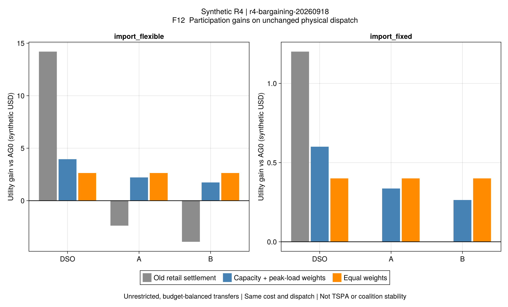
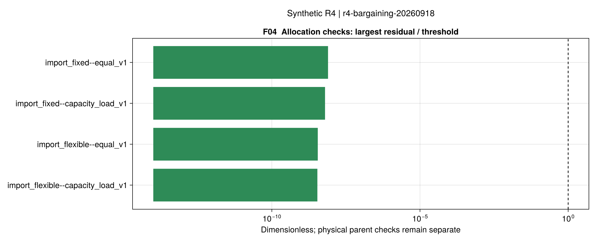

# R4第三批结果：节约可以分配，参与条件需要明确基线

批次r4-bargaining-20260918，源码节点5a13a69。父调度来自
[R4可实施基线](ch04-baseline-results.md)，本批没有重新选择物理最优计划或改变其费用。
冻结两套输入、两套权重，共4项分配；另执行2项Clarabel独立运营运行作为局部最优性补证。
理论、权重口径与适用条件见[议价说明](ch04-bargaining.md)。

## 1. 上一批说明了什么？

同一仅购能制度下，灵活负荷AG0与集中原等式计划的成本为199.698493与191.792732，
差7.905761（3.95885%）；固定负荷为208.890542与207.689671，差1.200871（0.57488%）。
这包括货币化不满意度，不是同百分比的耗能量下降，也不是P2P交易专属收益。

灵活例沿用原零售价后，DSO增加14.201684，A/B分别减少2.378982/3.916942。
因此总体协调价值与个体加入意愿是两个独立问题。
本批在同一物理计划上计算转移，直接检查能否分配已有剩余。

## 2. 固定调度的分配结果

下表为相对各自同制度AG0的**效用增量**，单位为四小时的合成美元。
效用以成本负值及转账定义，不是企业财报利润。

| 案例 / 分配规则 | DSO | A | B | 合计 |
|---|---:|---:|---:|---:|
| 灵活 / 原零售结算 | 14.201684 | −2.378982 | −3.916942 | 7.905761 |
| 灵活 / 容量与峰荷权重 | 3.952880 | 2.215351 | 1.737530 | 7.905761 |
| 灵活 / 三方等权 | 2.635254 | 2.635254 | 2.635254 | 7.905761 |
| 固定 / 原零售结算 | 1.200871 | 约0 | 约0 | 1.200871 |
| 固定 / 容量与峰荷权重 | 0.600435 | 0.336508 | 0.263928 | 1.200871 |
| 固定 / 三方等权 | 0.400290 | 0.400290 | 0.400290 | 1.200871 |

灵活例按容量权重分配时，相对旧账单，DSO让渡10.248804，A/B分别获得补偿4.594332/5.654472。
这些是**追加补偿**；新总内部净支付为另一列。两种表示计算出相同的最终效用，不能重复相加。
所有分配都保持原设备出力、负荷、网络状态和总资源成本不变。

因此，本批支持：在允许无限额、无摩擦双向转移且总剩余为正的模型里，
存在让三方都比指定AG0更好的支付安排。这是解析模型的条件性结论和实现验证。
它不证明某一套权重客观公平，也不证明受限交易合同能实现同样分配。

原文设运营商权重等于聚合商权重之和，所以容量权重组的运营商份额为1/2；
等权组为1/3。份额变化来自规则，不是重新发现了运营商的因果贡献。

## 3. 独立运营费用证据补到了哪一步？

保持原AG0计划不变，用Clarabel枚举唯一电池的16种状态，取得相同局部模型的下界。
旧候选目标与新有效下界的相对差如下，均小于A2的1e-4：

| 原局部计划 | 相对差 |
|---|---:|
| 灵活A | 1.0434e-8 |
| 灵活B | 1.2663e-9 |
| 固定A | 3.4891e-8 |
| 固定B | 1.0800e-8 |

此前B的Gurobi记录因目标界缺失而cost_optimization_complete=false，该历史字段仍保持false。
新证据解决了“该局部候选是否接近同模型最优值”的缺口；原等式网络计划及其原有界另行保留。
这不是把AG0解释成系统集中全局最优，也不证明作者采用相同接入制度。

机器证据：[局部证书](assets/r4-bargaining/certificates.toml)、
[完整分配与父运行证据](assets/r4-bargaining/allocations.toml)、
[主体账本图源](assets/r4-bargaining/allocations.csv)。

## 4. 验收与限制

- 4项正式分配均通过预算平衡、个体理性、剩余恒等式和Nash一阶条件。
- 独立指数锥对照通过目标、支付和有效间隙检查；正/零/负剩余分别覆盖。
- 原物理计划由父运行独立重读验收；补偿本身不改动任何物理变量。
- R1–R4完整1412项回归通过，其中42项为本批议价测试；严格Documenter及doctest通过。
- 仍是三主体、四时段合成案例，热网仅为已声明的稳态能量流模型。
- 未实现TSPA、ATC/ADMM、网络重构或论文规模；不能由个体理性声称所有子联盟稳定。

F04只展示分配残差，物理残差保留在父批次，不能用零预算误差代替物理验收。
来源、父输入及图源哈希见[报告元数据](assets/r4-bargaining/report.toml)和
[图形配置](assets/r4-bargaining/figure-config.toml)。

## 5. 下一步优先级

1. **实现TSPA的原文结构及条件审计。**分别计算忽略网络的聚合商交易计划、
   DHSO0-r惩罚分歧点和实际网络可行性，检查正剩余与稳定性推导前提；
   负剩余或反事实基线必须保留，不人为补成“所有人满意”。
2. **推进ATC/ADMM。**先将原页的惩罚系数、范数平方和对偶更新写成一致推导，
   在固定离散选择的凸小例上对照集中结果，再分别检查整数和原电网等式的限制。
3. **补拓扑与规模。**上述结构验收后引入网络重构和公开/作者规模输入，
   随后按全文计划推进第5–7章；不回到R3无限追加算法版本。

本批已经有足够证据转向上述问题，不必为让合成收益百分比接近论文而继续调整数据。
