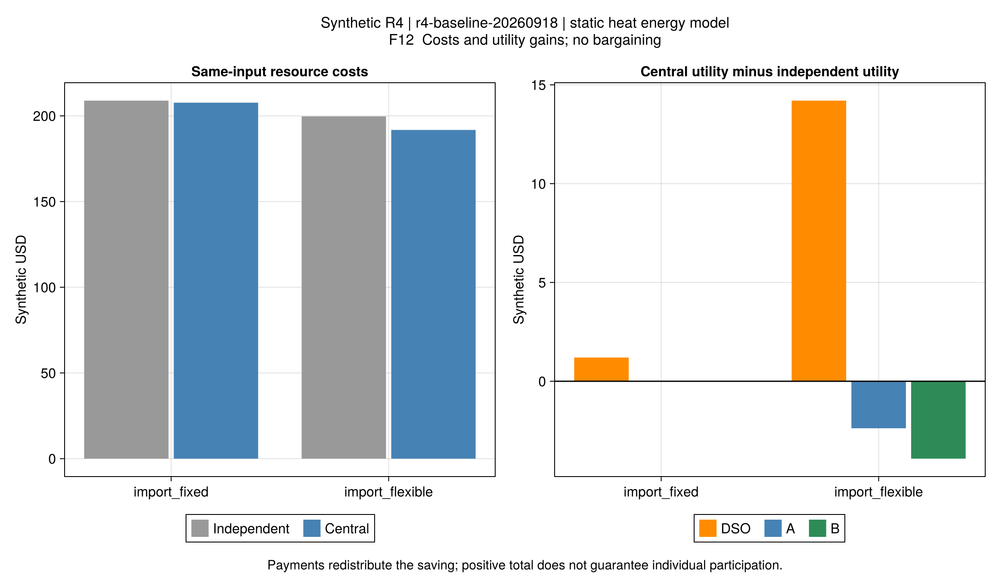
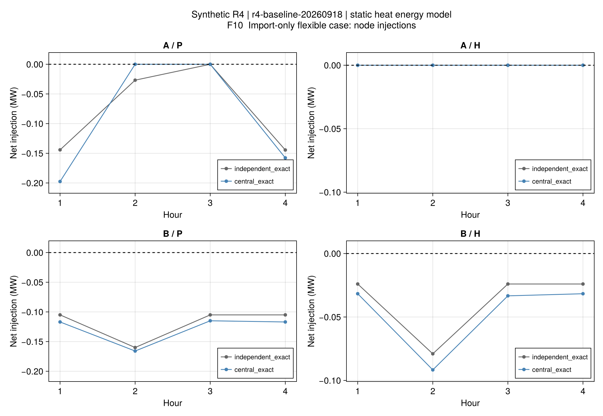
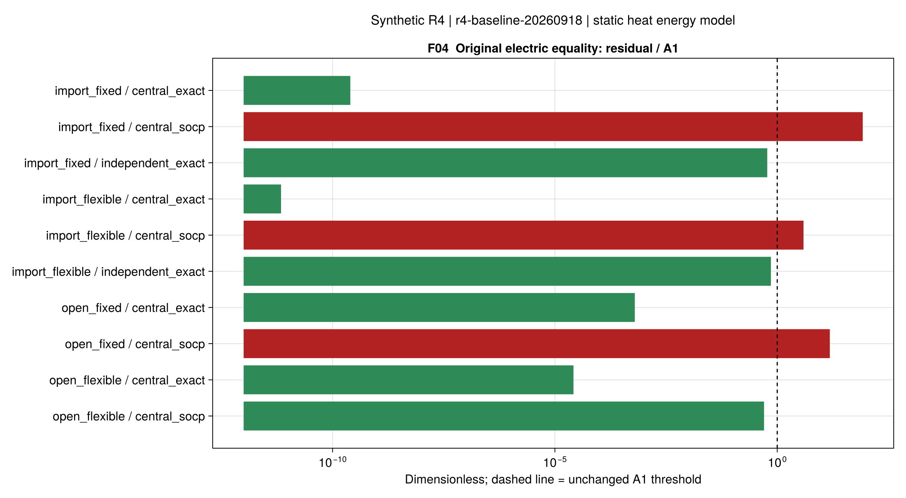

# R4第二批结果：节约与自愿参与是两件事

正式批次r4-baseline-20260918，求解源码节点750a36a。四组冻结合成输入各执行AG0原电网校核、
集中SOCP及集中原等式，共12次；另有Clarabel枚举16个电池模式的同模型对照，共13条存档。
模型/制度见[采用解释](ch04-baseline.md)，历史[首批结果](ch04-results.md)不改写。

## 1. 首先有了可实施的独立运营对照

仅购能制度在两套计划中施加相同边界，不根据集中收益调整负荷或价格。
所有金额为四个一小时时段的合成美元；内部支付已从资源成本中抵消。
此处系统成本包含设备运行、外部购电及货币化不满意度；费用节约不等于同百分比的耗能量下降。

| 接入制度 / 负荷 | 独立计划网络检查 | 独立成本 | 集中原等式候选成本 | 同制度候选节约 |
| --- | --- | ---: | ---: | ---: |
| 开放 / 灵活 | 不可行 | 不报告 | 165.049330 | 不适用 |
| 开放 / 固定 | 不可行 | 不报告 | 179.726618 | 不适用 |
| 仅购能 / 灵活 | A1通过 | 199.698493 | 191.792732 | 7.905761（3.95885%） |
| 仅购能 / 固定 | A1通过 | 208.890542 | 207.689671 | 1.200871（0.57488%） |

原开放AG0仍然不可行。仅购能是预先声明的项目对照制度，不证明原AG0已经被修复，
也不证明所有网络都能接受任意仅购能计划。容量不足仍可失败。

**费用证据限制：**灵活AG0的B局部问题返回OPTIMAL，但现有Gurobi调用未取得有效目标界，
故完整流程的cost_optimization_complete=false。网络计划通过独立验算，上表成本差是可实施候选之间的差；
不将其宣称为已经认证的两个全局最优策略之差。固定AG0的全部阶段认证字段通过。
该缺口后续通过独立同模型证书补充，不能把缺失界写成零间隙。

证据：[13项对照与界](assets/r4-baseline/comparison.csv)、[同输入收益核算](assets/r4-baseline/surplus.toml)、
[来源与生成脚本](assets/r4-baseline/report.toml)。

## 2. 总体节约仍可能让聚合商受损

以各自在同一制度下实际可实施的AG0效用为分歧点，灵活负荷例沿用原零售价：

| 主体 | 集中效用减独立效用（合成美元） |
| --- | ---: |
| 运营商DSO | +14.201684 |
| 聚合商A | −2.378982 |
| 聚合商B | −3.916942 |
| 合计 | +7.905761 |

三方变化之和等于资源节约，内部支付没有创造额外资源。
集中目标通过调整设备与负荷改善全系统成本，但原零售价没有自动把好处分给承担调整的主体。
因此该例不能声称自愿参与成立，更不能称为已经完成公平议价。
固定负荷例则主要由运营商获得约1.200871，A/B效用在数值容差内不变。

仅购能例没有P2P净出售；这是一项调度协调效应，不能把3.95885%直接叫作P2P交易收益。
开放集中成本更低包含接入权限变化，不与上述同制度差混算。

## 3. 固定偏好后，灵活性的作用不再被混杂

对照检查确认两组只改变flex，偏好、设备、成本和网络保持一致。
开放集中成本由固定负荷179.726618降至灵活负荷165.049330，候选差14.677288；
仅购能集中成本由207.689671降至191.792732，候选差15.896939。

这一结果与“扩大可行域不会提高同一目标的最优值”相容。
首批固定负荷例同时改变偏好锚点，不能与本批新固定负荷费用混用。
[单因素检查与原始费用](assets/r4-baseline/flexibility.csv)保留两套对照。

相同载能类型使用相同纵轴，约1e-10 MW的数值噪声不放大为供热变化。
图中A基本热自给；P/H节点净量仍不能替代支路潮流或完整温度场。

## 4. 哪些验收通过，哪些没有？

- 四个集中原电网等式候选、两个仅购能AG0网络计划通过本批A1。
- 四个Gurobi集中SOCP均满足采用模型，但固定开放、灵活仅购能、固定仅购能的原支路等式未过A1。
  费用接近不替代原关系验算；失败保留。
- 同一仅购能SOCP的Gurobi/Clarabel相对费用差1.7569e-7；
  有效间隙分别7.7836e-7、6.8241e-11，通过A2的1e-4门槛。
- 现金流两两抵消、费用独立重算、偏好隔离、输入哈希和旧19运行重读均通过。
- 全R1–R4回归1370项通过，其中本批新增80项。工程通过不等于全文科学结论成立。

[完整残差](assets/r4-baseline/residuals.csv)、[主体账本](assets/r4-baseline/actors.csv)、
[合同量](assets/r4-baseline/contracts.csv)、[A2](assets/r4-baseline/solver-comparison.toml)、
[图源配置](assets/r4-baseline/figure-config.toml)可独立检查。

## 5. 与论文主线的关系及下一步

本批支持了“统一调度能够产生可分配剩余，但原价格未必满足个体参与条件”这一机制，
并为第4章分布协调/议价提供了可检查的集中参考和分歧点。
这不是作者同输入数值复现，也没有完成非对称纳什议价、ATC/ADMM或网络重构。

接下来：

1. 核读第4章后续分布协调和议价原式，补齐局部最优性证据和分歧点定义。
2. 先在固定物理调度下建立预算平衡、个体理性、零/负剩余处理的议价账本。
   议价权重须有原文或单独声明的教学依据，不能事后挑选以制造公平。
3. 用同一集中模型逐步验证ATC/ADMM的残差、成本差和整数/非凸边界；再加入拓扑决策。
4. 第5–7章按[全文清单](reproduction-coverage.md)继续，R3历史限制保留，不启动v4专项。

热网仍只验证稳态能量流、端口包络和容量，没有逐管温差、混合或水压认证。
本批结论限定在声明的采用模型内，不扩大为实际工程网络或整个论文完成。
