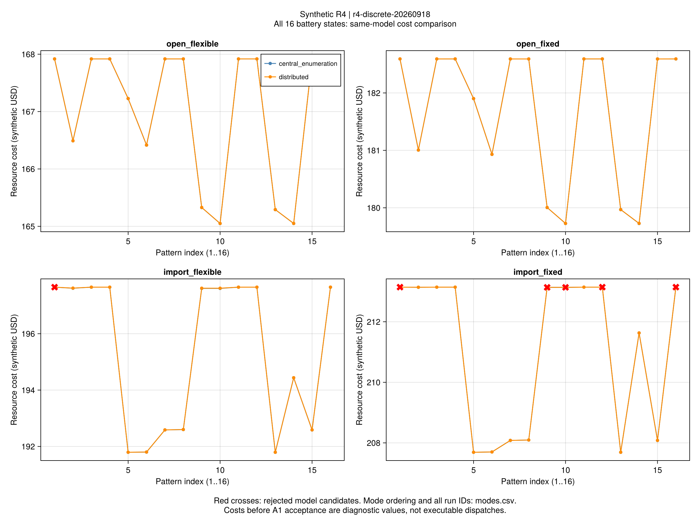
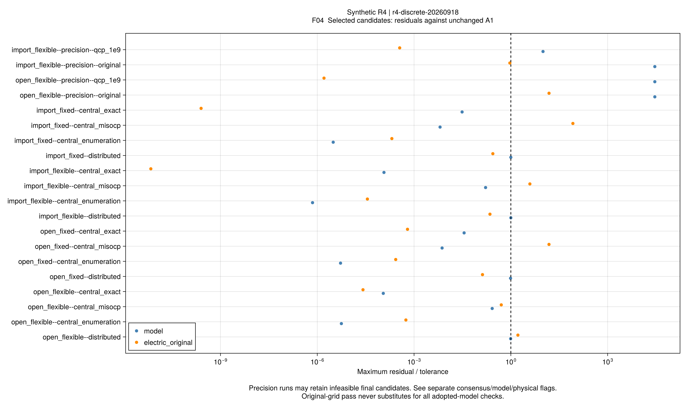
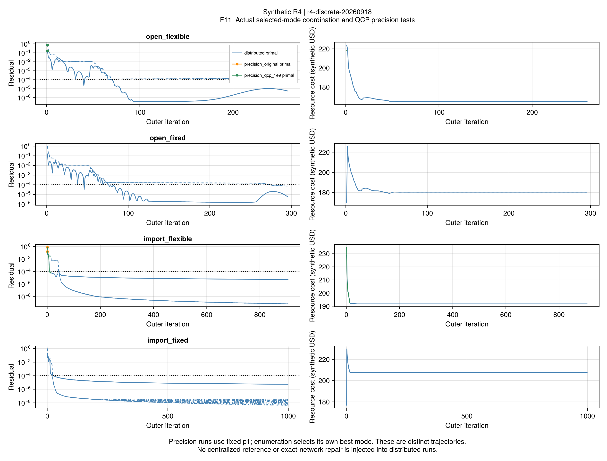
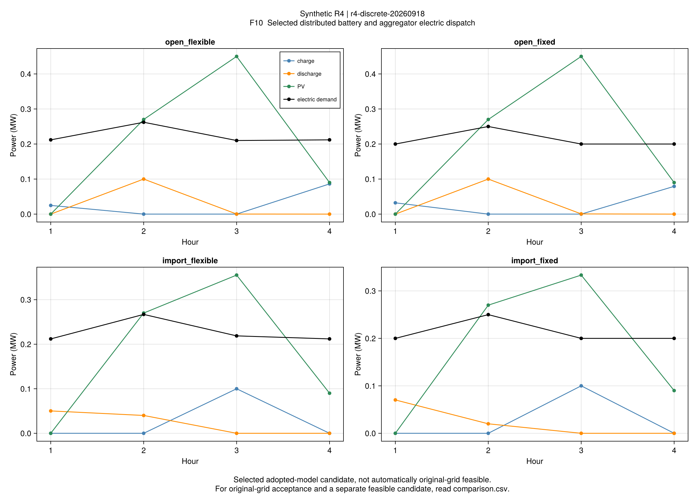

# R4全部电池模式：结果与精度边界

## 1. 结论

**全部离散选择已经在合成小系统上穷尽核查；分布法的最好采用模型费用接近集中参照，
但达到共识和接近最优费用仍不能自动保证原电网关系。**

四套输入各有16个模式。分布候选共58/64通过采用模型验收，44/64同时通过原电网等式；
6项达到1000轮上限。四套均有至少一个原电网合格候选。
完整方法运行20项：四输入×四方法，以及4项固定模式精度对照。
这些是有限模式搜索结果，不是整数ADMM的一般收敛证明。

## 2. 同输入比较

批次r4-discrete-20260918，科学源码46dadf6，配置在求解前冻结。
每个完整方法共享600秒；分布与集中穷举都覆盖全部16模式，沒有从参考解初始化。
原始结果、解析费用重构、采用模型和原电网检查分别保存。
方法和项目编号公式见[离散核查说明](ch04-discrete.md)。

| 输入 | 分布采用模型通过 | 分布原电网通过 | 分布最好模型费用 | 集中穷举费用 | 相对费用差 | 分布最好物理合格费用 |
|---|---:|---:|---:|---:|---:|---:|
| 开放、灵活 | 16/16 | 2/16 | 165.050516 | 165.049330 | 0.000719% | 166.416178 |
| 开放、固定 | 16/16 | 16/16 | 179.728287 | 179.726618 | 0.000929% | 179.728287 |
| 仅购能、灵活 | 15/16 | 15/16 | 191.793662 | 191.792732 | 0.000485% | 191.793662 |
| 仅购能、固定 | 11/16 | 11/16 | 207.690147 | 207.689670 | 0.000230% | 207.690147 |

金额为合成美元，含负荷不满意度。相对费用差是同模型算法误差，不是节能率或交易收益率。
开放/灵活的最好模型候选没有通过原电网A1；其最好物理候选费用约高0.83%，不能混用两列。
其余三套的最好模型候选也通过原电网。

此前两组固定模式并未包含所有更优选择。例如开放/灵活集中最低费用由p1的166.415462降到165.049330。
这是扩大离散搜索范围的作用，不能记为修改ADMM带来的性能收益。
分布与集中可能选择不同模式编号；电池闲置时多个二进制模式描述同一物理计划，
微小数值差即可改变编号，因此不据此声称两法选择了实质不同的最优策略。

全部128条逐模式记录见[modes.csv](assets/r4-discrete/modes.csv)。
分布失败为仅购能/灵活的0000，以及仅购能/固定的0000、0001、1001、1101、1111；
字符串从第一时段到第四时段。原始失败保留，没有重选模式或增加迭代次数。

## 3. 集中参考与物理边界

- Clarabel集中穷举的64个模式全部通过采用模型和原电网A1。
- 四个有限并集的有效下界均覆盖全部模式，总相对间隙不超过6.68e-10。
- Gurobi集中MISOCP的四项费用与集中穷举接近，均通过采用模型和A2；
  但只有开放/灵活的原电网关系通过，另外三项保留失败。
- 四项含原电网等式的整数参考均通过本批A1，实际报告的有效间隙均小于1e-6。
  原等式参考与SOCP是不同模型，费用差不称为同模型最优性间隙。

这说明原电网残差并非只在分布法中出现。原等式参考费用又十分接近凸穷举，
支持这四个输入的最优费用层面松弛差较小；不能因此把每个SOCP候选自动改判物理通过，
也不能由此证明所有输入的锥松弛都精确。

F04绘制每个方法所选的最好模型候选；precision运行保留最后已完成候选，
即使它不满足模型约束也显示其残差。无量纲比值1为各自冻结A1门槛，原始数值见
[residuals.csv](assets/r4-discrete/residuals.csv)。
此处“物理合格”仅包括本批电网、设备和稳态热能流，未验证动态温度场。

## 4. 单参数精度对照

两套灵活输入保持既有p1、同一算法、预算、初值、A1/A4门槛，
只把Gurobi BarQCPConvTol从实际默认1e-6改为1e-9。

| 输入 | 原设置 | 收紧设置 | 收紧设置完成外层轮数 |
|---|---|---|---:|
| 开放、灵活 | 内层100次上限 | 某块返回LOCALLY_SOLVED，外层按solver_failure停止 | 1 |
| 仅购能、灵活 | 内层100次上限 | 某块返回LOCALLY_SOLVED，外层按solver_failure停止 | 14 |

两项收紧设置均未取得采用模型合格调度。不能认为“只要把容差调小就会成功”。
LOCALLY_SOLVED没有满足本算法内循环要求的OPTIMAL状态；它也不等于原问题被证明不可行。
该批原始记录没有保存底层Gurobi状态号，而当前适配层有不止一种状态映射到LOCALLY_SOLVED，
因此不进一步猜测其具体内部退出原因。记录见[precision.csv](assets/r4-discrete/precision.csv)。
本批按冻结方案结束参数对照，不继续搜索有利参数。

F11残差面板实线为原始残差、虚线为对偶残差。蓝线是全模式中所选的实际分布轨迹；另外两种颜色是固定p1的精度实验，
二者模式可能不同，不作逐轮速度排名。单点失败也保留标记。
分布穷举实测约66–156秒，集中参考耗时另外记录；JIT预热和求解顺序未设计为性能实验，
不能据此给出可推广的加速或减速倍数，更不能继承论文规模速度结论。

F10显示最好采用模型候选的电池、光伏及负荷。必须结合F04和结果表判断原电网是否合格。
数据：[dispatch.csv](assets/r4-discrete/dispatch.csv)、[trajectory.csv](assets/r4-discrete/trajectory.csv)。

## 5. 验证与下一步

- 原始运行读回、完整文件清单与哈希、逐模式控制与成本重构、候选选择均已重验。
- 实现节点完整R1–R4回归1555项通过；证据收尾补充缺界、无电池与不可行检查，专项45项通过。
  后者不修改冻结科学源码、参数或结果。
- API使用中文docstring；3条项目式、符号和测试映射通过。图表只读取保存结果。
- 同一运行的原始失败不会因重构或另一个模式成功被改写；分布法仍不具有自己的全问题下界。

本批完成“全部电池模式与一次有界精度核查”。下一步推进第4章电热网络重构：
核对连通、径向和开关边界，在可枚举小网络上比较固定/重构配置，再进入较大系统。
当前精度限制作为后续使用边界保留，不发展无边界的求解器调参任务。
第5章风险与样本外、第6章弹性规划及第7章迁移仍在[全文清单](reproduction-coverage.md)中。

完整比较：[comparison.csv](assets/r4-discrete/comparison.csv)。本批仅本地提交，未推送。
