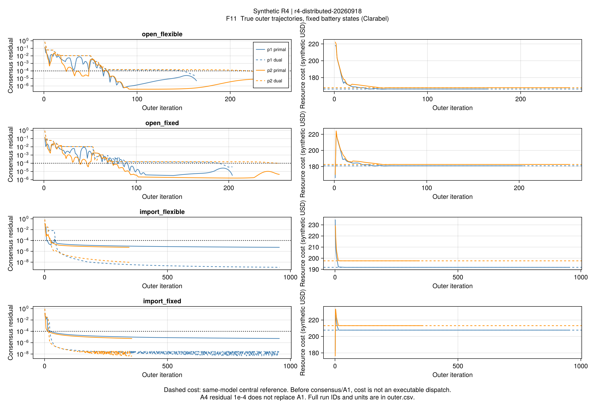
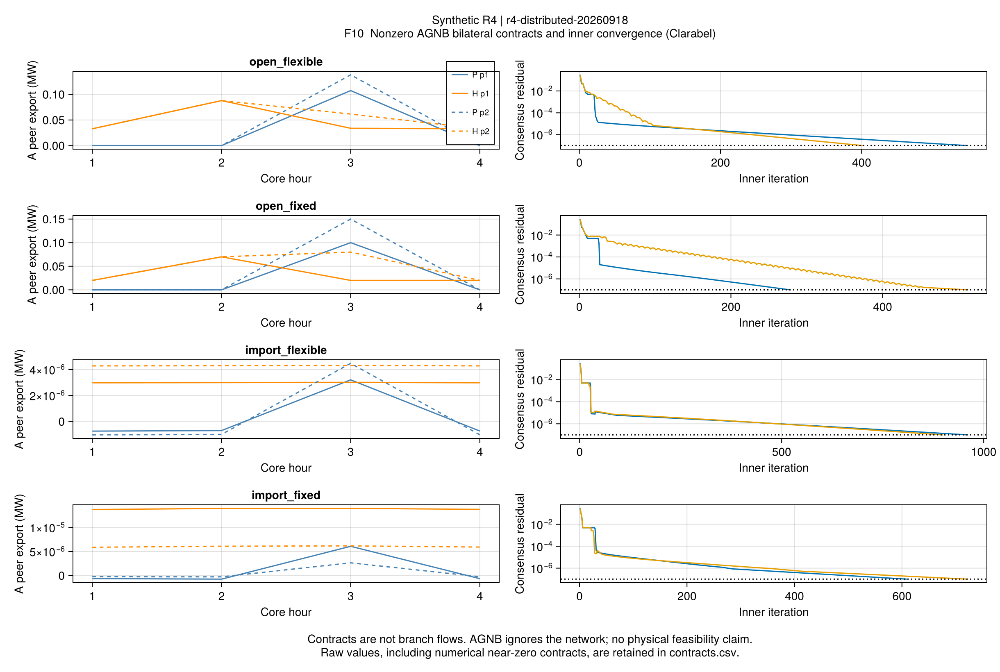
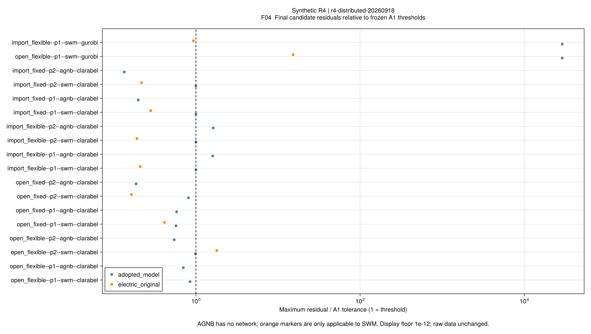

# R4分布协调：固定离散模式正式对照

## 1. 本批说明了什么

**在固定电池状态的合成凸问题上，交换边界消息可以接近同一集中最优费用。**
Clarabel的8项SWM全部通过共识、采用模型A1和A4费用对照，最大相对费用差约
**0.000636%**。其中7项满足原电网等式A1；剩余1项仍保留失败。

这验证了分解接口和采用算法的数值作用，不等于作者完整ATC参数规则、整数/非凸全局算法、
网络重构或论文规模速度优势已经复现。模型版本与推导见[分布协调说明](ch04-distributed.md)。

## 2. 冻结设计与证据

- 源码节点：c10b4a6；批次：r4-distributed-20260918。
- 四套原有输入，p1=[1,0,1,0]、p2=[0,1,0,1]两组预定电池模式。
- Clarabel：4输入×2模式×SWM/AGNB=16项。另两套灵活输入p1各做一次Gurobi SWM，共18项。
- 18项独立集中参考分别在分布运行之后求解，相同输入、模式、目标和SOCP约束。
- ρ=ρ_q=1、零初始消息；外层上限1000，嵌套内层上限100，独立AGNB上限1000。
  每种方法/参考各有600秒预算，未调整阈值或重选输入。
- 记录保存实际MOI约束类型；本批各块只有仿射约束与SOC/旋转SOC，
  增广目标由正系数平方仿射项组成，没有离散变量。约束类型及末次块界见
  [solver-blocks.csv](assets/r4-distributed/solver-blocks.csv)。

### SWM：资源费用和物理检查

| 输入 | 模式 | 外层轮数 | 分布费用 | 集中费用 | 相对差 | 原电网A1 |
|---|---:|---:|---:|---:|---:|---|
| 开放、灵活 | p1 | 164 | 166.416178 | 166.415462 | 0.000430% | 通过 |
| 开放、灵活 | p2 | 253 | 167.918386 | 167.917471 | 0.000545% | 未通过 |
| 开放、固定 | p1 | 204 | 180.930872 | 180.930468 | 0.000223% | 通过 |
| 开放、固定 | p2 | 255 | 182.592992 | 182.591831 | 0.000636% | 通过 |
| 仅购能、灵活 | p1 | 956 | 191.801016 | 191.800102 | 0.000476% | 通过 |
| 仅购能、灵活 | p2 | 345 | 197.652313 | 197.651199 | 0.000564% | 通过 |
| 仅购能、固定 | p1 | 956 | 207.700402 | 207.699961 | 0.000212% | 通过 |
| 仅购能、固定 | p2 | 356 | 213.142831 | 213.142343 | 0.000229% | 通过 |

单位为合成美元，含负荷不满意度；不是耗能量或完整整数调度最优值。
两组固定模式的费用不能用来宣称已经选出全部16组状态的全局最优。
这8项均通过采用模型A1，集中参考均有有效A2界。

开放/灵活p2的原支路等式最大残差为1.79456e-6，门槛1e-6。
失败数值虽小，仍不改判；尚未证明该现象来自结构松弛不精确或仅是数值精度。
本批没有在末尾偷偷调用原等式集中修正。



F11每条线来自真实迭代；费用在早期就接近参考，但仅购能p1到956轮才同时满足A1与A4。
因此“费用看起来稳定”不能替代共识和约束判据。未共识点也可能位于参考费用以下。

## 3. AGNB：非零交易与成本上图

开放输入出现非零电热合同，证明内层不仅验证了零交易退化。
原始8项AGNB都达到内层共识条件；6项通过完整A1，另外两项只在成本重算一致性检查失败。
对应设备、储能、接入边界及合同平衡已通过；AGNB没有网络，不能称为物理调度验证。

| 未通过的原始运行 | 成本重算误差 | 原A1门槛 | 不满意度上图余量 | 收费辅助余量及合同误差 |
|---|---:|---:|---:|---:|
| 仅购能、灵活p1 | 0.000473624 | 0.000295932 | 0.000096504 | 0.000377116 |
| 仅购能、灵活p2 | 0.000506243 | 0.000311780 | 0.000102848 | 0.000403390 |

单位为合成美元。独立分解误差均小于1e-8，见
[成本分解](assets/r4-distributed/cost-closure.csv)和[失败原行](assets/r4-distributed/failed-rows.csv)。
末次块虽报告OPTIMAL，其保存的增广目标相对间隙约4.50e-6至9.97e-6，
不能假定求解器状态已经保证所有更严格的账本条件。

### 保持控制量的解析核查

采用模型中的不满意度上图变量w仅参与下界锥约束与正费用项。
给定负荷后，将w取到对应平方值不会破坏其他约束，也不改变设备控制。
在既有集中合同表示中，服务费本就按反对称合同的绝对值计一次；
局部收费辅助变量未取等的原值继续留在原始主体记录中。

我们单独保存解析重构：只收紧w，合同和所有物理变量逐值相同，
按原采用模型重算数学目标，并单列原求解器目标。
**8/8重构候选通过A1，实际资源与交易费用不变**。
这是成本辅助量的收尾，不是新的求解器证书；原始6通过/2失败及外层停止状态均未重写。
两条候选的实际费用与集中参考仍相差约0.000206%/0.000224%。

证据：[cost-tightening.csv](assets/r4-distributed/cost-tightening.csv)、
[完整重构值与控制哈希](assets/r4-distributed/cost-tightening.toml)。
这项独立分析尚未暗中接入算法停止逻辑，避免改变被冻结的运行。



仅购能输入中的合同量约为1e-6至1e-5 MW，属于本批数值近零量，
不能因图轴自动缩放将其解释为实质性交易收益。内层轮数278–960，输入与模式均会影响速度。

## 4. Gurobi对照中的负结果

两项Gurobi分布运行都在第二次外层的内循环达到100次上限，
仅完成一次外层网络更新，最终未形成采用模型A1合格的合并调度。
末次内层原始/对偶误差：

| 输入p1 | 原始误差 | 对偶误差 | 内层门槛 |
|---|---:|---:|---:|
| 开放、灵活 | 1.12719e-5 | 3.71358e-6 | 1e-7 |
| 仅购能、灵活 | 5.21168e-6 | 8.61675e-6 | 1e-7 |

对应集中参考有可行值；开放例有效间隙1.23101e-6，通过A2。
仅购能例未读取到有效界，仍为A2未通过，不能根据OPTIMAL补造界。
本批没有通过反复调参挑选成功结果，具体数值精度/退化成因尚未完全分离。

总体为18项分布运行、18项参考：16项Clarabel达到共识，原始14项同时通过A1及A4费用对照；
两项成本重构另列。Gurobi两项分布失败和一项参考缺界不隐藏。



F04蓝色为采用模型与账本检查，橙色仅表示原电网支路关系，
不能只看橙色点通过就判完整调度可行；AGNB没有橙色网络检查。

## 5. 与作者主线的关系和下一步

支持的机制是：**主体保留自己的设备问题，通过一致边界协调可以接近集中福利解。**
这与论文第4.3节的分布协调主线相符；本批的额外边界消息和固定ρ是明确采用解释。
合成三节点/两AG、固定电池模式、静态热能流不能继承作者论文规模效率或通用隐私声明。

下一步按有界节点推进：

1. 将解析成本辅助量收紧的证据转为显式可选后处理，同时保留原始状态；
   对内层精度进行一次预先冻结的等价模型/求解器对照，避免无限打磨单例。
2. 对四时段电池全部16种状态与集中MISOCP对照，区分状态内凸收敛与整数选择。
3. 再推进电热网络重构及较大公开/替代输入；不以本批小系统覆盖代替完整R4。
4. 保持全文目标：第5章风险与样本外、第6章弹性及分解、第7章迁移均仍须完成。

## 6. 操作入口和检查

```powershell
julia +1.12.6 --startup-file=no --project=. scripts/check_r4_distributed.jl
julia +1.12.6 --startup-file=no --project=. scripts/test_r4_distributed.jl
julia +1.12.6 --startup-file=no --project=. scripts/study_r4_distributed.jl
julia +1.12.6 --startup-file=no --project=. scripts/report_r4_distributed.jl <study.toml>
julia +1.12.6 --startup-file=no --project=docs scripts/plot_r4_distributed.jl <新报告目录>
```

独立审计另用audit_r4_distributed.jl、tighten_r4_distributed_cost.jl，
二者均接收study.toml和报告目录；既有运行和封存报告不允许覆盖。
VS Code已配置任务；本次没有可发现的原生窗口，不声称任务UI已执行。

专项54项、完整R1–R4共1516项测试通过；严格Documenter/doctest、格式、公式映射和项目检查
在实现节点通过，证据收尾另记于任务记录。所有图只读取保存数值。
完整表：[comparison.csv](assets/r4-distributed/comparison.csv)；
轨迹：[outer.csv](assets/r4-distributed/outer.csv)、[inner.csv](assets/r4-distributed/inner.csv)。
