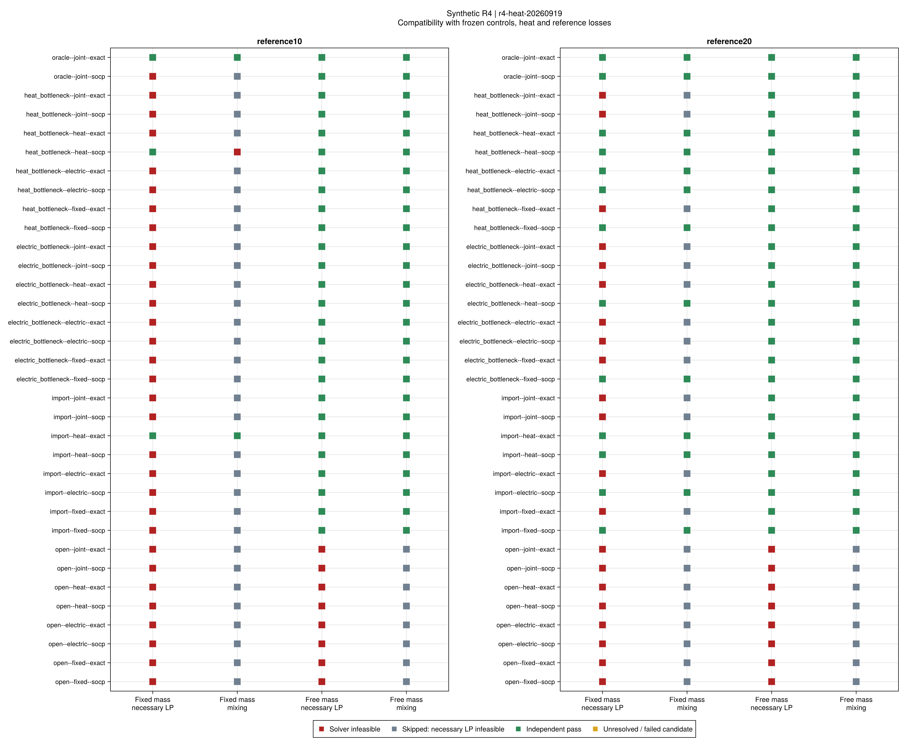
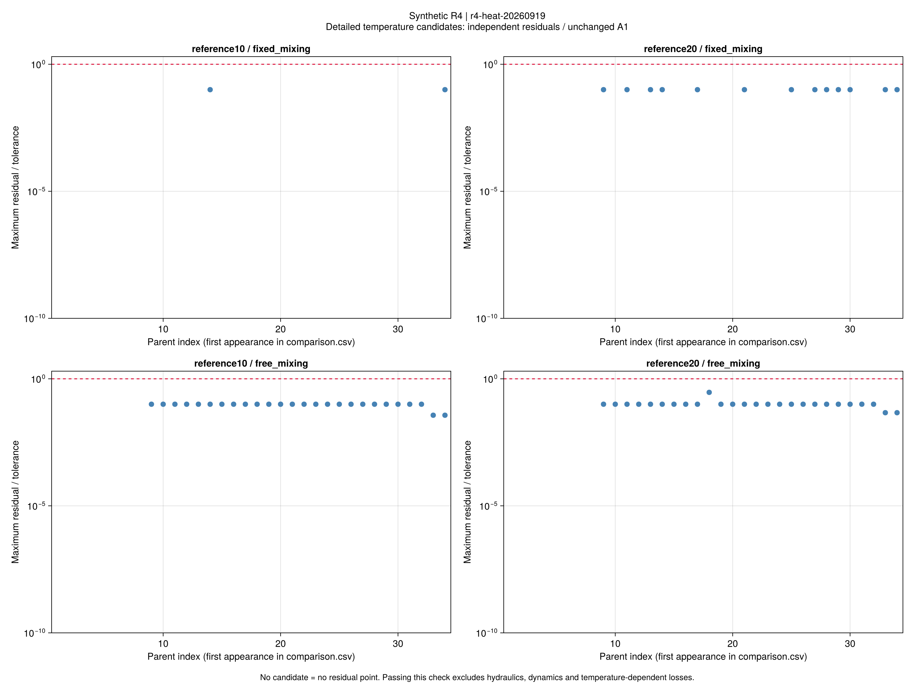
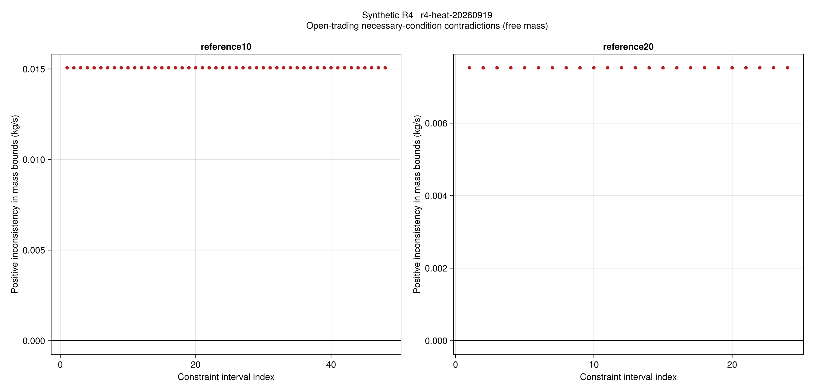
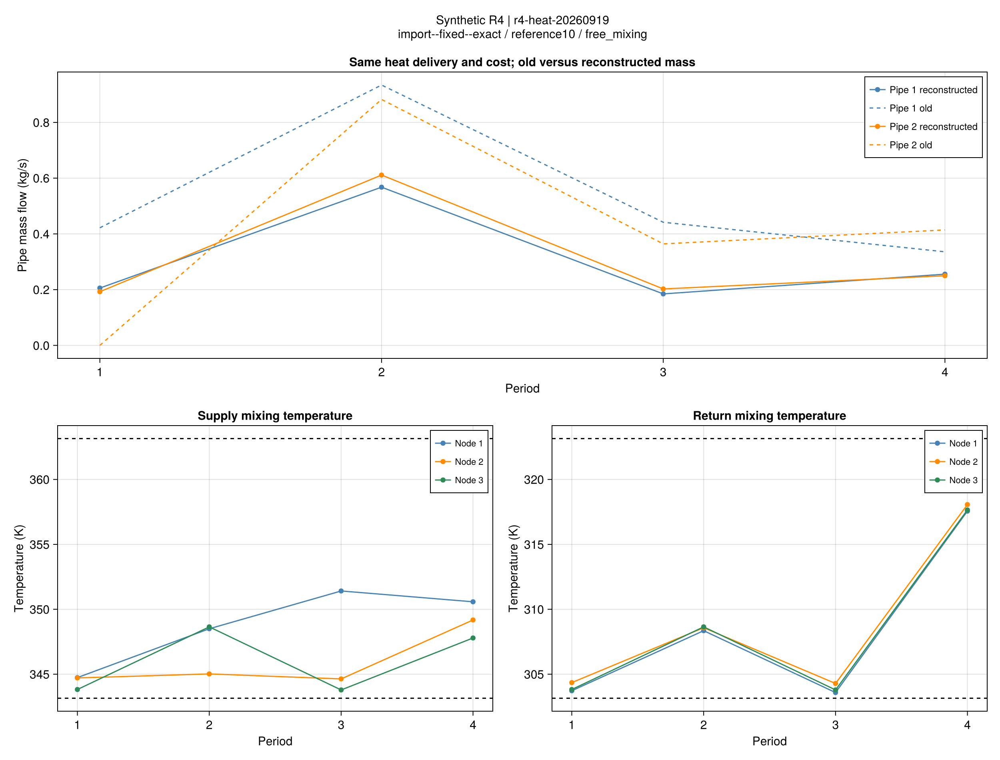

# R4热状态核查：哪些调度可保留，哪些必须重审

## 1. 结论

**34个父调度中，26个能在设备出力、负荷、拓扑、逐管热交付和费用均不变时，
重构出满足声明范围的稳态供回水状态；8个开放交易调度在两组温度带下都存在必要条件冲突。**
这里的相容性仍使用冻结参考损耗，不包含水压、泵、动态或实际温度相关散热。
原电网检查另行保留：26个可重构调度中24个同时通过原电网等式。

这给出了比“原始质量流不合理”更具体的判断：

- 仅购能、电瓶颈、热容量缩减及单时段核验调度可保持原设备与费用，另存合理的热状态。
- 开放交易调度的失败不能只靠重选质量流和温度消除，需要重新审查端口、闲置支路和损耗边界。
- 热状态重构成功不修复原电网失败，也不把旧运行的历史判定改成新判定。

批次r4-heat-20260919，科学源码60f2eab；父批次r4-network-20260919。
34个父运行、2组预先冻结温度带、4阶段，共272条阶段记录：204条实际求解/存档，
68条因对应线性必要条件不可行而明确跳过。没有超时或未决项。
输入及方法见[相容性说明](ch04-heat-compatibility.md)，[原重构结果](ch04-network-results.md)完整保留。

## 2. 固定原质量流与允许重构的差别

| 项目温度带 | 固定原流量：必要条件通过 | 固定原流量：详细混合通过 | 自由重构流量：必要条件通过 | 自由重构流量：详细混合通过 |
|---|---:|---:|---:|---:|
| reference10，参考温度±10K | 3/34 | 2/34 | 26/34 | 26/34 |
| reference20，参考温度±20K | 13/34 | 13/34 | 26/34 | 26/34 |

温度带来自项目假设，不是论文参数。扩宽温度带改变了“原质量流是否可保留”，
没有改变本批“允许重构后是否相容”的分类。不能据此推断任意温度范围都有相同结论。

绿色表示该层独立验算通过；灰色仅表示依据必要条件跳过，没有虚构一次非凸求解。
窄温度带下heat_bottleneck--heat--socp通过了固定流量必要条件，却被详细混合模型判为不可行；
允许流量重构后通过。这直接说明逐管温差包络不能替代整个供回水网络的混合关系。

全部52个“自由流详细候选”对应26个父调度在两个温度带下的证据，不能当成52个独立案例。
详细合格候选最大归一化残差约0.293，混合温度误差最高2.931e-5K，低于既有1e-4K门槛。
质量流最大改动约2.44133kg/s；其物理控制意义不能与可任意收紧的成本辅助变量混为一谈。
本批没有水泵用电，因此“费用不变”只对当前声明的资源费用模型成立。

没有候选的阶段不绘制虚假零残差。图中阈值1为原有A1，不因负结果改变。

## 3. 开放交易失败的可手算证据

16条自由流必要条件不可行记录（8父运行×2温度带）均有解析区间冲突。
这排除了本批失败仅仅源于非凸求解器没有找到温度解的解释。
证据仍限定于冻结热交付、方向、端口边界及参考损耗；不证明所有热网解释均不可行。

以open--electric--exact、第1时段的反向弧2→1为例：
保存入口热量0.0018MW，出口热量0，供管损耗0.00126MW，回管损耗0.00054MW。
末端节点1的产热和用热均为0，原状态的管道质量流也为0。

在reference20下，供水允许的最大温降是40K。取cp=0.00418 MW/(kg/s·K)，
建模热量匹配带宽ε_H=3e-7MW，有必要条件

~~~math
m_{2\to1}\ge
\frac{0.00126-\varepsilon_H}{0.00418\times40}
=0.00753409\ {\rm kg/s}.
\tag{HC-E1}
~~~

该末端没有向外的有效供水通路。其源端口温差下限20K、负荷端口下限10K，
而两者热功率均为0。即使允许上述热量误差，负荷端口仍满足

~~~math
m^{\rm load}_1\le
\frac{\varepsilon_H}{0.00418\times10}
=7.17703\times10^{-6}\ {\rm kg/s}.
\tag{HC-E2}
~~~

质量守恒要求源注入加管道入流等于负荷端口流量；源注入非负，
因此至少有0.00752691kg/s无法平衡，远大于原质量流门槛1.1e-5kg/s。
即使把热量匹配带宽恢复为完整功率A1的3e-6MW，该反例仍有约0.00744617kg/s的质量不平衡下界；
所以这里的冲突不能由内部采用A1十分之一带宽解释。
窄温度带还存在“正散热要求正流量、零出口热量又要求近零流量”的单管矛盾。
HC-E1/HC-E2为本项目解析推论，不冒用论文式号。

这里至少涉及三个相互依赖的设定：开启支路始终计参考散热、固定热交付、
以及零热源/负荷在正温差下限下不能承担循环流量。
本批没有单独改变这些因素，不能将全部责任归给某一项，更不能直接据此认定作者论文错误。

## 4. 可重构调度说明了什么

图示固定为import--fixed--exact、reference10：虚线为父运行管道流量，
实线为不改设备、负荷、热量和费用的新流量。供水和回水温度分别验算，
本地热源出口、负荷回水出口与节点混合温度采用不同变量。

这为部分简化热能流调度提供了更强的存在性证据。但重构未最小化流量改动，
不能解释为最小调整方案；未计算水压和泵耗，不能据此声称工程执行代价为零。

结合[网络重构费用对照](ch04-network-results.md)：

- 电瓶颈原电网参考的固定/联合调度均可重构，原0.12011%费用差在当前冻结损耗稳态解释下得到补充支持。
- 开放交易原电网参考虽通过电气等式，却没有通过本批热必要条件；原0.05684%不能提升为电热可实施收益。
- 热网重构仍未显示正收益；热容量缩减例未形成有效瓶颈的历史事实不变。
- 原SOCP的6项电网失败仍保留，其中2项虽然热状态可重构，也不能合并判为电热均合格。

## 5. 下一步与全文边界

优先修订一个明确命名的新热模型版本：区分阀门连通、实际循环/停流，
核查闲置支路损耗及是否允许明确的旁通回路；需要变化的端口边界必须作为新假设登记。
随后用旧冻结设备和网络数据重新优化并比较成本，检验修订改变了哪些调度。
不能通过放宽验收门槛、无记录取消损耗或事后改变输入来消除反例。

本批已经完成相容性对照及负结果归因，不再无边界地调整求解参数。
热边界补齐后推进较大替代系统，并继续第5章风险调度、第6章弹性规划和第7章迁移。
小系统结论不等于作者数据、论文规模或全文复现；[全文清单](reproduction-coverage.md)继续保留剩余工作。

## 6. 证据、命令和验证

- 完整R1–R4回归1623项、开放热核查26项、Gurobi手算对照3项通过。
- 科学源码与输入在正式运行后未变；报告、绘图只读保存结果。
- [272项阶段表](assets/r4-heat/comparison.csv)、[统计](assets/r4-heat/counts.csv)、
  [质量流区间](assets/r4-heat/mass-intervals.csv)、[节点冲突](assets/r4-heat/node-intervals.csv)、
  [状态轨迹](assets/r4-heat/states.csv)、[窄温度带全部残差](assets/r4-heat/residuals-reference10.csv)、
  [宽温度带全部残差](assets/r4-heat/residuals-reference20.csv)有哈希清单。
- 旧结果、父费用和旧A1判定不被改写；只本地提交，没有远程发布。

~~~powershell
julia +1.12.6 --startup-file=no --project=. scripts/report_r4_heat_compatibility.jl results/runs/r4/r4-heat-20260919/study.toml results/summaries/r4-heat-replay
julia +1.12.6 --startup-file=no --project=docs scripts/plot_r4_heat_compatibility.jl results/summaries/r4-heat-replay
julia +1.12.6 --startup-file=no --project=. scripts/inspect_r4_heat_results.jl results/summaries/r4-heat
julia +1.12.6 --startup-file=no --project=. scripts/check_r4_heat_artifacts.jl results/summaries/r4-heat
~~~
