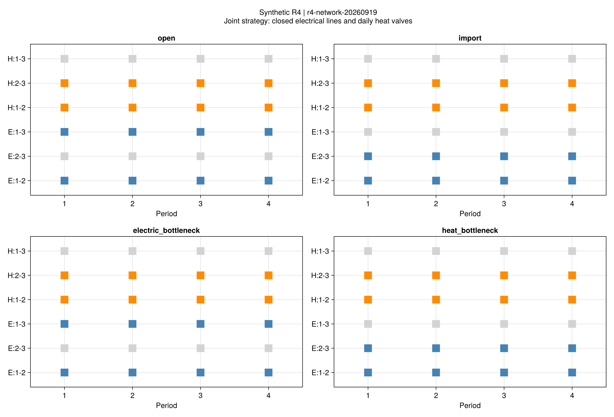
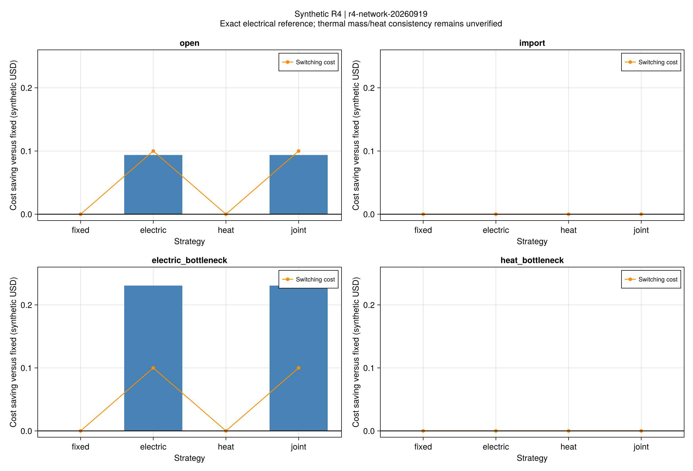
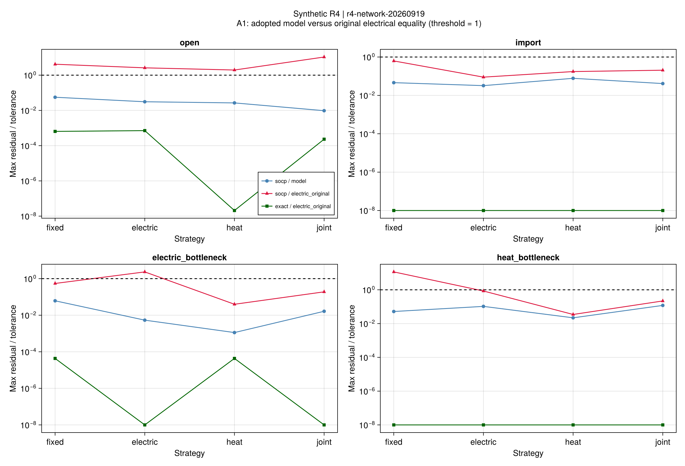
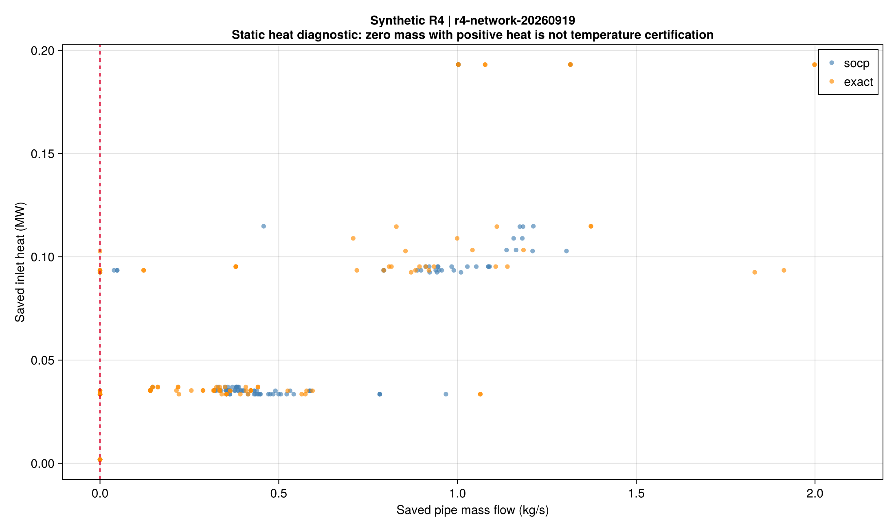

# R4网络重构：费用机制与热模型缺口

## 1. 本批完成了什么

批次r4-network-20260919，科学源码758670b。四套合成输入、四策略、两种电网版本，
共32项四时段对照；另有2项同输入单时段整数参考与72项连续穷举。
每个完整运行预算600秒，输入在首次优化前冻结，原始结果与失败判定不覆盖。
模型和原式补全见[重构说明](ch04-network.md)。

**采用模型的费用与拓扑闭环已完成，但不能把本批候选称为完整电热物理可实施调度。**
独立核查发现了稳态热模型缺少逐管热量—质量流率一致性约束的问题，见第5节。

## 2. 实际结果

34项整数结果都通过本批采用模型A1及费用A2。32项主对照中：

- 16项原电网等式参考全部通过原电网A1。
- 16项SOCP中10项通过原电网A1；另外6项保留失败。
- 两项单时段整数参考也通过原电网；因此全部整数结果为28/34通过。

单时段72项连续穷举的最优采用模型费用为54.272214044，完整并集下界为54.272214042，
相对间隙约4.22e-11。整数SOCP与它的相对费用差为2.22e-8，通过既有1e-4标准。
这验证单时段离散建模和求解口径，不构成四时段全状态穷举或整数分布收敛证明。

F01为联合策略的原电网参考：蓝色表示电线闭合，橙色表示热阀门开启，灰色表示关闭。
热阀门全日不变；逐时热方向另存在topology.csv中，不把方向变化算成阀门动作。

## 3. 重构有什么作用？

下表使用原电网等式参考，费用包括设备资源、购电、不满意度和实际开关动作成本。
它仍是声明的稳态热近似模型费用，不是完整热物理认证后的收益承诺。

| 输入 | 固定费用 | 电重构费用 | 热重构费用 | 联合费用 | 联合相对固定变化 |
|---|---:|---:|---:|---:|---:|
| 开放交易 | 164.864784 | 164.771073 | 164.864784 | 164.771073 | 降0.05684% |
| 仅购能 | 191.792732 | 191.792732 | 191.792732 | 191.792732 | 无可辨别改善 |
| 电瓶颈 | 192.034177 | 191.803519 | 192.034177 | 191.803519 | 降0.12011% |
| 热容量缩减 | 191.792732 | 191.792732 | 191.792732 | 191.792732 | 无可辨别改善 |

金额为合成美元。开放交易与电瓶颈的电/联合策略各发生2次电开关动作，合计0.1美元，
已经包含在表中。热阀门全部保持原状，不能声称本批验证了热网重构有正收益。

电瓶颈固定策略第一时段的1–2线路达到0.3MW上界，联合策略降为约0.197974MW，
这是拓扑改变缓解该约束的直接证据。热容量缩减并未使管道成为当前最优计划的紧约束：
2–3管入口热量最高约0.093467MW，低于冻结0.15MW容量，因此“缩减容量”不能自动当成已制造有效瓶颈。
不根据此结果再次调小参数寻找收益。

开放交易下弃光已近零；其余输入仍约0.094726MWh。电瓶颈重构仅改变约2.16e-6MWh，
没有证据支持显著的新能源消纳改善。表中的极小正负费用尾差按数值误差解释，不作物理价值排序。

F10蓝柱为相对固定费用变化，橙线为已计入目标的动作成本。
40项受限计划向更自由策略的独立回代全部通过采用模型；
不依赖更自由问题恰好返回同一解来判断可行域包含关系。

## 4. 电网松弛仍须回代

阈值1对应原冻结A1。SOCP的6项原电网失败为开放交易的全部4策略、
电瓶颈的电重构以及热容量缩减的固定策略。
原等式参考独立求解且全部通过；费用接近并不把这些SOCP原始失败改成成功。
本批未把集中参考注入分布算法，也未运行带重构整数决策的ATC/ADMM。

## 5. 新发现：热量与流量不完全一致

额外诊断在780个“方向弧×时段”记录中找到59处：
入口热量大于1e-6MW，同时质量流率绝对值不超过1e-6kg/s，涉及20个整数运行。
最明显一项为开放交易/电重构/原等式参考的2–3管、第3时段：
保存m=0kg/s，入口热量约0.102806MW。

有限温差下，零质量流不应输送正显热。当前采用模型只有源荷端口温差包络、
节点质量与热量守恒，以及逐管容量/冻结损耗；这些关系尚不足以约束每管热量与质量流率。
该现象直接证实保存的某些热状态缺少物理一致性；**尚不能据此断言相同设备出力和热量不存在另一组可行质量流或温度。**
需另作保持控制量不变的可行重构检验。

这项筛查不篡改本批预先声明的A1，不作为作者论文错误的证明，也不能用它直接否定全部协调方法。
它改变了下一步研究优先级：先核对被引能量流模型与原式(4-41)–(4-47)，
再检验热量—流量—温度的相容性和可行重构，之后再扩大网络规模。
如果需要新增边界或方程，采用新版本、新输入说明和新实验，旧结果保留。

## 6. 验证与范围

- 完整R1–R4回归1597项通过；重构专项36项；Gurobi独立交叉对照9项。
- 6条采用式、5符号、5项原文疑点有API/测试映射，原始公式另存。
- 文件哈希、保存后重读、72项完整覆盖、40项嵌入、费用分项和实际动作核算均可重查。
- 图表仅从保存CSV重绘；科学源码与冻结配置在正式运行期间及之后未改变。
- 当前3电/3热节点、4时段；不是论文规模结果，不包含动态温度、水压、开断瞬态或周期恢复。

[比较表](assets/r4-network/comparison.csv)、[全72项](assets/r4-network/oracle.csv)、
[拓扑与潮流](assets/r4-network/topology.csv)、[热一致性筛查](assets/r4-network/thermal-diagnostic.csv)、
[残差](assets/r4-network/residuals.csv)均保留原始数值。
