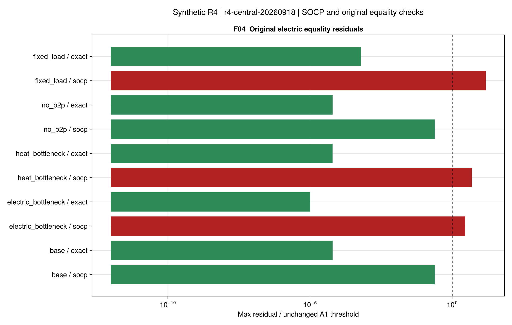
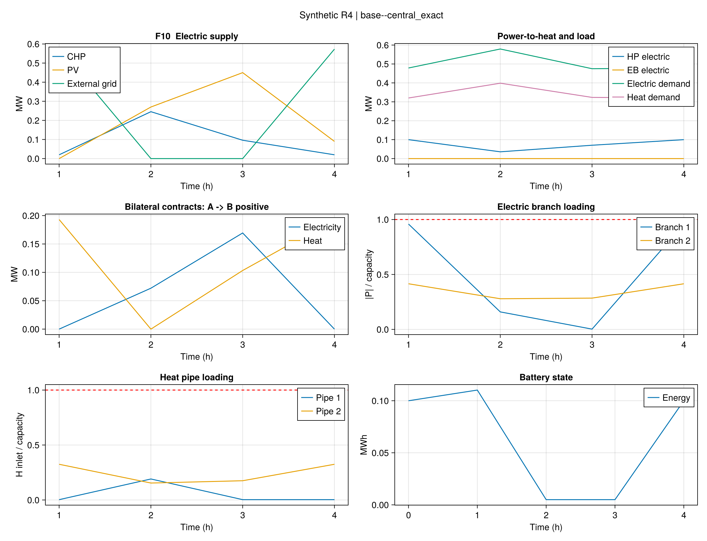
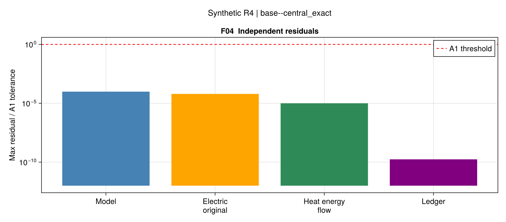
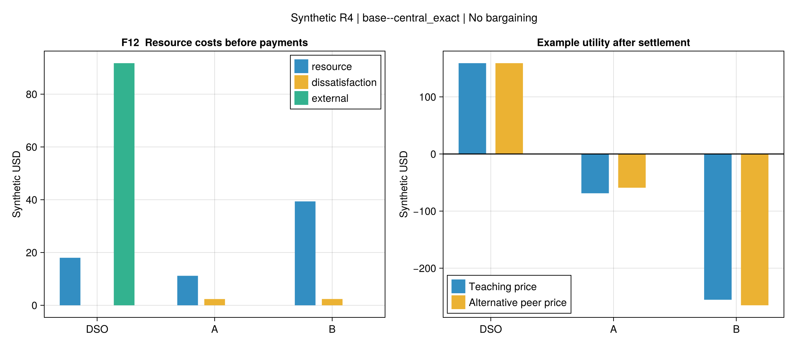

# R4首批：集中式交易与核算基准

## 1. 交付与证据范围

本批交付独立自调度校核、集中调度、静态热能流和收益账本。全部为四时段三节点**合成输入**；
没有复现作者原始数据、网络重构、ATC/ADMM、纳什议价或完整动态热网。
R3阶段归档，保留其限制与历史判定；没有发展v4，也未把R3尾段条件带入R4。

原页PDF64–68、式(4-1)–(4-59)共59条、43项符号、7项疑点有台账。
46条标为有采用范围映射，13条为说明/未实现；这不是59条原式的逐字实现。
源/荷分流、SI损耗、逐时电池互斥和结算方向均在[模型说明](ch04-models.md)单独标注。
文献[26]的作者接受稿已定位，但没有用它替代尚未核清的逐管热损耗原式。

正式批次为r4-central-20260918：6组输入×3种运行方式=18项，加1项Clarabel穷举对照。
先冻结输入、瓶颈25%规则与求解参数，再求解；每方式共享600秒。
图表只读取保存结果，没有为绘图重新求解或筛掉失败案例。

机器证据：[全配置对照](assets/r4-first-batch/comparison.csv)、
[逐约束残差](assets/r4-first-batch/residuals.csv)、
[账本](assets/r4-first-batch/actors.csv)、
[支付明细](assets/r4-first-batch/payments.csv)、
[来源与运行ID](assets/r4-first-batch/report.toml)。
本地完整结果含源码、环境、输入及原始数值，路径在对照表中，使用仓库相对路径。

## 2. 独立最优计划不一定能进入网络

六组AG0均完成两个主体的自调度，但冻结后网络校核不可行；没有把它们偷偷重调成集中方案。
基础例的第3时段给出可以独立检查的反例：

- A净售热约0.194 MW，B净购热约0.024 MW。
- 两根管道的合计损耗为0.0036 MW。
- 全网守恒要求DSO发热为0.0036 − 0.194 + 0.024 ≈ −0.1664 MW。

DSO没有吸热/弃热通道，热源出力非负，故这组冻结计划不可行。
这不是价格符号误差，也不能用合同收支抵消解决。
[逐时解析诊断](assets/r4-first-batch/ag0-diagnostic.csv)保留其他工况，包括容量不足时的另一类冲突。

因此，本批**没有可实施AG0与SWM的费用降幅**。得到的结论是集中协调在这些输入上恢复了网络可实施性，
不能据此量化相对真实独立运营的经济收益。无损无设备解析例另验证了两者均可行时的零协同剩余退化。

## 3. 集中模型：费用与原等式分别验收

金额为合成美元，未计入内部转账。每行对应独立冻结配置；不同配置的费用差不是最优性间隙。

| 配置 | SOCP资源成本 | SOCP原电网A1 | 原等式参考成本 | 原等式参考A1 |
| --- | ---: | --- | ---: | --- |
| 基础 | 165.049333 | 通过 | 165.049330 | 通过 |
| 电支路瓶颈 | 172.155722 | 未通过 | 172.155716 | 通过 |
| 热管道瓶颈 | 166.974398 | 未通过 | 166.974341 | 通过 |
| 禁止P2P | 165.049333 | 通过 | 165.049330 | 通过 |
| 固定负荷 | 145.381653 | 未通过 | 145.381618 | 通过 |
| 供热容量不足 | 不可行 | 无解不评估 | 不可行 | 无解不评估 |

五个SOCP候选均通过采用模型，但电瓶颈、热瓶颈、固定负荷的原支路等式最大残差分别为
2.84×10⁻⁶、4.90×10⁻⁶、1.52×10⁻⁵（标幺四次量），超过不变的1×10⁻⁶阈值。
这些小残差不能被“费用非常接近”替代；五个单独求解的原等式参考均通过本批A1。
没有把这些残差夸大成不可恢复的物理缺陷。

供热容量不足例的负荷下界为9 MW，而全部设备热出力上界仅1.125 MW，尚未扣除管损；
这是独立于求解器的不可行证明。[容量证明](assets/r4-first-batch/capacity-proof.toml)

固定负荷例只用于退化检验：本批不满意度以允许负荷上界为偏好锚点，令flex=0同时改变了锚点。
故其较低费用**不能解释成灵活负荷有害**，也不是保持同一效用函数的单因素价值实验。
后续若研究负荷灵活性价值，需先将偏好锚点与可调范围分开冻结，再设计新批次，不能改写本批输入。

同模型对照中，Gurobi MISOCP与Clarabel穷举16种互斥模式的费用相对差为2.04×10⁻⁸，
各自有效间隙为6.38×10⁻⁷和6.49×10⁻¹⁰，均通过1×10⁻⁴的A2。
这项对照使用**同一SOCP模型**，不是拿不同模型费用差当最优性间隙。
[求解器对照](assets/r4-first-batch/solver-comparison.toml)

## 4. 协调怎样改变运行

基础集中解在第1、4时段使用A的HP为B供热，而非要求A始终只供本地负荷；
高价第2时段及PV较多的第3时段重新分配CHP、HP、电池和购电。
第3时段A净售热降到约0.10507 MW，B净购热升到约0.10327 MW；
配合DSO的0.0018 MW供热，管道热量守恒成立。负荷调整和机组调度都是优化结果。
合同P2P量单列，电支路与热管流量另行计算。

基础原等式解的热网验收只覆盖质量、热量、端口包络和容量。它不验证延时、混合温度或水压。
管道热量和质量流量没有逐管温差等式，故“原等式参考”特指电网原支路关系，不能解读成完整热网物理认证。
各项A1与账本检查如下；接近零的柱仅为对数绘图设显示下限，未改变原始残差。

## 5. 总成本不等于个体收益

基础原等式调度的资源成本是165.049330。内部现金流之和约2.84×10⁻¹⁴，效用和等于资源成本的负数。
负效用表示消费支出和成本，不自动表示参与合作后受损；判断受益必须指定对照点。

| 主体 | 支付前成本 | 教学P2P结算后效用 | 同一调度、全零售效用 | P2P相对全零售变化 |
| --- | ---: | ---: | ---: | ---: |
| DSO | 109.745939 | 158.998196 | 247.885408 | −88.887212 |
| A | 13.548362 | −68.823984 | −111.440252 | +42.616269 |
| B | 41.755029 | −255.223542 | −301.494485 | +46.270944 |

这里比较的是**同一可行调度的合同分解**，不是不可行AG0。A/B受益、DSO减少收入，三者变化合计为零。
本模型零售通道充分宽，禁止P2P只改变合同，集中物理成本完全相同。
这不能推出P2P在所有制度中都没有价值，只说明本批未把合同选择作为独立物理控制或价格机制。

再将P2P电/热价从130/100改为150/110，A效用约增加9.724194，B同额减少，DSO不变，
资源总成本仍为165.049330。服务费仍由卖方支付一次，运营商收到同额款项。
[同调度结算敏感性](assets/r4-first-batch/settlement-sensitivity.csv)

因此没有证明三方都愿意参加、分配公平或联盟稳定。下一阶段研究分配前，应先定义各方可实施的分歧点。

## 6. 验证、复用与下一步

本批R4开放测试80项通过，连同R1–R3共1290项通过；原始运行、正式表格、图源与阈值分别保留。
严格Documenter/doctest、公式映射、格式和项目检查列入任务记录；本机实验不是GitHub CI已经执行的声明。
图表配置记录脚本、输入哈希和运行ID，摘要有完整文件哈希清单。

本批已经支持：固定拓扑的集中交易资源基准、独立计划网络校核、原等式参照、现金流核算和反例诊断。
继续研究时优先补充可实施的独立运营分歧点、价格/网络费规则和效用基准，再进入ATC或议价；
完整动态热网与论文规模数据需要单独建模/输入核查，不由本批自动保证。
