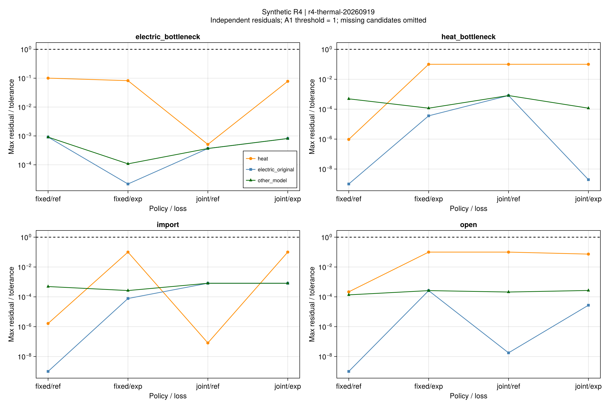
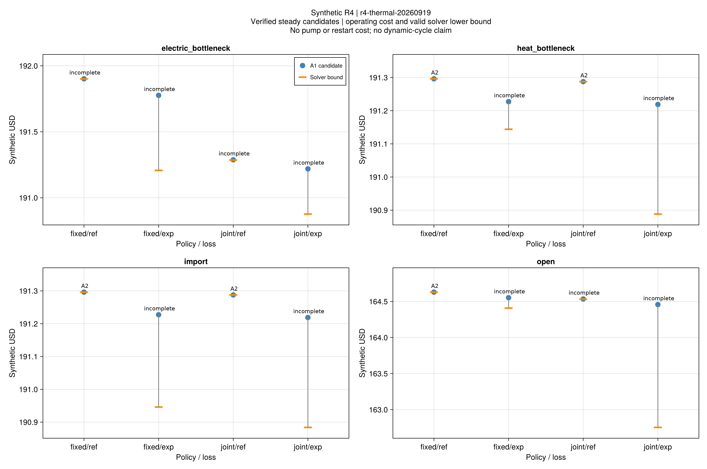
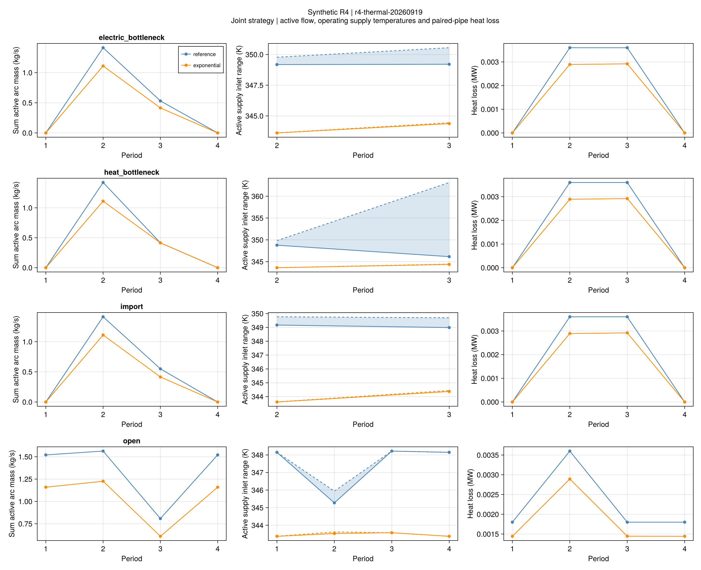

# R4稳态循环与温变散热：正式结果

## 1. 本批结论

**16/16个保存候选通过采用模型、供回水温度与混合、账本及原电网等式检查。**
其中5项满足原有费用完成标志，11项保留限时可行状态；物理验算通过不代表费用已全局最优。
本批采用逐时独立稳态模型，没有水压、泵耗、停流冷却、重启能量或旁通。

批次r4-thermal-20260919，科学源码6bc044f。原4套输入×固定/联合策略×参考/指数损耗，
共16项，在求解前冻结，各600秒预算。结果有16788条独立数值残差；全部历史父运行保留。
模型见[循环和温变散热](ch04-thermal.md)，前批反例见[热状态相容性](ch04-heat-results.md)。

## 2. 建模边界发生了什么变化？

旧能量流模型将阀门连通与实际运行混在一起，开启但无热源/负荷的末端可能仍必须承担固定损耗。
前批8个开放交易调度存在可手算的质量流冲突，仅重选流量和温度无法修复。
新版本显式分开日阀门树与逐时循环/闲置，同时优化供回水温度、端口热量及混合关系。

本批开放交易的四项新调度均通过上述稳态检查。这支持“先前组合边界会影响可行性”的解释，
但不是把旧调度改判为通过：新模型重新优化了设备、热量及流量，不能称为保持旧控制量的修复。
参考/指数两个新版本之间仅改变运行管道的损耗公式；与旧能量流模型比较则是多个边界共同改变。

每个案例有8个开阀管道时段。保存候选中，开放例有3个闲置时段，仅购能与热容量缩减例有4个；
电瓶颈固定策略闲置2个、联合策略闲置4个。这里的闲置是零输运的稳态抽象，
不意味着真实管道停流后不散热，也不保证下一小时重启没有代价。

图中1表示既有A1阈值，最大归一化残差约0.1004。热约束、原电网与其他模型约束分别展示，
没有用某一组通过代替完整验算。

## 3. 联合策略的费用改善有多确定？

金额为四小时的合成美元，包含设备、购能、不满意度及网络动作成本，不含泵耗。
下表候选差为固定策略费用减联合策略费用；百分比按固定策略候选计算。

| 案例 | 损耗模型 | 固定费用 | 联合费用 | 候选节约 | 有效界给出的费用差区间 |
|---|---|---:|---:|---:|---:|
| 开放交易 | 参考 | 164.628960 | 164.533930 | 0.05772% | [0.094913, 0.097999] |
| 开放交易 | 指数 | 164.551885 | 164.456667 | 0.05786% | [−0.048950, 1.798819] |
| 仅购能 | 参考 | 191.296196 | 191.287694 | 0.00444% | [0.008448, 0.008532] |
| 仅购能 | 指数 | 191.227343 | 191.218840 | 0.00445% | [−0.272883, 0.343424] |
| 电瓶颈 | 参考 | 191.901406 | 191.287694 | 0.31981% | [0.612574, 0.615563] |
| 电瓶颈 | 指数 | 191.776086 | 191.218840 | 0.29057% | [−0.011022, 0.899727] |
| 热容量缩减 | 参考 | 191.296196 | 191.287694 | 0.00444% | [0.008444, 0.008547] |
| 热容量缩减 | 指数 | 191.227343 | 191.218840 | 0.00445% | [−0.074841, 0.339215] |

设各策略的有效费用界为[L,U]，U取独立验算合格的候选，推得：

~~~math
L_{\rm fixed}-U_{\rm joint}
\le C_{\rm fixed}^{*}-C_{\rm joint}^{*}
\le U_{\rm fixed}-L_{\rm joint}.
\tag{R4-TH-R1}
~~~

因此参考损耗的四组区间均支持正费用改善，即使个别求解返回限时状态。
指数损耗的四组区间均跨零，当前只能报告候选改善，不能确认严格正的最优费用优势。
跨零并不证明灵活性有害，只说明现有上下界不足以区分如此小的费用差。
指数版本8项全部限时，其相对间隙约0.04358%–1.03590%；未换种子或增加预算筛选更好结果。

热容量缩减例与仅购能例仍基本相同，没有形成有辨别力的热瓶颈收益证据。
联合策略包含0.1美元动作费，费用差已经扣除该成本；不能拿拓扑变化次数直接解释收益。

## 4. 散热和热量转移

指数公式使用实际流量与入口温度。各配对候选的总损耗低于参考损耗候选，
但不同损耗模型的费用差不叫最优性间隙，也不是同一物理模型下的策略收益。

| 案例/策略 | 参考损耗kWh | 指数损耗kWh |
|---|---:|---:|
| 开放/固定或联合 | 9.0000 | 约7.2234 |
| 仅购能/固定或联合 | 7.2000 | 约5.8139 |
| 电瓶颈/固定 | 10.8000 | 8.7358 |
| 电瓶颈/联合 | 7.2000 | 5.8139 |
| 热容量缩减/固定或联合 | 7.2000 | 约5.8139 |

图中的温度仅描述运行管道；闲置温度占位值不解释为实测温度或管内记忆状态。
光伏利用量在同案例配对中几乎不变，没有据此发现新增消纳收益。

## 5. 对后续研究的影响

本批可以归档：新版本已在冻结小系统上给出稳态可行调度、负结果的边界解释及带界的费用比较。
完整水力、泵耗、启停热状态和更大替代系统仍是单独的未完成工作；不将其默认为已验证。
第5章的固定流量动态热网与本模型不同，下一步按该章的市场、楼宇和风险主线推进。
这不是作者同输入数值复现，也未证明论文规模的算法速度优势。

## 6. 证据与重绘

- [16项状态/费用](assets/r4-thermal/comparison.csv)、[16788项残差](assets/r4-thermal/residuals.csv)、
  [策略与界](assets/r4-thermal/policy-comparison.csv)、[旧模型组合差异](assets/r4-thermal/legacy-comparison.csv)。
- [逐管状态](assets/r4-thermal/states.csv)、[节点状态](assets/r4-thermal/nodes.csv)、
  [运行及脚本来源](assets/r4-thermal/report.toml)、[图源配置](assets/r4-thermal/figure-config.toml)。
- 原科学节点的1697项回归、74项开放专项和8项本机手算断言已通过。
  正式研究全部结果重新读取独立验算，报告及绘图不重新求解。
- 600秒预算的限时运行保留原退出状态；最高记录墙钟约600.309秒，含求解返回和验算尾耗。

~~~powershell
julia +1.12.6 --startup-file=no --project=. scripts/report_r4_thermal.jl results/runs/r4/r4-thermal-20260919/study.toml results/summaries/r4-thermal-replay
julia +1.12.6 --startup-file=no --project=docs scripts/plot_r4_thermal.jl results/summaries/r4-thermal-replay
julia +1.12.6 --startup-file=no --project=. scripts/check_r4_thermal_artifacts.jl results/summaries/r4-thermal-replay --seal
~~~
