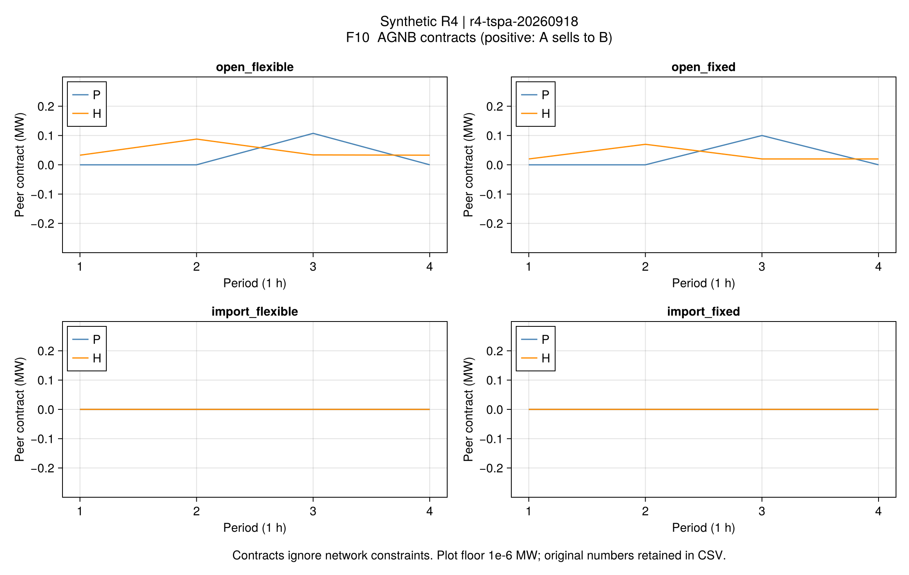
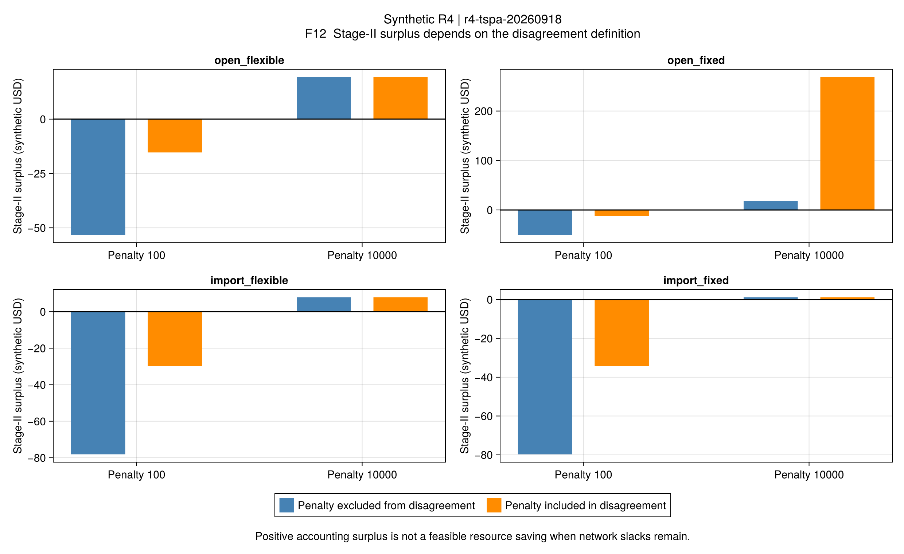
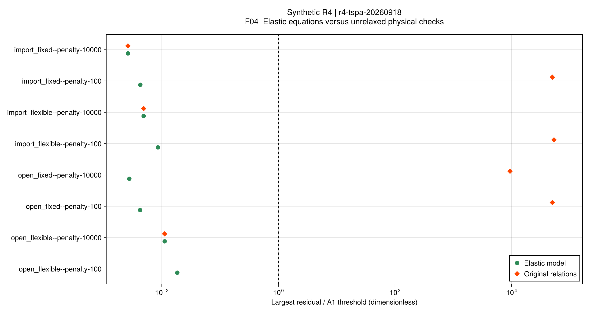

# R4第四批结果：分歧点的物理含义决定分配结论

批次r4-tspa-20260918，求解源码节点deb2b93。四套既有合成输入各取罚系数100/10000，
共8项完整流程；同案例两系数逐元素使用同一AGNB控制，不根据收益调整数据。
每项又核算罚项进入/不进入分歧效用，共16项核算。
模型与解释见[两阶段说明](ch04-tspa.md)，不是作者输入或规模的直接数值复现。

## 1. 最重要的结论

**聚合商联合交易可以提高其局部效用，但忽略网络的交易计划不一定可执行；
正的议价剩余也不能证明其分歧点可执行。**

本批既有可实施的正例，也有明确反例。三个案例在高罚系数下得到原关系A1通过的分歧点；
开放/固定负荷例严格网络不可行，却仍能计算正的第二阶段分配。
不把后者记为“所有主体都从可实施合作中获益”。

## 2. 第一阶段：交易效用与网络可行性分开

金额为四小时合成美元。第一列是两个聚合商相对各自原AG0的**总效用增量**，
包含零售/服务费变化，不能直接叫全系统资源节约。

| 案例 | AGNB聚合商总增益 | 冻结AGNB的严格网络检查 |
|---|---:|---|
| 开放 / 灵活 | 25.694330 | A1通过 |
| 开放 / 固定 | 22.516673 | 求解器报告不可行；另有热守恒证明 |
| 仅购能 / 灵活 | 0 | A1通过 |
| 仅购能 / 固定 | 8.91e-7（数值上接近零） | A1通过 |

四个交易求解器候选均有有效界，相对间隙最高5.92e-7，小于A2的1e-4。
仅购能/灵活例的已知AG0嵌入候选重算费用略低于新求解器候选，按预先规则选择原AG0；
原求解器候选及其界仍保存。表中的0来自该候选恒等关系，没有把负剩余裁零。
仅购能/固定的微小正数不解释为实质P2P收益。两仅购能例的P2P数量在数值尺度内为零。

开放/灵活的新AGNB计划可被网络接收，而此前同输入AG0失败，说明局部交易合作
改变了设备/负荷选择和网络兼容性；这不构成“任意P2P交易都会修复网络”的保证。
每条合同、净量与费用分别保存在[合同图源](assets/r4-tspa/contracts.csv)与
[求解器目标和界](assets/r4-tspa/solver-evidence.csv)。

## 3. 低罚系数为什么产生负的第二阶段剩余？

罚系数100时，四项弹性模型均通过自身约束，但全部未通过原关系。
本例有功尺度为2MW，因此1MWh有功缺口的罚价仅50合成美元，
低于冻结外部电价80–140。模型有动机用人工松弛代替真实购能。
保存值中可见约0.15–0.21MW的节点有功违反；这远超不变的A1门槛。

| 案例 | 不计罚项的第二阶段剩余 | 计罚项的第二阶段剩余 |
|---|---:|---:|
| 开放 / 灵活 | −53.234746 | −15.330709 |
| 开放 / 固定 | −50.305368 | −12.452736 |
| 仅购能 / 灵活 | −78.107018 | −29.855380 |
| 仅购能 / 固定 | −79.726755 | −34.282109 |

16项核算中的这8项均保留negative_surplus，没有给出虚构的个体理性支付。
这不是说合作模型物理上无解：三个严格分歧计划本来可行，合作参考也均通过A1。
问题在于这个罚项较低的反事实计划获得了现实中不能免费取得的供能能力。

## 4. 高罚系数下，正剩余仍须验物理

| 案例 | 弹性点原关系A1 | 资源费用差 / 不计罚项剩余 | 人工罚项 | 计罚项剩余 |
|---|---|---:|---:|---:|
| 开放 / 灵活 | 通过 | 19.314631 | 约3.02e-7 | 19.314631 |
| 开放 / 固定 | **失败** | 17.869269 | 250.666667 | 268.535935 |
| 仅购能 / 灵活 | 通过 | 7.905763 | 0 | 7.905763 |
| 仅购能 / 固定 | 通过 | 1.200872 | 0 | 1.200872 |

前三列金额均独立重算，人工罚项与实际资源成本不混记。
开放/固定行不能把17.869269称为两个可实施计划之间的节约。
同一物理数值，仅将罚项扣入运营商分歧效用，账面可分剩余便从17.869269增至268.535935。
新增250.666667完全来自分歧点定义，不是新增电热产出或成本改善。

在高罚系数开放/灵活例中，不计微小罚项时第二阶段DSO/A/B分别新增
9.657316/5.412342/4.244974。这里的AG增益是相对第一阶段分歧点，
不能与上一批相对原AG0的单阶段增益直接当作同口径排名。
两阶段总支付替代全部旧内部结算，第一阶段增益只用于说明基线变化，不能再次叠加支付。

### 一个无需求解器的热守恒反例

开放/固定例的第3时段，两个聚合商净供热之和为0.0300MW。
两者之间管道2→3损耗为0.0018MW。把节点2、3的热平衡相加，
从运营商进入该区域的管道1→2出口热量必须满足：

~~~math
H_{12,3}^{\mathrm{out}}
=L_{23}^{H}-\left(H_{A,3}^{\mathrm{net}}+H_{B,3}^{\mathrm{net}}\right)
=0.0018-0.0300=-0.0282\ \mathrm{MW}.
\tag{R4-T4}
~~~

采用模型要求固定方向的出口热量非负，故冻结计划严格不可行。
高罚系数解在节点2留下0.0282MW热量松弛，恰与该区域守恒缺口一致。
按H尺度1.125MW计罚，10000×0.0282/1.125=250.666667。
这是固定输入和本批固定方向稳态能量流模型的反例，不是整篇论文或所有运行方式无解的证明。

[逐时必要条件](assets/r4-tspa/network-necessary-condition.csv)及
[只读审计来源](assets/r4-tspa/audit.toml)可以复核上述算式。

## 5. 与原文相比，复现到了哪一步？

- 已恢复AGNB → 冻结网络DHSO0-r → 更新分歧点 → 第二次Nash分配的结构。
- 原文没有逐项列明松弛位置与罚项口径。本项目采用节点平衡松弛，
  同时保留两种罚项解释，不能声称与作者源码等价。
- 结果支持原文所强调的“聚合商交易与网络协同需要分开分配”的研究问题；
  也表明（4-102）依赖的总福利前提需要核验，不能由形式上的分配公式自动得到。
- 3套高罚系数案例提供采用模型内的可实施对照；固定负荷反例提供明确负结果。
- 未验证所有子联盟、完整热温度场、真实合同约束、ATC/ADMM、拓扑重构或论文规模性能。

本批没有证明TSPA普遍优于SSPA。仅购能例的第一阶段增益接近零；
开放例的原AG0网络不可行，不能把不同可实施性基线上的分配数值直接当作公平性排名。

全部8项弹性模型约束通过；其中仅3项原关系通过。图中两种颜色正是这两类验收，
不能只展示绿色点而省略红色物理违反。
原始残差、16项核算及主体账本见[比较表](assets/r4-tspa/comparison.csv)、
[完整核算证据](assets/r4-tspa/evidence.toml)、[主体支付](assets/r4-tspa/actors.csv)。

## 6. 下一步

本批已足够回答分歧点与罚项的问题，保留反例后推进**ATC/ADMM分布协调**。
先在固定电池模式的凸小系统上核对原文更新式，比较原始/对偶残差与同模型集中费用；
再单列整数选择和原电网等式带来的限制。不能把分布子问题每轮有解当作全系统达成协调。
随后补网络重构与规模，再依全文清单推进第5–7章，不为匹配合成收益而重选输入。

## 验收记录

50项新增专项及全R1–R4共1462项回归通过；严格Documenter、doctest及映射通过。
8条正式运行均保存、重读、验算；同案例AGNB控制哈希完全一致。
F04/F10/F12全部从保存数值重绘并完成视觉检查。
首次编译及显式复用阶段的耗时不同，本批没有端到端速度优势结论。
热网络通过仅限声明的稳态能量流模型；研究失败不会因工程检查通过而被改判。
