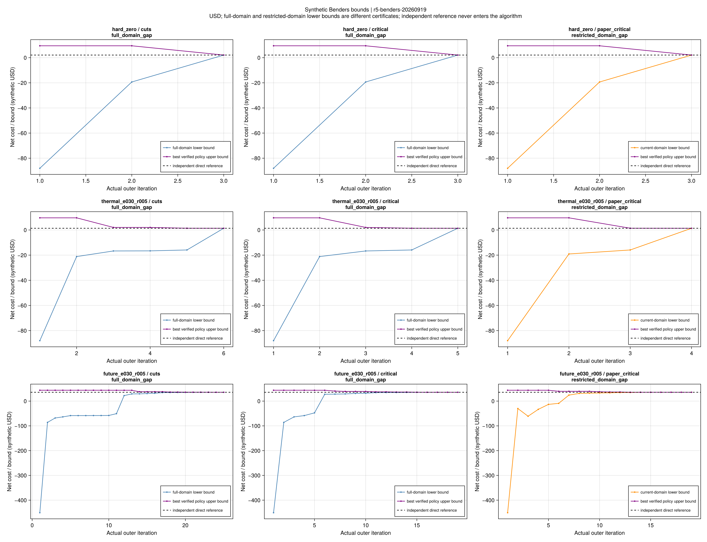
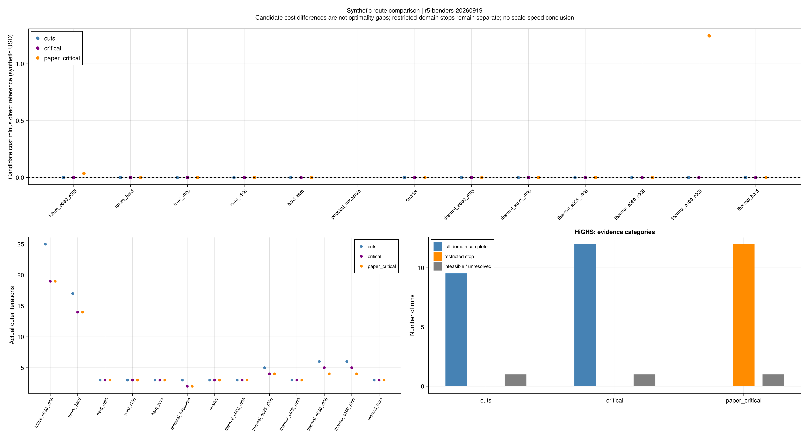
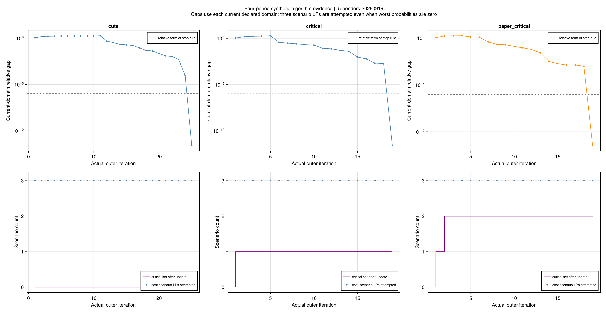
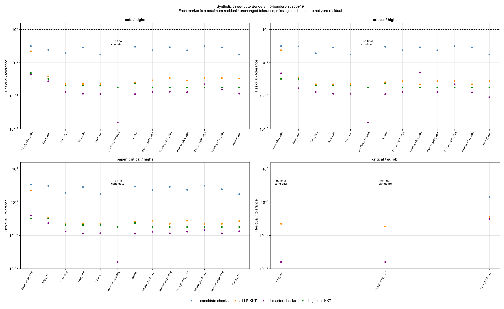

# 条件Benders正式对照：费用、有效界与受限策略域

## 1. 本轮研究问题与实验口径

本批检验分解算法能否在已有的有限支持风险模型上恢复直接求解的费用，
以及关键情景筛选是否改变了允许选择的策略。采用模型仍为固定外生价格、完整情景补救和合成输入。
不是作者同输入数值复现，不涉及论文规模速度、策略报价或样本外可靠性。

科学源码节点为`440f32d`，正式规则在本地节点`44c363d`、首次优化前冻结。
批次`r5-benders-20260919`包含原13套风险输入×三路线的39项HiGHS运行，
另含手算、热风险、四时段风险的3项预声明Gurobi关键情景对照。
全部运行使用独立Clarabel费用与风险运输回查；直接参考来自上一批冻结的同输入结果。

每项从空割集、空关键集开始，直接解不进入初始化、方向或割。
每完整方法共享600秒、最多200轮；绝对/相对停止项为1e-7/1e-6，
有理割算术与1024倍等价诊断表示均在正式优化前确定。A1、A2及KKT门槛保持。

| 路线 | 采用的策略域 | 正式停止结果 |
|---|---|---|
| `cuts` | 完整风险域；不可行分支添加弹性可行性割 | 12项可行输入达到完整域间隙；1项容量不足不可行 |
| `critical` | 完整风险域；加入关键情景完整关系 | 12项可行输入达到完整域间隙；1项容量不足不可行 |
| `paper_critical` | 按原(5-102)固定关键集外的舒适开关 | 12项在当前受限域停止；1项报告受限域不可行 |
| Gurobi `critical`对照 | 完整风险域 | 3项因子问题合并状态停止；四时段保留已有合格候选 |

这张表区分运行记录和独立输入。重复求解器/路线不能当作增加了物理案例数量。
最终公开见证、表格及图表的独立重验统计见本页末尾证据文件；未通过停止的结果仍完整保留。

本批共有37个采用模型/风险合格候选，24项完整域费用完成及与独立直接参考的A2配对通过。
这24项最大相对费用差为4.90×10⁻¹³，自身有效界最大相对间隙为1.99×10⁻¹¹。
所选候选的9623条逐项残差全部通过，最大残差/阈值为0.00311121；
全部返回数值的阶段检查共681819条，失败数为0。缺失候选和合并状态不被当作零残差。

## 2. 完整域分解恢复了直接基准

下表费用单位为合成USD；它包含日前购能、备用收入与补救净费用，不能称为纯资源成本。

| 合成输入 | 独立直接费用 | 纯割费用 / 轮数 | 完整域关键情景费用 / 轮数 |
|---|---:|---:|---:|
| 单时段手算 | 2.085000 | 2.085000 / 3 | 2.085000 / 3 |
| 热风险，ε=0.30、ρ=0.05 | 1.366480 | 1.366480 / 6 | 1.366480 / 5 |
| 四时段全舒适 | 35.160173 | 35.160173 / 17 | 35.160173 / 14 |
| 四时段风险 | 35.669615 | 35.669615 / 25 | 35.669615 / 19 |

两条完整域路线在这12套可行输入中均取得通过模型、风险与同域间隙的候选。
负补救费用、零最坏概率、0.25小时时间步也包含在冻结范围内。
每轮仍独立求解全部情景，零权重不能成为跳过物理补救或除以零提取乘子的理由。

关键情景路线在两个四时段例中减少了外层轮数，但并非每个输入都有减少。
原直接方法预算为60秒，本批分解为600秒；公共初始化与存档重读耗时另记。
当前小系统数据、执行规模与初始化成本不足以支持端到端或论文规模加速结论。

## 3. 受限域停止确实可能错过完整域更优策略

原(5-102)将关键情景集合外的舒适开关固定为零。
这意味着算法允许放松哪些情景，会受到关键集合的额外限制。
在当前采用模型中，受限策略都能放入完整风险域，反方向一般不成立。

| 输入 | 完整域参考费用 | 受限域候选费用 | 观察 |
|---|---:|---:|---|
| 四时段风险 | 35.669615 | 35.705617 | 受限域已停止，候选费用仍高0.036003 |
| 热例，ε=1、ρ=0 | −0.183450 | 1.062600 | 完整域可利用更多舒适选择；受限域高1.246050 |
| 单时段手算 | 2.085000 | 2.085000 | 费用恰好一致，仍不能把受限域证书改称完整域证书 |

这是本轮最有辨别力的结果：很小的上下界间隙必须连同界对应的策略域一起解释。
关键集扩大后，旧受限域下界不能累计为扩大后域的全局下界。
报告中的受限候选费用差只用于对照，不称为完整模型最优间隙。

保存的舒适选择进一步说明了成因。情景顺序为未调用、上调用、下调用：

| 四时段风险策略 | 关键情景集合 | 舒适开关z |
|---|---|---|
| 完整域关键情景 | 下调用 | (0, 1, 0) |
| 受限域关键情景 | 未调用、下调用 | (0, 0, 0) |

完整域最优策略需要上调用情景的舒适弹性，但可行性关键集合没有包含上调用。
受限式把它的开关固定为零，因此失去这项更低费用的选择。
这支持“为恢复可行性选出的关键情景未必覆盖最低费用所需舒适选择”的具体反例。
对应[完整域原值](assets/r5-benders/witnesses/future_e030_r005--critical--highs/witness.toml)和
[受限域原值](assets/r5-benders/witnesses/future_e030_r005--paper_critical--highs/witness.toml)保留完整轨迹。

这个反例针对本项目明确实现的原(5-102)结构及采用的有限支持模型。
论文的其他未公开实现细节、作者数据和算例结构尚未等同，不能由此直接断言作者所有算例错误。
原式、项目解释与数值边界见[条件分解教程](ch05-benders.md)及[推导台账](ch05-benders-equations.md)。

## 4. 失败记录揭示了什么

容量不足输入的电负荷2 MW，超过购电1 MW与本地发电0.2 MW上界之和。
两条完整域路线均报告不可行，与独立直接基准一致。
受限路线自身只能报告受限域不可行；该输入完整域也不可行的依据另来自前述容量推导和完整域运行。
舒适风险容忍没有放松设备容量和电能守恒。

三项Gurobi对照的直接停止原因均为`INFEASIBLE_OR_UNBOUNDED`，没有取得明确的不可行状态。
程序只在成本子问题明确不可行后进入弹性诊断，所以在这里停止并保存原因。
这是状态未消歧；当前证据没有表明这些停止由错误的乘子符号造成。
四时段运行保留了前一轮费用43.874202的合格候选，其费用优化没有完成。

Gurobi官方说明建议对该合并状态设`DualReductions=0`再求解以取得明确结论。
这应作为后续单因素复核，不能回写本批冻结参数或删除失败。
参见[官方状态码说明](https://docs.gurobi.com/projects/optimizer/en/current/reference/numericcodes/statuscodes.html)。

后续已完成独立的[状态单因素复核](ch05-benders-status.md)：原五个条件点明确不可行，
三个完整方法均恢复并通过同模型A2。本页保留原42项历史状态。

图中的每个点汇总对应阶段/情景/类别的最大残差与原验收阈值之比，合格线为1。
无候选没有被画成零残差；弹性诊断合格只表示诊断模型合格。
所选候选的全部原始逐项残差另存在`selected-residuals.csv`，全部阶段原值在分块见证中。

## 5. 本轮结论和下一步

本轮支持两个有边界的结论：完整域的条件分解可以在这些合成输入上恢复直接基准；
额外限制关键情景外的舒适策略可能得到已停止但更贵的解。
负费用的割下界、全情景回查和界的作用域是正确性的必要组成部分。

下一步先完成Gurobi合并状态的单因素消歧，然后连接策略报价与市场出清。
现在价格固定，算法选择在这些价格下承诺多少购电与备用；接入策略报价后，
还须检查报价如何影响成交量、价格及电热系统实际交付。
此后冻结训练/验证/测试划分、半径校准和样本外统计；第6章弹性规划及第7章迁移继续独立推进。
完整缺口见[全文清单](reproduction-coverage.md)。

## 6. 证据、操作与复核

- [费用、状态与独立参考](assets/r5-benders/comparison.csv)、[全部真实迭代](assets/r5-benders/iterations.csv)。
- [子问题与失败](assets/r5-benders/subproblems.csv)、[条件割证书](assets/r5-benders/cuts.csv)。
- [阶段残差最大项及失败数](assets/r5-benders/residuals.csv)、[所选候选全部残差](assets/r5-benders/selected-residuals.csv)。
- [输入、源码与汇总](assets/r5-benders/report.toml)、[图源配置](assets/r5-benders/figure-config.toml)、[封存清单](assets/r5-benders/artifact-hashes.toml)。

公开见证保留所有策略、原始乘子、割和求解状态；大型结果按子问题分文件。
可重新计算的验算表保存规范化哈希，重读时完整重算；不会为缩小文件而删掉失败来源。
本机完整运行另保存冻结源码，公开重验不依赖忽略的`results/runs`目录。

~~~powershell
julia +1.12.6 --startup-file=no --project=. scripts/check_r5_benders_artifacts.jl results/summaries/r5-benders
julia +1.12.6 --startup-file=no --project=. scripts/test_r5_benders_witness.jl
~~~

重新实验、报告、绘图须分别使用新目录；图表不重新求解。VS Code提供frozen study、saved report、
saved plots、frozen evidence任务。单次运行和原生API见[分解教程](ch05-benders.md)。
