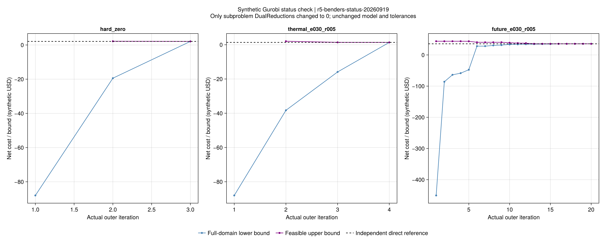
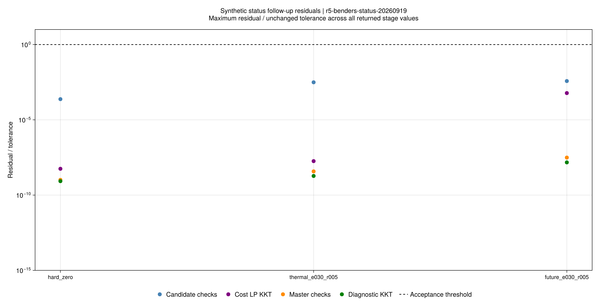

# 分解停滞归因：条件不可行与求解器合并状态

这轮解释了[上一批三路线对照](ch05-benders-results.md)中三个Gurobi运行的停止原因。
研究对象仍是固定价格、有限支持的合成调度模型。新证据不改写旧42项的判定。

## 1. 一个子问题不可行，为什么算法仍可能成功

主问题先决定日前购电、备用容量和舒适分支，子问题再检查各情景能否兑现这些承诺。
某个承诺无法兑现时，算法需要一条有依据的可行性约束来排除它，然后选择新的承诺。
如果求解器只返回“不可行或无界”，就还没有足够依据进入这个分支。

此前三个运行遇到的正是这种合并状态。它不等于整套调度没有可行解，也不是对偶符号错误的证据。
Gurobi说明某些预处理会合并这两个状态，建议关闭DualReductions后重新求解以作区分。
见[官方说明](https://support.gurobi.com/hc/en-us/articles/4402704428177-How-do-I-resolve-the-error-Model-is-infeasible-or-unbounded)。

## 2. 实验只改变什么

规则在提交8dd928e、首次求解前冻结，批次为r5-benders-status-20260919。

- 五个已保存的失败LP点分别重建DualReductions为1和0的模型；日前承诺、情景和舒适分支完全相同。
- 每点共享60秒，明确不可行后才运行现有弹性诊断。容差、有限盒和1024倍等价诊断表示保持不变。
- 三个完整方法从空割和空关键情景集开始，每项共享600秒。主问题仍为DR=1，只有子问题改为DR=0。
- 独立直接解仅用于事后比较；不进入初值、割或候选选择。未修改全局求解器默认配置。

## 3. 五个失败点得到明确证据

五点在DR=1下都复现原合并状态，DR=0下都报告不可行。
输入有限盒给出了有限成本上下界，排除了这些成本LP的目标向负无穷发散。
弹性诊断的原始对偶KKT均通过，并取得严格正的、经有理算术保护的下支撑值：

| 原输入及情景/分支 | 诊断下支撑值 | 解释 |
|---|---:|---|
| hard_zero，3/0 | 0.009000 | 该承诺与分支不可行 |
| thermal_e030_r005，3/0 | 0.009000 | 同上 |
| future_e030_r005，1/0 | 0.105588 | 同上 |
| future_e030_r005，2/0 | 0.097999 | 同上 |
| future_e030_r005，3/1 | 0.141743 | 同上 |

这些值是既定归一化诊断目标，不是美元费用。
它们只证明对应条件子问题不可行，不能推广成原输入的整个风险调度问题不可行。
精确数值、父运行和成本盒见[五点记录](assets/r5-benders-status/status-probes.csv)。

## 4. 三个完整方法随后完成费用验收

| 合成输入 | 旧结果 | 新费用（合成USD） | 新迭代数 |
|---|---|---:|---:|
| hard_zero | 无候选、状态未决 | 2.085000 | 3 |
| thermal_e030_r005 | 无候选、状态未决 | 1.366480 | 4 |
| future_e030_r005 | 候选43.874202、费用未完成 | 35.669615 | 20 |

三项均通过采用模型、风险、独立费用回算及同模型A2，均满足完整风险域的间隙停止条件。
最大自身相对间隙约1.99×10⁻¹¹，最大直接参考相对费用差约5.72×10⁻¹⁴。
正式方法墙钟分别约13.55、2.22、49.95秒，均在600秒内。
这些小系统时长含各自编译/建模开销，不能用于宣称论文规模的加速。

残差图使用既定验收阈值归一化；诊断模型通过和调度模型通过分别记录。

## 5. 这轮支持什么，仍缺什么

本轮支持：旧三个停止由未消歧的求解器状态阻断了诊断分支；在这些条件点取得不可行证据后，
现有分解结构能够继续迭代并恢复独立直接基准。没有修改模型、对偶或验收阈值来制造成功。

本轮不证明所有数值问题都已解除，也不解决原式(5-102)关键集外固定舒适策略的受限域问题。
后者的更高费用反例仍在上一批报告中。当前价格仍外生；下一步接入
[连续策略报价与支付核算](ch05-strategic.md)，再进行样本外统计及较大系统验证。

## 6. 证据和复核

- [新旧状态配对](assets/r5-benders-status/before-after.csv)、[模型及A2结果](assets/r5-benders-status/comparison.csv)。
- [真实迭代](assets/r5-benders-status/iterations.csv)、[子问题](assets/r5-benders-status/subproblems.csv)、
  [割证书](assets/r5-benders-status/cuts.csv)、[候选原始残差](assets/r5-benders-status/selected-residuals.csv)。
- [来源及参数](assets/r5-benders-status/report.toml)、[图源配置](assets/r5-benders-status/figure-config.toml)、
  [封存清单](assets/r5-benders-status/artifact-hashes.toml)。

~~~powershell
julia +1.12.6 --startup-file=no --project=. scripts/test_r5_benders_status.jl
julia +1.12.6 --startup-file=no --project=. scripts/check_r5_benders_status_artifacts.jl results/summaries/r5-benders-status
~~~

检查器从公开小型见证独立重算新旧运行、原始对偶、诊断证书和CSV，不重新优化。
重新实验用study_r5_benders_status.jl指定新批次；报告和重绘各用新目录，不能覆盖封存结果。
