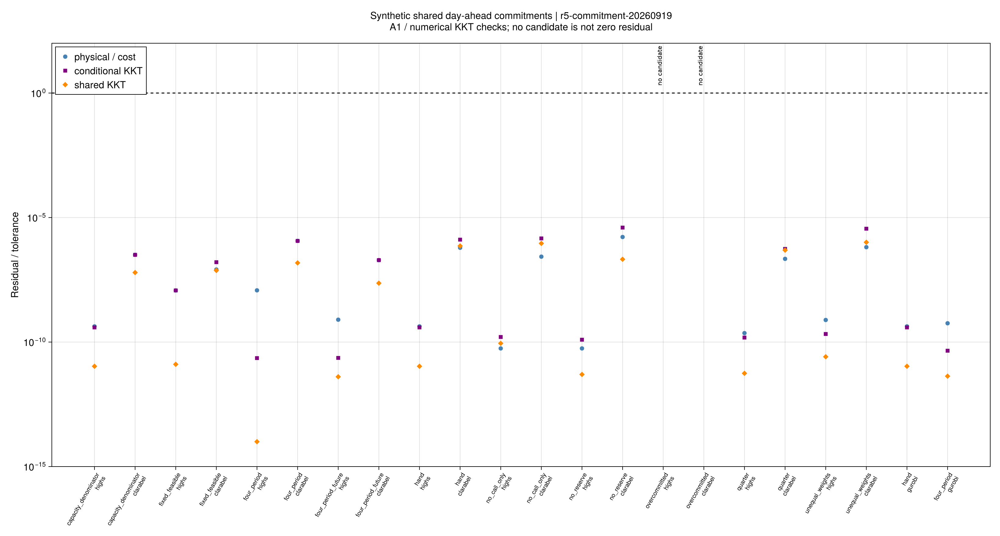
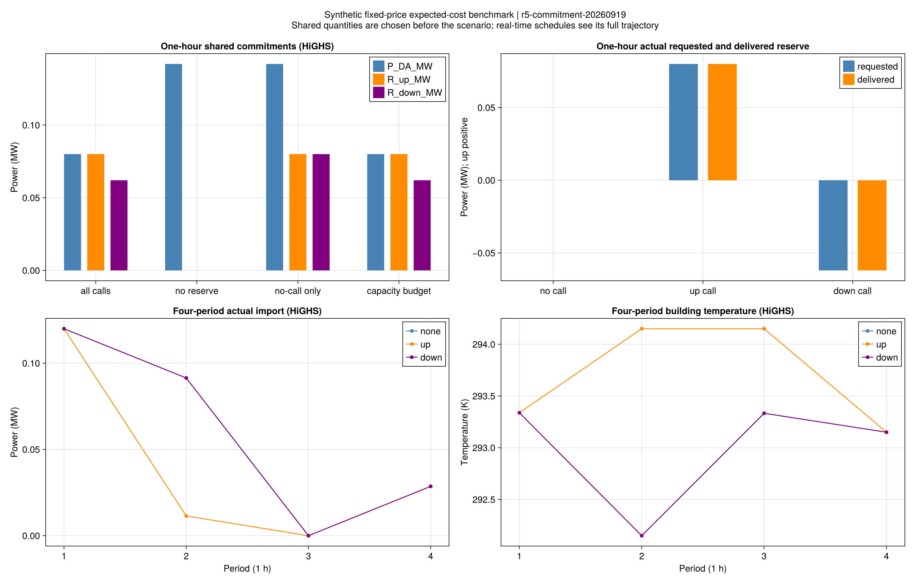

# 共同日前承诺：正式结果与研究边界

## 1. 本批完成了什么

科学节点`44431fd`，正式批次`r5-commitment-20260919`。10套合成输入与22项规则先于首次优化冻结。
本批把共同购电/备用、逐情景电热补救和独立最优性验证接在一起，检验的是固定外生价格下的期望净费用。

| 项目 | 实际证据 |
|---|---|
| 模型、条件KKT、共同KKT与费用完成 | 20/22；包含HiGHS、Clarabel及2项本机Gurobi对照 |
| 不可行 | 同一套固定过量承诺的2个开放求解器记录，保留原状态 |
| 独立残差 | 21562项；最大残差/对应阈值3.95195×10⁻⁶，合格线为1 |
| 同模型费用对照 | 11项可比较配对全部通过A2，最大目标相对差6.59942×10⁻¹²；另1对为双方不可行 |
| 有效费用界 | 最大相对间隙9.26333×10⁻¹¹；按固定价格、声明情景的LP解释 |
| 本地程序与数学验证 | 137项专项、完整2396项回归；严格Documenter/doctest、格式、映射和项目检查通过 |
| 冻结源码重读 | four_period--highs/code/replay.jl独立读取，模型及KKT通过，无重新优化 |

20/22不是场景可靠率。这22项包括对相同输入的求解器重复运行，以及事先规定的不可行例。
每项建模和求解预算60秒，最大记录6.152秒；公共求解器环境初始化另存，不作端到端加速结论。

F04分别显示物理/费用、条件KKT和共同KKT。对数坐标中零值显示在1e-14，原始表格保留零。
无候选记录单独标注，不填造零残差。

## 2. 共同承诺确实受交付能力约束

单时段三情景手算例的正式结果为：

| 输入 | 日前购电P / MW | 上备用U / MW | 下备用D / MW | 期望净费用 / 合成USD |
|---|---:|---:|---:|---:|
| 三种调用，共同决定 | 0.080 | 0.080 | 0.062 | 2.085 |
| 无备用 | 0.142 | 0 | 0 | 14.200 |
| 只看未调用 | 0.142 | 0.080 | 0.080 | −1.800 |
| 上调用概率提高为0.6 | 0.062 | 0.062 | 0.080 | 3.460 |
| 累计误差比例δ=0.1 | 0.080 | 0.080 | 0.062 | 2.085 |

无调用、上调用、下调用的基础概率为0.5/0.25/0.25；不同概率对照改为0.2/0.6/0.2，其余规则保持。
负净费用包含备用容量收入，不能解释为负资源成本。

三情景解分别调用0、0.08、−0.062MW，实际交付与请求一致。日前净支出为−6.2，
期望补救费用8.285，两者合计2.085。共同决定在事前作一次，未将三个情景的日前支付相加三次。

**仅未调用时的低费用不能直接作为履约收益。** 它选择的下备用在全额调用时要求实际购电
0.142+0.08=0.222MW；本例固定耗电0.142MW、发电非负且不能外送，无法吸收多出的0.08MW。
另一套预先冻结的过量承诺P=U=D=0.08在下调用时也要求0.16MW，超过0.142MW。
它的不可行有解析上界依据，不只是求解器未找到解。

概率对照中，较频繁的上调用增加本地发电及结算成本，最优容量组合随之改变。
这说明固定概率与完整调用集合参与了承诺选择；不能由这两个概率设置推广到任意市场。

δ=0.1对照没有改变最优费用和承诺，保存为无差异结果。
本例正罚价1000下，没有观察到利用新增误差额度降低费用；这不推翻上一批“小请求可能全部未满足”的考核反例。

## 3. 信息结构和跨时电热耦合

解析/开发测试另做了“每个情景都提前改承诺”的完美信息对照，其期望费用为−1.35。
它比共同承诺2.085低，但不符合事前只能选择一次的限制，不能把这个下界当实际可用调度。
情景排序和将一个情景拆为两个半概率副本，均保持共同费用不变，防止概率记账或索引错误。
该信息对照属于数学测试，不混入22项正式运行数量。

四时段模型含热输运历史、设备爬坡和建筑动态，正式净费用33.384788。
共同上备用仅在第2时段取0.08MW；上调用情景的建筑温度轨迹与未调用/下调用不同，均在声明舒适范围内。
末期室温返回初值，管温终端仍是显式free，因此不是周期热状态恢复后的收益比较。
本批没有冻结/移除热惯性的反事实，不能从这条轨迹单独量化热惯性的收益。

另一套未来轨迹同时改变环境温度、电负荷和光伏可用量，净费用35.160173。
这是组合输入差异，不能归因于其中某一个因素，也不能将两套模型的费用差称最优性间隙。
两套四时段均通过独立物理、费用与整体KKT；前者还有Gurobi独立对照。

## 4. 相比论文主线，下一步是什么

现有证据支持：在声明情景与固定价格下，日前承诺和实时电热运行能够联合优化，
成本、交付、条件对偶以及共同最优性可被分别核查。
仍未建立策略报价导致的出清价格变化，也没有最坏分布、联合机会约束、在线控制或样本外保证。
当前线性电网、固定流量热网和建筑采用解释不新增交流、水压、泵耗或连续输运精度认证。

下一步先把已核查的有限支持最坏分布和联合机会约束接入这个直接基准，
分别验算费用风险与舒适违约事件；随后用直接模型验收分解、关键情景和策略报价。
原5-4容量分母、负补救成本的有限下界及二元舒适分支，仍须保持独立清晰的解释。
不能把本批正概率条件对偶除法直接用于最坏分布中概率为零的情景。

## 5. 证据与重读

- [状态与费用](assets/r5-commitment/comparison.csv)、[求解器配对](assets/r5-commitment/solver-comparison.csv)、
  [独立残差](assets/r5-commitment/residuals.csv)。
- [共同承诺](assets/r5-commitment/commitments.csv)、[情景费用与误差](assets/r5-commitment/scenarios.csv)、
  [交付与建筑轨迹](assets/r5-commitment/trajectories.csv)。
- [来源与源码](assets/r5-commitment/report.toml)、[图源配置](assets/r5-commitment/figure-config.toml)、
  [封存清单](assets/r5-commitment/artifact-hashes.toml)。

公开小型见证内嵌全部输入和必要原值；检查不依赖忽略的results/runs目录，不重新求解。

~~~powershell
julia +1.12.6 --startup-file=no --project=. scripts/check_historical_evidence.jl r5-commitment
~~~

新生成报告与重绘须使用新目录，完整命令及API见[共同承诺教程](ch05-commitment.md)。
