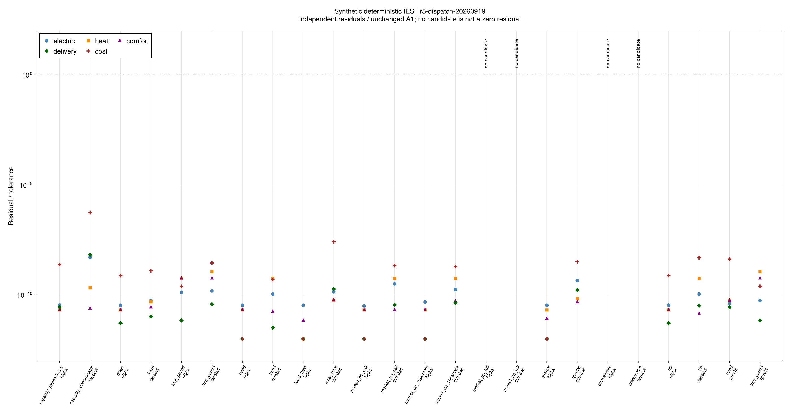
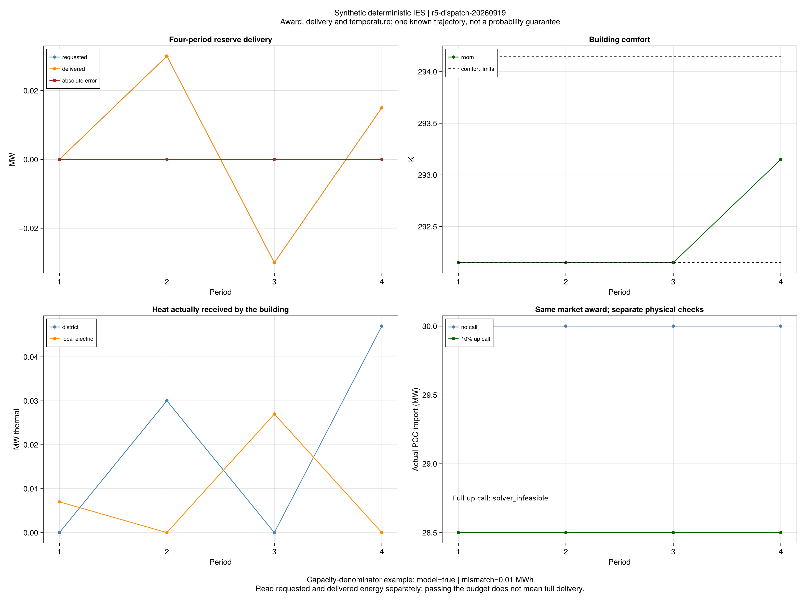

# 确定性IES补救：中标备用能否实际交付

## 1. 本轮的结论

**市场出清成立、内部调度可行、备用足额交付是三个不同的判定。**
本批把上一批已认证的市场成交，接入设备、电网、供回水和建筑模型，
在明确的合成输入上检验这些判定的关系。

科学节点为3f0036d，批次为r5-dispatch-20260919。11套输入和24项运行在求解前冻结：
HiGHS和Clarabel各11项，Gurobi另做手算和四时段两个对照。
20项获得最优候选并通过采用模型、费用及有效界验收；4项对应两套预先构造的容量不足输入，
保留不可行判定。它们不是24套独立输入，也不能把20/24当作随机场景可靠率。

| 验收 | 结果与含义 |
|---|---|
| 采用模型与费用完成 | 20/24；线性电网、固定流量热关系、硬舒适边界和声明的交付考核 |
| 容量不可行 | 2套输入×2求解器；下文另有供能下界证明 |
| 独立残差 | 1883项；最大残差/原A1阈值为5.59290×10⁻⁷，阈值线为1 |
| 有效费用界 | 20个候选均通过，最大相对间隙1.77632×10⁻¹¹ |
| 同模型求解器对照 | 11/11可比较配对通过A2；最大目标相对差4.59155×10⁻¹³ |
| 预算 | 每项60秒含建模/求解；最大记录耗时6.028秒，不作论文算法加速结论 |

本批没有补救对偶的独立KKT认证；保存原始乘子和求解器有效界，不能据此直接生成已认证Benders割。
采用模型也不包含完整交流潮流、水压、泵耗及节点法之外的连续输运精度认证。
后续[独立对偶补证](ch05-recourse-duality.md)已只读核验本批20个候选，原历史验收和4项不可行记录保持不变。

## 2. 备用中标不等于备用可交付

三个桥接案例复制同一市场运行的30MW日前购电、15MW上备用和价格，保留父运行及输入哈希，
没有缩放中标量。内部设备是另外冻结的合成输入：30MW固定电负荷，2MW燃机，
0.042MW电锅炉供热需求，无其他发电或本地加热。供回温固定、管损为零。
因而每个时段都满足如下必要条件：

~~~math
P^{actual}\ge 30+0.042-2=28.042\ {\rm MW}.
\tag{R5-D-R1}
~~~

| 调用 | 要求的实际购电 | 结果 |
|---|---:|---|
| 无调用 | 30MW | 两求解器均通过 |
| 调用上备用的10% | 28.5MW | 两求解器均通过 |
| 调用全部上备用 | 15MW | 低于28.042MW必要下界，两求解器均判不可行 |

另一个微型容量反例要求实际购电0.042MW，而最低需求为0.142MW，也有同样的解析矛盾。
这两项反例不依赖“求解器没找到解”的解释。

**能支持的解释：**仅有市场容量中标，不能认证内部物理交付；必须把设备能力和调用情景带回上层承诺决策。
不能据此推断作者原算例过量中标，因为本批没有使用作者的完整物理参数，
也尚未实现作者将不确定性和内部补救纳入报价决策的完整模型。

## 3. 原误差考核允许什么？

原式（5-4）按累计**中标备用容量**给误差上限。采用显式时间步后：

~~~math
\sum_t |r_t-d_t|\Delta t
\le\delta\sum_t(R_t^{up}+R_t^{down})\Delta t.
\tag{R5-D-R2}
~~~

capacity_denominator案例中，一小时中标0.1MW，仅调用10%，请求为0.01MWh；δ=0.1。
设备无法改变原购电，实际交付约为零，绝对误差为0.01MWh，恰好等于允许值。
两个求解器都通过模型验收，但该次调用的未满足比例为100%。

这是原判据的数学含义，不是验证器放宽了容差，也不是未计罚款：净费用23.7中已经含10的误差罚款。
后续必须分别展示中标容量、实际请求、实际交付、误差预算及相对调用量的未满足比例。
若研究需要约束逐次交付比例，须另立项目版本并作对照，不能静默改写原式。

## 4. 楼宇、热网与时间单位的证据

第2章（2-72）与第5章（5-30）共同支持楼宇接受区供热与本地产热之和，
本批按[采用解释](ch05-dispatch.md)恢复（5-27）中的总受热量。
手算条件为COP均为1且无管损，0.042MW供热全部由管网或全部由本地加热提供，
得到相同293.15K室温和14.2合成美元净费用。不能把这一特殊费用相等推广到任意COP与热损耗。
同一稳态功率改用0.25小时单步后费用为3.55；历史覆盖随物理延迟重新提供，能量与费用均按dt积分。

四时段案例同时含非整步时延、管损、CHP/GT/PV/EB和本地加热。
三求解器目标均约57.571301；请求和实际交付一致至数值精度，室温前三段位于292.15K下界，
末段回到显式初温293.15K。图中同时可见区供热和本地加热承担热需求。
这验证了部件连接和独立回放，没有建立“热惯性带来多少收益”的反事实对照。

四时段热管的入口、出口、独立回放温度与输运权重见[pipes.csv](assets/r5-dispatch/pipes.csv)。
图表读取保存数值，不重新求解。管温终端是显式free，故这些费用不是周期热状态恢复后的收益。

## 5. 与原文相比，进展到哪里？

本批连接了第5章的“日前能量/备用成交→实时电热调度→室温和交付检查”。
原式、量纲补全和项目边界分别登记，详见[31条原式与符号](ch05-dispatch-equations.md)。
这是小系统、已知完整调用轨迹的确定性方法验证，没有证明作者同输入收益、
最坏分布下的可靠性、样本外表现或在线控制能力，也没有完成整章及全文复现。

下一步依次推进：

1. 独立核验补救LP的KKT和参数灵敏度，并用解析例、合法方向差分验证；它是分解割的依据。
2. 把日前购能与备用承诺作为共同决策，接入多个冻结调用情景；先求可直接核验的小问题。
3. 连接已核查的有限支持最坏分布和联合机会约束，分别核算费用风险与室温违约风险。
4. 在直接小问题基准成立后实现策略报价、Benders及关键情景；随后做独立样本外统计检验。

不继续调参消除本批容量反例；它们将作为检查上层决策是否尊重交付能力的回归案例。

## 6. 证据、验证和重绘入口

- [全部状态与费用](assets/r5-dispatch/comparison.csv)、[独立残差](assets/r5-dispatch/residuals.csv)、
  [求解器对照](assets/r5-dispatch/solver-comparison.csv)、[解析反例与机制核查](assets/r5-dispatch/mechanism-audit.toml)。
- [请求与交付](assets/r5-dispatch/dispatch.csv)、[室温与热量](assets/r5-dispatch/buildings.csv)、
  [费用分项](assets/r5-dispatch/cost-components.csv)。
- [批次来源](assets/r5-dispatch/report.toml)、[图源配置](assets/r5-dispatch/figure-config.toml)、
  [封存哈希](assets/r5-dispatch/artifact-hashes.toml)。

正式运行使用冻结源码；four_period--highs/code/replay.jl已成功独立重读，不重求解。
完整1917项回归通过后补充两个索引规范化检查，最终125项专项通过；不把这两次数量相加为一次完整回归。

~~~powershell
julia +1.12.6 --startup-file=no --project=. scripts/check_r5_dispatch_artifacts.jl results/summaries/r5-dispatch
julia +1.12.6 --startup-file=no --project=. scripts/report_r5_dispatch.jl results/runs/r5/r5-dispatch-20260919/study.toml results/summaries/r5-dispatch-replay
julia +1.12.6 --startup-file=no --project=. scripts/audit_r5_dispatch.jl results/runs/r5/r5-dispatch-20260919/study.toml results/summaries/r5-dispatch-replay
julia +1.12.6 --startup-file=no --project=docs scripts/plot_r5_dispatch.jl results/summaries/r5-dispatch-replay
julia +1.12.6 --startup-file=no --project=. scripts/check_r5_dispatch_artifacts.jl results/summaries/r5-dispatch-replay --seal
~~~

新报告目录必须尚不存在；重绘输出与旧运行、旧图分开保存。VS Code提供报告、机制核查、重绘和封存检查任务。
