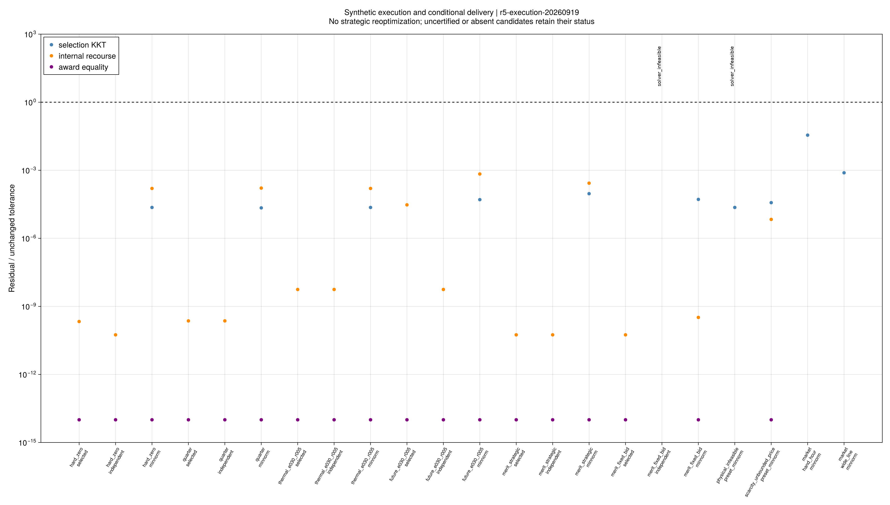
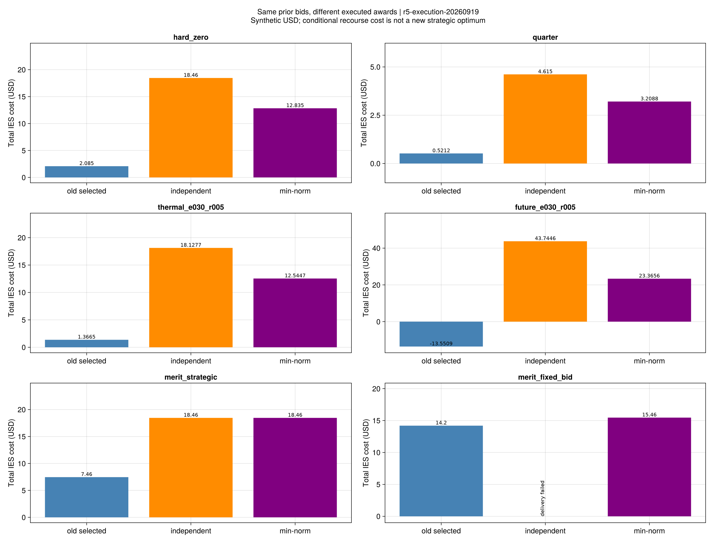
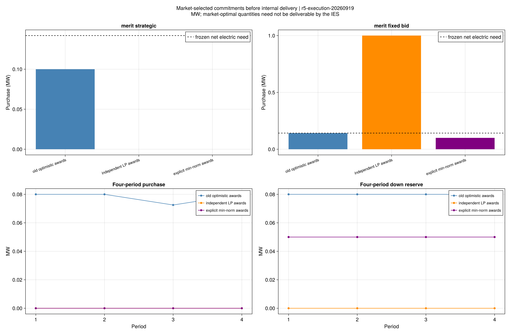

# 同样最优的市场成交，能否兑现原策略收益

本批结论是：**原乐观模型的费用优势依赖下层如何选择成交；市场最优也不保证IES能交付。**
新的执行规则能给出确定的成交与价格，但不能代替内部设备验算，也没有证明公平或现实适用性。
所有数据均为合成输入；采用规则见[模型说明](ch05-execution.md)。

## 1. 做了什么对照

科学节点为`fc31fa1`，规则在`configs/r5/execution/study.toml`先于正式求解冻结，
批次为`r5-execution-20260919`。六个原有效SOS1父例，各自固定原报价、设备和风险要求，
只更换成交来源：

1. 原策略模型选中的乐观成交。
2. 上一批独立市场LP实际返回的成交。
3. 项目明确的最小范数成交及价格。

旧无候选的两例使用预先声明的报价上下界中点，另有两个纯市场选择例，共22项。
每项选择与补救共享600秒，选择至多180秒；没有参考解注入或事后改变输入。
这次重新优化的是**固定成交后的补救调度**，没有在新执行规则下重新优化报价。

| 检查 | 结果 | 含义 |
|---|---:|---|
| 新规则选择 | 10/10认证通过 | 包括两个纯市场例；保留原市场福利最优值 |
| 旧市场见证 | 12/12重验通过 | 不能写成新增12次市场求解 |
| 内部交付与风险 | 18/20通过 | 另两项求解器报告不可行 |
| 条件费用优化 | 18/18完成 | 界只属于给定成交，不是新制度下的策略最优界 |
| 独立残差 | 9223项通过 | 最大残差/原阈值为0.035295，小于1 |
| 专项与完整回归 | 78/3141项通过 | 软件、数学与旧接口检查 |

QP驻点、互补、原对偶差与市场KKT分别检查，未修改原始乘子或放宽门槛。
四时段选择与补救均用运行自带冻结源码重读；失败记录没有伪造零残差。

对数图把小于10⁻¹⁴的显示值放在10⁻¹⁴位置；CSV仍保留真实数值，未据此改变验收。

## 2. 六个原有效例的费用对照

单位为合成USD；每行内部输入及报价相同。数值是市场支付加最坏补救费用，
不同输入行之间不作收益排名；负费用表示净收入，不表示负资源消耗。

| 输入 | 原乐观成交 | 独立LP成交 | 明确执行规则 |
|---|---:|---:|---:|
| 竞争供给，1小时 | 2.08500 | 18.46000 | 12.83500 |
| 竞争供给，0.25小时 | 0.52125 | 4.61500 | 3.20875 |
| 热风险ε=0.30、ρ=0.05 | 1.36648 | 18.12772 | 12.54465 |
| 四时段风险 | −13.55089 | 43.74458 | 23.36555 |
| 阶梯供给，原连续报价 | 7.46000 | 18.46000 | 18.46000 |
| 阶梯供给，报价固定100 | 14.20000 | 不可交付 | 15.46000 |

六个原选定成交的重算费用均与父值相符。保持原报价，换为独立或新规则成交后，
可交付例的费用全部变高；这是这些冻结输入支持的结果，不是所有市场的一般定理。
按0.25小时缩放的费用也与1小时例保持对应。

### 为什么阶梯例的收益排序改变

在原乐观模型中，报价20使IES买入0.1 MW，费用7.46；固定报价100的费用为14.2。
在明确执行规则下，原报价20对应的购电约为零，IES自行供能，费用18.46；
报价100对应购电约0.1 MW，费用15.46。

因此，**旧策略在旧选择模型里最优，不代表把它交给另一执行制度后仍最优。**
这里同时更换了成交与价格选择，不能把全部差额单独归因于价格；
更不能据此声称策略报价必然有害。重新优化该制度下的报价属于另一个问题。

### 一个真正的交付反例

固定报价100时，独立市场LP返回1 MW购电。市场KKT通过，
固定这项成交后的内部风险调度却报告不可行；我们没有按设备容量缩小成交。
同一输入下，0.142 MW原选定成交和约0.1 MW新规则成交均可交付。

这区分了“没有内部设备约束的市场出清”与“真实设备履约”两个问题。
本批保存了不可行状态与原值，尚不把它写成所有备用轨迹下的独立解析不可行证明。

## 3. 价格唯一化解决了什么，没解决什么

`scarcity_unbounded_price`的旧乐观策略模型存在价格射线，旧无界结果保持。
在预声明的中点报价和新最小范数制度下，选出有限价格，条件总费用为3.435。
这是**新制度下的有限结果**，没有修复或推翻旧模型的无界性。

纯市场`hand_hour`选出的支付约为600，`wide_line`约为5880。
后者处于上一批固定全部成交的4980–5880区间上端，
说明“最小乘子范数”并不等于“让IES支付最少”。
最小范数只是本项目选定的确定性制度，不能解释成市场公允价。
这些纯市场例没有内部IES输入，因此未进行内部交付认证。

`competitive_physical_infeasible`在新选择下仍无法内部交付。
价格有限、选择唯一和设备可行是三项不同结论。

所有价格和成交原值均保留数值精度。例如零备用成交附近的价格存在很小的数值偏差，
没有把其裁剪为零后再核验；结算、KKT和费用均使用保存的原值。

## 4. 与论文的关系及研究结论

原第5章(5-32)至(5-59)的报价、下层市场、KKT和支付关系已经形成合成小系统基准。
原方程约束最优解集合；本批的最小范数选择是项目新增制度，不归于作者。
本批未取得作者同输入或实际成交规则，不能解释为作者结果错误。

本次支持三项判断：

- **模型侧：**现有乐观策略结果经固定成交重算仍成立；没有发现需要推翻这些父结果的证据。
- **执行侧：**同样的报价与下层最优值可能产生不同费用，甚至无法内部交付。
- **边界侧：**有限支持风险认证、线性电网和固定流量热网仍是采用模型范围；
  尚无样本外概率保证或论文规模性能结论。

这项执行归因已经达到可复核的阶段结果，可以归档。下一步回到论文算法主线：

1. 将现有、明确标记乐观选择的策略市场接入分解主问题，
   与直接SOS1模型做**同模型**对照；不把旧固定价格Benders结果当作策略分解结果。
2. 冻结独立训练、验证、测试数据，开展R6样本外费用、舒适违约和备用实际交付统计。
3. 继续第6章韧性规划、第7章场景迁移及规模/输入缺口，见[全文清单](reproduction-coverage.md)。

新制度下策略重优化和更完整的市场设计保留为附加专题，
不把持续增加市场规则当作推进论文复现的替代。

## 5. 数据与复核

- [逐项费用和状态](assets/r5-execution/comparison.csv)、
  [成交与价格](assets/r5-execution/awards.csv)、
  [内部物理轨迹](assets/r5-execution/trajectories.csv)、
  [全部残差](assets/r5-execution/residuals.csv)。
- [输入和源码来源](assets/r5-execution/report.toml)、
  [图源配置](assets/r5-execution/figure-config.toml)、
  [封存清单](assets/r5-execution/artifact-hashes.toml)。

~~~powershell
julia +1.12.6 --startup-file=no --project=. scripts/check_r5_execution_artifacts.jl results/summaries/r5-execution
~~~

检查器只读公开见证并重算表格，不重新求解。VS Code任务提供测试、批次、报告、核验及重绘入口。
重新求解或出图必须使用新目录，保留本批原始记录。
