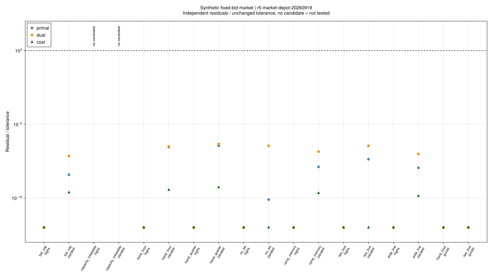
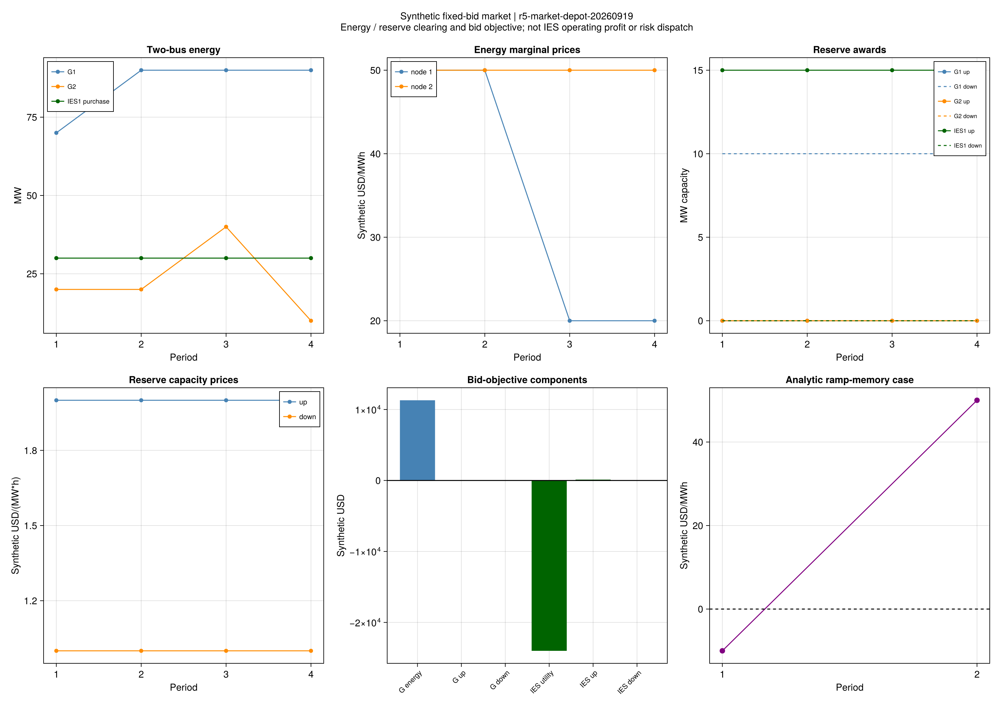

# 固定报价市场：出清、价格与原对偶结果

## 1. 本批说明了什么？

**16项可行运行通过能量/备用出清、KKT和独立手推对偶；2项预设容量不足案例被判不可行。**
这说明采用的确定性连续市场模型在冻结小系统上实现一致，能够作为后续双层和风险调度的下层基准。
还没有把中标备用接入IES内部设备、热网、室温和实时交付，不能据此宣布第5章完成。
后续独立批次已完成上述确定性连接，见[实际交付检查](ch05-dispatch-results.md)；本页市场批次判定不变。

首轮r5-market-20260919的18项包含2项Gurobi包加载错误；全部原值和2940条残差保留在
results/summaries/r5-market。修正当前进程的本地depot搜索后，使用同一冻结规则执行
r5-market-depot-20260919，科学节点c22b423，18项均得到明确结论，输出3417条独立残差。
配对核查确认输入、模型、验证器及根环境未变，首轮14项合格目标全部通过A2复核。
这里区分环境错误和科学不可行，没有覆盖旧记录或改动门槛。

## 2. 原问题、对偶和三个求解器

| 验收项 | 实际证据 |
|---|---|
| 固定输入 | 8套合成案例；HiGHS/Clarabel各8项、Gurobi 2项 |
| 可行出清及原始乘子KKT | 16/16可行运行通过 |
| 独立构建的对偶 | 16/16通过，包含初始出力、相邻时段爬坡和独立报价数量上界 |
| 容量不可行 | HiGHS、Clarabel分别确认；不填入零费用 |
| 最大残差/验收阈值 | 4.68283×10⁻⁷，阈值线为1 |
| 最大原对偶相对差 | 2.87512×10⁻¹¹ |
| 同输入跨求解器比较 | 9/9可比较对照通过A2，最大目标相对差4.38636×10⁻¹² |
| 每项共享预算 | 60秒；本批最大记录方法耗时8.624秒，不作算法加速结论 |

引擎版本分别为HiGHS 1.15.1、Clarabel 0.11.1、Gurobi 13.0.3；包版本另由根环境和
可选求解器环境锁定。原始MOI对偶、转换后乘子、独立对偶证书、求解器版本和源码快照均在运行中保存。
退化LP可以有不同的有效价格或中标组合，本批不强迫这些数值逐项唯一。

图中没有候选的两项是预先构造的容量不足：原发电总容量180MW，而首时段普通负荷已达1060MW，
即使IES购电取零也不可能平衡。求解器判定与这一必要条件一致。

## 3. 三个可以手算解释的机制

### 时间单位与价格

单节点一小时手算目标为−1280合成美元，0.25小时为−320；能量价格均为20美元/MWh。
负目标来自购电效用项，不表示负燃料费用或负运行成本。固定普通负荷效用常数在原对偶两侧一致省略。

### 爬坡具有跨时段价值

两时段解析例的负荷为20/100MW。廉价机组报价20、昂贵机组50，廉价机组每小时最多增加20MW。
最优廉价出力为20/40MW，昂贵机组为0/60MW，总报价成本4200。
如果第一时段负荷增加一个足够小的量ε，廉价机组可在第一、第二时段各多发ε，第二时段昂贵机组少发ε：

~~~math
\Delta Z=(20+20-50)\varepsilon=-10\varepsilon.
\tag{R5-MK-R1}
~~~

所以第一时段边际价格是−10美元/MWh，第二时段是50。三个递减差分步长已核对此方向。
这并不需要负报价；它来自当前负荷对后续爬坡空间的影响。
原(5-46)已包含下一时段乘子，本项目核对的是统一方向、初始/末端边界和费用常数。

### 线路容量与备用报价共同影响出清

两节点主例中，IES购电30MW，并以2美元/(MW·h)报价提供15MW上备用；
发电机提供10MW下备用，其边际容量价格为1美元/(MW·h)。这只是日前容量中标，尚未证明实际可交付。
第3/4时段两个节点能量价格为20和50美元/MWh，说明不能用一个统一电价代替所有节点。

| 冻结案例 | HiGHS目标（合成美元） | 解释边界 |
|---|---:|---|
| 两节点、70MW线路 | −12540 | 含IES购电效用，不能称为资源成本 |
| 同输入、200MW线路 | −13140 | 容量扩大后报价目标改善600；没有计入扩建成本 |
| 无IES | 6850 | 同时移除了效用和参与者，不能与主例直接计算协同收益率 |
| 发电报价数量上限40MW | 3800 | 报价上限与物理容量分别生效 |

图形预先选定two_bus--highs和ramp_memory--highs，不按结果挑选更好求解器。
目标分项是报价成本和效用，不是完整IES净利润，也没有计算不确定备用调用下的偏差罚款。

## 4. 下一步

1. 核清楼宇接收的总热量、热容和时间步，显式保留热网及本地加热贡献。
2. 接入确定性IES设备、电网、固定流量动态热网，验证中标备用与实际购电改变的方向及可交付性。
3. 分开价格接受者与策略报价模型，用本批市场原对偶基准核对下层结果。
4. 再加入有限情景不确定性、最坏分布和室温联合风险，先建立直接小问题参照，再实现分解。

所有输入仍为合成；原论文15电/10热系统及PJM市场的同输入结论、完整风险算法和样本外可靠性均未完成。
模型说明见[市场与对偶推导](ch05-market.md)，更完整的未完成清单见[全文覆盖](reproduction-coverage.md)。

## 5. 证据和重绘

- [全部状态与目标](assets/r5-market/comparison.csv)、[原对偶残差](assets/r5-market/residuals.csv)、
  [同输入求解器比较](assets/r5-market/solver-comparison.csv)、[两批环境复核](assets/r5-market/environment-replay.toml)。
- [节点价格](assets/r5-market/prices.csv)、[出清量](assets/r5-market/dispatch.csv)、
  [线路潮流](assets/r5-market/flows.csv)、[目标分项](assets/r5-market/objective-components.csv)。
- [运行与来源](assets/r5-market/report.toml)、[图源配置](assets/r5-market/figure-config.toml)。
- 完整回归1794项通过；补充版本/环境快照后97项市场专项再次通过。旧R1–R4调用保持兼容。

~~~powershell
julia +1.12.6 --startup-file=no --project=. scripts/validate_r5_market.jl results/runs/r5/r5-market-depot-20260919/study.toml
julia +1.12.6 --startup-file=no --project=. scripts/report_r5_market.jl results/runs/r5/r5-market-depot-20260919/study.toml results/summaries/r5-market-replay
julia +1.12.6 --startup-file=no --project=docs scripts/plot_r5_market.jl results/summaries/r5-market-replay
~~~
