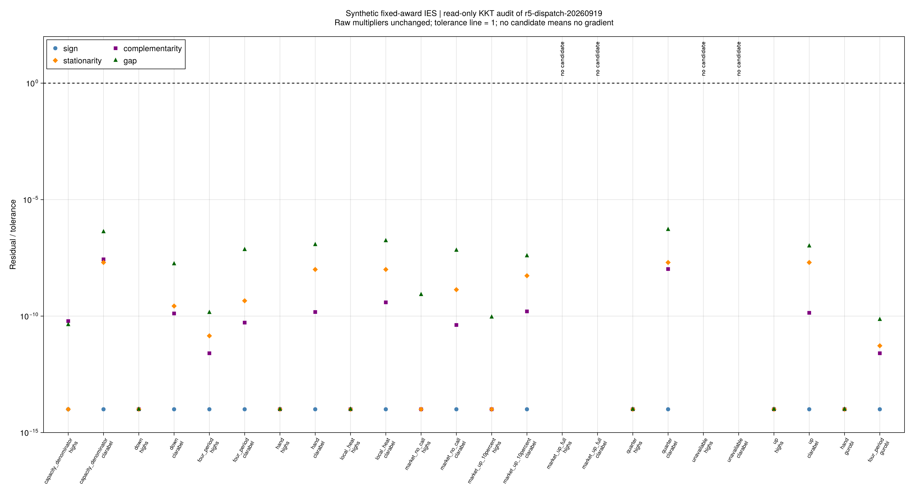

# 补救最优性与容量灵敏度

## 为什么这一步是必要的？

上一批给定日前成交，检查设备能否完成一条已知调用轨迹。下一步要选择购电和备用承诺，
就需要知道：承诺改变一点，最优补救费用会怎样变化？
论文（5-88）至（5-90）的分解结构依赖这种信息。本批提供固定舒适分支的数值对偶核验，
没有实现完整Benders、共同日前决策或随机风险调度。

## 1. 独立检查什么

[`validate_r5_dispatch_duals`](@ref)从输入重建电热关系和变量界的系数，
不读取JuMP约束表达式、不调用建模侧热输运核。所有变量都按稳定的`类型/实体/时段`索引。
包括热输运、供回水混合、建筑跨时状态、初始爬坡、终端室温以及固定变量的两侧界。

对偶方向遵循[MOI官方定义](https://jump.dev/MathOptInterface.jl/stable/background/duality/)：
最小化模型的`>=`行乘子非负，`<=`行乘子非正，等式乘子自由；原值不裁剪、不修改。
在独立A1检查之外，逐项检查符号、互补、驻点和原对偶目标差。
[`build_r5_dispatch_dual`](@ref)还可独立构造对偶LP，与原问题求解结果交叉比较。

所有尺度均由输入先确定。取功率尺度为原A1电功率尺度sP，价格尺度为设备成本、实时价格、
误差罚价及1的最大值sC，费用尺度为`max(1,dt*sP*sC)`。
变量尺度按功率、K或pu分别确定；行尺度为右端绝对值、加权变量尺度和1的最大值。
驻点残差乘变量尺度后除以费用尺度；乘子符号残差乘行尺度，互补乘积直接除以费用尺度。
三类无量纲门槛保持1e-6，原对偶相对差保持1e-4。

总费用与扣除日前常数后的补救费用分别检查原对偶差，避免很大的固定支付掩盖补救误差。
这属于给定容差下的数值认证，不是精确算术证明；未通过时不生成可信次梯度。

## 2. 备用有两条参数路径

令yD表示`delivery+P_PCC=P_DA`的原始乘子，y+、y−表示误差双行乘子，yB表示累计误差预算乘子。
保持价格、设备、历史、调用系数及舒适分支不变，补救费用Q的次梯度为：

~~~math
\frac{\partial Q}{\partial P^{DA}_t}=y^D_t,\qquad
g^{up}_t=\alpha^{up}_t(y^+_t-y^-_t)+\delta\Delta t\,y^B,\qquad
g^{down}_t=-\alpha^{down}_t(y^+_t-y^-_t)+\delta\Delta t\,y^B.
\tag{R5-DK4}
~~~

第一条路径改变调用请求，第二条路径改变原式（5-4）允许的误差额度。
遗漏后一项，会把更大误差预算带来的费用变化漏掉。其他设备与温度关系虽然不直接含日前参数，
仍通过最优乘子影响上述数值，不能删除这些约束。
总费用还须加入日前常数的导数：购电为`dt*energy_price`，备用为负的`dt*capacity_price`。
[`r5_dispatch_sensitivity`](@ref)分别返回`recourse`与`total`，单位USD/MW，已经含时间步。

### 可以手算的例子

在一小时、燃机边际成本130、实时价格80、日前购电价格100、上下容量价5/2的光滑小例中，
调用比例为0.4/0.2且不允许误差，总费用梯度为：

~~~math
(g^{DA},g^{up},g^{down})=(100-130,\ -5+0.4(130-80),\ -2-0.2(130-80))
=(-30,15,-12).
\tag{R5-DK5}
~~~

负的购电导数表示：稍多买日前电，可以减少更贵的本地发电。
把燃机成本改为2000、误差罚价1000、δ设为0.1，且上调用比例0.4时，最优运行用满误差额度。
上备用灵敏度为`−5+0.4*(2000−80)−0.1*920=671`。
最后的−92就是预算路径贡献；漏项会错误地得到763。
这些价格是解析测试的合成构造，没有作为作者参数使用。

## 3. 非光滑点不能强求唯一导数

在绝对误差为零或设备活跃集切换处，不同对偶解可能给出不同有效次梯度。
光滑测试采用三个递减步长1e-3、1e-4、1e-5 MW，A2相对误差门槛1e-3。
非光滑测试改为核验两侧的支撑不等式，不把中央差分强行当唯一导数。
另外覆盖固定变量、冗余等式、货币整体缩放、0.25小时单位、缺失/破坏对偶及旧结果只读兼容。

当前模型矩阵不随日前成交改变，因此固定分支LP的对偶有明确的次梯度意义。
未来引入舒适开关z、改变价格或物理参数时，要重新登记依赖；不能跨分支复用当前次梯度。
条件割仍须使用已经推导的有限下界，见[分解前提审计](ch05-algorithm-audit.md)。

## 4. 正式补证：20个候选的原始对偶均通过

科学节点为`eba7fb2`。本次只读核查`r5-dispatch-20260919`的全部24条历史记录，
没有重新优化、修改原始乘子或改写旧验收。公开见证包含小型输入、原解与原始对偶，
可以在不携带本地运行目录的干净克隆中重新验算。

| 核查 | 实际结果 |
|---|---|
| 原有可行候选 | 20/20通过独立模型、费用与数值KKT检查 |
| 原有不可行记录 | 4条保持无候选、无梯度；对应两套输入的双求解器记录 |
| 独立核查量 | 6127项残差、123项参数灵敏度，均可从公开见证重算 |
| 最大总费用原对偶相对差 | 1.75270×10⁻¹¹ |
| 最大补救费用原对偶相对差 | 5.18630×10⁻¹¹；已扣除固定日前费用 |
| 最大残差/对应阈值 | 5.59290×10⁻⁷；合格线为1，未放宽门槛 |
| 数学与程序测试 | 340项专项通过；完整R1–R5回归2259/2259通过 |

这里的20/20说明保存的解与乘子满足所采用LP的数值最优性条件，不是随机场景可靠率，
也不追加完整交流潮流、水压或作者同输入结果的认证。4条无候选记录未以零残差代替缺失值。

F04读取保存的符号、互补、驻点及原对偶差；原始零值仅为对数坐标显示置于1e-14，
原始表格仍保留零。没有候选的记录单独标注。目标重算等全部项目保存在完整残差表中。

### 这一轮说明什么？

1. **固定承诺下的费用反馈已有依据。** 在相同价格、物理模型与舒适分支内，
   可以使用通过独立核查的次梯度描述承诺小幅改变的费用影响。
2. **备用容量有两种作用。** 它同时改变调用请求和允许的累计误差；上述671与763的差异
   说明漏掉误差预算贡献会给出错误方向。次梯度通过并不改变误差考核本身的解释。
3. **上层承诺仍须接受物理约束。** 上一批全额调用容量反例保持不可行；认证乘子不会创造设备能力。
   当前仍是固定成交下的确定性补救，尚未回答应当承诺多少备用。

下一步先建立**共同日前承诺、多调用情景的直接优化基准**：各情景共享日前购电与备用容量，
分别执行实时电热调度。先用可手算的小问题核对承诺、交付、费用和有效界，
再接入已核查的最坏分布与联合机会约束，最后用直接基准验收分解算法。
固定舒适分支的次梯度不能跨二元风险分支直接复用；负补救费用的条件割仍须有效有限下界。

首次审计在记录Git元数据时发生`EBADF`环境错误，原输出另存。
同脚本正常环境复核的24个见证与3个CSV逐字节一致；两次均未执行求解器。
该环境故障未作为科学失败或新的优化成功计数。

## 5. 运行与证据

- [原状态、KKT与费用差](assets/r5-duality/comparison.csv)、[全部独立残差](assets/r5-duality/kkt-residuals.csv)、
  [次梯度及分项贡献](assets/r5-duality/sensitivity.csv)。
- [来源、源码和见证哈希](assets/r5-duality/audit.toml)、[图源配置](assets/r5-duality/figure-config.toml)、
  [环境复核](assets/r5-duality/environment-replay.toml)、[封存清单](assets/r5-duality/artifact-hashes.toml)。

已封存结果的只读检查：

~~~powershell
julia +1.12.6 --startup-file=no --project=. scripts/check_r5_duality.jl results/summaries/r5-duality-verified
~~~

重新生成报告时使用新的输出目录：

~~~powershell
julia +1.12.6 --startup-file=no --project=. scripts/test_r5_dispatch_duality.jl
julia +1.12.6 --startup-file=no --project=. scripts/check_r5_duality.jl
julia +1.12.6 --startup-file=no --project=. scripts/audit_r5_dispatch_duality.jl results/runs/r5/r5-dispatch-20260919/study.toml results/summaries/r5-duality-new
julia +1.12.6 --startup-file=no --project=docs scripts/plot_r5_duality.jl results/summaries/r5-duality-new
julia +1.12.6 --startup-file=no --project=. scripts/check_r5_duality.jl results/summaries/r5-duality-new --seal
~~~

审计覆盖上一批全部24条记录，不重新求解、不重写原始状态。新目录保存公开的小型输入/原值见证，
使干净克隆也能重新检查KKT与灵敏度。旧运行没有候选时，保持没有梯度；不能用独立对偶替换原始乘子来制造通过。
公式与符号以[权威生成页](ch05-recourse-equations.md)为准。全文尚未完成，下一步为共同日前承诺的多情景直接基准。
