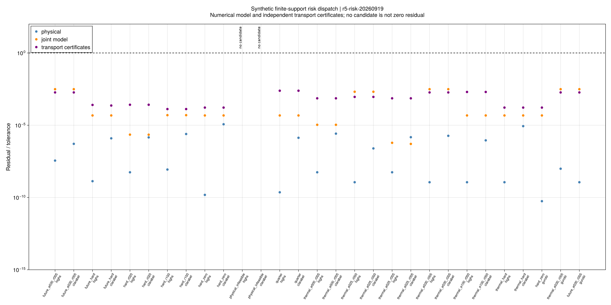
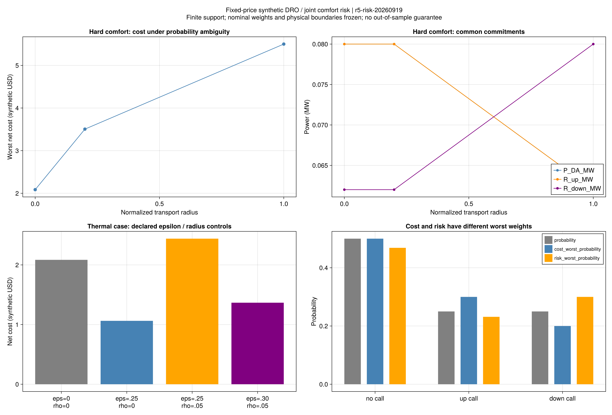
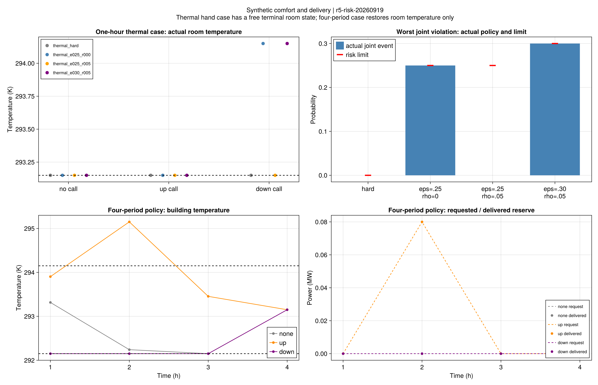

# 有限支持风险调度：正式结果与机制解释

## 1. 本批回答了什么

科学节点`8561d74`，正式批次`r5-risk-20260919`。13套合成输入、29项运行规则在首次优化前冻结。
本批将共同日前承诺、电热补救、最坏费用分布和联合舒适风险接入同一个直接模型，
检验固定外生价格、有限情景集合下的费用—舒适风险权衡。

| 项目 | 实际证据 |
|---|---|
| 模型、风险、费用及费用完成 | 27/29；余下2项是预设容量不足输入的双求解器不可行记录 |
| 独立原值重算 | 6972条残差全部通过；最大残差/阈值为0.00311122，合格线为1 |
| 开放方法对照 | 13次HiGHS直接MILP、13次Clarabel完整模式枚举；后者共104个LP分支，25个费用完成、79个不可行 |
| 本机商业求解器对照 | 3次Gurobi直接MILP，均通过相同验收 |
| 同模型费用对照 | 15项可比较配对全部通过A2；最大目标相对差6.02079×10⁻¹²，另1对双方不可行 |
| 有效费用界 | 27个候选最大相对间隙6.77110×10⁻¹¹；不等于每个零概率情景分别达到条件最优 |
| 数学与程序检查 | 118项专项、完整2514项回归通过，另补7项封存路径测试；沿用A1/A2，未放宽阈值 |

27/29不是样本外成功概率，也不是27种独立物理情景。运行数包括同输入方法对照和预设不可行例。
每个方法的建模、枚举与运输证书共用60秒预算，最大记录11.205秒；公共环境初始化另存。
未测试论文规模，不能据此宣称算法加速。

原始微小室温越界与A1分类事件分别保留：14项情景记录只有数值级越界，没有超过1e-4 K。
风险概率仍以1e-8检查；不能利用室温分类掩盖二元风险证书失败。
表中近零负概率、略高于1的概率等原始舍入量未被改写；正文按显示精度表述。

## 2. 概率不确定性会改变承诺，而不仅是改变费用标签

首先固定全部情景舒适，改变概率集合的半径。下表均为同一单时段物理输入，
费用单位为合成USD，功率单位为MW；半径是输入中预先声明的归一化距离量。

| 半径ρ | 最坏净费用 | 日前购电P | 上备用U | 下备用D |
|---|---:|---:|---:|---:|
| 0 | 2.085 | 0.080 | 0.080 | 0.062 |
| 0.2 | 3.505 | 0.080 | 0.080 | 0.062 |
| 1 | 5.500 | 0.062 | 0.062 | 0.080 |

半径0退化为上一批固定名义概率的共同承诺。半径0.2增加了最坏费用，但没有改变最优承诺；
半径1足以把概率集中到高费用的上调用情景，最优购电和备用组合随之变化。
这支持“概率判断参与资源承诺”的机制，不支持“任意增加半径都必然改变调度”。

距离来自三个调用类别的归一化标签，非依据真实预测误差校准的统计距离。
因此这些半径不对应真实天气或市场的置信水平。

## 3. 舒适弹性有价值，但名义风险合格不等于鲁棒风险合格

独立的热手算例包含0.1小时无损输运延迟、有界回温和显式free建筑末温。
舒适目标为293.15 K单点，物理域为292.15–294.15 K；其他容量、网络和交付约束不放松。
所有行采用同一物理输入，只改变ε和ρ：

| 联合风险上限ε | 半径ρ | 最坏净费用 | 实际联合违约最坏概率 | 采用的舒适选择 |
|---|---|---:|---:|---|
| 0 | 0 | 2.08500 | 0 | 全部舒适 |
| 0.25 | 0 | 1.06260 | 0.25 | 下调用情景允许升温1 K |
| 0.25 | 0.05 | 2.44000 | 0 | 重新选择全部舒适 |
| 0.30 | 0.05 | 1.36648 | 0.30 | 下调用情景允许升温1 K |
| 0 | 0.05 | 2.44000 | 0 | 全部舒适的同半径对照 |
| 1 | 0 | −0.18345 | 1 | 所有情景可超出舒适区，但仍在物理域内 |

名义下调用概率为0.25。距离为1、运输预算0.05时，该违约事件的最坏概率可以达到0.30。
所以名义模型中合法的低费用方案，在ε=0.25的鲁棒模型中不可采用；允许ε=0.30后才能再次采用。
这是一项有明确手算依据的风险机制，而不是为得到收益事后调整输入。

升温1 K使建筑当期可吸收热量增加0.0142 MWh，经历史输运换算，源端电锅炉用电增加0.01278 MWh。
因此下备用容量可从0.062提高到0.07478 MW，正是电热柔性影响市场承诺的具体路径。
负净费用包括容量收入，不是负资源成本；ε=1的结果也不能解释为舒适可靠。

该手算例允许末温变化。它验证声明边界下的机制，不是恢复周期热状态后的收益保证，
更不能与另一套固定末温输入直接作公平收益排名。

## 4. 费用和舒适事件必须使用各自的最坏分布

在ε=0.30、ρ=0.05热例中，成本最坏分布给未调用/上调用/下调用的权重约为0.50/0.30/0.20。
它增加高费用上调用的权重，却减少了本例会超温的下调用权重。
若拿它检验舒适风险，会得到0.20；独立风险最坏分布给下调用0.30。
两者不同，不能用同一个最坏分布同时认证费用和风险。

半径1的全舒适例中，费用最坏分布含两个零权重。
直接模型仍能验证所选策略的最坏费用与全模型有效界，但不能把联合乘子除以零，
也不能声称零权重情景已各自费用最优。下一步分解必须独立处理这一点。

## 5. 四时段结果与失败例

四时段输入同时包含环境温度、电负荷和光伏轨迹差异。ε=0.30、ρ=0.05时，最坏净费用为35.669615，
同一策略在名义概率下为35.218328。上调用情景第2时段室温达到295.15 K，
高于舒适上限294.15 K，但满足显式物理上限，末时段室温仍回到293.15 K。
其余两个情景不发生超过A1的舒适违约；备用请求与实际交付一致。

四时段全部舒适、ρ=0对照的费用为35.160173。
两者同时改变了概率集合和风险上限，因此不能把这项费用差单独归因于舒适弹性或鲁棒性。
管温终端仍是free；该结果没有认证完整周期状态、在线信息可得性、交流潮流或水压。

容量不足输入中，电负荷2 MW，大于购电上界1 MW与本地发电上界0.2 MW之和。
即使ε=1允许所有情景超出舒适区，电能守恒仍不可能成立；HiGHS和全部8个舒适分支均保留不可行。
风险容忍只作用于声明的舒适事件，不能替代供能容量。

## 6. 与论文主线及下一步的关系

现有证据支持：共同承诺、电热补救和最坏联合舒适风险之间存在可核查的费用权衡；
有限支持运输对偶、直接整数求解和全部分支枚举在这些合成输入上相互吻合。
第5章的风险调度主线已从独立概率检查推进到与物理补救联动的直接基准。

这仍是固定外生价格模型，未完成策略报价、市场出清联动或作者的加速分解。
不将合成结果当作者原输入，不继承连续支持或样本外可靠性保证，也不追求相同收益百分比。
原式歧义、项目推导和采用边界见[模型教程](ch05-risk.md)与[公式台账](ch05-risk-equations.md)。

下一批优先以本批直接解和全枚举界作为独立参照，验证Benders及关键情景路线：

1. 先固定价格和有限支持，推导负补救费用的有限下界、条件割及零概率情景处理。
2. 每条割独立核查有效性；候选须全情景回查，逐轮保存可行上界与有效下界。
3. 小系统与本批直接基准按A2对照，失败与预算不足保留；不先声称速度优势。
4. 再接入策略报价与市场出清，之后做数据分割、半径校准和样本外统计；第6–7章仍待独立推进。

## 7. 证据与重读

- [费用与状态](assets/r5-risk/comparison.csv)、[方法对照](assets/r5-risk/method-comparison.csv)、
  [全部舒适分支](assets/r5-risk/branches.csv)、[独立残差](assets/r5-risk/residuals.csv)。
- [共同承诺](assets/r5-risk/commitments.csv)、[情景费用与最坏概率](assets/r5-risk/scenarios.csv)、
  [室温与交付](assets/r5-risk/trajectories.csv)。
- [来源与源码](assets/r5-risk/report.toml)、[图源配置](assets/r5-risk/figure-config.toml)、
  [封存清单](assets/r5-risk/artifact-hashes.toml)。

公开小型见证含输入、原值、运输原对偶证书和枚举分支。独立重读不依赖本机原运行目录，不重新求解：

~~~powershell
julia +1.12.6 --startup-file=no --project=. scripts/check_historical_evidence.jl r5-risk
~~~

完整运行的`code/replay.jl`使用冻结科学源码核验同一存档。重新实验、报告及绘图须使用新目录，
命令和API见[有限支持风险教程](ch05-risk.md)。
