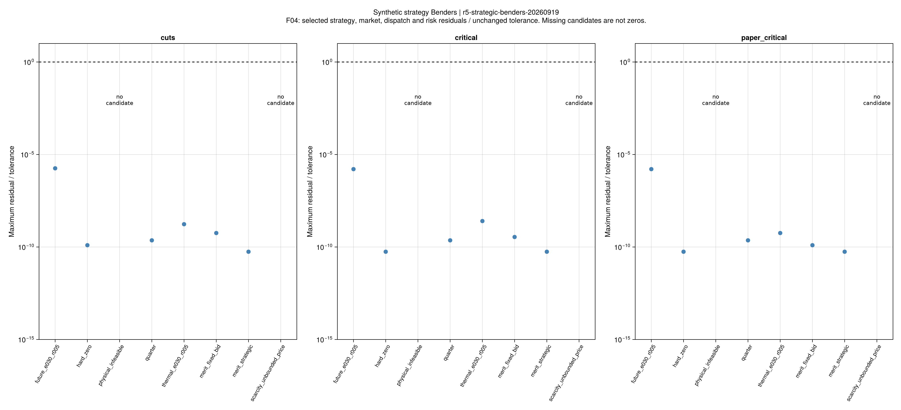
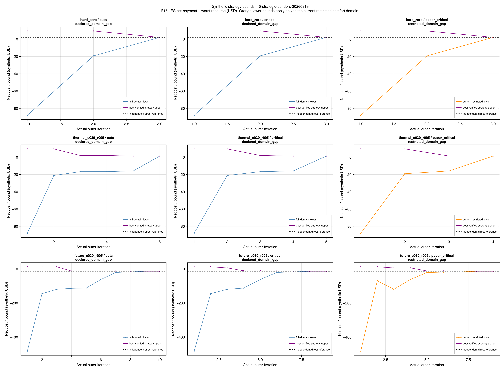
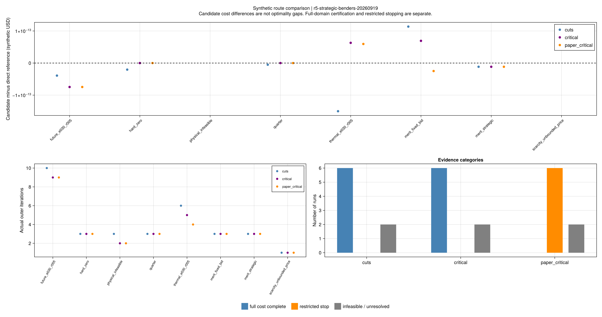

# 连续策略报价的三路线正式对照

本批回答：把连续报价和市场出清接入后，条件Benders还能否得到与独立直接模型相同的策略费用？
采用版本为`r5_strategic_benders_checked_v1`；八套输入均为合成输入。
模型与推导见[市场和分解连接](ch05-strategic-benders.md)，上一批的
[市场执行规则对照](ch05-execution-results.md)保持独立。

## 先冻结了什么

科学源码节点为`e98c14e`，规则节点为`c49509b`。规则在首次优化前固定八套输入、
三路线、全部科学和执行脚本哈希，以及后置直接参考身份：
`configs/r5/strategic-benders/study.toml`。

- 每个完整方法共享600秒，最多200轮；建模、主问题、条件LP、诊断和独立核验均计时。
- 主问题使用Gurobi原生SOS1，子问题与运输对手用HiGHS；不设置任意乘子上界或隐式限价。
- 从空割、空关键情景集开始。独立直接参考不提供初值、互补分支或割。
- 三条路线分别为纯割`cuts`、加入完整关键情景`critical`、额外固定非关键情景舒适开关的`paper_critical`。
- 原始乘子、市场选择乘子、完整费用和各分项单独保存；A1、A2、KKT门槛不变。

正式批次为`r5-strategic-benders-20260919`，24项均已完成并保存。
第一次加载/JIT及共享主机条件会影响计时，表中时间只作原始记录，不据此计算加速比。

## 得到了什么

| 证据类别 | 数量 | 能够说明什么 |
|---|---:|---|
| 完整域费用完成，且与直接参考通过A2 | 12 | 六个可行输入的纯割、关键情景两路线达到同模型目标精度 |
| 受限舒适域停止 | 6 | 有完整可交付候选；自身下界与停止证书仍属受限域 |
| 容量不足 | 3 | 两个完整域不可行记录、一个受限域不可行记录分别保留 |
| 主问题松弛无界 | 3 | 未产生候选；不能单独用松弛状态证明完整策略模型无界 |

18个候选均通过市场、内部调度、风险与费用核算。8595项选定候选残差全部通过，
最大“残差/原验收门槛”为`1.79010e-6`。12个完整域方法与独立直接参考的最大相对费用差
为`1.09846e-13`；不是仅比较求解器返回的目标标签。

| 输入 | IES净费用，合成USD | cuts轮数 | critical轮数 | paper_critical轮数 |
|---|---:|---:|---:|---:|
| 竞争供给手算 | 2.085 | 3 | 3 | 3 |
| 0.25小时时间步 | 0.52125 | 3 | 3 | 3 |
| 热风险 | 1.36648 | 6 | 5 | 4 |
| 四时段 | −13.5508906216 | 10 | 9 | 9 |
| 阶梯供给固定报价 | 14.2 | 3 | 3 | 3 |
| 阶梯供给连续报价 | 7.46 | 3 | 3 | 3 |

本批三个方法在上述六个输入上得到相同费用，差异处于数值误差量级。
这次没有出现论文式路线的费用损失，不能据此证明其域限制在其他输入上无影响。
四时段和热风险的关键情景路线分别比纯割少一轮；小系统轮数差不等于论文规模速度优势。

负费用是IES市场净收入超过内部最坏补救支出的结果，不代表负资源消耗。
阶梯报价的7.46和14.2复核了此前的私人费用差；不能据此重新命名为社会福利改善。

## 为什么仍保留“受限域”标签

`paper_critical`固定非关键情景舒适开关为零，缩小了可选择的策略集合。
尽管本批候选费用恰好与独立完整模型相同，它自身的主问题下界仍属于受限集合。
因此表中的6项不记入完整域A2，也不把跨域费用差叫作该算法的最优性间隙。
完整模型直接参考提供的外部对照与分解算法自己的证书是两类证据。

容量反例在纯割/关键路线分别第3/2轮确认对应完整域不可行；论文式路线第2轮确认受限域不可行。
稀缺例的三条路线均在第1轮返回`master_relaxation_DUAL_INFEASIBLE`。
旧直接模型的价格无界证据仍另行保留，本轮松弛状态不替代那项证据，也未通过限价改变问题。

## 科学图与可重读证据

F04只显示选定候选的独立残差。对数轴显示下限为`1e-14`，原值在CSV中保留；
无候选明确标记，不绘制为零残差。

F16显示真实外层迭代、已验证策略上界和所属模型域的下界。橙色表示受限域；
虚线直接参考在运行结束后加入图中，没有进入算法。

下载[费用与证书](assets/r5-strategic-benders/comparison.csv)、
[真实迭代](assets/r5-strategic-benders/iterations.csv)、
[情景子问题](assets/r5-strategic-benders/subproblems.csv)、
[全部阶段残差摘要](assets/r5-strategic-benders/residuals.csv)、
[最终候选逐项残差](assets/r5-strategic-benders/selected-residuals.csv)及
[图源配置](assets/r5-strategic-benders/figure-config.toml)。
公开证据位于`results/summaries/r5-strategic-benders/`；每轮和每个情景LP拆分保存，
完整原值、乘子、割、哈希及独立参考可脱离本地原始运行目录重新验算。

~~~powershell
julia +1.12.6 --startup-file=no --project=. scripts/check_historical_evidence.jl r5-strategic-benders study
julia +1.12.6 --startup-file=no --project=. scripts/check_historical_evidence.jl r5-strategic-benders
julia +1.12.6 --startup-file=no --project=. scripts/summarize_r5_strategic_benders.jl results/summaries/r5-strategic-benders
~~~

重新执行用`study_r5_strategic_benders.jl <新批次名>`；重新报告与绘图用
`report_r5_strategic_benders.jl <study.toml> <新目录>`及
`plot_r5_strategic_benders.jl <该目录>`。VS Code提供对应任务。
公开重验、报告和重绘均不调用优化；重新执行正式研究必须使用新目录。

## 阶段结论与下一步

连续报价、市场KKT、风险补救与分解在这批合成输入上取得同模型交叉验证。
仍采用显式乐观选择、有限支持不确定性与已声明物理模型，不认证实际市场必然执行同一成交。
本批归档后转向R6：冻结训练/验证/测试数据，比较确定性、SP、RO、DRO、CCP、DRJCC，
至少1000条独立完整测试轨迹；联合违约按整条轨迹定义，统计结论用A5单侧95%界判断。
样本外结果、作者原始输入与规模性能尚待验证，第6/7章及全文覆盖缺口继续有效。
