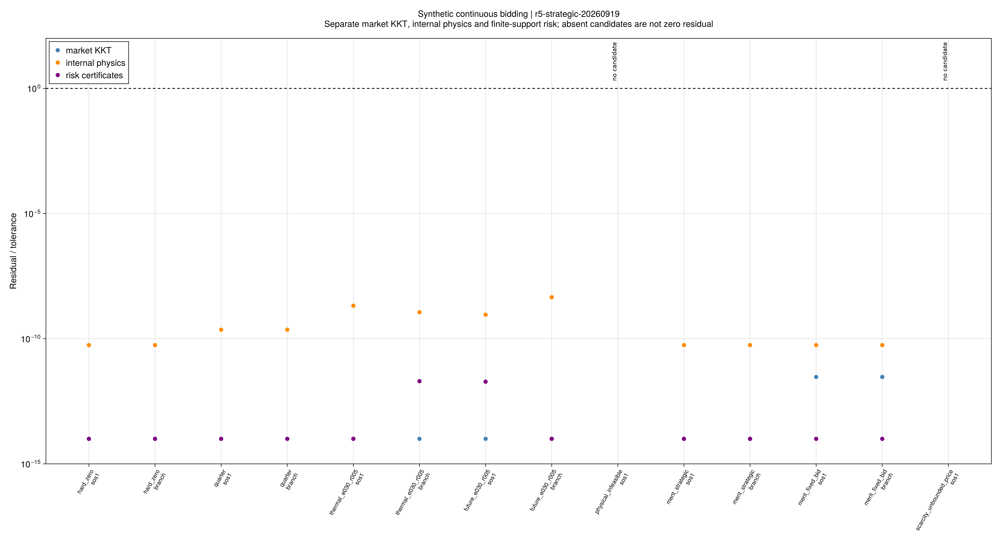
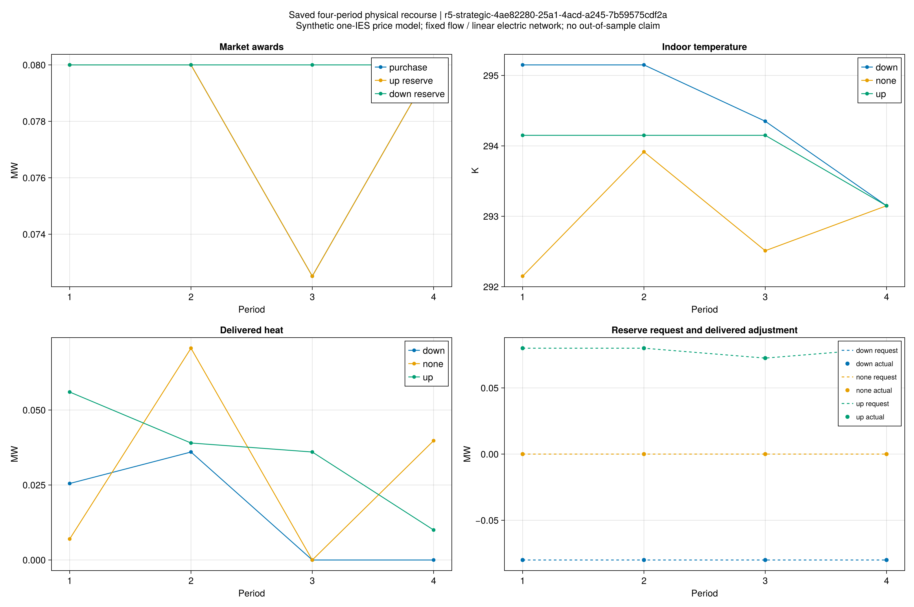
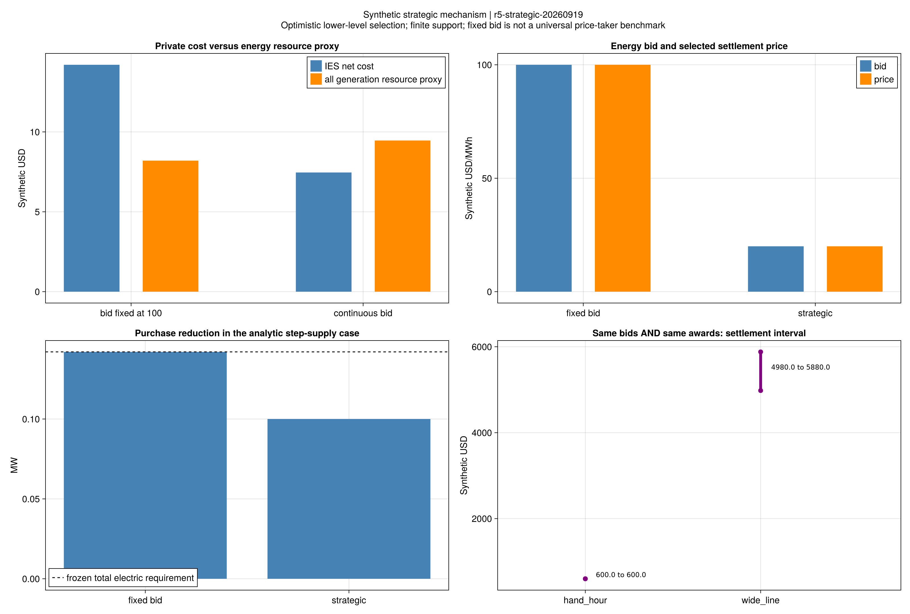

# 连续策略报价：收益、成交选择与价格边界

本批已把“连续报价 → 市场出清 → 共同成交 → 多情景风险补救”接起来。
结果支持小系统采用模型的数学正确性，也揭示了实施条件：
**报价相同且市场目标同样最优，不保证成交量或结算价格相同。**

本页所有输入均为合成数据。模型为单IES、固定报价容量、有限支持风险与
`optimistic_primal_dual`选择；定义见[模型教程](ch05-strategic-model.md)。
“乐观选择”指上层可在下层多个最优结果中选择对自己有利的成交和价格。
这项项目假设不能自动作为现实市场的执行规则。

## 1. 冻结范围与验收

规则和8套输入在首次正式优化前冻结于`configs/r5/strategic/study.toml`，
科学节点为`e86b6d9`，正式批次为`r5-strategic-20260919`。
14次策略运行包括8次完整SOS1模型和6次显式固定互补分支；另有2次固定成交价格范围核查。
每个方法共用600秒，原A1、A2和KKT门槛保持不变。

| 验收项 | 实际结果 | 判定范围 |
|---|---:|---|
| 完整SOS1模型取得有限最优解 | 6/8 | 既定乐观MPEC；另2例分别不可行、无界 |
| 固定互补分支取得最优解 | 6/6 | 分支内部；其界不能当整个MPEC的下界 |
| 有效候选的市场、风险与费用认证 | 12/12 | 同时检查成交桥接及采用的补救物理关系 |
| 完整模型/固定分支费用对照 | 6/6通过A2 | 最大相对差约1.49×10⁻¹⁴ |
| 独立数值残差 | 5912项全部通过 | 最大归一化值约1.33×10⁻⁸，阈值为1 |
| 专项/完整回归 | 81/3063项通过 | 软件和数学检查，不等于论文规模复现 |

独立市场LP在选定报价下重新出清，原始MOI乘子、最优值和KKT分别保存。
上层模型中的乘子是优化变量，未伪装成上层求解器返回的原始对偶。
公开见证可以脱离本地运行目录重验；四时段运行也已用冻结源码重读通过。

无候选的两例没有残差“通过”值。图中保留其状态，不能把缺少数值当作零残差。

## 2. 六套有限最优例说明什么

下表列完整SOS1运行，费用单位为合成USD。费用=市场净支付+最坏补救费用。
负的净支付表示市场收入超过购电支出；负的总费用不表示负资源消耗。

| 输入 | 市场净支付 | 最坏补救费 | IES总费用 |
|---|---:|---:|---:|
| 竞争供给，1小时手算 | −6.20000 | 8.28500 | 2.08500 |
| 同类工况，0.25小时 | −1.55000 | 2.07125 | 0.52125 |
| 热风险，ε=0.30、ρ=0.05 | −7.47800 | 8.84448 | 1.36648 |
| 四时段风险调度 | −32.00000 | 18.44911 | −13.55089 |
| 阶梯供给，连续策略报价 | 2.00000 | 5.46000 | 7.46000 |
| 阶梯供给，购电报价固定100 | 14.20000 | 0 | 14.20000 |

竞争供给例的外部机组容量充足，能量和两种备用都有严格正的边际供给，
从驻点与互补关系可确定三种边际价格均为100。
新接口因此能够退化到已有固定价格手算结果，时间步从1小时变为0.25小时后费用相应缩放。
这项结果验证连接和单位，不证明连续报价一定可以改变价格。

四时段输入的市场价格边界已改变，不能将−13.55089与旧固定价格分解例的35.669615
直接相减并称为策略收益。两者不是只改变报价策略的配对实验。

风险证书仍只覆盖声明的有限支持与运输歧义集；尚未做样本外统计或在线信息约束验证。

## 3. 私人收益可以与资源效率相反

阶梯供给例有0.2 MW的外部低价容量，普通负荷占用0.1 MW。
IES需电0.142 MW，外部供给报价20/100，IES自发电成本130。

- 固定购电报价100：选择购电0.142 MW，IES费用14.2。
- 连续报价选择20：乐观成交0.1 MW、自发电0.042 MW，IES费用7.46。
- IES费用减少6.74，但以教学发电报价作为资源成本代理时，合计成本从8.2上升到9.46。

原因是IES通过改变边际价格减少支付，同时启用了更贵的自发电。
这是合成市场中的私人激励机制，不能表述为系统节能或社会福利改善。
固定报价对照也保留相同乐观选择假设，不能直接等同于一般的价格接受者策略。

## 4. 相同报价的成交和价格仍需执行规则

### 成交量：独立出清并未重现上层所选调度

对12个有效运行、18个时段记录，只读对比已保存的独立市场结果：
**全部18行都存在超过A1的IES成交量差异，而下层目标值一致。**
竞争供给例中，策略模型选择正购电及备用，独立LP则选择IES三类成交为零。
阶梯策略例选择购电0.1 MW，独立LP选择零；固定报价例选择0.142 MW，独立LP选择1 MW。

两种结果均可属于同一市场LP的最优解集合。市场LP没有内部IES设备约束，
内部交付检查只与策略模型选中的成交桥接，不能据此认证独立LP的另一套成交也能交付。
本批没有对这些替代成交重新调度，故其内部可实施性仍未决。

这不是原有乐观模型的KKT失败；它说明该模型的最优解需要相应的市场选择规则才能执行。
不能把“独立下层目标相等”写成“市场会执行同一策略计划”。
详见[逐时成交选择审计](assets/r5-strategic/selection-audit.csv)。

### 价格：固定全部成交后，结算也未必唯一

另两例固定报价及全部发电/IES成交，只优化对偶最优面内的支付：

| 输入 | 最小净支付（USD） | 最大净支付（USD） | 范围 |
|---|---:|---:|---:|
| hand_hour | 600 | 600 | 此输入下支付唯一 |
| wide_line | 4980 | 5880 | 相同成交的支付可相差900 |

这一检查将价格多解与成交多解分开。它比旧市场记录的不同求解器支付差提供了更明确的证据，
但仍未求解完整悲观双层问题，也未把任何旧记录改判为错误。
范围两端及独立KKT见[价格面结果](assets/r5-strategic/settlement-range.csv)。

## 5. 两个负结果为什么要保留

`competitive_physical_infeasible`在声明的内部容量下不可行，未生成合格调度。
不能通过缩小市场成交或改变设备容量，把它改成成功例。

`scarcity_unbounded_price`返回`DUAL_INFEASIBLE`，对应本最小化模型的原问题无界；
[稀缺价格射线推导](ch05-strategic-model.md)给出了独立代数解释。
当唯一IES恰好提供全部0.08 MW上备用时，可以同步增加备用价格及容量乘子，
保持成交、驻点和下层最优值不变，却持续增加IES收入。

因此，有限报价上界不等于有限结算价格上界。
不能用隐式限价消除这个负结果，更不能据此断言作者程序也具有同样问题。
缺失的市场规则需要明确建模并作为新版本验证。

## 6. 与原文的关系及下一步

原第5章(5-32)给出连续报价，(5-33)连接成交与内部承诺，
(5-34)至(5-57)描述市场及其KKT。这条结构现已在合成小系统上连接，
不是只用外生价格运行内部设备。采用模型的支付修正、风险解释及多最优选择均单独登记。

仍不能声称已恢复作者同输入收益、完整策略分解算法或样本外可靠性。
当前Benders三路线证据属于固定价格风险调度，尚未连接新的策略市场主问题。

后续按以下顺序推进：

1. 先界定可执行市场规则。冻结一种公开说明的同价成交/价格选择规则，
   与现有乐观基准配对；替代成交的内部交付单独验证。价格稀缺制度须有来源或明确教学假设。
2. 将已验证的市场结构接入分解主问题，使用本批直接模型作独立比较；
   不把参考解注入初值或割，不继承固定价格模型的结论。
3. 冻结独立训练、验证和测试数据，进入R6样本外可靠性检验，
   分别报告备用交付、舒适事件、费用与置信区间。
4. 第6章韧性规划、第7章迁移和论文规模差距继续按[全文清单](reproduction-coverage.md)推进。

本批已回答“模型在声明的选择规则下是否正确、私人收益来自哪里”，
留下的主要问题是市场执行与统计可靠性，而非继续追求一个更低的小例费用。

## 7. 复核入口

- [费用与状态](assets/r5-strategic/comparison.csv)、[方法配对](assets/r5-strategic/method-comparison.csv)。
- [报价与成交](assets/r5-strategic/bids-awards.csv)、[逐情景风险](assets/r5-strategic/risk-scenarios.csv)、
  [物理轨迹](assets/r5-strategic/trajectories.csv)、[全部残差](assets/r5-strategic/residuals.csv)。
- [报告来源](assets/r5-strategic/report.toml)、[选择审计说明](assets/r5-strategic/selection-audit.toml)、
  [图源配置](assets/r5-strategic/figure-config.toml)、[封存哈希](assets/r5-strategic/artifact-hashes.toml)。

~~~powershell
julia +1.12.6 --startup-file=no --project=. scripts/check_r5_strategic.jl
julia +1.12.6 --startup-file=no --project=. scripts/check_historical_evidence.jl r5-strategic
~~~

检查器从公开见证重新计算数值与表格，不重新优化。
重新求解或重绘须指定新目录，保留本批输入、原值、源码快照及封存结果。
