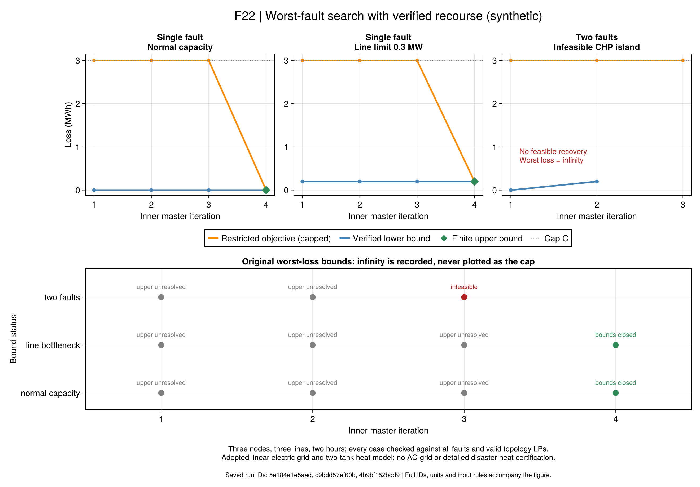

# R7：怎样寻找真正最难恢复的故障

此前的[有限故障规划](ch06-planning.md)逐个求解全部故障，提供透明的小系统参考。
本页实现`r7_inner_indicator_v1`：只让故障对手选择需要检查的线路组合，
再由完整恢复问题寻找相应设备出力和网络拓扑。内层发现新恢复拓扑后，重新寻找故障。

**范围是固定灾前状态、线性电网与双水箱恢复的合成方法验证。**
它保留论文嵌套C&CG结构，同时显式修正对偶与界方向，并处理恢复不可行。
原文与项目方程分别编号，见[方程与符号](ch06-adversary-equations.md)。

算法与穷举一致不保证双水箱模型足够精确。[后续热状态回代](ch06-thermal.md)
已发现旧安全规划见证的端口温度冲突；原方法验证保留，物理适用范围另行判断。

## 先理解两个相反的优化方向

给定一个故障，运营者希望少失供；故障对手则希望找出运营者尽力恢复后仍然最差的故障。
因此固定故障的恢复可行值只是该故障的损失上界。不能发现一个很差的恢复方案，
就声称该故障必然造成那么大损失：可能还有更好的恢复方案。

采用版始终保存两类证据：

- **下界：**完整恢复MILP的有效最小化下界。一个故障的该下界超过门槛，已足以否定安全。
- **上界：**限制运营者只能使用已发现恢复拓扑，故障对手最大化得到的有效上界。
  因为允许的恢复方式更少，最坏损失只能更高；满足后述截断条件时可以认证安全。

PDF119的步骤2.a/2.b把这两个方向分别记作UB/LB。本项目按max-min实际含义重新推导，
不沿用相反的标签，也不把两个求解器的可行目标直接当作已证明的上下界。

## 为什么必须允许恢复不可行

旧案例的CHP孤岛冲突说明，并不是所有故障都存在恢复策略。
原式（6-108）在故障对手中要求一个可行恢复见证；对本采用模型直接照搬，
会排除完全无法恢复的故障，恰好漏掉最严重的反例。

另一方面，某个拓扑不可行未必是故障不可恢复。例如1→2断线时，原拓扑不适用，
闭合1→3联络线后可能仍能恢复。必须让完整恢复MILP自由选择拓扑后再判断。

对固定拓扑，从实际JuMP约束抽取全部行，包括变量界和固定值，将恢复变量视为自由变量。
相应对偶为非正乘子和平稳性等式。失供目标只有非负系数、失供变量有零下界，
因此可以直接构造一个对所有故障都成立的可行对偶。固定拓扑不可行时，该对偶可以无界。

这里采用公开嵌套方法文献的适用条件审查，而非把KKT完整补救假设当成已满足条件。
其Remark 2区分KKT路线与强对偶路线；本项目进一步针对现有实际行系统给出上述证书。
[Zhao与Zeng预印本](https://optimization-online.org/wp-content/uploads/2012/01/3310.pdf)

## 截断只服务于搜索，不改变物理损失

输入决定了任一可行恢复的损失上界B：最大可削减电热负荷乘以时间步，再按场景加权。
预先固定C=B+1 MWh，用它截断对手目标，避免无界模式使搜索中断。

- 对手有效上界低于C：没有任何故障能使受限模式损失达到截断，故可转为原问题有限上界。
- 对手达到C：可能缺少恢复模式，也可能真的无法恢复；原问题上界仍记为∞。
- 对候选故障求完整恢复：找到可行拓扑就加入池；认证不可行就保留无限损失反例。

这不是把灾害损失改为C，也不是给对偶乘子选大M。故障与乘子的乘积用两条原生指示等式，
项目关闭自动桥接，不为乘子猜有限界。求解器内部仍有数值处理和容差，不能据此免除残差检查。
接口语义见[JuMP指示约束](https://jump.dev/JuMP.jl/stable/manual/constraints/#Indicator-constraints)与
[Gurobi约束说明](https://docs.gurobi.com/projects/optimizer/en/current/concepts/modeling/constraints.html)。

## 先冻结的三节点例

两小时、三个电节点，通常闭合1→2→3，1→3为联络线；CHP在1，电池在2。
2、3各有0.3MW电负荷，热负荷0.4MW。电池有0.4MWh初能，CHP继承开启且最小出力0.2MW。
只允许一次主动开关动作；故障自动断开不计该动作。管道、热端口和全部场景状态显式配置。

`inner-freeze.toml`在首次求解前记录三个变体与手算期望；没有按结果修改容量：

| 变体 | 先验推导 | 实际内层结果 | 穷举参考 |
|---|---|---|---|
| 单故障，正常容量 | 联络线保持连通；CHP0.4MW加电池0.2MW可供负荷 | 最坏失供0，4轮 | 故障MILP与拓扑LP均为0 |
| 单故障，各线容量0.3MW | 最坏故障每小时至少缺0.1MW | 最坏失供0.2MWh，4轮 | 0.2MWh |
| 最多两故障 | 同时断开1→2与1→3形成CHP孤岛硬冲突 | 完整恢复认证不可行，3轮 | 同样认证不可行 |

瓶颈例还需要验证水箱库存足以承担供热缺口；单靠电力容量算术不是完整可行性证明。
上述结果已经经过实际电热恢复原值回代。1→2断线时2→3需要反向送电，
因此该例明确采用有符号支路功率；不能沿用只能正向的旧域再宣称同模型对照。

这三例验证故障搜索和边界方向，没有证明论文规模速度优势、交流潮流或详细热网可实现性。



橙线是截断后的受限对手目标；蓝线是完整恢复给出的下界。橙线等于C时，原问题上界仍是∞，
不能把橙线当成已证明的有限最坏损失。下方逐轮状态明确保留未决、界闭合和不可行。

## Julia与保存结果

```text
julia +1.12.6 --startup-file=no --project=. scripts/test_r7_adversary.jl
julia +1.12.6 --startup-file=no --project=tools/solvers scripts/r7_adversary.jl run configs/r7/inner-tie-two-hour.toml results/runs/r7-inner-new 600
julia +1.12.6 --startup-file=no --project=. scripts/r7_adversary.jl check results/runs/r7-inner-new
```

`build_r7_adversary`只建模。`solve_r7_adversary`不使用故障穷举后备；无原生指示支持就明确失败。
开放测试用HiGHS核对固定故障LP对偶、不可行状态与预算；本机Gurobi检查原生指示和完整搜索。

显式选择`solve_r7_planning(...; method=:nested_indicator_ccg)`可接回灾前主问题。
每事件发现认证违反门槛的故障即可返回外层，不强求先完全认证该事件的最坏值；
安全判定仍须所有事件在本轮同一正常计划下有合格上界。旧方法默认值与旧运行不改写。
单次规划所有建模、内外循环和回代共享600秒预算；有限预算下可能留下未决结果。

嵌套规划已经在原储备输入得到193.275USD，与手算和此前全量/穷举内层参考一致；
旧CHP孤岛输入仍认证不可行。记录分别位于`r7-nested-reserve-20260920-v1`和
`r7-nested-legacy-20260920-v1`，未改写此前原值或以参考解作初始化。

三节点原值、完整故障/拓扑参考和迭代表位于`results/summaries/r7-inner-three-node-20260920-v1`。
归档首轮暴露了显示命名问题：未在主模块导入JuMP时，112个行标签从`VariableRef`变成
`JuMP.VariableRef`，系数、边界、目标没有变化。新抽取器使用固定标签；旧记录通过外部包装脚本
恢复原显示环境重验，原源码和数值未修改，未重新优化。使用本页CLI重读旧记录，
不要把该包装修正称为一次新的科学实验。

## 原生API

~~~@index
Pages = ["ch06-adversary.md"]
~~~

~~~@docs
PaperRebuild.R7RecourseLP
PaperRebuild.r7_recovery_lp
PaperRebuild.r7_recovery_loss_cap
PaperRebuild.build_r7_recourse_dual
PaperRebuild.build_r7_adversary
PaperRebuild.validate_r7_dual
PaperRebuild.solve_r7_adversary
PaperRebuild.validate_r7_adversary
PaperRebuild.save_r7_adversary
PaperRebuild.read_r7_adversary
~~~
