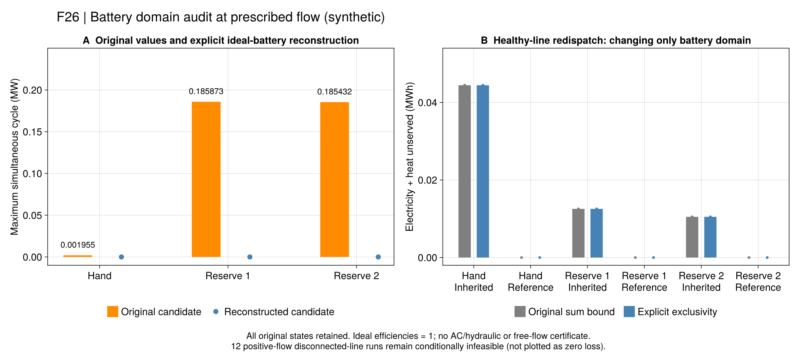

# R7：电池同时充放应该怎样评价？

[逐管联合恢复](ch06-transport.md)发现三个候选同时充放。需要先判断它是否改变了实际净注入和能量，
再决定是否影响保供结论。本节点保留原候选，增加明确的互斥域和独立重构证据。
权威方程、来源与符号见[电池台账](ch06-battery-equations.md)。

## 原文约束与项目选择

论文PDF108页（印刷91）的6-12只约束充放功率之和；6-14分别计算效率损耗，6-15要求正常运行首末能量相等。
PDF113页的灾时说明允许取消末端等式，但要继承灾前电量。新运行域不改变这些不同边界。

| 输入规则 | 含义 | 模型类型的影响 |
| --- | --- | --- |
| `paper_sum_bound` | 原和式容量与原状态递推，保留旧默认 | 固定其余离散量可成为LP |
| `per_period_exclusive_v1` | 在原边界上增加逐设备/时段/场景互斥 | 未固定电池模式时仍为MILP |

互斥是项目新增操作约定，不能改称作者已有约束或笔误修正。新输入有单独哈希，旧输入、原值和历史验收不改写。
`fixed_battery_modes`按设备ID给出“时段×场景”的0/1矩阵；1允许充电、0允许放电，都允许闲置。
模式与原设备功率一样可依场景变化，不把它们强行变成跨场景共同决策。

## 为什么不能总是删去同时充放？

设某时段同时充电和放电，将两者共同部分等量去掉，网络看见的净注入不变。
但状态方程说明：效率不为1时，去掉能量耗散会使电池内的电量增加。

手算例单独声明：一小时，充放效率均0.8，初末电量及上限均1MWh，最大功率1MW，必须吸收0.2MW净功率。
和式模型允许充电5/9MW、放电16/45MW，能量恰好不变。移除循环后仅充电0.2MW，
电量会增加0.16MWh，超过上限。互斥模型因此不可行；这一边界不能用“修剪”掩盖。
该解析输入是方法检查，不是论文原数据。

反过来，本批三个旧Clarabel候选的电池双效率**恰好均为1**。
在这些特定输入下，等量移除循环可保持净注入、完整电量轨迹、温度、流量和失供不变。
新API只在该严格条件下作代数重构，再检查整个采用模型；不重新求解，不复制原求解器界。
因此不能仅凭旧候选同时充放，就断言旧零失供收益是虚假的。

## 如何进入正常调度和规划？

运行域由正常输入传到灾时输入；电池初态仍从同一正常轨迹事件起点取得。
全量故障主问题与有限故障C&CG保留电池二元决策，逐故障检查完整MILP。
旧的内层对偶算法只固定电拓扑，尚未将电池模式加入模式池，因此明确拒绝互斥域；
不能删除二元变量、求连续松弛后声称已验证新域的嵌套算法。

当前正常管流仍给定，有限故障规划的灾时热块仍是其明确声明的代理模型。
本节点没有将旧193.275USD安全规划升级为详细热可交付证明。
下一步须连接同一灾前轨迹的**完整管温空间状态**与详细恢复，而非仅传递总库存。

## 冻结实验

协议`configs/r7/battery-study.toml`先冻结再求解：24项原主案例仅改变电池域，
三个参考案例枚举全部2/4/4种电池模式，共34次优化；另做3项原值代数重构。
每个整数方法共享600秒，每个完整电池模式枚举也共享600秒。
原初态、流量、容量、效率、故障、温区及A1/A2均不变。

正式原值保存于`r7-battery-20260920-v1`，公开包为`results/summaries/r7-battery-public-20260920-v1`。
输入归档包含全部父记录，单文件超过5MiB，所以公开包按完整行分片；拼接字节/哈希须与原件一致。
`pack_r7_battery.jl check`恢复原载体并调用各运行的冻结源码验证，不重新优化。

| 证据 | 实际结果 | 可以说明什么 |
| --- | --- | --- |
| 24项HiGHS/Gurobi主对照 | 12候选模型与互斥通过，失供与对应旧结果逐项相同；12项仍条件不可行 | 本批已见的失供改善不依赖放开电池互斥；没有解除断线边界 |
| 全部2/4/4种模式，10个Clarabel连续子问题 | 10候选通过采用模型与互斥 | 有跨求解路线的数值对照；缺有效目标界时仍不认证其最优间隙 |
| 3个原Clarabel候选代数重构 | 三项都保持净注入、全部电量与热状态、失供，并通过新域 | 对本批理想电池，同充放是可消除的控制退化，不能据此否定保供量 |

12个可行主候选的新旧失供差均为0；六个同输入求解器配对继续在A2内一致。
手算、储备事件1/2的原流量仍分别失供0.0444444444、0.01255、0.01050MWh；参考流量仍在A1内为零。
这里的“相同”指失供和已检查边界，不要求所有温度或设备变量唯一。
原同时充放最大约0.001955、0.185873、0.185432MW的三条候选另立重构记录，原失败和后续验证补证保留。

**已排除的解释：**在本批合成输入和给定流量下，零失供不是依靠同时充放产生的虚假供能。
**仍未解决：**非理想效率下的系统级资源价值、流量选择、详细热状态与正常安全规划连接，以及资源单独收益。
电池约束明确之后，应继续推进这些主线，避免在同一组理想电池上反复更换求解参数。

## 操作与API

~~~text
julia +1.12.6 --startup-file=no --project=. scripts/test_r7_battery.jl
julia +1.12.6 --startup-file=no --project=. scripts/check_r7_battery.jl
julia +1.12.6 --startup-file=no --project=. scripts/r7_battery_study.jl freeze results/runs/<new>
julia +1.12.6 --startup-file=no --project=. scripts/r7_battery_study.jl run results/runs/<frozen> open
julia +1.12.6 --startup-file=no --project=tools/solvers scripts/r7_battery_study.jl run results/runs/<frozen> gurobi
julia +1.12.6 --startup-file=no --project=. scripts/r7_battery_study.jl report results/runs/<complete> results/summaries/<new>
julia +1.12.6 --startup-file=no --project=. scripts/r7_battery_study.jl check results/summaries/<saved>
julia +1.12.6 --startup-file=no --project=. scripts/pack_r7_battery.jl check results/summaries/r7-battery-public-20260920-v1
julia +1.12.6 --startup-file=no --project=docs scripts/plot_r7_battery.jl results/summaries/r7-battery-public-20260920-v1 results/runs/<new-figures>
~~~

~~~@index
Pages = ["ch06-battery.md"]
~~~

~~~@docs
PaperRebuild.with_r7_battery_rule
PaperRebuild.r7_battery_cycle_effect
PaperRebuild.r7_reconstruct_battery_cycles
~~~
