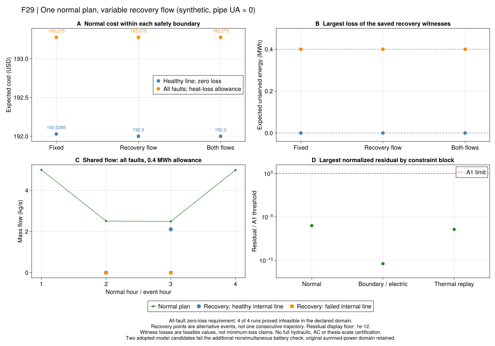

# R7：让灾前和灾后共同选择流量

[连续正常流量](ch06-normal-flow.md)的分时价例给出约14.9%的费用改善候选，
但它只回答正常期能否省钱。一次正常调度必须在每个允许故障下留下可用的设备、电量和管内热状态，
才有资格称为安全规划的候选。本节点接回这条依赖，版本为`r7_shared_continuous_flow_v1`。

## 为什么不能重新指定灾后初温？

设一根管道前半段热、后半段冷，另一根排列相反。两者总储热可以相同，负荷首先收到的水温却不同。
因此“库存相等”不能代替“来自同一正常历史”。现在每个故障分支使用同一组正常流量和入口温度，
通过累计质量确定事件开始时完整空间状态；随后恢复流量可以在声明的连续区间内优化。

原文PDF114的式(6-70/71)要求初态继承，式(6-72)限制恢复流量偏离正常计划。
项目完整空间状态是对其物理意图的显式参考解释，见[原式与采用推导](ch06-flow-planning-equations.md)。
原文随后用聚合储热简化恢复问题；本详细参考并不因此成为MILP，也不直接继承原对偶算法。

## 两层决策，共用一个正常计划

1. 正常计划选择设备启停、电池状态、入口温度与连续管流，目标是概率加权正常费用。
2. 对每个允许的事件和线路故障，加入一份恢复调度，使电热失供不超过该事件门槛。
3. 所有恢复分支共同继承正常启停、前时段出力、电池初能量、完整管温状态和对应时段流量。
4. 这些是可能发生的分支，不把不同故障当成连续发生而重复扣减同一份储备。

恢复块提供门槛内的存在性见证，未单独最小化失供；不能给它套用“失供最优解”的说法。
全量故障参考的费用界仅属于声明控制域。将所有流量上下界设为同一个值时，模型退化为LP/MILP；
一般自由流量模型保留热功率、混合和质量交集乘温度的非凸关系，按实际约束报告MIQCP。

## 停流如何处理？

正常期沿用严格正流；恢复期允许零流，但暂不允许反向。零流时没有“流出的平均水温”，
模型中的出口温度只是有界占位量，验证器不把它当一次温度观测。
管内库存和空间分布仍保留，重新通水必须继续排出原来的水团；没有水流的端口也不能输送热量。
已有接口的停流约定保持原默认，新规则只由本版本显式选择。

## 验证与边界

独立验证先重算正常调度，再从原始空间温度和保存的正常流量、入口温度裁切水团。
它不读取优化中的交集辅助量，不裁剪负流量或替换已保存温度。恢复设备、电网、流量偏差、
端口热功率、节点混合、库存、温区与失供全部通过后，才接受共同计划。

本版本仅覆盖零散热、正向/非负管流、固定正常电拓扑和子步平均节点；恢复仍采用线性电网，
尚不认证交流潮流、恢复水力或连续节点动态。正常终端仍是各管库存循环，不是空间温度逐点循环。
无损整网能量恒等式显式加入以加强求解表示，它没有增加真实供热能力。

## 实验说明了什么？

`configs/r7/flow-planning-study.toml`在正式优化前冻结12项：三种安全边界各比较固定流量、
仅恢复连续流量及正常/恢复共同连续流量；固定域同时使用HiGHS和Gurobi。
这是开发检查后确定的合成方法对照，不是未见过的统计测试集。公开原值与源码为
`results/summaries/r7-flow-planning-20260920-v2`。

| 同一安全边界 | 固定流量费用/USD | 仅恢复连续流量/USD | 共同连续流量/USD | 解释 |
|---|---:|---:|---:|---|
| 内部线路健康，零失供 | 192.0285 | 192.0000 | 192.0000 | PCC仍中断；没有认证内部断线 |
| 全部允许故障，门槛0.4 MWh | 193.2750 | 193.2750 | 193.2750 | 当前热负荷正好0.4 MWh，门槛允许全热失供 |
| 全部允许故障，零失供 | 不可行 | 不可行 | 不可行 | 连续流量没有解除本输入的岛内源端口限制 |

8项采用模型候选通过独立验证且费用界闭合，4项不可行；两个可行固定域跨求解器对照通过A2，
不可行固定域的两求解器状态一致。105项原值/域/对照检查通过，10212条残差从冻结源码重算。
这些是本声明控制域的证据，不继承作者全系统最优性或规模性能结论。

**第一，恢复流量确实可以改变所需灾前储备，但本例收益很小。**健康线对照节约0.0285 USD，
约占192.0285的0.0148%。两调度的正常外部购电支付均为160 USD，启动费均为0，
资源运行费用从32.0285降到32 USD。并非发现了普遍的大幅收益。放开正常流量在这个输入上没有再降低费用。

这个小差额也能从保存值解释：固定流量候选的场景2在事件开始时，源回温为323.10238 K，
源供温上限353.15 K、流量5 kg/s，最大CHP热功率为0.631 MW。热电比为1，
0.8 MW电负荷因而需要0.169 MWh电池支撑；原初能量0.15 MWh，正常期须多预存0.019 MWh。
该场景概率0.75、充放吞吐费用1 USD/MWh，循环回到原电量的费用为
`2 × 0.019 × 0.75 = 0.0285 USD`。恢复流量可变的候选无需这次额外预存。
这是对这两个冻结候选的手算核对，未把所选温度轨迹称为唯一最优解。
对应7项手算检查也从冻结原值通过；没有重新优化来挑选更有利的轨迹。

**第二，更多流量自由度不能替代所有缺失的资源。**内部断线后，当前孤岛没有消纳CHP有功的端口；
在所采用源/回温区与源端口关系下，热源正流又要求正产热。因此零失供冲突仍存在，
这与[先前的端口下界](ch06-ports.md)一致。该解释有明确的拓扑、设备和温区前提，
不推广为真实系统中所有旁通、循环或储热方案都无效。

**第三，模型通过与附加物理要求必须分开。**本批保留原输入的电池功率和式域。
8项采用模型候选只有6项也通过充放互斥检查；全故障0.4 MWh组的两个连续流量恢复见证有同充放。
原值及失败标志保留，没有自动移除循环或改写成严格互斥域结果。它们也不是最小失供调度：
不同求解器可以给出不同的门槛内恢复见证，不能把这些失供差异当成恢复算法优劣。

F29读取保存表格，图源/运行ID/单位/脚本在`results/summaries/r7-flow-planning-figures-20260920-v3`。
费用图竖线为有效界而非统计区间；恢复点是互斥的可能事件，不能连读为同一实际时间序列。

## 工程验收与下一步

开放专项初次发现空间状态哈希的序列化错误，修复后32项检查通过；失败日志保留。
8项Gurobi开发检查和完整R1–R7回归也已通过。开发冒烟包与正式12项分别保存。
首批编排曾因商用环境无CSV及动态加载的world-age错误未开始优化；修复只涉及编排，
重新冻结v2后执行正式运行。输入/科学模型不因结果改变，旧失败日志保留。

下一步先处理尚缺的有损/方向控制域和明确的电池互斥域，再做R8资源去除、R9迁移及规模/全文教程。
资源对照应围绕“储电、热状态与流量各自解除什么冲突”，不继续调整参数追求预期收益排序。
零失供负结果保留；新的端口或旁通解释须独立推导和命名，不能为使本例成功而取消温区。

~~~text
julia +1.12.6 --startup-file=no --project=. scripts/check_r7_flow_planning.jl
julia +1.12.6 --startup-file=no --project=. scripts/test_r7_flow_planning.jl
julia +1.12.6 --startup-file=no --project=tools/solvers scripts/test_r7_flow_planning_gurobi.jl results/runs/<new-development-directory>
julia +1.12.6 --startup-file=no --project=. scripts/r7_flow_planning_study.jl freeze results/runs/<new-batch>
julia +1.12.6 --startup-file=no --project=. scripts/r7_flow_planning_study.jl run results/runs/<frozen-batch> HiGHS
julia +1.12.6 --startup-file=no --project=tools/solvers scripts/r7_flow_planning_study.jl run results/runs/<frozen-batch> Gurobi
julia +1.12.6 --startup-file=no --project=. scripts/r7_flow_planning_study.jl report results/runs/<complete-batch> results/summaries/<new-report>
julia +1.12.6 --startup-file=no --project=. scripts/check_r7_flow_planning_results.jl results/summaries/r7-flow-planning-20260920-v2
julia +1.12.6 --startup-file=no --project=docs scripts/plot_r7_flow_planning.jl results/summaries/r7-flow-planning-20260920-v2 results/runs/<new-figure-directory>
~~~

~~~@index
Pages = ["ch06-flow-planning.md"]
~~~

~~~@docs
PaperRebuild.r7_flow_planning_spec
PaperRebuild.build_r7_flow_planning
PaperRebuild.solve_r7_flow_planning
PaperRebuild.validate_r7_flow_planning
PaperRebuild.save_r7_flow_planning
PaperRebuild.read_r7_flow_planning
~~~
