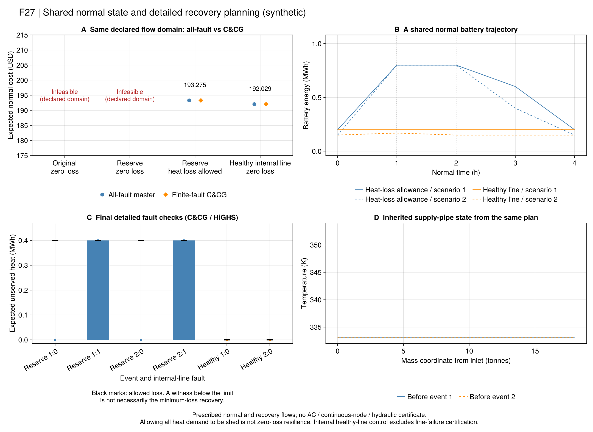

# R7：同一灾前计划怎样保证实际热交付？

前批[逐管恢复](ch06-transport.md)表明，给定总热库存还不足以保证当前能送出多少热量。
本节点把正常入口温度历史直接放进详细恢复模型，使它们由**同一份灾前计划**决定。
采用版为`r7_state_linked_v1`；原式、项目解释及符号见[方程台账](ch06-linked-equations.md)。

## 一个直观的区别

同样装有热水和较冷水的管道，总热量可以相同。热水靠近出口时可立即交付；
如果热水还在上游，它要先经过输运才能到达。模型必须同时保留库存与位置。
本项目以质量坐标记录水段，按实际流量移动；不把非整数输运时间取整。

旧[代理安全规划](ch06-planning.md)传递供、回水总库存，仍有其明确的采用模型范围。
新模型保留旧结果，另行将双水箱和Taylor热块替换成逐管输运、源荷端口及子步混合。
这属于项目详细参考模型的比较，不是把原近似式改名为精确物理定律。

## 怎样连接灾前和灾后？

1. 从已经声明的初始空间温度出发，回放事件以前的正常入口历史。
2. 将事件后的入口温度接在同一条历史之后，继续输运和散热。
3. 给定流量时，整个过程对入口温度是仿射关系，因此能够放进同一规划模型。
4. 每个事件、故障拥有独立的恢复控制，但其正常历史、CHP启停和电池初态连接同一组正常变量。

两个事件是不同的可能分支。例如第2小时或第3小时发生故障，不是连续发生两次故障。
不能将两次恢复耗能都从同一条正常轨迹扣除，也不能给两次事件分别选择更有利的灾前库存。

原6-70/71继承事件前管温与节点温度。本采用版保留管道的完整空间记忆；
节点仍假设零热容并在子步平均意义混合。事件后的平均混合温度可随控制改变，
没有把前时段平均温度强加为后时段温度，也没有验证连续节点动态。

## 求解与独立验证

`extensive`一次放入全部声明故障；`finite_fault_ccg`先求正常计划，再逐故障重新求解详细恢复，
将认证的超门槛或不可行反例加入主问题。当前内层仍是完整有限故障检查，
没有把旧双水箱LP对偶套到新的热模型上。

主问题的恢复块是“存在一套门槛内方案”的见证；运行成本才是主目标。
见证没有失供最优性下界。每次正常计划改变，全部事件原值和证书重新计算。

独立验证从保存的正常原值生成事件状态，再重新回放所有水团、端口和库存，
不读取优化模型的输运矩阵。历史列另与保存的正常温度逐项相比较，防止连接到旧轮或其他场景。
同一给定流量域的费用和有效界按既有A2核查；A1温度、功率与流量门槛保持不变。

## 冻结实验与实际结论

协议`configs/r7/linked-study.toml`在优化前冻结24项运行。四组输入保留原初态、设备、负荷、
价格和电池规则：内部电线健康时使用原正常管流，内部电线断开时使用零管流与零端口流。
这是显式给定的恢复策略，不是已优化的最优流量。每次完整方法共享600秒预算。

| 输入组 | 主运行数 | 全量与有限故障C&CG结果 | 可作的解释 |
| --- | ---: | --- | --- |
| 原手算输入，零失供 | 4 | 两求解器均不可行 | 在声明正常/恢复流量和原故障范围内不能保零失供 |
| 储备输入，零失供 | 4 | 两求解器均不可行 | 仅有预储电和管内热量不足以解除该故障边界 |
| 储备输入，每事件失供上限0.4MWh | 4 | 193.275合成USD，采用模型与条件费用界通过 | 允许全部热负荷失供；不能称零失供安全规划 |
| 储备输入，仅内部线健康，零失供 | 4 | 192.0285合成USD，采用模型与条件费用界通过 | PCC仍断开；只能认证内部线健康的声明故障集 |

后两组追加1、16子步及两种方法，共8项，费用与4子步一致。全部24项中16项候选通过、8项条件不可行。
8个可行同输入方法配对与4个可行求解器配对均通过A2；另8个配对两边均不可行，不虚构费用差。
本例子步结果一致不证明一般混合网络连续极限、完整水力或交流潮流正确。

### 为什么每次改变计划都要重查全部事件？

`healthy_diagnostic_finite_fault_ccg_highs_n4`保存了三轮真实主问题。
第一轮正常费用最优计划在事件1有0.01425MWh电失供，而事件2通过；加入事件1后，
第二轮事件1通过、事件2出现0.015MWh电失供。加入两项恢复约束后，第三轮才同时通过。
这说明一份计划满足一个事件，不意味着修改后仍满足之前未加入的其他事件。
所有场景共用同一正常计划、逐轮重新生成管温与电量状态，是这里的实质约束。
Gurobi在相同输入上使用两轮得到相同费用；不同的退化主解与轮数不作速度优势结论。

### 如何评价储热的作用？

本批已将“有多少库存”推进到“继承这个空间状态后能否交付”。专项手算中，两管道库存相同，
只反转冷热水的排列，事件第一段出口均温相差18K。库存不能替代空间状态。
不过，本批还没有资源去除对照，不能把联合调度收益全部归给管内储热。
同样，193.275USD与192.0285USD来自不同故障/失供边界，差额不代表算法优劣或同模型最优间隙。

原值报告`r7-linked-20260920-v2`保留在本地；公开证据为
`results/summaries/r7-linked-public-20260920-v2`。两个16子步C&CG结果及完整残差表超过单文件限制，
仅按完整行分片；拼接后字节与SHA必须完全一致，并用随附冻结源码重验全部原值。
不删除失败行，不重新优化，不以当前代码冒充运行时版本。

**仍未覆盖：**正常/恢复流量选择、正常电拓扑选择、互斥电池域的完整内层对偶、连续节点、
恢复水力、交流电网、资源单独价值与论文规模。当前成功只属于给定流量与子步模型。
下一步先把明确的流量选择域接进这一共同状态接口，再进入R8资源机制对照；不继续对同例反复调参。

## Julia入口

~~~text
julia +1.12.6 --startup-file=no --project=. scripts/test_r7_linked_planning.jl
julia +1.12.6 --startup-file=no --project=. scripts/check_r7_linked_planning.jl
julia +1.12.6 --startup-file=no --project=. scripts/r7_linked_study.jl freeze results/runs/<new>
julia +1.12.6 --startup-file=no --project=. scripts/r7_linked_study.jl run results/runs/<frozen> open
julia +1.12.6 --startup-file=no --project=tools/solvers scripts/r7_linked_study.jl run results/runs/<frozen> gurobi
julia +1.12.6 --startup-file=no --project=. scripts/r7_linked_study.jl report results/runs/<complete> results/summaries/<new>
julia +1.12.6 --startup-file=no --project=. scripts/pack_r7_linked.jl check results/summaries/r7-linked-public-20260920-v2
julia +1.12.6 --startup-file=no --project=docs scripts/plot_r7_linked.jl results/summaries/r7-linked-public-20260920-v2 results/runs/<new-figures>
~~~

VS Code的同名任务依次提供映射、测试、冻结、两求解器运行、报告、公开原值重验和只读重绘。
原值中的`normal_inlets`、`event_evidence`、`thermal_values`分别对应共同历史、状态继承与恢复温度；
不能只看总状态`robust_candidate`而忽略其流量域和故障集合。

~~~@index
Pages = ["ch06-linked-planning.md"]
~~~

~~~@docs
PaperRebuild.r7_linked_planning_spec
PaperRebuild.r7_linked_pipe_replay
PaperRebuild.r7_linked_pipe_map
PaperRebuild.build_r7_linked_planning
PaperRebuild.solve_r7_linked_planning
PaperRebuild.validate_r7_linked_planning
PaperRebuild.save_r7_linked_planning
PaperRebuild.read_r7_linked_planning
~~~
