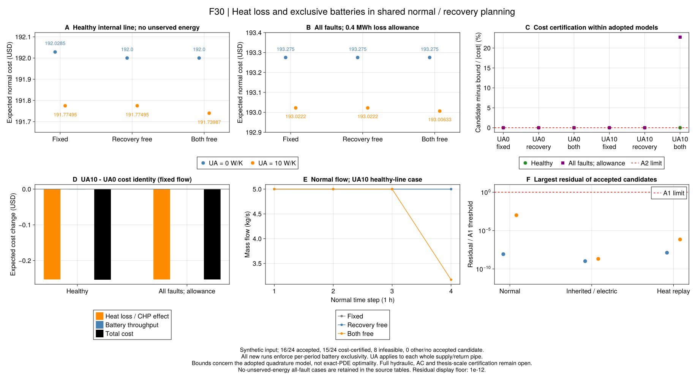

# R7：把散热接入连续流量决策

[共同流量实验](ch06-flow-planning.md)使用零UA。UA是整根管道对环境的传热系数，
单位W/K；把它改为正数会改变水团温度、库存和恢复能力，不能只取消输入检查。
本节点将[连续水团参考](ch06-pipe-state.md)写成可由JuMP优化的表达式。
它是项目详细参考，保留作者节点法及聚合简化各自的身份，不把新参考称为作者原算法。

## 水流慢了，损耗为什么不只是一个固定比例？

同一步内较早进入的水团已经冷却较久，刚进入的水团温度更接近入口；离管时刻也不同。
因此不能给所有新水团统一乘一次全步衰减，停流时更不能把损耗置零。
我们为每批水团保留累计质量区间，按实际出生和离开时刻积分温度。
环境温度允许逐时段改变，正常步和恢复子步可以长度不同，供回水各自计算一次。

质量区间交集继续精确表示，散热指数保持非线性。零流采用有界的步内位置变量，
不直接除以流量；空区间的温度位置可以不唯一，但质量和热量贡献必须为零。
库存之外还检查每个留下水团的两端温度，防止“平均温度合格，小段已经越界”。
完整推导与单位见[方程和符号](ch06-lossy-flow-equations.md)。

## 数值积分新增了什么假设？

指数函数在质量交集上用5或10点Gauss积分。采用版本显式命名为
`r7_continuous_positive_lossy_gauss_v1`和`r7_shared_lossy_flow_v1`。
积分阶数与最大截断误差在求解前确定，超出就拒绝，不事后放宽。
余项由[NIST Gauss求积公式](https://dlmf.nist.gov/3.5#v)推导；
这个解析界不包含浮点和优化误差，更不自动保证整个网络精度。

求解后继续使用独立的`r7_pipe_step`逐水团回放，检查实际温度、库存和按停留时间积分的散热。
采用积分模型的费用界与精确连续热模型的最优界分开；结果显式保存
`exact_transport_optimality_verified=false`，不能用很小的求积误差代替优化问题的下界证明。

自由流量下指数关系使模型成为一般非凸MINLP；全固定流量时系数为常数，可退化为LP/MILP。
[JuMP非线性表达式](https://jump.dev/JuMP.jl/stable/manual/nonlinear/)和
[Gurobi非线性说明](https://docs.gurobi.com/projects/optimizer/en/current/features/nonlinear.html)
支持这种建模，但有限预算是否找到解、是否得到有效界仍以实际状态为准。

## 当前验证状态

开放质量核213项检查通过，覆盖变流量、停流、整数/非整数输运、逐段温区和Gauss多项式精度。
Gurobi质量核34项检查通过，其中包含真正选择流量的反问题：给定出口温度下限，
最小流量与独立解析输运的q=2基准一致，费用界也在预定门槛内。
共同模型固定流量、有损与显式电池互斥的20项检查通过，包含保存后冻结源码重读。
这些开发检查尚不替代正式自由流量案例，也不认证反向优化、恢复水力或交流潮流。

## 冻结的24项对照

本次先冻结`configs/r7/lossy-flow-study.toml`的输入、规则和科学源码，再运行24项：
供回水各管UA取0或10 W/K，三个安全边界、三个流量域，固定域用HiGHS/Gurobi对照。
所有新输入显式采用电池逐时充放互斥；设备、负荷、温区和初始空间状态保持原值。
这是一组开发后声明的合成方法对照，不是作者原数据或未见过的统计测试集。

| 安全条件 | 每管UA / W/K | 固定流量 / USD | 仅恢复调流 / USD | 正常与恢复共同调流 / USD |
|---|---:|---:|---:|---:|
| 内部线路健康，零失供 | 0 | 192.028500 | 192.000000 | 192.000000 |
| 内部线路健康，零失供 | 10 | 191.774950 | 191.774950 | 191.739872 |
| 全部允许故障，门槛0.4 MWh | 0 | 193.275000 | 193.275000 | 193.275000 |
| 全部允许故障，门槛0.4 MWh | 10 | 193.022195 | 193.022195 | 193.006335，限时候选 |
| 全部允许故障，零失供 | 0及10 | 均不可行 | 均不可行 | 均不可行 |

表中是期望正常费用，恢复块只是门槛内的可行见证，未单独最小化失供。
内部线健康时PCC仍断开；0.4 MWh门槛允许该窗口的全部热负荷失供，不能把两种安全边界混成收益比较。

16项候选通过采用模型及独立水团回放，全部通过电池互斥；15项采用模型费用界闭合，8项不可行。
唯一未闭合的是UA10全故障共同流量：候选193.006335、界149.117434 USD，相对间隙22.7396%。
运行连同验证约540.115秒，仍在600秒总预算内；其余运行也未超预算。
这个弱界不能说明候选不可行，也不能把候选叫作最优费用；没有延长时间挑选更好结果。
四个可行固定域的跨求解器费用对照通过A2，两组不可行固定域的状态一致。

原值与源码在`results/summaries/r7-lossy-flow-20260920-v1`。
397项输入/域/原值检查通过，22160条残差按冻结源码独立重算，最大残差约为相应A1阈值的0.001倍。
历史无损/和式域12项仍由自身冻结源码读回，105项与7项手算检查通过，未重写旧判定。
另189项新旧配对检查确认UA0只改变电池域和版本/名称，物理输入及流量边界相同，费用在A2内一致。

## 为什么加入散热，费用反而略降？

**这是当前设备与价格形成的结果，不是散热的普遍优势。**冻结输入只有热电比1的CHP和理想电池；
CHP按电功率计的成本20 USD/MWh，外部购电100 USD/MWh。正常期电热需求为3.2和1.6 MWh，
管内库存与电量均回到初值。散失一点热，需要CHP补产同量热，也同步多发电、少购更贵的电。
结合能量守恒，得到[本输入费用恒等式R7-H6](ch06-lossy-flow-equations.md#R7-H6)：
基准192 USD，减去每MWh散热所伴随的80 USD购电替代，再加电池吞吐费与启动费。

健康线固定流量的实际分解是：正常散热约0.0031591703 MWh，CHP/购电效应为−0.25273362 USD，
电池吞吐费从0.02850000降至0.02768355 USD；两者合计使费用降低约0.25355007 USD。
这说明模型允许用额外热需求提高廉价联产电量；不能据此推广到不同燃料价格、热电比、可弃热设备或真实管网。
16候选的独立能量/费用分项在`results/summaries/r7-lossy-flow-audit-20260920-v1`，
审计保留原始库存尾差，不把浮点数裁剪成零来制造恒等式。

**流量收益与资源边界也要分开。**UA10健康线共同调流相对固定域再改善约0.03508 USD，
而只放开恢复流量没有改善。UA0加入严格电池互斥后，各域费用在A2内保持上一批数值，
说明这组理想效率输入的费用改善并不依赖旧见证中的同充放循环；不能推广成一般电池域等价。
两种UA下全故障零失供仍不可行，与[既有孤岛端口限制](ch06-ports.md)一致。
散热与连续流量都没有凭空增加孤岛的电力消纳端口。

F30只读原值表和费用审计；图源、全部运行ID、单位与脚本在
`results/summaries/r7-lossy-flow-figures-20260920-v2`。图中界差属于采用积分模型，
不表示已认证精确PDE最优性；费用变化也不是算法在论文规模的速度优势。

## 下一步做什么？

本节点补齐了正向/停流有损参考和严格电池域的共同规划证据。下一批优先进入R8：
按同一输入改变失供阈值，分开检查储电、可用热状态、调流和重构的作用，报告每项资源解除的冲突及失败边界。
不为让全故障零失供通过而取消温区，也不持续优化本小例来追求某个收益比例。
反向/正常停流、完整正常拓扑、恢复水力、连续节点、规模及第7章迁移继续列为未完成，
不能将本次小系统机制证据表述为整篇论文完成。

完整R1–R7回归已实际退出0。运行入口也已加入VS Code任务；基本顺序为：

~~~text
julia +1.12.6 --startup-file=no --project=. scripts/check_r7_lossy_flow.jl
julia +1.12.6 --startup-file=no --project=. scripts/test_r7_lossy_mass.jl
julia +1.12.6 --startup-file=no --project=. scripts/test_r7_lossy_flow.jl
julia +1.12.6 --startup-file=no --project=. scripts/r7_lossy_flow_study.jl freeze results/runs/<new-batch>
julia +1.12.6 --startup-file=no --project=. scripts/r7_lossy_flow_study.jl run results/runs/<frozen-batch> HiGHS
julia +1.12.6 --startup-file=no --project=tools/solvers scripts/r7_lossy_flow_study.jl run results/runs/<frozen-batch> Gurobi
julia +1.12.6 --startup-file=no --project=. scripts/check_r7_lossy_flow_results.jl results/summaries/r7-lossy-flow-20260920-v1
julia +1.12.6 --startup-file=no --project=. scripts/check_r7_lossy_flow_audit.jl results/summaries/r7-lossy-flow-20260920-v1 results/summaries/r7-lossy-flow-audit-20260920-v1
~~~

报告生成、费用审计和重绘都要求新的输出目录；不覆盖已有原值或以重新优化代替核查。

~~~@index
Pages = ["ch06-lossy-flow.md"]
~~~

~~~@docs
PaperRebuild.add_r7_lossy_mass_transport!
PaperRebuild.r7_loss_quadrature_bound
~~~
