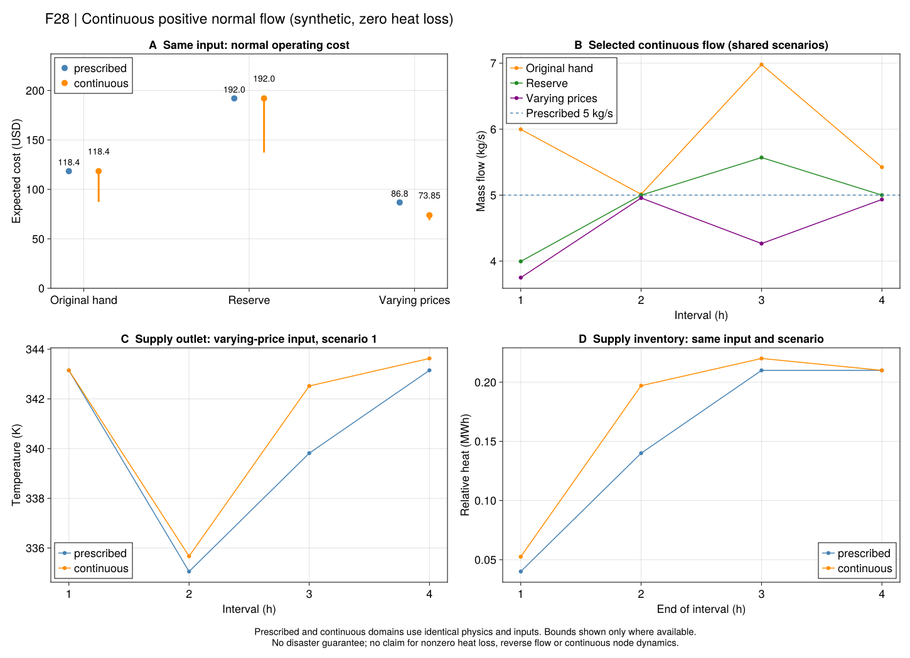

# R7：把管道流量真正作为决策量

上一节点已经把同一灾前空间状态连接到详细恢复，但正常与恢复管流仍由输入规定。
本节点先补**正常期的连续正向流量**。版本为`r7_continuous_positive_lossless_v1`。
原式、符号和采用推导见[方程台账](ch06-normal-flow-equations.md)。

## 物理问题

流量加大，水团在同样时间内走得更远；它改变当前可交付热量，也改变未来留在管内的温度分布。
因此不能只把热功率中的流量换成变量，同时沿用固定流量算好的时延和输运权重。

PDF109页式(6-26)、(6-28)、(6-33/34)、(6-37/38)分别包含热功率、压降、混合的乘积关系；
(6-41)至(6-46)的节点法权重也依赖流量。本采用版明确保留非凸乘积，模型是MIQCP，
不是凸SOCP或MILP。[Gurobi二次约束说明](https://docs.gurobi.com/projects/optimizer/en/current/concepts/modeling/constraints.html#quadratic-constraints)

## 怎样保留连续输运？

把一整管水的质量作为1。初始管段按入口到出口排列，用负标签记录原有水团；
以后进入的水按累计流量获得正标签。每个时段排出的标签区间，和每批水的标签区间相交，
交集长度就是它对出口的贡献。末端留在管内的区间则决定库存。

这些交集通过有限界的分段线性约束精确表达；流量本身仍是连续变量。
它不把非整数延迟取整，也不把流量限制在几个候选值上。
若一时间步流过超过一管水，出口自然含有本步刚进入的新水。

一个可手算的例子：初始一管冷水，入口变为热水，本步通过`q`管水。
当`q≤1`时，管内新增热水比例为`q`，出口仍冷；当`q>1`时，出口平均热水比例为`(q-1)/q`。
要求出口平均达到冷热温差的一半，最低通过量应为`q=2`。商用解析测试检查这一自由连续解。

## 本节点的范围

- 原有两个冻结正常案例的供回管UA本来就是0；保留该输入，不将非零散热偷偷设为0。
- 仅严格正向流量；正式对照正下界为0.05 kg/s，上界沿用原容量。原(6-31)允许反向，尚未覆盖。
- 固定原电拓扑、源荷端口活动集合和场景信息。流量跨场景共享，设备与温度调度仍依场景变化。
- 保留全部正常设备、电池、启停、有限水压界和原热末端规则。供回管分开回放。
- 本批末端要求各管热库存回到初值，未要求整条空间温度分布逐点恢复；费用比较仅属于这一共同边界。
- 管内输运在分段恒定入口、零散热下精确；节点仍采用时段平均混合，不认证连续节点动态。
- 此模型优化正常费用，尚未把自由流量与多个灾后分支共同优化；正常可行不表示灾后安全。

## 独立检查与运行

验证器读取求解器保存的流量与温度，重新调用数值水团裁切，逐项检查出口、库存、
热功率、质量守恒、水压、电网、设备和费用。它不使用优化时的交集权重。
全固定流量输入仍退化到旧LP/MILP，可以用HiGHS独立对照。

~~~text
julia +1.12.6 --startup-file=no --project=. scripts/test_r7_normal_flow.jl
julia +1.12.6 --startup-file=no --project=tools/solvers scripts/test_r7_normal_flow_gurobi.jl
julia +1.12.6 --startup-file=no --project=. scripts/check_r7_normal_flow.jl
julia +1.12.6 --startup-file=no --project=. scripts/r7_normal_flow_study.jl freeze results/runs/<new>
julia +1.12.6 --startup-file=no --project=. scripts/r7_normal_flow_study.jl run results/runs/<frozen> HiGHS
julia +1.12.6 --startup-file=no --project=tools/solvers scripts/r7_normal_flow_study.jl run results/runs/<frozen> Gurobi
julia +1.12.6 --startup-file=no --project=. scripts/r7_normal_flow_study.jl report results/runs/<complete> results/summaries/<new>
julia +1.12.6 --startup-file=no --project=. scripts/r7_normal_flow_study.jl check results/summaries/<report>
~~~

## 预冻结实验

协议`configs/r7/normal-flow-study.toml`规定9项：原手算、储备、显式分时电价三个输入，
每个输入进行Gurobi固定/连续流量对照，并以HiGHS补充同固定流量参考。
分时价只改变原手算输入的价格，首次优化前声明为`[30,120,60,150]`合成USD/MWh。
输入、源码、运行ID、界与负结果分别保存；每完整运行600秒。不注入固定流量最优解。

### 平电价案例的解析下界

若只有一台固定热电比CHP及理想效率电池，全部热库存与电池均周期恢复，且零热损耗，
总热需求固定了CHP总发电量，电池净充电量为零。启动和充放吞吐费用非负，所以

~~~math
C\geq\lambda L^{\mathrm e}+
\frac{c_{\mathrm{CHP}}-\lambda}{r_{\mathrm{CHP}}}L^{\mathrm h}.
\tag{R7-F5}
~~~

其中电热总需求``L^{\mathrm e},L^{\mathrm h}``用MWh，价格用USD/MWh。
原手算与储备输入分别给出118.4、192 USD下界。已核验的固定流量候选达到该界，
且其流量属于新连续域，因此这两个**条件正常问题**的最优费用已经由守恒与可行见证闭合。
这不要求非凸求解器先证明同一件事；也不改变其原有状态或缺界记录。
分时电价不满足此推导前提，审计明确返回`not_applicable`。

费用审计位于`results/summaries/r7-normal-flow-audit-20260920-v1`，原值保持。
独立核验：`scripts/check_r7_normal_flow_audit.jl <原报告> <审计目录>`。
这说明在特定守恒和计费结构下，流量自由度可以改变轨迹而不改变最优总费用；
不能据此推断热网流量在分时价格、有损或灾害恢复时没有价值。

### 为什么候选已接近解析最优，求解器仍未证明？

原手算的基准连续运行在600秒结束时得到118.39999972 USD合格候选，但求解器下界仅87.37533374，
有效界差约26.2%。候选正确与求解器松弛界足够紧是两个不同问题。

各管和节点的能量关系相加，可得[式R7-F6](@ref R7-F6)的线性整网能量恒等式。
它已由原非线性关系隐含；在独立探针中显式加入后，同一输入以118.4 USD完成费用认证，
总构建、求解与验证24.05秒，在预设60秒预算内。两组原值和源码分别保留。
这为后续主模型的等价强化提供依据；本节点没有把该探针结果混入原九项正式实验，
也不把不同进程/JIT条件下的耗时比称为算法加速倍数。

探针见`results/summaries/r7-flow-balance-probe-20260920-v1`；
只读入口为`scripts/check_r7_flow_balance_probe.jl <探针目录>`。
默认建模接口本批仍保留基准表示，后续纳入强化时需新证据，原限时状态不改写。

后续[共同流量规划](ch06-flow-planning.md)已增加显式`energy_balance=true`选项；
旧调用仍默认为`false`，原九项证据保留原表示。联合规划的新记录明确采用该等价守恒行。

### 九项正式结果

原值与冻结源码在`results/summaries/r7-normal-flow-20260920-v1`。九项均通过声明正常模型与
独立水团回放；六项固定流量费用完成，三项连续流量均限时保留可行候选。
三个固定流量HiGHS/Gurobi配对通过A2，连续流量的求解器界不继承固定问题的最优性。

| 输入 | 固定流量最优费用/USD | 连续流量候选/USD | 连续流量求解器下界/USD | 解释 |
| --- | ---: | ---: | ---: | --- |
| 原手算，平电价 | 118.4000 | 118.4000 | 87.3753 | 守恒下界与嵌入的固定可行见证另行闭合费用；原求解器仍限时 |
| 储备输入，平电价 | 192.0000 | 192.0000 | 137.2505 | 同上；这只是正常费用，不是安全规划费用 |
| 分时电价 | 86.8000 | 73.8500 | 68.9135 | 合格候选降低12.95 USD，约14.9%；约6.7%求解器界差尚未闭合 |

两项平电价结果说明：总热需求、周期库存和计费结构可能使增加流量自由度不改变最优费用。
分时价结果则给出同输入、同物理关系下的可实施费用改善见证。不能将14.9%称为论文收益，
也不能据这一小系统候选推断一般收益比例。三个连续候选均保留原`TIME_LIMIT`状态。

按两个已保存分时价Gurobi调度重算，期望外部购电支付从36降到23.25 USD，设备运行费用从
50.8降到50.6 USD，启动费均为0。第2小时电价120 USD/MWh时，期望购电从0.14降到约0 MW；
第1小时电价30 USD/MWh时，从0.44增加到0.585 MW。流量与热状态自由度允许CHP重新安排
发电/产热时序，并与同一电池设备协调；本对照没有分离“仅流量、仅温度、仅电池”的单独贡献。
这些费用与出力均来自原报告`records/varying_prices_*_gurobi/result.toml`，没有重新优化。

图F28的竖线表示求解器给出的上下界区间，不是统计置信区间。两项平电价的独立解析证书
未改写图中的原求解器下界；温度和库存只展示分时输入的场景1，流量由全部场景共享。
图源、运行ID和生成配置在`results/summaries/r7-normal-flow-figures-20260920-v2`。

## 接下来补什么？

先把已有推导支持的整网能量恒等式作为显式可选表示接入，并在原冻结输入上核验费用及界；
随后将连续流量与同一正常空间状态、灾后详细恢复共同求解。需要分别检查正常可行、
每个故障可恢复和最坏故障证书，不能直接把正常费用改善当作弹性收益。
有损、停流/反向、正常拓扑与更大系统仍是明确缺口；之后继续R8资源机制、R9迁移和全文交付。

~~~@index
Pages = ["ch06-normal-flow.md"]
~~~

~~~@docs
PaperRebuild.r7_normal_flow_spec
PaperRebuild.add_r7_mass_transport!
PaperRebuild.build_r7_normal_flow
PaperRebuild.solve_r7_normal_flow
PaperRebuild.validate_r7_normal_flow
PaperRebuild.save_r7_normal_flow
PaperRebuild.read_r7_normal_flow
~~~
