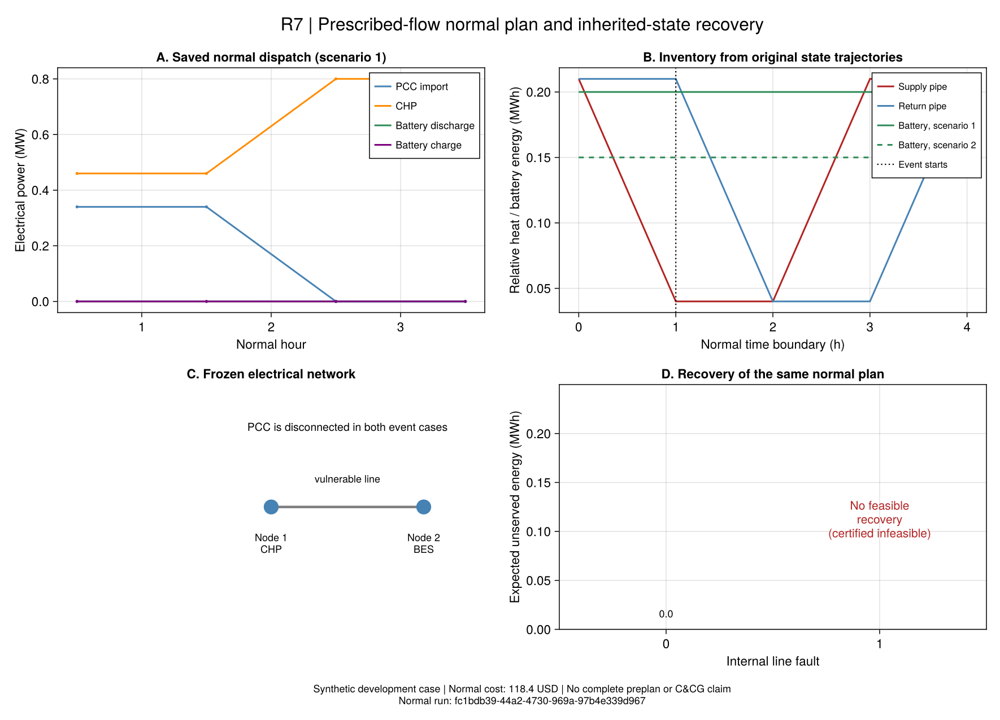

# R7：正常调度怎样成为恢复初值

本批把正常设备、电网、供回水混合、管道输运和事件前状态连接起来。
`r7_normal_prescribed_v1`是**给定正向管流、固定电拓扑的条件经济调度**。
CHP启停仍可优化，电池和逐场景设备出力不是固定输入；完整变流量灾前规划及嵌套C&CG仍须继续。

原页核查范围为PDF106–110、116。逐项解释、居中编号公式与符号见[正常方程台账](ch06-normal-equations.md)。
原[CHP约束块](ch06-commitment.md)、[管内状态参考](ch06-pipe-state.md)和[恢复模型](ch06-recovery.md)保持原接口与历史判定。

## 从物理问题开始

正常运行时电网可从PCC购电，电热负荷必须全部满足。CHP同时产电产热，电池移动电能，
供回水管保存之前进入的水及其温度。突发断电时，系统不能重新选择一组更方便的初始库存。
恢复必须接续同一条正常轨迹。

例如故障从第2小时开始：CHP爬坡以第1小时出力为前值；电池取第2小时起点电量；
管道取第1小时完成后的空间温度分布。它们的数组下标不同，不能统一写成“取第2个出力”。
新能源场景各自继承状态，不能先跨场景平均。

严格输入检查可能遇到`0.8000000000000003`与声明上界`0.8`这样的浮点尾差。
事件桥接仅允许不超过8个Float64最小表示步长的边界映射，并保存原值、继承值和差值。
原调度不改写，更大的越界直接拒绝；这不改变A1，也不能用于修复真实的容量不足。

## 这个子问题保留哪些关系？

- CHP共享启停、最短启停时长、窗口前义务、逐场景P/Q与爬坡；启动费只计一次。
- GT、PV、EB及电池。电池沿原6-12使用充放功率之和界，沿6-15使用周期能量；同时充放另报。
- 固定树的线性电压幅值模型；全部节点包括PCC根节点统一守恒。它不认证交流潮流。
- 正源/荷端口质量与热量、供回水分别混合、有限温度域以及沿实际流向的平方水力压降。
- 给定管流后热功率、混合和水力关系都成为仿射式；实际约束类型为MILP，固定CHP启停后为LP。

压力使用Pa，供水`i→j`、回水`j→i`。有限供压与阀门压降是明确的项目边界；
尚无泵电耗、水力动态或温度依赖密度。初始温度域、有限PCC交易域和源荷分离也是显式输入。
原正常热网允许变流量和方向变化，本子问题的MILP性质不能推广到完整原问题。

## 两种输运版本为什么都保留？

| 版本 | 出口关系 | 管内库存 | 作用 |
|---|---|---|---|
| `node_method_fixed_v1` | 原节点法恒流K/J的单位恢复版 | 按同一入口轨迹另做连续参考积分 | 原公式对照；有损误差单列 |
| `plug_flow_reference_v1` | 给定流量的一维平流散热参考 | 同一连续参考的空间质量积分 | 温度、损耗和库存一致的条件调度 |

连续参考采用步内恒定流量、环境和入口温度，允许给定流量逐步变化；不把变流量当优化变量。
线性叠加矩阵由基准与温度脉冲提取，求解后的验证器直接回放水团及独立积分损耗。
节点法验证另外以时间区间交集计算权重，不读JuMP表达式。

两种版本只在相应退化条件下应一致。有损节点法的出口如果与连续回放不一致，仍可记录其
采用模型检查通过，但`r7_normal_event`会拒绝把该候选认证为一致的物理状态来源。
这个拒绝不是断言作者模型无效，而是说明当前两种状态解释尚不可直接互换。

## 一个可手算的正常案例

`configs/r7/normal-hand.toml`为合成两电节点、两热节点、四小时案例；两个概率为0.25/0.75的场景，
电池初值分别0.20/0.15 MWh。每小时电负荷0.8 MW，热负荷0.63 MW；CHP热电比1，
CHP电当量成本20 USD/MWh，PCC电价100 USD/MWh，电池吞吐成本1 USD/MWh。
供回管各18 m³、无损、流率5 kg/s，停留时间正好1小时。

这个手算例明确选用项目边界`pipe_inventory_initial`，要求每根供回管末期显热等于初始值。
因此总CHP热量与电量均为2.52 MWh，购电0.68 MWh；无需付费循环电池。
总费用为`2.52×20 + 0.68×100 = 118.4 USD`。
该边界只恢复平均显热，不能宣称整管温度分布周期恢复。`free`变体也必须显式指定，不能混做公平周期费用对照。

```jldoctest
julia> using PaperRebuild

julia> path = joinpath(dirname(dirname(pathof(PaperRebuild))), "configs", "r7", "normal-hand.toml");

julia> c = load_r7_normal_case(path);

julia> build_r7_normal(c).model_class
"MILP"
```

## 运行、检查与事件连接

下面命令使用新的输出目录；重读不会重新优化。

```text
julia +1.12.6 --startup-file=no --project=. scripts/test_r7_normal.jl
julia +1.12.6 --startup-file=no --project=. scripts/check_r7_normal.jl
julia +1.12.6 --startup-file=no --project=. scripts/r7_normal.jl run configs/r7/normal-hand.toml results/runs/r7-normal-new
julia +1.12.6 --startup-file=no --project=. scripts/r7_normal.jl check results/runs/r7-normal-new
julia +1.12.6 --startup-file=no --project=. scripts/r7_normal.jl event results/runs/r7-normal-new 2 1 0.5 2.0 results/runs/r7-event-new
julia +1.12.6 --startup-file=no --project=. scripts/r7_normal.jl check-event results/runs/r7-normal-new results/runs/r7-event-new
```

事件入口先检查正常候选与连续输运，再从同一父记录产生恢复案例和状态证据。
它不更改正常计划、不以恢复结果反调初值；正常费用界不能当灾后失供界。
既有恢复模型仍为Taylor双水箱，源状态已核查不代表灾后详细管网可行。

每个正常运行存输入、原值、逐约束残差与源码快照；源码更新后用存档`code/replay.jl`重验。
接口分别保留`candidate_accepted`、`conditional_cost_complete`、`pipe_reference_pass`和全文范围标志。
没有有效下界的求解不能仅凭状态字符串认证费用完成。

## 下一步仍需完成

1. 正式冻结给定流量正常计划及故障/恢复对照，检查更多支路与事件窗口。
2. 完成正常变流量、方向与拓扑控制的采用解释，处理原紧凑MILP与详细热关系的条件差异。
3. 连接故障对手、外层经济安全计划及嵌套C&CG，利用穷举参考核验每类界。
4. 比较双水箱恢复与详细热状态可实现性，再开展R8保供机制和后续规模验证。

## 本批保存结果说明什么？

证据包`results/summaries/r7-normal-20260920-v2`保存同一正常计划与两种内部故障，
正常运行ID为`fc1bdb39-44a2-4730-969a-97b4e339d967`，输入SHA为
`a983f5e316d1415b0657a1833af1705b6b3d682fbf13f726c6317935c08c3101`。
这是开发阶段合成证据；保存时包含源码快照与未提交状态，不能冒称在干净提交上执行的正式规模实验。

| 检查对象 | 保存结果 | 能说明什么 |
| --- | --- | --- |
| 四小时正常调度 | 118.4 USD，条件费用认证与独立约束/管内回放通过 | 给定管流、拓扑及初末边界下，与手算一致 |
| 第2小时PCC断开，内部电线健康 | 恢复模型认证最优，电/热失供均0 MWh | 同一事件前状态可在该恢复模型内供能 |
| 同时断开唯一内部电线 | `infeasible_certified`，没有可用失供数值 | 继承启停与孤岛电力守恒发生硬冲突 |

两种灾害都包含PCC断开；“内部健康”不等于没有灾害。
恢复仍采用Taylor双水箱及线性电网，不能把零失供解释成交流电网或详细热管网认证。

### 断线失败有独立的解析解释

CHP位于节点1，负荷和电池位于节点2。断线且PCC断开后，节点1无电力消纳端。
第2小时继承的CHP启停为1，其最小电出力0.2 MW，与该孤岛守恒要求矛盾：

```math
u_{1,2}=1\ \Longrightarrow\ P_{1,2}^{\mathrm{CHP}}\geq 0.2\ \mathrm{MW},
\qquad P_{1,2}^{\mathrm{CHP}}=0.
\tag{R7-D6}
```

R7-D6是本项目对冻结反例的推导，不是原论文式号。它说明当前继承计划无恢复解，
并非求解时间不够；失供数值必须保持缺失，不能填零或把它当某个有限最坏损失。

本案例还存在更强的容量限制。无损、管内库存周期、唯一热源为CHP且热电比1时，
四小时必须供热2.52 MWh；少开一小时的上界只有`3×0.8=2.4 MWh`。
所以仅在本案例的正常启停内搜索也无法解除该故障冲突。后续需要独立冻结具有可恢复资源或
网络路径的新配置，并保留当前不可行实例，不能悄悄取消最小出力或周期边界。



F20只读取保存数值；管道能量相对参考温度，不能全部解释为可用于供热的能量。
图源、运行ID、单位和哈希保存在`results/summaries/r7-normal-figures-20260920-v2`。

```text
julia +1.12.6 --startup-file=no --project=. scripts/test_r7_normal_evidence.jl results/summaries/r7-normal-20260920-v2
julia +1.12.6 --startup-file=no --project=docs scripts/plot_r7_normal.jl results/summaries/r7-normal-20260920-v2 results/runs/r7-normal-redraw
julia +1.12.6 --startup-file=no --project=. scripts/check_r7_normal_figures.jl results/summaries/r7-normal-20260920-v2 results/summaries/r7-normal-figures-20260920-v2
```

首次报告因Julia闭包共享缓冲区而生成空摘要，首次绘图因绘图环境未暴露JuMP而失败，
随后修正刻度类型；第一次生成图的不可行文字被裁切，视检后重新排版为图v2。
v2只从原值同字节续接，修复报告载体及动态模块加载；原科学输入/源码/结果不改、不重复优化。
原失败包和日志保留，v2检查额外拒绝空摘要、重封哈希后的虚假费用及继承状态篡改。

这批结果支持第6章“经济性与灾后可恢复性应同时考虑”的研究问题。
它尚未验证作者嵌套C&CG、论文规模收益，或在同一输入上复现作者结果。

## 原生API

~~~@index
Pages = ["ch06-normal.md"]
~~~

~~~@docs
PaperRebuild.R7NormalCase
PaperRebuild.load_r7_normal_case
PaperRebuild.build_r7_normal
PaperRebuild.solve_r7_normal
PaperRebuild.validate_r7_normal
PaperRebuild.r7_normal_event
PaperRebuild.save_r7_normal
PaperRebuild.read_r7_normal
~~~
