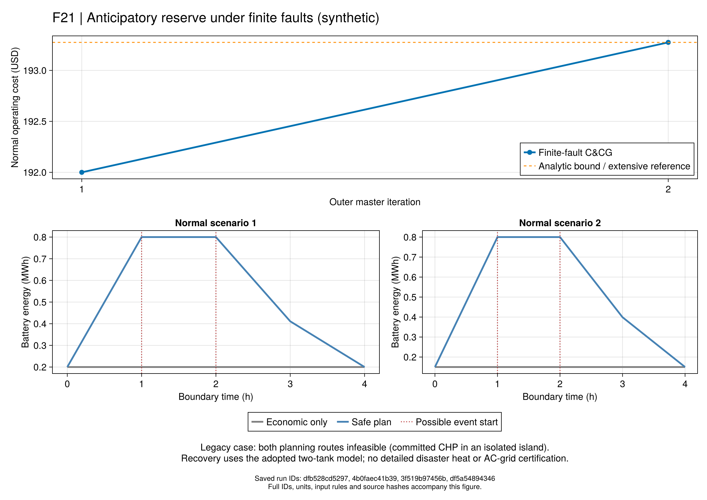

# R7：把灾后恢复纳入灾前计划

本页接续[正常调度与事件连接](ch06-normal.md)。作者第6章的核心要求是：
正常运行费用尽量低，同时每个声明灾害下都能找到损失不超门槛的恢复策略。
当前实现名为`r7_planning_finite_v1`，采用给定正向管流、固定正常电拓扑的小系统。
原件PDF117–119/印刷100–102，逐式解释见[方程与符号](ch06-planning-equations.md)。

## 为什么不能先选最便宜计划，再假设灾后总能处理

旧`normal-hand`在正常运行中只需118.4合成USD，却无法处理内部唯一电线断开的事件。
CHP必须开启才能满足全日周期热量，但断线后其孤岛没有电力消纳端。
这形成真正的硬冲突，增加求解时间不会解除它。旧配置和冻结证据全部保留。

规划主问题因此要同时选择正常启停、出力、电池和管内热状态。每次找到一种无法恢复的故障，
就在主问题加入一套该故障的恢复约束。这套约束连接的是**本轮同一个正常决策**，
恢复后的电压、出力、开关、流量等控制则按事件/故障分别设置。
两种可能灾害不是先后必然发生的事件，不能把它们的耗能重复叠加。

## 两条对照路线

| 路线 | 做法 | 用途 |
|---|---|---|
| `extensive` | 一次纳入每个事件下全部允许故障的恢复块 | 独立的有限故障全量参考 |
| `finite_fault_ccg` | 从无故障约束主问题开始，逐轮加入认证反例 | 验证作者外层列与约束生成结构 |

外层的故障审计目前枚举全部允许故障，各自求解恢复MILP。固定故障的最小化**可行解**给失供上界，
求解器有效下界可认证超过门槛的反例。只有所有故障上界都合格，事件才被认证安全。
缺许可、限时无解或数值失败保留为未知；没有解的记录不能填成零失供。
每轮正常计划更新后，旧事件证书失效；代码保存父ID与原值哈希并重新检查。
本实现批量加入本轮找到的全部认证反例，原文描述按事件加入最坏故障。
两者都是约束生成结构，但不声称有相同的迭代轨迹或运行时间。

主问题的恢复块仅需证明“存在一套合格恢复”。它不会顺带最小化各故障失供，
因此记录为`recovery_feasibility_witness`，没有伪造的失供最优性或下界。
主问题费用界只属于声明的安全规划域，不属于未加安全要求的正常经济调度。

上述`finite_fault_ccg`保留穷举内层；后续新增的[内层故障搜索](ch06-adversary.md)使用实际LP对偶、
原生指示约束和显式截断处理恢复不可行，可通过`nested_indicator_ccg`接入本规划。
这属于有推导的采用版，不冒称原文符号和数值规则的逐字实现。
Zhao与Zeng预印本区分完全补救假设、KKT与强对偶路线；本项目另外检验共同对偶可行性，
没有任意选择乘子大M。[作者预印本](https://optimization-online.org/wp-content/uploads/2012/01/3310.pdf)

## 一个先推导、再优化的储备例

独立新配置`normal-reserve-hand.toml`保留两电节点、两热节点、四小时和两个正常场景，
明确把热负荷改为0.4MW、CHP最小电出力设为0、电池功率/容量设为1MW/1MWh。
这不是旧反例的修补或作者参数。供回初温342.15K与约323.102381K使5kg/s恒流稳态交付0.4MW。
场景概率0.25/0.75，初始电池能量0.2/0.15MWh；第2和第3小时分别作为可能的一小时灾害。

四小时热量1.6MWh、无损和库存周期固定了CHP总电量。总电负荷3.2MWh，正常费用下界192USD。
若内部线断开，负荷节点必须由电池供给0.8MWh。因此正常计划至少提前充至0.8MWh，
持有到第3小时，随后回到原有周期末端。加权充放电费用至少1.275USD，安全费用下界193.275USD。
这个下界必须另有共同电热可行解才能达到；不能只靠算术宣称安全。

输入、哈希、期望答案在`reserve-hand-freeze.toml`中先于首次优化冻结，
生成入口`freeze_r7_reserve_hand.jl`拒绝覆盖已有配置。基础测试比较两路线、独立拓扑LP穷举和Clarabel固定拓扑解。

## Julia与VS Code操作

```text
julia +1.12.6 --startup-file=no --project=. scripts/check_r7_planning.jl
julia +1.12.6 --startup-file=no --project=. scripts/test_r7_planning.jl
julia +1.12.6 --startup-file=no --project=. scripts/r7_planning.jl run configs/r7/normal-reserve-hand.toml configs/r7/planning-reserve-hand.toml finite_fault_ccg results/runs/r7-planning-new 600
julia +1.12.6 --startup-file=no --project=. scripts/r7_planning.jl check results/runs/r7-planning-new
```

默认单次600秒预算由全部建模、外层、内层和验证共享，不给每个嵌套调用重新分配600秒。
结果保存逐轮正常轨迹、恢复原值、阈值证书、费用界、科学源码和哈希。源码变更后，
使用存档`code/replay.jl`只读重验，不覆盖或重新优化旧运行。

## 研究结论边界

### 已保存的解析对照

开发证据`results/summaries/r7-planning-20260920-v2`包含四项规划与一项正常经济基准。
原值和科学源码均已冻结，报告续接没有重复优化，仍标为两节点合成开发验证。

| 配置/路线 | 状态 | 正常费用（USD） | 主问题轮数 |
|---|---|---:|---:|
| 原不可行例，全量参考 | 认证不可行 | 无候选 | 1 |
| 原不可行例，有限故障C&CG | 认证不可行 | 无候选 | 2 |
| 新储备例，正常经济基准 | 正常模型与费用检查通过 | 192.000 | — |
| 新储备例，全量参考 | 全故障采用模型安全、费用界闭合 | 193.275 | 1 |
| 新储备例，有限故障C&CG | 全事件/故障审计通过、费用界闭合 | 193.275 | 2 |

新例的C&CG首轮正常费用192，加入三项认证反例后得到193.275；两个正常场景在两事件前均持有0.8MWh电量。
相同最优费用不要求退化调度的每个变量都相同，不能用这几项冷/热编译混合耗时作加速结论。
图中电池轨迹是正常计划，事件恢复各有独立分支，并不是把两次灾害连续执行后的轨迹。



这些结果给出的机制证据是：本资源配置可通过预储电满足恢复门槛，并付出可解释的增量费用；
原例则存在调度无法消除的硬冲突。它们不是“所有正常经济计划都不安全”或“储能总能解决孤岛问题”的证明。
首报告的路径与动态模块读取失败、首图图例遮挡均留存；续接和重绘只读原值，不改变输入、容差或判定。

```text
julia +1.12.6 --startup-file=no --project=. scripts/r7_planning_evidence.jl check results/summaries/r7-planning-20260920-v2
julia +1.12.6 --startup-file=no --project=docs scripts/plot_r7_planning.jl results/summaries/r7-planning-20260920-v2 results/runs/r7-planning-redraw
```

### 尚未覆盖

实现和解析例回答“怎样把已声明恢复要求放进灾前计划”。
即使本条件域内全部故障通过、费用界闭合，也不认证完整变流量正常域、交流电网、灾后详细热网，
不证明原作者规模或嵌套算法的速度和最优性。多支路/双时段固定状态和内层故障对手的后续检查见
[内层对照](ch06-adversary.md)；尚须检查双水箱恢复对详细热状态的可实现性及完整正常控制域，
同时保留旧不可行见证。

## 原生API

~~~@index
Pages = ["ch06-planning.md"]
~~~

~~~@docs
PaperRebuild.R7PlanningCase
PaperRebuild.load_r7_planning_case
PaperRebuild.build_r7_planning
PaperRebuild.solve_r7_planning
PaperRebuild.validate_r7_planning
PaperRebuild.save_r7_planning
PaperRebuild.read_r7_planning
~~~
