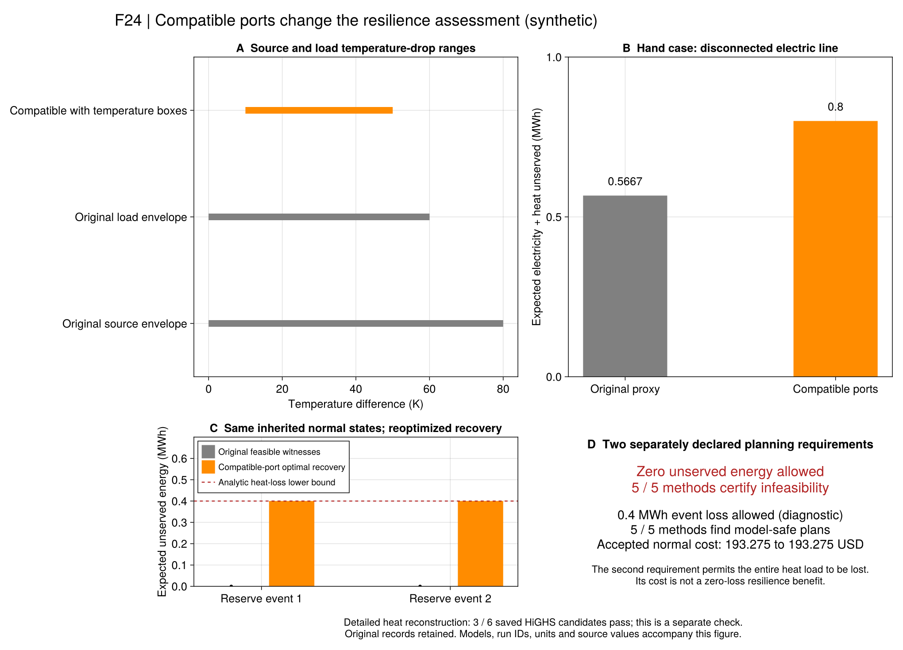

# R7：从端口温区到安全规划

[上一批热重构](ch06-thermal.md)发现，两个原恢复方案无法在详细温度模型中实现。
本批继续问：**重新选择设备出力、管流和恢复拓扑以后，冲突能否消失？**
采用版为`r7_recovery_port_checked_v1`，原`r7_recovery_checked_v1`及其历史证据保留。
公式与符号只在[权威台账](ch06-ports-equations.md)定义。

## 先分清原文与项目边界

原PDF109（印刷92）的式（6-27）对热源供温给出上下限，没有写“停机时取消”。
PDF115–116的式（6-81）至（6-84）用供回管允许温区定义储热容量，用温差包络约束端口功率。
这里没有完整交代源停机、循环泵与旁通的联动。本批不补造作者规则。

当前合成案例的供水区间是333.15–353.15K，回水区间是303.15–323.15K；
相容温差应在10–50K内。此前项目原端口包络允许源温差0–80K、荷温差0–60K，范围更宽。
因此本次首先修正**项目采用模型在这组输入上的相容性**，不能据此宣称作者原参数错误。

## 为什么源端口零功率仍然重要？

热功率等于比热乘以流量和温差。当前温区始终保持至少10K的源温差，
正循环流必须配有正的加热功率。只统计管内热量，会遗漏这一端口条件。

新版本保留原双水箱方程、Taylor循环交换、负荷、设备、历史与全部原约束，
只追加R7-C1的温区必要条件。它仍是MILP，固定拓扑后仍为LP；
新增行同时进入独立验证器、实际LP对偶提取和安全规划恢复块。
**必要条件通过仍不代表温度动态可重构。** 获得恢复候选后还要运行逐管检查。

## 一个不依赖选中控制的下界

以当前单热源的断线事件为例：CHP所在电孤岛没有负荷、充电设备或电锅炉，
外部电网在灾时断开。无损电平衡迫使CHP有功出力为零，定热电比又使产热为零。

1. 正源温差与零产热迫使全部源端口流量为零。
2. 全热网质量守恒及非负负荷端口流量，使所有负荷端口流量也为零。
3. 有限温差下，热交付只能为零；一小时0.4MW热负荷对应至少0.4MWh热失供。

这个下界独立于所选恢复流量和原储热量。只要设备、电网、温区与源端口语义不变，
增加现有负荷侧电池的储能量也不能消除这一热失供。它并不证明允许旁通、
源停机循环降温或不同设备配置的系统也无法恢复。

`r7_island_heat_bound`使用全部健康线路构成的超图；只有这张图仍无有功消纳端时才出具证书。
即使电负荷只有一个很小的正数，也不会按A1容差删去；有电锅炉或可充电电池时保守返回不适用。
证书只给必要下界，是否能达到还须优化。若负荷最多削减比例小于100%，还可能出现硬不可行。

## 冻结的正式对照

`configs/r7/ports-study.toml`声明三组恢复输入：原手算与旧安全规划的两个事件状态。
每组各两个故障，由HiGHS/Gurobi求恢复MILP、Clarabel求固定拓扑LP，共18项。
另有零失供与0.4MWh容许失供两种规划规格，分别执行全量模型、有限故障C&CG及Gurobi原生指示嵌套对照，共10项。
原状态、温区、核心数据、求解规则与记录ID均在正式优化前冻结。

0.4MWh规格是**允许整段热负荷失供的诊断**，不是原零失供目标的修复，
不能把其可行费用包装为零失供安全收益。每方法共享600秒；HiGHS恢复候选的16子步热回代使用剩余预算。
旧算法结果不改判，不通过替换原案例制造一致收益。

## 正式结果与研究解释

两组运行均实际退出0，28项方法记录和6项16子步热回代保留原值、源码与输入。
报告位于`results/summaries/r7-ports-20260920-v1`；不重算前批结果。

| 对象 | 温区相容版结果 | 适用解释 |
| --- | --- | --- |
| 手算例，内部线路断开 | 电热总失供0.8MWh；旧代理模型为17/30MWh | 相容端口条件改变了模型对恢复能力的判断 |
| 两个继承正常状态，内部线路断开 | 每个事件至少且实际失供0.4MWh热量 | 与孤岛电平衡、端口温差及质量守恒的解析下界一致 |
| 原零失供安全要求 | 五个求解器／算法组合均判不可行 | 在声明的设备与边界下，重新选择恢复控制仍不能实现零失供 |
| 另立容许失供0.4MWh要求 | 五个组合均通过采用规划模型，正常费用193.275合成USD | 这个要求容许整个事件热负荷失供，不能解读为零失供收益 |

18项恢复候选均通过各自采用模型；HiGHS分别与Gurobi、固定拓扑Clarabel的12组目标值对照通过A2。
Clarabel记录缺少有效求解器界的情况仍保留，目标一致不补造其最优性证书。
五个放宽失供要求的规划候选有各自有效费用界，并通过该条件域的费用验收。

独立热检查给出了进一步的限制：

- 三个内部线路断开的HiGHS调度通过固定控制热重构，但均失去全部0.4MWh热负荷。
  这证明这些失供调度可以表达，不能证明管内储热实现了有效保供。
- 三个内部线路健康的调度在代理模型中失供为零，固定控制温度LP却均不可行。
  灾时PCC仍按原输入断开；“内部线路健康”不等于无灾害正常工况。
  本批没有给这三项进一步提取最小冲突，不据此猜测唯一成因，也不排除改变控制后的详细可行解。

**温区必要条件已经排除一类过于乐观的方案，但仍不足以认证完整热交付。**
这是对当前项目采用模型与合成边界的判断，不是作者原始数据或方法失效的证据。
历史193.275USD方案仍保留其原代理模型判定；新增证据限制它能支持的物理结论。

### 接下来的研究优先级

1. 固定保留三项“端口通过、详细温度失败”的反例，区分端口、初始空间温度、混合和输运的贡献。
   先核对源停机循环及旁通的物理语义；任何新运行规则都另立版本，不能静默取消温度界。
2. 将可交付热量与温度状态接回恢复优化，先在原小例上核验改变流量／出力后的详细可行性。
   继续分别记录库存、交付量和失供，补齐正常控制域，不把总储热量直接当可用供热量。
3. 在边界清楚后进入R8资源与弹性阈值机制、R9场景迁移，最后汇总全文数据、规模和教程缺口。
   已有负结果达到可复核标准后归档，不为制造零失供而反复调整输入。

61项专项和完整R1–R7回归已通过；工程检查不能替代上述科学判定。
后续文档、图源与项目检查的实际执行记录见`docs/agent/tasks/2026-09-20-r7-ports.md`。

## Julia操作

~~~text
julia +1.12.6 --project=. scripts/test_r7_ports.jl
julia +1.12.6 --project=. scripts/check_r7_ports.jl
julia +1.12.6 --project=. scripts/r7_ports_study.jl freeze results/runs/<new>
julia +1.12.6 --project=. scripts/r7_ports_study.jl run results/runs/<frozen> open
julia +1.12.6 --project=tools/solvers scripts/r7_ports_study.jl run results/runs/<frozen> gurobi
julia +1.12.6 --project=. scripts/r7_ports_study.jl report results/runs/<complete> results/summaries/<new>
julia +1.12.6 --project=. scripts/r7_ports_study.jl check results/summaries/<saved>
~~~

运行拒绝覆盖已有组；输入中未声明新版本的旧调用保持原模型和哈希。保存记录自带源码，
未来检查使用各自`code/replay.jl`；重新绘图不重新优化。

## 原生API

~~~@index
Pages = ["ch06-ports.md"]
~~~

~~~@docs
PaperRebuild.with_r7_port_temperature_bounds
PaperRebuild.r7_port_temperature_bounds
PaperRebuild.r7_island_heat_bound
~~~
