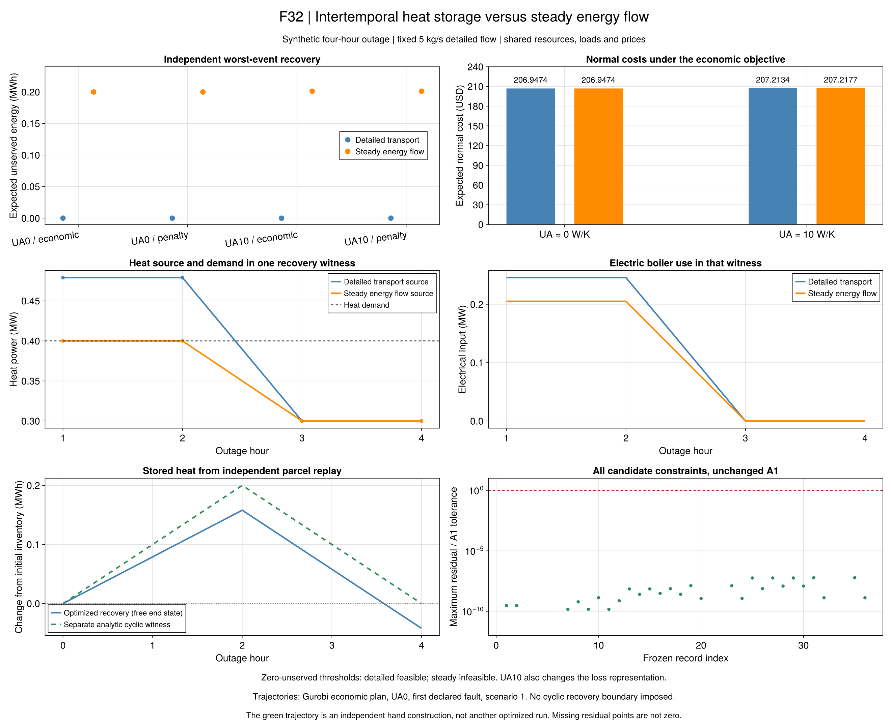

# R8稳态对照结果：储热能否减少晚段失供？

本批对齐作者第6.5.3节方案3.1及图6-7的研究问题：在电力紧张之前多产热，
能否减少后续供热与电负荷争用电力？所有输入均为合成小系统。
[模型和手算](ch06-r8-energy.md)说明共同部分与删去的热状态；
[原页、推导及符号](ch06-r8-energy-equations.md)区分作者描述与项目解释。

## 最有用的结果

新四小时事件中，CHP电/热上限各0.3MW，GT上限0.5MW，电锅炉效率0.95。
电负荷为0.5、0.5、0.8、0.8MW，热负荷恒为0.4MW；PCC始终断开，
全部三个允许的内部故障均独立检查。两种热模型使用相同的设备、负荷、价格和初始设备状态。

| 输入与热模型 | 最优正常费用（USD） | 固定正常计划后的最坏期望失供（MWh） | 零失供门槛 |
| --- | ---: | ---: | --- |
| 零UA，详细输运 | 206.947368 | A1内为0 | 可行 |
| 零UA，稳态能流 | 206.947368 | 0.200000 | 不可行 |
| UA=10W/K，详细输运 | 207.213445 | A1内为0 | 可行 |
| UA=10W/K，稳态能流 | 207.217732 | 0.201259 | 不可行 |

费用列与失供列来自两个不同目标：先求正常费用，再固定该正常计划最小化最坏恢复失供。
在本案例中，经济目标和500USD/MWh罚项目标得到相同正常费用及上述失供；
有损稳态罚项目标另加约100.629524USD，不能当作正常能耗费用。

**零UA对照支持跨时段储热的保供作用。** 晚段0.8MW电负荷已经用尽CHP与GT容量。
即时供热模型每增加1MW电锅炉用电，至少少供1MW电，却只少缺0.95MW热。
因此两个晚段的电热总失供至少为0.2MWh。两个求解器均达到这一独立下界。
详细输运模型允许前段存热，后段释放，全部故障下都找到了零失供恢复方案。

这支持作者的物理机制，尚不认证其原始算例的收益比例、紧凑热模型或算法速度。
两个采用模型还在温度/状态约束上存在差异，不把它们当作严格嵌套可行域。
有损组另外改变了损耗表示，因此0.004288USD的正常费用差不能全部归因于储热。

## 实际轨迹与手算轨迹不能混用

正式运行的恢复末端热状态是自由的。F32选择零UA、Gurobi经济计划、首个声明故障及场景1，
该恢复原值前两小时各产热0.479MW，后两小时各产热0.3MW。
独立水团回放的相对初始库存为0.079、0.158、0.058、−0.042MWh。
它同时使用了前段新增储热和0.042MWh初始可用热量，**不是周期运行收益证据**。

优化前单独构造的0.5、0.5、0.3、0.3MW热轨迹则对应0.1、0.2、0.1、0MWh，
末端供回水回到初态。它通过热量、温区及聚合电容量检查，说明该时移机制有手算依据；
不能把这个手工轨迹写成优化器返回的调度，也不能替代每一故障下的完整网络验证。
两条轨迹在图例中分开标注，正式原值不被手算值覆盖。

## 旧两节点的不可行是另一类原因

旧两节点稳态经济计划正常费用为191.747352USD，但其独立灾后恢复不可行；
门槛和罚项模型也不可行。唯一内部电线断开后，CHP所在孤岛没有电负荷、
电池或电锅炉来消纳联产电力，因此CHP不能产热。采用的温热网络参考散热规则却要求
持续补偿约0.000789524MW热损耗，即使全部热负荷都削减也不例外。

这给出一个独立的容量/守恒矛盾。它属于本项目参考散热边界，
不应解释为动态热网取得了无限收益，或断言作者的稳态模型也采用同一规则。
旧三节点在两种热模型中均可零失供，微小费用差同样来自散热表示，不能外推为资源普遍无效。

父批次三节点固定组只运行了Gurobi，因此对应HiGHS的三项跨模型比较标为缺少同求解器父结果。
没有补跑或偷偷混入另一个求解器来填满表格。

## 证据与适用范围

- 36项正式运行全部按冻结输入/科学源码完成：28项正常/主模型候选、8项不可行。
- 28项主目标达到既定精度；26项独立风险评估通过并有有效界，另外2项为旧两节点经济计划的恢复不可行。
- 18个同输入求解器配对：14对通过A2，4对均不可行。A1、A2未放宽。
- 全部保存原值按冻结源码重验；逐式残差、每故障每场景轨迹、解析下界和孤岛证书单独存档。
- 四项原自由流量超时已有保持物理值不变的嵌入见证，最大模型违反约2.274e-13；
  它排除相应采用模型完全不可行，仍未证明自由调流收益、最优性或高效求解。

公开证据为`results/summaries/r8-energy-20260920-v1`、
`r8-energy-audit-20260920-v2`和`r8-embedding-20260920-v1`。
审计首版因父批次缺少HiGHS三节点对照而停止，局部文件保留在本地失败目录；
修正的是报告配对逻辑，36项科学运行没有重算或改判。

图源、运行ID、选择规则及绘图配置保存在`r8-energy-figures-20260920-v2`。
图表只读保存结果；缺失/不可行不画成零，手算见证单独标注。

## 下一步

本小系统的储热机制已有解析、优化和独立回放三方面证据，无需继续调参追求更大收益。
下一批转入R9第7章示范区场景迁移，先核对四套修改场景、输入来源及适用模型，
再建立规模更大的公开替代系统。自由流量搜索与论文规模性能作为明确专题保留，
不把本批通过升级为整个第6章或全文完成。完整缺口见[覆盖清单](reproduction-coverage.md)。
