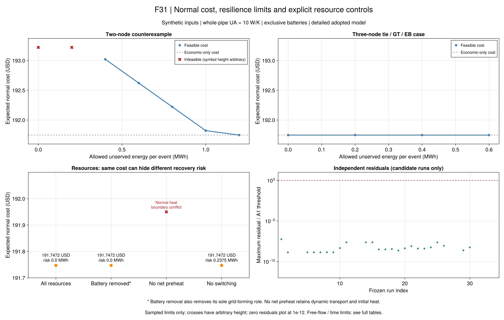

# R8首批结果：成本、保供与资源作用

本批使用冻结的合成小系统，比较正常经济目标、逐事件失供上限和500美元/MWh罚项。
同一个正常计划另作独立恢复优化；费用用USD，失供用MWh，两个目标的界分别记录。
本页是第6章机制验证，不能当作作者原始系统或同输入数值复现。
输入、定义与边界见[模型说明](ch06-r8.md)及[公式台账](ch06-r8-equations.md)。

## 固定流量：保供要求怎样改变费用？

旧两节点例中，全部故障包括唯一内部线路断开。固定恢复停流时，
热源孤岛无法交付0.4 MWh热负荷；正常期提前储电可以减少电失供，却不能消除这个热缺口。
各行是同一输入下的独立优化，两个替代事件分别接受检查，不把它们当成同时发生。

| 目标/每事件上限 | 正常费用（USD） | 固定计划后的最坏期望失供（每事件MWh） |
| --- | ---: | ---: |
| 仅经济 | 191.747195 | 1.0375 |
| 上限1.2 | 191.747195 | 1.0375 |
| 上限1.0 | 191.822195 | 1.0000 |
| 上限0.8 | 192.222195 | 0.8000 |
| 上限0.6 | 192.622195 | 0.6000 |
| 上限0.4 | 193.022195 | 0.4000 |
| 上限0.2或0 | 不可行 | 无候选 |
| 500美元/MWh罚项 | 193.022195 | 0.4000 |

HiGHS与Gurobi的相同输入固定流量费用一致，保留原始小数和界。
严格门槛由1.0375降至0.4 MWh，增加正常费用1.275 USD；
它支持“正常期准备可以换取灾后少失供”的机制，同时揭示资源及输运边界给出的保供下限。
罚项模式的求解目标为593.022195 USD，包含两个0.4 MWh事件的罚项400 USD，
不能把它与193.022195 USD正常费用混为一谈。

## 新三节点例：费用平坦不等于资源没有作用

新案例保留原聚合负荷和热网络，增加备用电连接、GT与EB；构造规则先于优化冻结。
正常经济方案已有零失供恢复方案，因此上限0、0.2、0.4、0.6 MWh及罚项目标
均未改变最优正常费用191.747195 USD。本例在这些阈值下没有额外保供费用，
不能据此否定其他输入中的成本与保供权衡。

同一0.4 MWh上限下的资源对照为：

| 资源限制 | 正常费用（USD） | 独立最坏期望失供（每事件MWh） | 可支持的解释 |
| --- | ---: | ---: | --- |
| 全部资源 | 191.747195 | 约0 | 当前输入可实现零失供 |
| 移除电池及其独有成网资格 | 191.747195 | A1内为0 | 此组资源可以替代电池的作用，不能推广为电池无价值 |
| 禁止灾后重构 | 191.747195 | 0.2375 | 当前门槛仍能满足，但恢复质量下降；只看成本会遗漏此作用 |
| 禁止正常净预充热 | 不可行 | 未运行 | 正常热边界冲突，不能作为资源收益差额 |

这里的费用是正常期运行费用，资源容量已经给定；不包含新增设备投资，
独立灾后评估也只最小化失供，没有把灾后燃料费加进正常费用。
因此“零正常增量费用”不代表建设或使用备用资源没有经济代价。

禁止重构后的最坏电孤岛由电池支撑，聚合初始电量为
``0.25\times0.2+0.75\times0.15=0.1625`` MWh，
对0.4 MWh孤岛电负荷留下0.2375 MWh缺口。它与独立恢复结果相符。

### 禁止净预充热的失败原因已经分离

[R8-T6](ch06-r8-equations.md#R8-T6)证明，在本例固定流量和逐步库存上限下，
末端回温最多323.0835876013 K，达不到初值323.1023809524 K；
差0.0187933510 K，对应0.0003946604 MWh，超过既定验收门槛。
独立水团回放得到同一上界，零散热极限恢复等号。

这个冲突在正常运行中已存在，早于灾后恢复。两求解器的不可行报告有解析依据；
其含义是本次资源限制与初末边界不能共存，而不是热灵活性产生了无限收益。
原输入和失败证据保留。作者“无热灵活性”的方案3.1采用稳态能流模型，仍须另作对照。

## 自由流量与结果可信度

34项正式运行已全部结束，原值和冻结源码已独立重读：

- 固定流量24项候选通过采用模型与独立输运检查，24项主目标及固定计划风险目标达到既定精度；
  同一输入12个跨求解器配对包含9对候选、3对相同不可行结论。
- 固定流量6项不可行：两节点0/0.2 MWh门槛各两个求解器，以及禁止净预充热的两个求解器。
- 四项自由流量（3节点经济、罚项、0.4 MWh门槛及2节点0.4 MWh门槛）
  均为`time_limit_no_solution`，耗时约480.04–480.60秒，主求解使用总600秒的80%。
  保留求解器下界，但没有可行费用或最优性间隙，不能写成“问题无解”。

这些运行没有重选初值、加时或用固定流量结果替换，均未超总预算。
当前结果不支持自由流量带来收益的结论；早期开发例有候选也不能替代本次冻结输入的失败。
固定域已有可行基准，下一步应核查其在更大模型中的嵌入与等价表示，区分模型错误和求解困难。

原值报告为`results/summaries/r8-tradeoff-20260920-v1`，共享冻结科学源码可独立回放；
`r8-tradeoff-audit-20260920-v1`保存逐式残差、同模型配对与热边界证书。

图源、运行ID、单位、绘图配置和脚本见`results/summaries/r8-tradeoff-figures-20260920-v3`。
上方两图使用同一费用纵轴，避免放大浮点尾差；红叉高度只用于标识不可行，不代表费用。
残差图只展示有候选的运行，空缺不能解释为零残差。图表全部读取保存结果，没有重新优化。

## 与原文相比，完成到了哪里？

已对齐第6.5.2节的三种目标，以及第6.5.3节中关于资源和重构作用的研究问题。
旧两节点例支持正常准备与失供之间的权衡；三节点例揭示资源充足时费用曲线可以平坦，
重构的作用仍体现在灾后失供中。两种情况不矛盾，也不要求重现作者的收益百分比。

仍有明确差异：采用详细输运参考、有限故障全量模型及合成2/3节点输入；
没有认证作者紧凑热模型、完整嵌套算法在论文规模下的速度，或原始表6-5/图6-6的同输入数值。
采用模型的A1及有效界也不能扩展为完整水力、交流潮流或精确连续节点模型的认证。

## 下一步

1. 本批34项作为保留负结果的基线；后续采用新协议，保持原输入与原判定不变。
2. 单独定义作者稳态能流对照，保持共同外部负荷、资源与价格，并明确其舍弃的温度和空间状态。
   使用先推导、先冻结的新协议，不能把“禁止净预充热”改名替代。
3. 对自由流量求解困难先检查固定域嵌入和等价模型表示；限定补证范围，不反复调参追求全绿。
4. 随后推进R9示范区场景迁移与较大替代系统，补齐全文教程及[剩余覆盖](reproduction-coverage.md)。

R8完整机制、论文规模和全文复现仍未完成。
