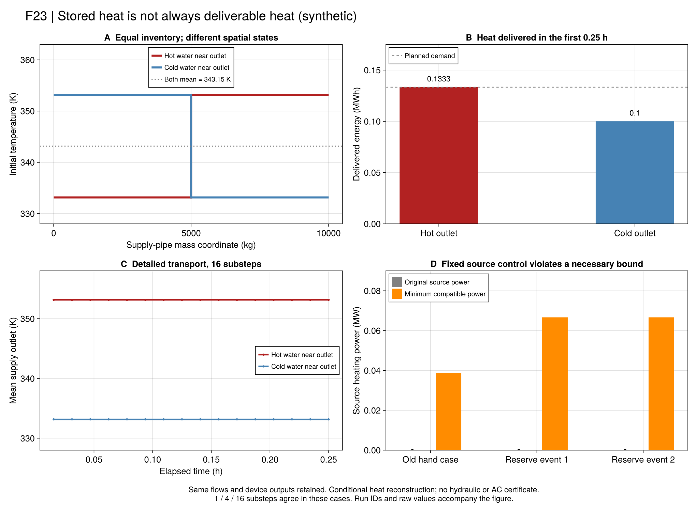

# R7：储热量与灾后热量交付

后续[温区相容端口与规划](ch06-ports.md)已重新优化恢复控制并检验原零失供要求；
本页39项固定控制历史结果保留，后续证据不改写其当时判定。

本批检查[双水箱恢复](ch06-recovery.md)及[嵌套规划](ch06-adversary.md)的一个关键边界：
**固定原恢复的流量和设备出力时，原定热量能否在逐管温度模型中送到负荷？**
采用版`r7_thermal_reconstruction_v1`；方程、初态与单位见[权威台账](ch06-thermal-equations.md)。

## 为什么总热量仍不够？

一根管道前半段较冷、后半段较热，与顺序颠倒的管道可以有相同质量平均温度和储热量。
故障刚开始时，负荷先收到靠近出口的水。若这些水温较低，允许的回水温度下限会限制可交付热量，
即使上游的热水已经计入总库存，也需要时间才能到达。

论文PDF115–116（印刷98–99）明确用双水箱状态替代节点、管道温度变量，并采用近参考温度的交换近似。
本检查保留原结果，单独检验这种聚合在当前输入上的适用性；没有把项目反例当成作者全部数值结果失效。

## 固定什么，重新求什么？

| 内容 | 本批处理 |
|---|---|
| 电拓扑、设备电热出力、管流、源荷端口流 | 完整继承原恢复候选 |
| 初始管温分布 | 正常事件沿用完整质量段；旧均温只有显式均匀假设才能使用 |
| `same_dispatch` | 原热交付逐子步固定，只寻找相容温度状态 |
| `curtail_heat` | 保持以上控制，仅允许增加热失供；界只属于该条件问题 |
| 供、回水输运 | 分别步进；反流切换实际入口，停流继续冷却且没有出口温度 |
| 热量核查 | 端口功率、节点混合、空间温度和独立积分总守恒 |

固定流量后，这些方程对温度为线性关系。因此新增接口构建LP，不需要增加优化软件依赖。
验证器不用建模矩阵，而是以保存温度重新调用水团回放并核对能量。

### 必须保留的时间离散边界

管内使用项目[连续塞流参考](ch06-pipe-state.md)，它精确处理**给定的分段常入口**。
节点混合与端口功率只在子步平均意义闭合，并未证明瞬时混合始终满足。
本批比较每原时段1、4、16子步；细分稳定是数值证据，不是普遍的连续系统误差界。
逐管空间温度检查覆盖每个子步边界的全部质量段两端，不是只检查均温。

这条参考路线与实际软件中按输运时延建模的思想相关，但不等价于引入该软件完整元件。
例如[LBL Buildings管道文档](https://simulationresearch.lbl.gov/modelica/releases/v11.1.0/help/Buildings_Fluid_FixedResistances.html)
还列出管壁热容、压降和连接处状态等建模选项。本项目本批仍不认证水力、管壁热容或交流潮流。

## 先冻结的解析对照

配置在`configs/r7/thermal-freeze.toml`，冻结在新热重构优化之前。

1. **稳态：**热源与负荷均0.4MW，供回温343.15/313.15K，流量由30K温差确定。
2. **空间前锋：**持续0.25h，供管两半各5000kg、温度333.15与353.15K；平均均为343.15K。
   两种排列的回水均为313.15K，热源0.4MW，目标供热8/15MW。
   窗口内仅输运20000/7kg，不到半管，出口始终由初始下游半管决定。

出口353.15K时可通过40K温降满足目标；出口333.15K时，303.15K回温下限把供热限制到0.4MW。
因此后一排列需要额外失供`(8/15-0.4)×0.25=1/30 MWh`，尽管初始总库存相同。
这也是为什么不能用相同均温替换空间初态后宣称得到相同恢复能力。

## 正式结果：39项条件重构

原值见`results/summaries/r7-thermal-20260920-v1`。六组输入各执行两种模式、三种细分，共36项；
另有三个16子步的Clarabel对照。18项有合格温度候选，21项报告条件模型不可行。
15项HiGHS候选具有有效同模型最优界；Clarabel三项通过物理回代并与对应HiGHS目标满足A2，
但接口没有返回有效目标界，不能把其`OPTIMAL`字样当作另一份间隙证书。

| 固定控制与初态 | 原交付能否重构？ | 只增加热失供后的结果 |
|---|---|---|
| 稳态均匀管温 | 可以 | 热失供0 |
| 热水位于出口端 | 可以 | 热失供0 |
| 冷水位于出口端、相同平均库存 | 不可行 | 热失供1/30 MWh；解析值与三个细分一致 |
| 旧故障手算候选，显式均匀假设 | 不可行 | 源端口仍冲突 |
| 193.275USD规划的两个事件恢复见证 | 均不可行 | 两个见证源端口仍冲突 |

### 这怎样改变对上一轮结果的评价？

上一轮193.275USD仍是**双水箱采用模型及既定正常控制域内**的认证费用，原运行不改判。
这次新增检查表明，两个已保存恢复见证不能直接升级为详细热可行调度：

- 它们的热源功率为0，但源端口循环流为约1.587302kg/s。
- 在该输入的供温下界与回温上界间仍有10K温差，因此至少需要`1/15 MW ≈ 0.066667 MW`加热功率。
- 原定0.4MW负荷交付，也超过该流量与50K最大允许温差给出的`1/3 MW`上限。

这里的端口冲突不依赖输运离散精度。增加热削减只能缓解负荷端，不能消除源端的正加热要求。
原端口温差包络允许源温差0、负荷温差60K，分别比恢复温度区间能实现的条件更宽。
审计表`port-audit.csv`保留每个节点、时段、场景的数值与原运行ID。

**上述结论针对这两个固定控制见证。** 还没有证明更换流量、设备调度或明确增加旁通后的恢复问题不可行。
源温约束在灾时是否仍对无加热循环适用，也是必须显式声明的运行边界；不能为获得通过而临时取消。
下一步应把相容的端口必要条件和热交付检查接回恢复/规划，并比较修正后的失供和费用。

图从保存结果重绘，包含热端/冷端初态、真实出口轨迹、交付能量与最小源功率。
图中的失败属于条件重构，不表示已证明全部恢复控制不可行。

## Julia与只读重验

~~~text
julia +1.12.6 --startup-file=no --project=. scripts/test_r7_thermal.jl
julia +1.12.6 --startup-file=no --project=. scripts/check_r7_thermal.jl
julia +1.12.6 --startup-file=no --project=. scripts/r7_thermal_study.jl run results/runs/<new-directory>
julia +1.12.6 --startup-file=no --project=. scripts/r7_thermal_study.jl check results/runs/<saved-directory>
julia +1.12.6 --startup-file=no --project=. scripts/report_r7_thermal.jl check results/summaries/r7-thermal-20260920-v1
~~~

运行保存父恢复、空间初态、子步约定、温度、逐行残差、源码和哈希，拒绝覆盖旧目录。
`same_dispatch`失败只意味着这个固定控制不能在所声明热模型下重构，不能直接认定所有恢复控制均不可行。

## 原生API

~~~@index
Pages = ["ch06-thermal.md"]
~~~

~~~@docs
PaperRebuild.r7_thermal_spec
PaperRebuild.r7_thermal_port_witness
PaperRebuild.build_r7_thermal_reconstruction
PaperRebuild.solve_r7_thermal_reconstruction
PaperRebuild.validate_r7_thermal_reconstruction
PaperRebuild.save_r7_thermal_reconstruction
PaperRebuild.read_r7_thermal_reconstruction
~~~
