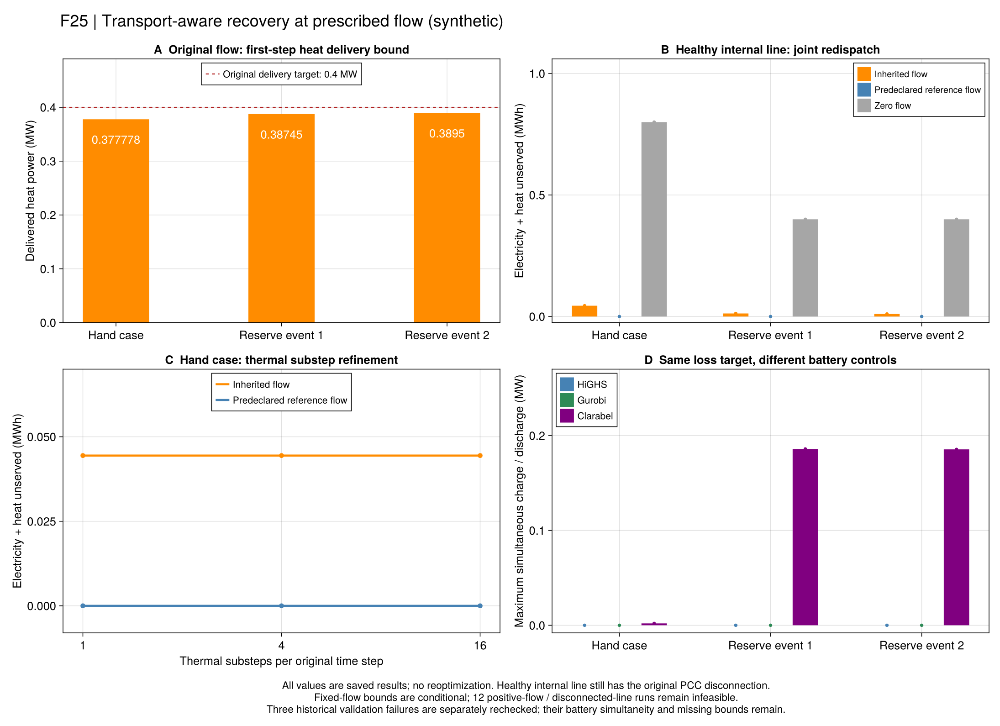

# R7：把真正到达的热量接回恢复调度

[端口温区](ch06-ports.md)是必要条件，但不知道当前到达的是哪一段水。
本批追踪三个既有失败调度的实际出口温度，并在同一输入下重新优化设备与失供。
采用版`r7_transport_recovery_v1`；[公式与符号](ch06-transport-equations.md)为权威台账。

## 一段水说明了什么？

手算例的原调度流量为2.248677kg/s，源产热和负荷交付均为0.4MW。
供管初始出口343.15K、回管初始出口313.15K。首个1/16h只排出约505.95kg，
小于每管10000kg；新入口温度此时还不能改变出口。

源供水最高353.15K、负荷回水最低303.15K，所以两个端口此时最多实现40K温差。
分别可承担的功率为

~~~math
\frac{4200}{10^6}\times2.2486772486772484\times40
=\frac{17}{45}\ \mathrm{MW}<0.4\ \mathrm{MW}.
\tag{R7-D-H1}
~~~

两个端口各差1/45MW。这不需要通过求解器的“不可行”字样猜测，也不依赖输入温度能取到全局50K温差。
程序对完整时段、每个场景分别回放入口温度上下界；初态、混合与源荷端口之间都有可核对数值。
这是一组足以解释原调度失败的必要条件，未声称找到了唯一或最少约束的不可行子集。

## 重新优化什么？

新模型给定一条完整流量计划，联合选择电拓扑、设备出力、储能动作、电热失供和逐管温度。
相同管流下，输运系数已知，热方程是线性的；固定电拓扑后为LP，允许电重构时为MILP。
原设备和线性电网采用关系保留；电池同时充放的独立标志也保留，不据此认证完整交流电网。

双水箱总库存、Taylor交换和对应库存递推被显式替换为逐管状态。
它们描述不同的热动态，不能把两组递推同时强加后，再将组合不可行当成物理系统不可行。
实现通过[JuMP的约束删除接口](https://jump.dev/JuMP.jl/stable/manual/constraints/#Delete-a-constraint)
按明示清单替换，旧建模入口默认不变。

独立验证分两块：共用设备/电网/流量方程逐项重算，热网用保存温度和显式流量计划重新作水团回放。
缺一块不判通过。`aggregate_heat=false`只能验证共用块，其`model_pass`始终为false，
不能把被替换热关系的局部检查冒充完整双水箱认证。

### 保留的适用边界

- 流量按显式计划固定，跨新能源场景共享；设备与失供按原时间步优化，温度按子步计算。
- 全变流量搜索、完整正常控制域及详细热安全规划尚待连接。
- 连续管内参考使用分段常入口；节点与端口仍在子步平均意义闭合，未认证连续节点或水力。
- 固定流量的最优性界只属于该条件问题；条件不可行不证明所有流量不可行。
- 不引入旁通，不免除源停机温度边界，不改变原初始空间状态、负荷、容量或验收阈值。

## 冻结的正式研究

`configs/r7/transport-study.toml`预先定义37项：24项HiGHS/Gurobi主比较、6项停流、
3项固定拓扑Clarabel对照，以及手算例1/4子步的4项细分。
每方法共享600秒；输入、规则、记录ID和源码先冻结，再运行。

流量有三种明确来源：原父调度、原参考温差下负荷需求的手算流量、零循环。
参考流量由声明的负荷和30K参考温差决定；若超原边界就拒绝构造，不修改设备或温区。
三个原失败调度、原规则及其反例均保留；37项已实际运行完成，原输入与数值没有重算。

## 这一轮说明了什么？

原报告`results/summaries/r7-transport-20260920-v1`按冻结源码独立重验通过。
下表仅比较内部线路健康、灾时PCC仍断开的三个原输入；失供包括电量与热量。

| 给定流量计划 | 手算例/MWh | 储备事件1/MWh | 储备事件2/MWh |
| --- | ---: | ---: | ---: |
| 原父调度流量，详细模型重新调度 | 0.0444444444 | 0.01255 | 0.01050 |
| 实验前按原30K参考温差计算的流量，详细模型重新调度 | 约0 | 约0 | 约0 |
| 零循环流量 | 0.8 | 0.4 | 0.4 |

HiGHS与Gurobi的六组可行目标对照通过A2，最大绝对差约1.12e-16MWh；
12个对应候选均通过采用模型、条件最优性及电池非同时充放检查。
手算例使用1、4、16子步，原流量均得2/45MWh失供，参考流量均在A1内为零。
这个细分检查支持当前解析例，不能推广为所有输运输入的离散误差证明。

因此，本批有三个可以区分的结论：

1. **原调度的失败已有温度—输运依据。** 首步实际到达的水限制端口功率，
   总库存与全局温差包络不足以保证当时的交付量。
2. **固定原控制失败，不代表改变控制后也无法恢复。** 同一初态和设备边界下，
   原父流量允许部分恢复；采用预先声明的参考流量并重新调度，可得到零失供候选。
   这里同时改变了流量与设备调度，尚未分离管内储热、电池或流量调节各自的价值。
3. **真实故障边界仍然存在。** 内部线路再断开时，12项正流量运行在两求解器下均条件不可行。
   停流的三个输入可行，但分别失供0.8、0.4、0.4MWh。这没有推翻前批的孤岛热失供证书。

### 验证器修正与独立的电池限制

37项原运行中有22个候选通过原验证，12项条件不可行，3项Clarabel候选原验证失败。
只读审计逐行保留失败残差；本地完整表为`r7-transport-audit-20260920-v1`，
公开包为`r7-transport-audit-public-20260920-v1`。残差CSV超过单文件5MiB限制，
因此按完整行分片；拼接哈希须与原CSV逐字节相同，不删掉通过行或失败行。

审计发现一个项目验证器错误：固定为零的负荷端口流量有1.85e-19至3.36e-19kg/s正尾差，
验证器据此激活了原LP并未包含的正流温差约束，造成20–31K的假冲突。
热LP的系数与停流分支实际上由**输入计划**确定；修正版据此回放，同时独立检查保存流量
与计划的等式残差，阈值仍为1e-6kg/s。不裁剪原值、不放宽温度A1，也不重新优化。
该修正只影响逐管联合调度验证；旧独立温度重构的输入语义保持不变。

补证位于`r7-transport-recheck-20260920-v1`，保留原值哈希与新验证器源码。
三个原值现在通过采用模型；三项最大归一化热残差分别约6.86e-8、3.56e-7、9.02e-8，
原失败标志仍留在原报告。它们没有有效求解器最优界，不能补造条件最优性认证。

另一个问题独立存在：三项Clarabel候选同时充放分别约0.001955、0.185873、0.185432MW。
本批沿用的原电池和式边界没有排除这种选择，零失供目标也未区分这些调度。
因此，补证后的25个采用模型候选中，22个同时通过电池非同时充放检查；
不能把余下3项写成完整可执行调度，更不能归因于Clarabel一定比其他求解器差。
同一个目标值不保证同一组控制量，下一批须单独检验电池运行域与资源价值。

## 下一步的研究顺序

1. 将已验证的逐管热交付关系接入流量选择，再连接灾前正常调度及安全规划。
   当前只比较三类给定流量，没有认证自由流量最优值或完整故障安全规划。
2. 显式区分论文采用的电池和式域与逐时互斥域，保留本批原值；
   在共同初态、设备、负荷、故障和终端条件下做资源去除对照，分离电池、管内热状态及重构的贡献。
3. 完成边界明确的R8机制实验后继续R9场景迁移与全文规模、数据和教程验收。
   本轮解释的是合成小系统中的机制和实现问题，不能解释作者原数据的成功原因或宣布全文复现完成。

## 操作与验收

~~~text
julia +1.12.6 --startup-file=no --project=. scripts/test_r7_transport.jl
julia +1.12.6 --startup-file=no --project=. scripts/check_r7_transport.jl
julia +1.12.6 --startup-file=no --project=. scripts/r7_transport_study.jl freeze results/runs/<new>
julia +1.12.6 --startup-file=no --project=. scripts/r7_transport_study.jl run results/runs/<frozen> open
julia +1.12.6 --startup-file=no --project=tools/solvers scripts/r7_transport_study.jl run results/runs/<frozen> gurobi
julia +1.12.6 --startup-file=no --project=. scripts/r7_transport_study.jl report results/runs/<complete> results/summaries/<new>
julia +1.12.6 --startup-file=no --project=. scripts/r7_transport_study.jl check results/summaries/<saved>
julia +1.12.6 --startup-file=no --project=. scripts/audit_r7_transport.jl create results/summaries/<saved> results/summaries/<new-audit>
julia +1.12.6 --startup-file=no --project=. scripts/pack_r7_transport_audit.jl pack results/summaries/<audit> results/summaries/<new-public-audit>
julia +1.12.6 --startup-file=no --project=. scripts/pack_r7_transport_audit.jl check results/summaries/<saved> results/summaries/<public-audit>
julia +1.12.6 --startup-file=no --project=. scripts/recheck_r7_transport.jl create results/summaries/<saved> results/summaries/<new-recheck>
julia +1.12.6 --startup-file=no --project=docs scripts/plot_r7_transport.jl results/summaries/<saved> results/summaries/<recheck> results/summaries/<new-figures>
~~~

先看采用模型是否通过，再看热回放、充放标志和条件界；不要只看目标值。
原值与源码存档，重验和绘图不重新优化。
审计和补证的`check`子命令核对各自冻结证据；新运行使用当前验证器，旧报告只用自带源码重验。

## 原生API

~~~@index
Pages = ["ch06-transport.md"]
~~~

~~~@docs
PaperRebuild.r7_transport_spec
PaperRebuild.r7_transport_port_witness
PaperRebuild.build_r7_transport_recovery
PaperRebuild.solve_r7_transport_recovery
PaperRebuild.validate_r7_transport_recovery
PaperRebuild.save_r7_transport_recovery
PaperRebuild.read_r7_transport_recovery
~~~
