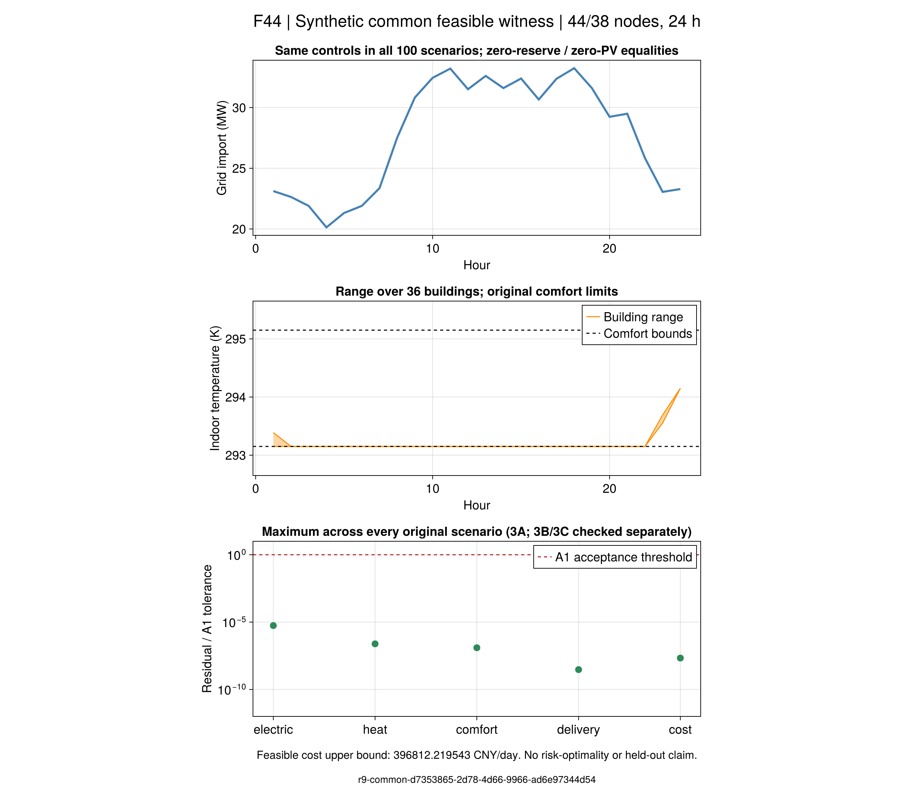

# 第7.4节：共同可行调度与规模诊断

[百情景三方案](ch07-risk-results.md)均在预算内超时而无候选。
本节点先检验可行性，再判断求解路径；不修改原输入，也不把受限问题当作原优化问题。
本页“原模型/原情景”指本项目此前冻结的核查版模型与合成输入，不指作者未公开的原始数据。

**实际结果：同一共同调度在3A、3B、3C各100个原情景中通过模型、风险和费用检查，
给出396812.219543 CNY/日的可行费用上界。** 它满足额外零备用、零实际PV出力等式，
不能当作备用收益最优解。旧三项超时无候选状态保持，现有证据支持优先研究同模型求解路径。

## 结果说明了什么

| 要回答的问题 | 本轮证据与边界 |
|---|---|
| 百情景模型是否完全没有可行调度？ | 已有同一原输入下、通过原A1的共同调度；旧超时没有不可行证明 |
| 是否已比较三种风险方案的优劣？ | 没有。三方案检验的是同一保守调度，不是分别优化出的结果 |
| 是否证明备用能带来收益？ | 没有。本见证的备用承诺接近数值零，只提供可行初值和费用上界 |
| 是否解释了全部求解瓶颈？ | 没有。排除了“未找到候选就等于没有可行调度”的判断；具体计算瓶颈仍需同模型对照 |
| 与原论文是否相同？ | 保留共同承诺、随机调用、电热补救及舒适风险结构；合成输入、有限支持和采用物理边界仍有区别 |

因此，本节点解决了一个方法推进的前提问题。它不证明三方案排名、论文报告的费用改善，
也不认证原交流潮流、完整热水力或未知分布下的可靠性。

## 一个可检验的共同调度

冻结情景只改变PV可用量和备用调用。若实际PV出力和上下备用承诺都为零，
其他控制取同一条24小时轨迹，则调用不再改变交付指令；原PV可用量仍然保留。
采用额外控制等式：

```math
R_t^{\mathrm{up}}=R_t^{\mathrm{down}}=0,\qquad
P_{g,t}^{\mathrm{PV}}=0,\qquad u_{s,t}=u_t\quad(\forall s).
\tag{R9-CW1}
```

这些等式缩小可行域，只用于构造一个可行见证。设备、网络、负荷、价格、初始热历史、
建筑末温和硬舒适边界均保留。若受限问题不可行，原问题仍可能通过使用PV或备用调节而可行。
若成功，必须把原值复制到每个原情景并用原验证器逐项检查；不能只检查平均情景。

费用上界来自经过验证的可行调度。受限问题的下界不会作为原风险问题的下界，
受限最优也不表示备用配置最优。这里没有估计或恢复作者未公开的初始解。

## 恒定费用的最坏分布证书

共同调度使每个情景的补救费用相同，且均满足舒适时，费用和事件分数分别为常数。
对任意冻结运输半径，以下原对偶构造给出同一目标值：

```math
q_s=\bar q,\qquad
\Pi_{ij}=p_j\mathbf1_{i=j},\qquad
\lambda=0,\qquad\nu_j=\bar q,
\qquad\sum_{ij}q_i\Pi_{ij}=\rho\lambda+\sum_jp_j\nu_j=\bar q.
\tag{R9-CW2}
```

经验概率位于自身运输球内，对角运输的距离为零。
实现检查原始质量、非负性、预算、对偶不等式及原对偶差，并与独立运输LP对照。
费用不相等时拒绝套用此证书，不能用取整制造“相等”。

求解器的零控制可能留有微小数值残差，逐情景回算的费用因此不逐位相等。
此时保留全部原值，对角运输仍给出可行下界，常数对偶给出上界：

```math
\sum_s p_s q_s\le \sup_{\pi\in\mathcal P}\sum_s\pi_s q_s\le\max_s q_s,
\qquad \lambda=0,\quad \nu_j=\max_s q_s.
\tag{R9-CW3}
```

只在原运输验证器的A2间隙门槛通过时采用这个简单证书，不宣称上下界精确相等。
费用离散较大时明确拒绝，须另解运输LP。这与把费用舍入成常数不同。

## Julia 入口

```@index
Pages = ["ch07-common-witness.md"]
```

```@docs
build_r9_common_witness
solve_r9_common_witness
r9_common_risk_candidate
r9_constant_transport
r9_diagonal_transport_bound
r9_risk_start_values
audit_r9_risk_start
```

单位仍为MW、MWh、K、h、CNY；``u``表示既有设备与网络变量的共同控制集合，
不是额外物理装置。``p,\rho,q,\Pi,\lambda,\nu``沿用[风险台账](ch07-risk-generated.md)的作用域。
源码及测试映射在`docs/reading/ch07/risk-study.toml`。

## 运行与判定

Julia脚本`scripts/r9_reserve_witness.jl`提供`freeze`、`run`、原值`replay`和只读`check`。
输入与新代码先冻结，求解使用冻结副本；完整过程共600秒，受限优化最多180秒。
全部原数值保留，保存原验证器的每情景结果和各组最大归一化残差；重读不重新优化。

### 实际结果与失败记录

共同构造器使用Clarabel，受限模型报告OPTIMAL。候选的零控制等式最大残差为
``2.2784\times10^{-13}``MW，全部数值原样保留。首次构造及验算耗时131.30秒，
因费用未逐位相等而记录`execution_error`；这条历史没有改写为通过。

三方案逐情景实际补救费用为104761.87312745827–104761.87312746176 CNY，
差约``3.4925\times10^{-9}``CNY。新版本采用(R9-CW3)的原对偶界，
在A2门槛内重新核验同一原字节候选，没有再次优化，也没有把实际费用舍入。

| 指标 | 3A | 3B | 3C |
|---|---:|---:|---:|
| 原情景数 | 100 | 100 | 100 |
| 模型/风险/费用 | 通过 | 通过 | 通过 |
| 日前费用 CNY | 292050.346415 | 292050.346415 | 292050.346415 |
| 经验净费用 CNY/日 | 396812.219543 | 396812.219543 | 396812.219543 |
| 最坏净费用上界 CNY/日 | 396812.219543 | 396812.219543 | 396812.219543 |
| 最坏舒适事件概率 | 0 | 0 | 0 |
| 原风险优化完成 | 否 | 否 | 否 |

表内一致来自复制同一调度及本见证的零事件，不代表三个优化问题等价。
新原值重验完整进程156.91秒，预算600秒；它是独立验证耗时，不是原百情景优化求解时间。
`valid_bound=false`指尚无该候选所属原优化运行的有效最优性下界，不否定已经核验的可行费用上界。

### 映射回原完整模型

原3A模型保留1061074个变量、2735895条约束（含变量集合）、零二元变量。
共同控制、费用上图和运输对偶初值完整映射后，所有原线性行及变量界检查通过：
最大原始违反约``1.4552\times10^{-11}``，最大行归一化违反约``4.2851\times10^{-12}``。
检查完整进程93.92秒，没有调用优化器；行归一化门槛``10^{-8}``不能替代已单独通过的物理A1。

可选Gurobi小例已分别验证LP的`PStart`和MIP的`Start`传入、原生列映射及数值回读，17项通过。
这只证明初值接口工作，完整100情景的带初值求解尚未执行。
两种属性的作用不同，参见[Gurobi初值属性](https://docs.gurobi.com/projects/optimizer/en/current/reference/attributes/variable.html#attrpstart)
和[LPWarmStart](https://docs.gurobi.com/projects/optimizer/en/current/reference/parameters.html#parameterlpwarmstart)。

### 只读重验与重绘

输入/实现分别冻结在`results/summaries/r9-common-input-20260921-v1`及`v2`；
二者保留相同原研究输入，v1保留严格常数判定失败，v2提供有界运输证书。
公开数值见证在`results/summaries/r9-common-evidence-20260921-v1`，
原始完整模型初值审计在`results/summaries/r9-common-start-20260921-v1`。
输入与见证包配对即可重验，无须本地`results/runs`或Gurobi许可。

```sh
julia +1.12.6 --startup-file=no --depwarn=error --project=. scripts/test_r9_common_evidence.jl results/summaries/r9-common-input-20260921-v2 results/summaries/r9-common-evidence-20260921-v1
julia +1.12.6 --startup-file=no --project=docs scripts/plot_r9_common_witness.jl results/summaries/r9-common-input-20260921-v2 results/summaries/r9-common-evidence-20260921-v1 results/runs/r9-common-redraw-new
```



F44保留MW、K和残差/容差单位。零残差只在对数显示时设``10^{-12}``下限，
图源表保留原值；图中原生轨迹没有裁剪成零。图表来自同一见证，不构造三条虚假的优化轨迹。

## 下一批的明确顺序

1. 冻结同输入、同门槛、同600秒预算的三方案带初值求解；分别记录初值、实际候选、界与终止状态。
2. 与原冷启动比较是否取得候选、费用改善和有效间隙。构造/映射耗时单列，不预称端到端加速。
   若仍受限，再依据实际建模/求解数据判断是否采用已有分解接口，不以更换样本或半径获得成功。
3. 锁定训练候选后，按事前划分开展样本外交付、舒适和费用评价。随后继续7.5与R10，
   7.2可信对偶和7.3可实施分歧点保持局部开放，不将本见证冒充整章完成。
