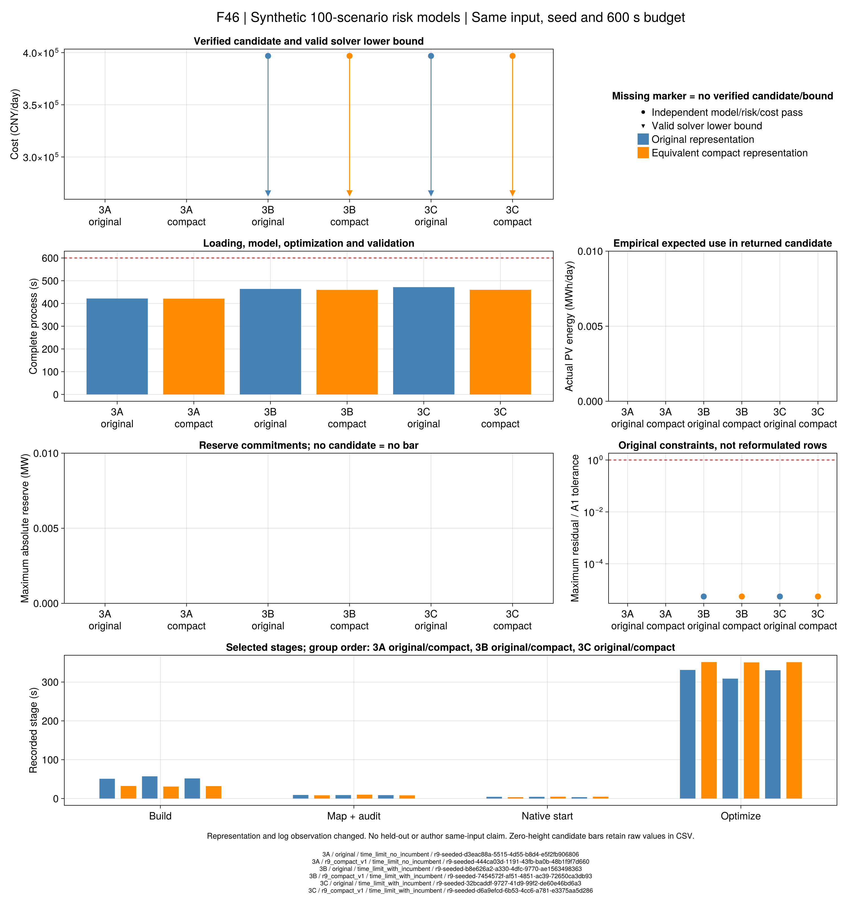

# 第7.4节：保持原模型的紧凑表示

上一轮[带初值对照](ch07-seeded-risk.md)中，3B/3C返回了合格调度，但费用仍为
396812.219543 CNY/日，备用接近零，间隙32.9549%；3A超时无新候选。
这说明可行见证与验证链条已有证据，尚不能比较三方案经济性。

本节点检验一个具体问题：**改变同一数学问题的装配方式，能否降低计算负担？**
模型表示命名为`r9_compact_v1`。它不是新的风险模型，不修改支持、概率、半径、价格、
交付和舒适边界，也不改变A1/A2。以下三项先证明等价，再进行规模对照。

## 1. 原上下界用原生变量界表达

只处理原系数台账显式标为`bound=true`、单个系数严格为1、右端有限的上下界。
例如原矩阵行与新变量域表示：

```math
1\cdot y_j\ge l_j,\quad 1\cdot y_j\le u_j
\quad\Longleftrightarrow\quad y_j\in[l_j,u_j].
\tag{R9-CX1}
```

一般设备或网络单项关系仍保留为约束；不因它只含一个变量就擅自改类。
重复上下界、非单位系数和错误方向被拒绝。
[JuMP约束文档](https://jump.dev/JuMP.jl/stable/manual/constraints/)区分变量域与仿射约束的表示；
这里保留原行ID到实际上下界引用的映射。
数学约束仍然存在，不能把原生边界从矩阵中移出称为删除物理限制。

## 2. 只移除精确零系数

```math
\sum_j a_jy_j=\sum_{j:a_j\ne0}a_jy_j.
\tag{R9-CX2}
```

代码仅使用`iszero(a_j)`，不设数值截断阈值；例如``10^{-30}``也保留。
不改变变量单位、右端、容差或原数据。需要由当前求解器实际计时确认影响，
因为前端或求解器也可能已经处理了部分零项。

## 3. 用等式定义情景费用

原费用运输约束反复引用每个情景的完整费用表达式。新表示引入一个**自由**费用变量：

```math
q_s=\sum_j c_{s,j}y_{s,j},\qquad
\lambda_Cd_{sr}+\nu_{C,r}\ge q_s.
\tag{R9-CX3}
```

每个原可行点都可通过唯一的``q_s=c_s^{\mathsf T}y_s``扩展；
从新可行点消去``q_s``便恢复全部原运输行。目标表达式不变，所以实数算术下可行域投影和
最优值完全相同。没有添加人为费用上下界，也没有用单向不等式代替定义等式。
浮点求解的残差仍由原验证器按原A1/A2检查。

新表示每情景增加一个变量和一条定义等式，减少费用系数在运输行中的重复。
因此“紧凑”指矩阵表达与重复项，**不是变量总数必然减少**。

## 原值与初值怎样保持可核查

- 共同初值仍从原已核查调度读取；新增费用变量用其原费用计算。
- 每条原行保留映射，初值仍检查实际模型的全部行；原生PStart/Start逐值读回。
- 解的设备、网络、承诺与风险变量仍由原数值接口提取。
- 保存后使用原`validate_r5_risk`重算物理、成本、风险及有效界，不用新模型的求解状态代替。
- `representation`和新代码哈希单独保存；旧输入、模型版本及历史文件不迁移。

原生LP/MIP初值属性的区别仍按[Gurobi说明](https://docs.gurobi.com/projects/optimizer/en/current/features/warmstart.html)处理。
新入口显式开启求解日志，并检查文件中存在实际优化进度；仅有日志文件头不算启用成功。

## Julia入口与测试

```@index
Pages = ["ch07-compact-risk.md"]
```

```@docs
build_r9_compact_risk
PaperRebuild.r9_logged_risk_optimize!
```

求解复用[`solve_r9_seeded_risk`](@ref)，显式指定`representation=:r9_compact_v1`；
旧调用默认仍为原表示。例：

```julia
model = build_r9_compact_risk(case; optimizer=optimizer_factory)
# 构造不求解、不写文件；正式运行通过下列冻结脚本入口。
```

数学测试`test/r9_compact_risk.jl`对三个解析小例的LP/MILP逐行消元核对、比较目标、
双向传递可行点，再通过原验证器和存档重读。它检验的是模型等价与接口，不能证明百情景加速。

本节点已通过84项数学/集成、16项本机Gurobi原生初值/实际日志、30项冻结兼容检查。
原生日志测试首版通过但出现Windows临时文件仍被占用的清理警告；新版保留独立日志目录，
再次16项通过且无该警告，原日志保留。这不改变科学模型或验收门槛。

```sh
julia +1.12.6 --startup-file=no --project=. scripts/test_r9_compact_risk.jl
julia +1.12.6 --startup-file=no --project=. scripts/test_r9_compact_native.jl
```

## 事前比较协议与当前边界

协议`configs/r9/compact-study.toml`保留原100代表、三个案例哈希、共同初值与求解器参数。
每项完整600秒，优化截止420秒、独立运输截止480秒，余下用于原验证和保存。
先冻结源码、协议和父输入身份，按3A/3B/3C依次执行；不在看到费用后修改数据或预算。

已冻结`results/summaries/r9-compact-input-20260921-v1`，manifest SHA256为
`b3473ac124c64b7fef5789ef4638e3bf2a15ea11cfa0d30f5e0e2829acebe609`。
17项当前代码/案例/协议核对及549项旧带初值证据检查通过，旧数值与判定保持。
冻结包检查入口为`scripts/check_r9_compact_delivery.jl`；VS Code提供专项、冻结、批量运行及重读任务。

```sh
julia +1.12.6 --startup-file=no --project=. scripts/r9_seeded_study.jl freeze results/summaries/r9-common-input-20260921-v2 results/summaries/r9-common-evidence-20260921-v1 results/runs/r9-compact-input-new configs/r9/compact-study.toml
```

规模对照需要分别记录构建、初值映射、原生求解、原验证、封存耗时，及实际候选和费用界。
表达方式同时改变三项，并启用日志观测；即使出现改善，也只支持这个组合在当前输入上的结果，
不拆分未经实验控制的单因素贡献，不外推所有优化模型。

## 正式百情景对照：建模改善，优化仍未完成

三项已按冻结协议执行，完整进程均在600秒内。下表费用只来自通过原模型、风险和费用检查的候选。
3A的单纯形日志出现更低中间目标，但最终没有可提取候选，因此不填入可行费用列。

| 方案 | 原建模时间 / 新建模时间（s） | 新完整耗时（s） | 原值验收费用（CNY/日） | 新有效间隙 | 状态 |
|---|---:|---:|---:|---:|---|
| 3A | 50.92 / 32.35 | 421.14 | 无候选 | 未认证 | 超时无候选 |
| 3B | 57.18 / 30.80 | 459.70 | 396812.219543 | 32.9325% | 超时有候选 |
| 3C | 51.81 / 32.02 | 460.03 | 396812.219543 | 32.9296% | 超时有候选 |

3B、3C的旧间隙均为32.9549%；新下界分别为266131.910934、266143.683166 CNY/日。
间隙略缩小，候选费用没有下降，仍不能评价三方案的最优经济排序。
新日志确认3A使用初始向量，3B/C加载了用户MIP初值；后两项各仅返回一个解。
日志同时包含内部数值警告，保留原日志，不调整求解器参数挑选更有利结果。

这次证据支持三点：

1. 数学等价与程序实现已有专项验证；本次表示组合确实减少了记录中的建模时间。
2. 在同一有限预算下，优化仍主要停留在连续松弛求解，不能把建模加快写成完整风险调度完成。
3. 原始100支持输入存在通过声明模型的调度；这既不是作者同输入复现，也不是样本外或在线运行保证。

3B/C上下备用最大绝对值为9.55×10⁻¹⁴ MW，经验概率加权的实际PV电量为4.06×10⁻¹² MWh/日，
均是数值零。费用没有改善，既不能解释为备用收益，也不能解释为新能源消纳改善。
每份候选的100情景合计2187906项独立残差；保存后移位重读与篡改拒绝9项通过。
这里只认证采用的线性电网、固定流热核与有限支持风险模型，不扩大为完整交流潮流、水压或在线调度认证。

原数值封存在`results/summaries/r9-compact-evidence-20260921-v1`；
配对原表在`results/summaries/r9-compact-report-20260921-v1`。



图源及运行ID在`results/summaries/r9-compact-figures-20260921-v2`；全部图表只读保存结果。
首版PV坐标放大了浮点尾差，另在部分轴隐藏了无候选的3A位置，视检失败版本保留。
第二版使用共同横坐标和声明的数值零显示范围，已实际视检；CSV原数不舍入或覆盖。
下方阶段柱按3A原/新、3B原/新、3C原/新排列，记录阶段不组成完整且互斥的时间分解。

重验和重绘入口为：

```sh
julia +1.12.6 --startup-file=no --project=. scripts/seal_r9_seeded.jl check results/summaries/r9-common-input-20260921-v2 results/summaries/r9-compact-input-20260921-v1 results/summaries/r9-compact-evidence-20260921-v1
julia +1.12.6 --startup-file=no --project=docs scripts/plot_r9_compact.jl results/summaries/r9-compact-report-20260921-v1 results/runs/r9-compact-redraw-new
```

VS Code另提供配对报告、F46重绘、来源核查与交付检查任务。最终工程检查状态见任务记录。
对照只执行本轮事前声明批次，不原样无限重跑；后续若采用分解或别的求解表示，须另行说明和冻结。
样本外评价须先锁定训练候选，并明确其最优性未认证；相同控制的重复评价不能充作三方案收益差异。
第7.5节按独立输入推进，不要求本节先认证全部全局最优。
