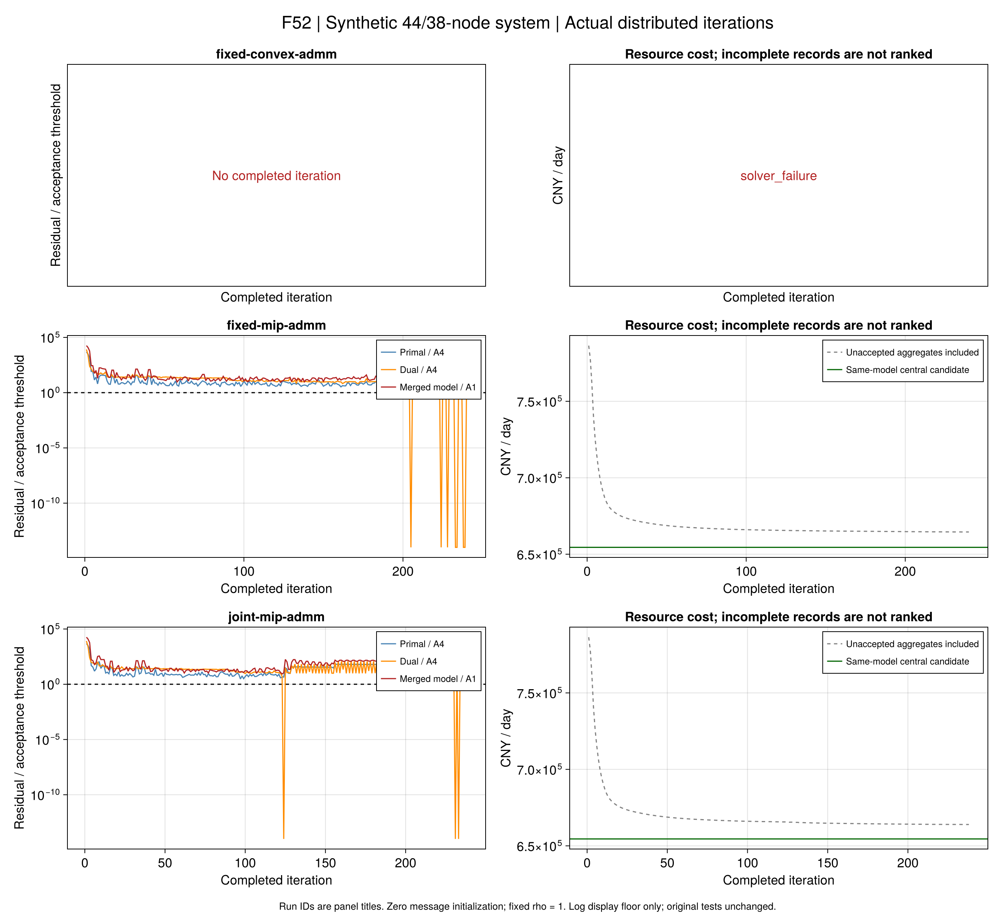
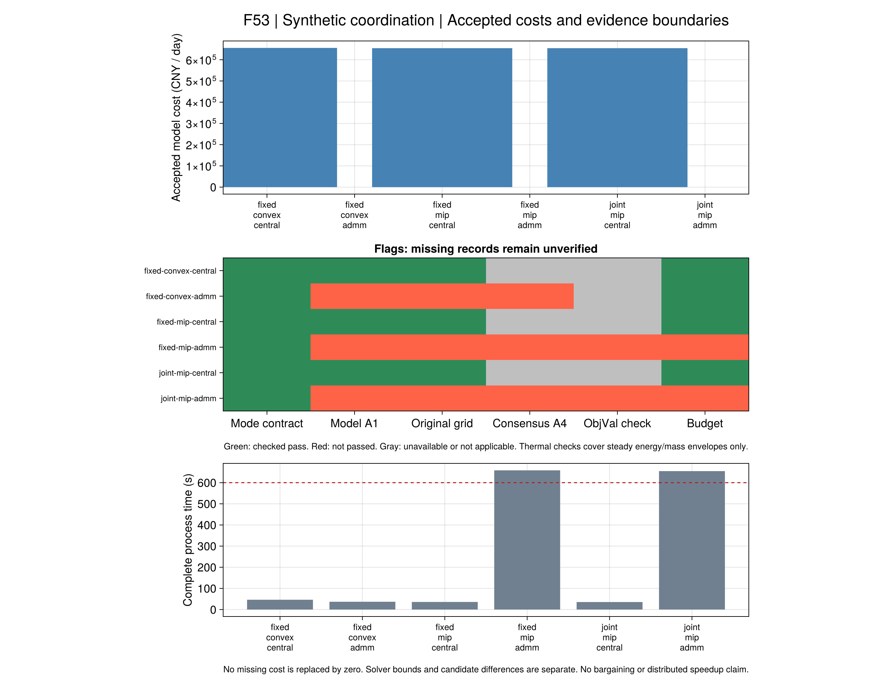

# 八聚合商怎样分别求解并协调网络？

本页接续[设备接入与集中基准](ch07-network.md)。集中模型由一个求解器同时看到全部设备和网络；
本节点将同一资源目标拆成多个主体块及一个运营商块，检验交换边界量能否恢复一致调度。
沿用[第4章原式核读与符号修正](ch04-distributed.md)，不将项目ADMM实现称为作者源码的等价实现。
数据仍为合成替代；规模正式对照、议价和完整热物理分别验收。

## 1. 每个主体传什么？

主体保留自己的设备、负荷偏好和储能初末条件。运营商保留自身资源、电网和稳态热网络。
两块之间需要传递四种量，不能仅传电热净量：

```math
b_{i,t}=\begin{bmatrix}
\sum_{g\in\mathcal G_i}(P_{g,t}^{gen}-P_{g,t}^{cons})-P_{i,t}^{D}\\
q_iP_{i,t}^{D}\\
\sum_{g\in\mathcal G_i}H_{g,t}^{gen}\\
H_{i,t}^{D}+\sum_{g\in\mathcal G_i}H_{g,t}^{cons}
\end{bmatrix},\qquad \underline b_{i,t}\le b_{i,t}\le\overline b_{i,t}.
\tag{R9-DC1}
```

第一项是向电网注入为正的净功率，第二项是无功需求，后两项分别是供热端口和用热端口。
储热放热进入第三项，充热进入第四项。即使两个主体接在同一个热节点，也保留各自身份，
最后才在节点守恒中相加。有限盒从原设备容量、可用功率和负荷范围推导，只是必要边界。

例如，某主体电负荷1 MW、光伏2 MW，净电注入为1 MW；若同时向储热充入0.4 MW，
这个热需求必须告知网络。只发送净热交换，不能完整约束供、用热端口的质量流量包络。
完整定义由[符号权威表](ch07-distributed-generated.md)生成。

## 2. 为什么拆开后仍是同一个资源问题？

设主体成本包含自己的资源消耗和不满意度；运营商还承担外部购电、自身资源及网络动作成本。
内部零售或P2P支付由账本处理，不能重复计入社会资源成本：

```math
\min_{y_0,y_1,\ldots,y_A}
C_0(y_0)+\sum_{i=1}^{A}C_i(y_i),\qquad
y_i\in\mathcal Y_i,\quad y_0\in\mathcal Y_0.
\tag{R9-DC2}
```

主体索引在本文数学式为1…A，Julia保存的运营商为actor=1、主体为2…A+1。
运营商优化各主体边界的副本；边界一致时才可以合成集中可行调度：

```math
b_i(y_i)=\widehat b_i(y_0)\quad(\forall i).
\tag{R9-DC3}
```

**从集中到分块：**把集中解的各设备控制交给其所属主体，把网络控制及边界交给运营商。
设备约束不变，原节点守恒被同值边界替代，成本逐项相加等于集中目标。

**从分块到集中：**保留运营商的网络变量，以各主体实际控制替换其边界副本。
当四类边界相等，原节点电、热、质量关系不变；各设备已经满足本地约束。
因此分块合并对应同一采用模型。这个论证要求固定模式一致、原端口容量保持，
并不证明电网锥松弛取等或稳态热量能由完整温度、水压动态实现。

测试中的集中解只用于检查上述数学嵌入。正式算法不接收集中解作为初值。

## 3. 怎样更新消息？

将各行通信量除以输入确定的尺度S；费用除以冻结正尺度C_s。
全部聚合商相互独立，所以把它们共同看作ADMM第一块，运营商为第二块：

```math
\begin{aligned}
y_i^{k+1}&\in\arg\min_{y_i\in\mathcal Y_i}
  C_i(y_i)/C_s+\frac\rho2\|x_i(y_i)-z_i^k+u_i^k\|_2^2,\\
y_0^{k+1}&\in\arg\min_{y_0\in\mathcal Y_0}
  C_0(y_0)/C_s+\frac\rho2\|z(y_0)-x^{k+1}-u^k\|_2^2,\\
u^{k+1}&=u^k+x^{k+1}-z^{k+1},\qquad x=S^{-1}b,\quad z=S^{-1}\widehat b.
\end{aligned}
\tag{R9-DC4}
```

运营商的乘子符号与主体相反。两边从零消息、零缩放乘子开始，每个模型只构建一次，
逐轮更换增广目标。每次完整运行最多600秒，最多1000轮，所有块共用截止时间。
串行模拟各主体交换信息，不等于多机部署或隐私隔离；保存全部原值是为了研究审计。

`r9_boundary_admm_fixed_v1`要求全部储能、热方向及适用网络开关模式显式固定；
这时块内为连续凸锥模型。`r9_boundary_admm_mip_v1`保留整数，是独立命名的启发式，
不能直接继承凸ADMM收敛结论。旧集中、独立运营及R1–R8接口保持原行为。

原论文罚系数递增、更新记号及范数形式的疑点仍保留在第4章台账。本项目采用固定正ρ和
一致增广拉格朗日推导。依据为[ADMM作者说明](https://web.stanford.edu/~boyd/papers/admm/)；
其中也强调，中间迭代可能尚不满足一致性，因此中间目标低于最优值不表示取得可实施收益。

## 4. 怎样判断成功？

```math
\|r^k\|_\infty=\|x^k-z^k\|_\infty\le10^{-4},\qquad
\|d^k\|_\infty=\rho\|z^k-z^{k-1}\|_\infty\le10^{-4}.
\tag{R9-DC5}
```

这是A4消息门槛。停止还要求用实际主体控制合并的调度通过采用模型A1。
不会平均不一致消息，也不会调用集中模型或修正程序制造可行候选。
原支路等式、稳态热量/质量、账本和费用检查分别保留；最好模型候选与最好原电网候选分别记录。
每块增广目标的界属于该子问题，不能相加当作社会成本下界。迭代停止不自动设置费用最优性完成。

完整迭代保存主体与运营商原变量、消息、缩放乘子、增广目标、原费用、实际状态及耗时。
独立重读重新计算每轮消息和合并方程；失败的半轮单列，不伪装成有效更新。
超时、缺许可、求解器不支持、证明不可行和数值失败分别报告。预算超出如实记录。

## 5. Julia与验证入口

```@index
Pages = ["ch07-distributed.md"]
```

```@docs
r9_boundary_contract
r9_trading_boundary
build_r9_distributed_block
R9DistributedSpec
solve_r9_distributed
validate_r9_distributed
save_r9_distributed_run
read_r9_distributed_run
```

```sh
julia +1.12.6 --startup-file=no --project=. scripts/test_r9_distributed.jl
julia +1.12.6 --startup-file=no --project=. scripts/check_r9_distributed.jl
julia +1.12.6 --startup-file=no --project=. scripts/r9_distributed.jl run INPUT.toml RULES.toml results/runs/r9-distributed NEW_RUN_ID
julia +1.12.6 --startup-file=no --project=. scripts/r9_distributed.jl check RUN_DIRECTORY
```

规则文件使用`schema="r9-distributed-rules-v1"`，显式给出`algorithm`、`rho`、`max_iterations`、
`budget_sec`、`solver`及`[solver_options]`；fixed版本还必须给出`[fixed_modes]`中完整的
`z_storage`、`heat_direction`，v2网络输入还包含`u_E`和`u_H`，均按行列数组存储。
Gurobi运行改用`--project=tools/solvers`；算法不因缺许可而自动改用其它求解器或整数版本。
VS Code提供相应测试、映射、符号同步、运行及重验任务；输入路径由使用者明确选择。

当前171项专项检查通过，覆盖两主体/八主体零初值迭代、手算费用、跨时储能与固定拓扑、
失败状态、原值重放、目标记录语义和篡改拒绝。44电节点/38热节点正式对照的失败与修订见后文；解析例的成功不能代替规模算法结果。
实际命令与原失败保存在`docs/agent/tasks/2026-09-22-r9-distributed.md`。
原AG0供热不足及第7.4节近零备用的负边界保持，不能因新的接口通过而改写。

两份命令行开发对照均从零消息运行4轮：Clarabel固定模式的最好采用模型费用为
100.000000003 CNY，Gurobi整数接口为99.999015426 CNY，均在手算100 CNY的A2门槛内。
这个微型整数例仅验证调用通路，不证明规模整数协调有效。两份原始输出的电网原等式均未通过，
只有模型A1和消息A4通过；辅助电流平方量的残差保留，费用差不能解释为经济优势。

额外只读诊断利用该手算例的零线路阻抗，按原支路等式重算电流平方辅助量，其余控制与费用逐位保持。
两份重构候选均通过采用模型及原电网检查；16项断言通过。原ADMM输出、最佳物理候选标志和存档未改写，
该诊断也没有反馈算法。零阻抗使辅助量不影响节点损耗和电压降；有阻抗网络必须重新核查全部依赖，
不能直接沿用这里的结论。通信量单位为MW/Mvar，内部P_branch/Q_branch已是标幺量，不能重复除基准。

## 6. 规模对照怎样预先固定？

`configs/r9/distributed-study.toml`声明六个方法，直接复用原网络批次的两份equipment输入。
44电节点、38热节点、八聚合商、24小时、设备、负荷、价格和容量均保持原字节。

| 配对组 | 离散范围 | 两种方法 |
|---|---|---|
| fixed-convex | 固定储能模式、热流方向及初始拓扑 | Clarabel集中／ADMM |
| fixed-mip | 固定拓扑，储能模式及热流方向可优化 | Gurobi集中／整数ADMM启发式 |
| joint-mip | 允许原输入中的电热网络重构 | Gurobi集中／整数ADMM启发式 |

第一组是控制离散因素后的连续基准。储能在电价不高于当日最低与最高价的中点时允许充能，
其余时段允许放能；实际功率仍由模型优化。热流方向采用管道参考正方向，所有开关固定初始状态。
这是由输入直接生成的项目规则，可能限制费用或可行性，不能冒称作者最优离散计划。
失败时保留结果，不改为从集中参考提取模式。后两组保留全部声明整数选择，单独评价启发式。

**首轮配置纠正：**原模式生成器把两条关闭热联络管的方向变量也设为1，违反既有
`heat_direction ≤ u_H`。两管×24时段共48条`1≤0`矛盾，属于项目配置错误，
不能把该连续集中不可行和分布失败当作算法反例。原六项清单及记录保留。
`configs/r9/distributed-fixed-correction.toml`独立冻结修正后的连续配对：开管取参考正向，
闭管方向取0。输入、价格、设备、ρ、预算和验收门槛保持；四项不受影响的整数运行不改写。
修正消除了这项已证明的矛盾，不预先保证整个连续模型可行。

另有整数分布运行在最终增广目标核验时抛出错误，原版未保存完整数值，不能评价其迭代质量。
`on_raw_result`诊断回调现在可在最终核验前保存深副本；回调不修改原结果，核验失败仍抛出。
保存了原值不等于验证通过；后续须定位具体误差，不能直接放宽判定门槛。

**方向修订对照：**关闭管纠正后，原固定模式仍在第8时段违反一个区域热量必要界。
区域内热源上限合计9.2 MW，最低负荷约9.052167 MW；内部散热加唯一向外管道的最小入口热量
至少0.405371 MW，超过最多0.147833 MW的净供给，缺口约0.257537 MW。
这是该固定方向/储能模式子集的不可行证据，不能推广到允许反向和模式优化的整数模型。

`configs/r9/distributed-corridor-study.toml`在后续优化前声明反向走廊`5→24→25→3`，
其余输入与原数值规则保持；每个中央/分布配对使用相同模式。修订依据为上述事后诊断，
不冒称原始预注册设计，也不从集中最优解提取模式或注入初值。
本协议同时显式采用下面的目标记录v2；新连续集中对照已可行，其费用不能当作全整数域最优费用。

六个方法均有600秒完整方法预算，装载、建模和嵌套求解计入；预留60秒给封存。
各次分布求解从零消息与零乘子起步，固定ρ=1，最多1000轮。集中参考单独运行，
不会反馈给分布算法。若返回检查或封存造成预算超出，实际耗时与超出状态仍记录。
串行主体模拟和本机并行工程检查的耗时不能作为分布式速度优势。

```sh
julia +1.12.6 --startup-file=no --project=. scripts/check_test_stages.jl
julia +1.12.6 --startup-file=no --project=. scripts/test_r9_distributed_study.jl
julia +1.12.6 --startup-file=no --project=. scripts/r9_distributed_study.jl freeze PARENT_NETWORK_STUDY NEW_STUDY
julia +1.12.6 --startup-file=no --project=. scripts/r9_distributed_study.jl check STUDY
julia +1.12.6 --startup-file=no --project=. STUDY/code/scripts/r9_distributed_study.jl run STUDY fixed-convex-admm
julia +1.12.6 --startup-file=no --project=tools/solvers STUDY/code/scripts/r9_distributed_study.jl run STUDY joint-mip-admm
```

运行必须使用冻结目录内的脚本。清单记录源码、两份原输入、固定模式、协议、方法和父身份；
启动或封存失败不覆盖原目录。方法的原始结果、数值存档与进程收据分开保留。
本节给出预先声明的实验口径；实际完成情况见`docs/agent/tasks/2026-09-22-r9-distributed-scale.md`，
尚未完成的方法不记为通过或给出费用排名。

## 7. 为什么要区分求解器报告目标与数学目标？

同一首轮原变量代入JuMP展开式、未展开的平方和及高精度计算，结果一致。
但五个连续块的Gurobi报告标量超过原记录一致性门槛。例如actor4报告14.398767689011876，
原变量回代为14.398767537896175，差约1.511157e-7。
进一步的独立块实验确认原生`ObjVal`与JuMP报告完全相同，原生二次表达式回代也与项目一致；
这将该例的差异定位到求解器报告值与返回变量之间，未声称查明求解器内部原因。

Gurobi的连续模型按相应算法容差终止；QCP有单独的屏障收敛设置，不能把报告`OPTIMAL`理解为所有
量以任意精度相等。参见[官方目标说明](https://docs.gurobi.com/projects/optimizer/en/current/concepts/modeling/objectives.html)
及[QCP参数说明](https://docs.gurobi.com/projects/optimizer/en/current/reference/parameters.html#parameterbarqcpconvtol)。
一次预先限定的`BarQCPConvTol=1e-10`诊断将标量差减至约7.548e-10，但返回原生状态13、
JuMP `LOCALLY_SOLVED`，因此仍未通过原子块状态要求；不继续调参挑选有利结果。

默认`objective_record=:reported`保持旧v1语义及历史判定。
显式`:separate`使用运行记录v2，分别保存：

| 数量 | 内容与检查 |
| --- | --- |
| `augmented_objective` | 原求解器报告标量，保持原值；增广界和报告间隙仍对应这一报告 |
| `augmented_objective_at_primal` | 用当前JuMP表达式在返回变量处计算；独立验证器用原数值重新构造平方和核对 |
| `solver_objective_report_error/pass` | 两者差异及原`1e-9`相对门槛；不一致继续标为false |
| `subproblem_accuracy_certified` | 保持false；未做完整子块KKT/误差认证，不由记录可重算推导精确最优性 |

v2只改变证据记录，不改变更新、子块必须`OPTIMAL`的条件、A1/A4或控制量。
`record_pass`表示记录能从原值一致重算；它不意味着`solver_objective_reports_pass`。
最终调度是否满足采用模型及原电网仍单独检查；不能用分块报告界拼成全局费用证书。
旧失败不因此改记成功，也不补造缺失的旧轨迹。

## 8. 原批次结果与证据边界

原六项中，固定拓扑和允许重构的整数集中候选费用分别为654505.252717、654519.851026 CNY/日，
均通过采用模型、原电网及账本；有效相对间隙分别约1.686e-6和2.406e-5。
费用界区间重叠，不能据候选费用差宣称网络重构有害或已获得收益。
固定模式原配置含48条直接方向矛盾，其两项失败不能用于算法优劣判断。
两项整数分布运行在最终检查抛异常且旧版缺少完整原值，轮数和候选质量未知。

关闭管方向修正后的连续集中模型仍不可行，上面的独立热量证据解释了这一限制。
走廊修订后，连续集中费用为655644.513537 CNY/日，通过声明的模型和原电网检查；
同输入Clarabel分布运行首个主体块返回`ALMOST_OPTIMAL/NEARLY_FEASIBLE_POINT`，按原规则停止，
没有完整外层迭代。它与旧固定模式的守恒矛盾是不同失败原因。

走廊修订的六项已经结束，正式原值为`results/runs/r9-distributed-corridor-20260922-v1`。
记录中`time_limit_with_candidate`只表示保留了迭代候选，必须继续读取合并调度验收，不能译为“已有可行解”。

| 模式与方法 | 完整分布轮数 | 采用模型／原电网 | 合格调度费用（CNY/日） | 进程记录耗时（秒） |
| --- | ---: | --- | ---: | ---: |
| 固定全部离散模式，集中 | 不适用 | 通过／通过 | 655644.513537 | 46.319 |
| 同模式，Clarabel分布 | 0 | 无合格候选 | — | 36.786 |
| 固定拓扑、整数设备，集中 | 不适用 | 通过／通过 | 654505.252717 | 35.851 |
| 同模型，Gurobi分布 | 240 | 未通过／未通过 | — | 658.297 |
| 联合拓扑与设备，集中 | 不适用 | 通过／通过 | 654519.851026 | 35.479 |
| 同模型，Gurobi分布 | 238 | 未通过／未通过 | — | 654.616 |

两项整数分布均未通过消息A4，且没有历史合格模型或原电网候选。
末轮最大采用模型残差分别为对应A1门槛的31.772和128.483倍，不能因目标曲线较平便判调度合格。
末轮资源成本664546.352192和663951.553619 CNY只是尚不一致的控制量之和，不能拿来计算经济收益。
两者的完整进程也超过600秒；启动器端总墙钟另存为658.903和655.254秒，同样超限。
封存与重验不免费，方法内计时未超限不能代替完整进程预算通过。

2160和2142个完成块中，分别有1294和1241个报告目标超过原`1e-9`相对核对门槛；
最大相对差分别约9.269e-7、7.480e-7。原标量及false标志保留，记录完整性通过不提供子块精度认证。
修复记录语义后仍没有A1候选，已排除“只有最终记录器报错，算法其实已经成功”这一未经证实的解释。
这只针对新协议运行；不能倒推旧批次缺失轨迹的质量。

两份原证据、诊断包和新六项证据保留在`results/summaries/r9-distributed*-20260922-v1/`。
新包为`r9-distributed-corridor-evidence-20260922-v1`，从冻结源码重算，不使用优化器。
热网检查仅覆盖稳态能量/质量包络，不认证完整动态热水力。



F52中灰色费用曲线包含未被接受的合并控制量，仅用于观察实际更新；绿色线是独立集中参考。
残差除以各自门槛后，低于1才表示该项通过。单个对偶残差变为零不能代替原始一致性和A1。



F53不把缺失合格费用画成零。图源见[逐轮表](assets/r9-distributed-corridor-v1/iterations.csv)、
[方法摘要](assets/r9-distributed-corridor-v1/summary.csv)、
[目标报告检查](assets/r9-distributed-corridor-v1/objective_reports.csv)及
[生成配置](assets/r9-distributed-corridor-v1/figure-config.toml)，运行ID与输入清单哈希均保留。

## 9. 这轮实验说明什么，下一步是什么？

**集中可行性已有证据，规模分布有效性尚未建立。**
我们现在可以分别定位：旧固定模式的热守恒矛盾、连续子块的近似状态停止，以及整数外层的合并不一致。
这比把所有失败都归因于“模型太复杂”更具体，但尚不能判定整数外层的主导原因是固定罚系数、
离散跳变、子块精度还是预算，也不能把合成输入上的负结果归因于作者未公开实现。

下一步先完成本批可移位证据、真实图表、文档与本地提交，再接续全文交付入口。
若继续该算法专题，先对已保存的连续首块与整数末轮做限定范围的尺度/误差诊断，
为一次受控对照明确假设、预算与停止条件；不直接扩大rho扫描、迭代次数或采用更容易成功的新输入。
只有取得合并A1候选和同模型有效参考后，才讨论费用与速度；原集中解继续只用于独立参考。

```sh
julia +1.12.6 --startup-file=no --project=. scripts/r9_distributed_evidence.jl check EVIDENCE
julia +1.12.6 --startup-file=no --project=. scripts/test_r9_distributed_diagnostics.jl DIAGNOSTICS
julia +1.12.6 --startup-file=no --project=docs scripts/plot_r9_distributed.jl EVIDENCE NEW_FIGURES
julia +1.12.6 --startup-file=no --project=. scripts/check_r9_distributed_artifacts.jl EVIDENCE FIGURES
```

## 内部建模与审计接口

下面的辅助接口用于核对实现分层；一般运行从前面的公共入口开始。

```@docs
PaperRebuild.r9_distributed_cost_scale
PaperRebuild.r9_distributed_modes
PaperRebuild.r9_trading_message_expressions
PaperRebuild.r9_distributed_objective!
PaperRebuild.r9_distributed_candidate
PaperRebuild.r9_distributed_block_cost
PaperRebuild.r9_distributed_error_status
PaperRebuild.r9_distributed_solve_block!
PaperRebuild.r9_distributed_check_files
PaperRebuild.r9_distributed_read_current
```
