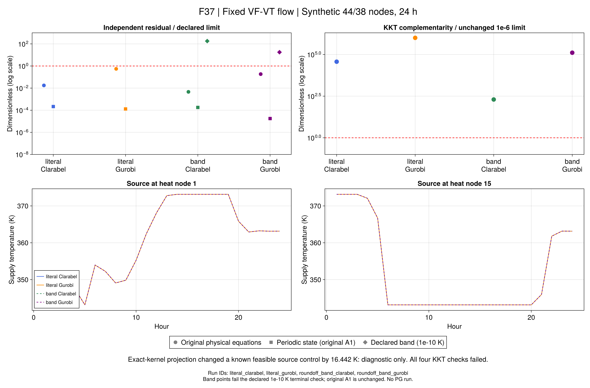

# R9固定流量子问题：终端相容与数值边界

本批接续[四模式直接参考](ch07-flow-results.md)。问题是：已经存在通过原物理检查的
VF-VT调度，为何把其流量固定后，连续凸子问题仍可能失败？
输入仍为44电节点、38热节点、24小时的替代数据；本批不运行PG。
参考调度仅提供固定流量参数及只读见证，不注入优化的原始变量或乘子。

## 1. 固定流量消除了什么？

端口热功率中的流量系数、混合权重及输运衰减成为已知数。
沿树前向计算后，热状态可以写为源温的仿射函数：

```math
\begin{aligned}
z_{\mathrm{heat}}&=B(\bar m)\theta+d(\bar m),\\
A(\bar m)\theta&=b(\bar m).
\end{aligned}\tag{R9-F1}
```

第二行来自周期末端状态恢复，仍依赖流量，不能在改变流量后沿用旧矩阵。
设备、电网、源温边界、初始历史、全部终端行及独立水团回放保持。
默认`terminal=:literal`；原CF调用行为不变，VF必须显式给定流量。

给定原调度后，59,151条实际JuMP约束最大原始距离为1.819×10⁻¹²，
912个匿名辅助量仅由单未知线性等式重构。控制量不变，独立成本与原记录一致。
这排除了明显的代入遗漏，不证明所有二进制等式严格可行，也不保证求解器返回候选。

## 2. 极小残差为何仍可能对应较大控制变化？

固定流量终端矩阵为74×48；对保存的二进制系数作有理数精确消元，
秩为32，并有38条依赖行的右端不相容。原调度残差约1.28×10⁻¹³ K。
证书针对计算机中保存的系数，不是物理不可行证明。

诊断函数保留全部16个精确核方向，不按奇异值阈值删方向。常数点只由输入盒决定：

```math
\begin{aligned}
p&=\theta_c+(A^{\mathsf T}A+\lambda I)^{-1}A^{\mathsf T}(b-A\theta_c),\\
\lambda&=\left(\frac{10^{-10}}{4\max(1,R)}\right)^2,\qquad
\theta=p+Uy,\quad AU=0.
\end{aligned}\tag{R9-F2}
```

其中温差数值统一用K，矩阵系数无量纲；实现采用512位运算及原二进制系数回代。
这能限制该仿射空间内的终端误差，却**不能证明覆盖所有容差内可行控制**。
把已合格源温投影到此空间，最大改变16.441654 K。
因此`rank_checked_rhs`仅保留为敏感性诊断，不能作为无影响的数值替换或默认PG修复。
失败测试原记录保留，后续测试显式核验这一负结果。

## 3. 两个预先声明的正式对照

四项实验使用同一固定流量，分别由Clarabel和Gurobi求解：

| 解释 | 终端关系 | 用途 |
|---|---|---|
| `literal` | 原浮点仿射等式 | 保留原失败边界 |
| `roundoff_band` | 保留全部源温变量的双边区间 | 检验受界数值解释的影响 |

```math
-\epsilon_T\le A(\bar m)\theta-b(\bar m)\le\epsilon_T,
\qquad \epsilon_T=2^{-34}\ {\rm K}.
\tag{R9-F3}
```

区间约5.82×10⁻¹¹ K。它是**项目新增数值解释**，不称字面等价。
每条上下界的Float64表示偏移经精确核查不得超过10⁻¹⁰ K；
输出另用保存的物理入口温度检查同一10⁻¹⁰ K上限。
既有A1温度门槛、其他物理门槛及KKT门槛不变。
不根据运行结果改变区间，也不通过锚定到参考源温选取可行空间。

每项600秒共享预算，不注入参考原始解；Gurobi固定Presolve=0，目标保持原CNY单位。
此前六个缩放探针单独保留；三项因检查器未识别缩放目标语义中断，原解已保存，
后续只读单位转换重验没有重算实验。这些记录缺少KKT采集，不能写成通过。

模型、原物理关系、终端、日能量、表示误差、KKT和预算分别判定。
可信乘子不替代原电网检查；缩减模型KKT通过也不自动给出完整流量灵敏度。
需要另推导全部参数依赖并作合法方向差分。数值诊断依据见
[Gurobi官方说明](https://docs.gurobi.com/projects/optimizer/en/current/concepts/numericguide/modelissues.html)
和[JuMP原始可行性检查](https://jump.dev/JuMP.jl/stable/tutorials/getting_started/debugging/)。

## 4. 正式结果和研究判定

固定同一VF-VT流量，不注入原始调度；两种解释各由两个求解器执行，共四项。
所有运行在600秒预算内，完整方法约8.2–31.9秒；不同编译状态不能作速度排名。

| 解释／求解器 | 保存费用（CNY） | 原物理及解释检查 | KKT互补性指标 |
|---|---:|---|---:|
| 字面／Clarabel | 492243.981158 | 通过 | 0.036990 |
| 字面／Gurobi | 492244.001357 | 通过 | 1.000000 |
| 区间／Clarabel | 492243.985667 | 新增终端解释门槛失败 | 0.000199 |
| 区间／Gurobi | 492243.995557 | 新增终端解释门槛失败 | 0.128215 |

四项对偶都未通过既有1e-6门槛；已从保存的原始乘子、原始变量见证及冻结约束矩阵重算，
没有调整乘子或用费用缩放制造通过。字面两项费用相差约0.0202元，
但Gurobi保存的相对费用界差约0.2911%，不能宣称同模型A2的有效界检查通过。
Clarabel小目标差也不能消除互补性失败。

区间两项仍满足原A1终端检查，但分别有70/74条新增1e-10 K检查失败，
最大温差约1.792e-8/1.767e-9 K。不能扩大这个预先声明的解释上限来制造成功，
也不把区间候选作为合格调度计算收益。

本批支持：前向代入可以在两求解器上找到通过原物理检查的固定流量调度；
模型转换没有表现出大幅控制或费用遗漏。它尚不支持：较大系统可信梯度、PG外层有效性、
四模式全局最优排序或作者同输入复现。舍入区间对照未解除问题，保留为负结果。
接下来将可信乘子和终端参数导数列为局部开放问题，同时推进7.3–7.5独立任务。

正式原值与六项旧缩放诊断、终端证书及16.44 K反例封存于r9-fixed-20260921-v4。
首版归档v1误用了physical而非physics汇总原关系行；v2遗漏图源的温度终端行。
v3逐例明确核对9096条原关系、111条温度/流量终端的覆盖，仅修正汇总，不重新优化。
最终v4对大文件按4 MiB无损分片；拼接后的哈希与原字节一致，逐式KKT表按5000行分片。
小表及图源不变，不删除原始乘子。该处理遵守项目5 MiB单文件限制。
最初动态模块启动失败也保留，与科学求解失败分开。



## 5. 运行入口

从仓库根目录执行；新冻结目录和报告目录必须不存在，检查不重新求解。

```sh
julia +1.12.6 --startup-file=no --project=. scripts/test_r9_fixed.jl
julia +1.12.6 --startup-file=no --project=. scripts/check_r9_fixed.jl
julia +1.12.6 --startup-file=no --project=. scripts/r9_fixed_evidence.jl check results/summaries/r9-fixed-20260921-v4
julia +1.12.6 --startup-file=no --project=docs scripts/plot_r9_fixed.jl results/summaries/r9-fixed-20260921-v4 results/runs/NEW_FIXED_FIGURES
julia +1.12.6 --startup-file=no --project=. scripts/r9_fixed_study.jl freeze results/runs/r9-flow-reference-20260921-v1 results/runs/NEW_FIXED
julia +1.12.6 --startup-file=no --project=. scripts/r9_fixed_study.jl run results/runs/NEW_FIXED Clarabel
julia +1.12.6 --startup-file=no --project=tools/solvers scripts/r9_fixed_study.jl run results/runs/NEW_FIXED Gurobi
julia +1.12.6 --startup-file=no --project=. scripts/r9_fixed_study.jl check results/runs/NEW_FIXED results/runs/NEW_REPORT
```

符号和公式映射见[台账索引](ch07-fixed-generated.md)。已有源温、矩阵和核坐标沿用
[固定模式说明](ch07-numerics.md)，原物理关系沿用[连续流量模型](ch07-flow.md)。

```@index
Pages = ["ch07-fixed.md"]
```

```@docs
r9_terminal_coordinates
solve_r9_fixed_case
validate_r9_fixed_solution
```
