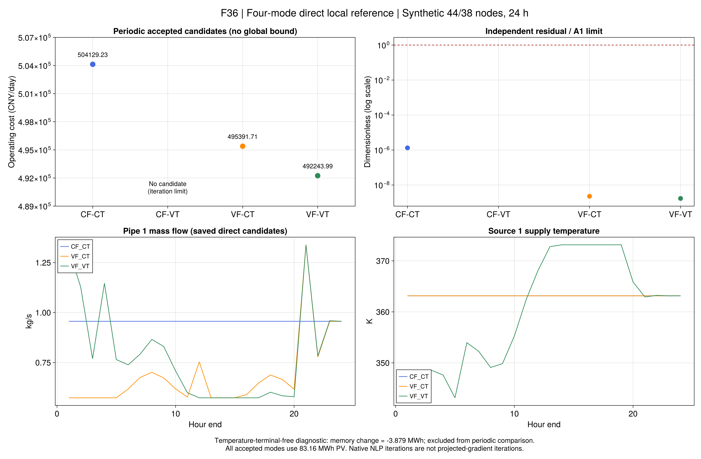

# 第7.2节：变流量直接参考与终端边界

本批使用同一44电节点、38热节点、24小时的冻结替代输入。完整正向流量盒、历史、温区、
设备、电网原支路等式和WMM关系不变。仍不是作者同输入复现，也没有执行作者PG外层。

## 1. 首次取得了哪些调度？

协议`configs/r9/flow-reference.toml`在四次优化前冻结。每项共享600秒，统一采用Gurobi局部非线性求解、
关闭预处理、保留字面温度及流量终端。仅删除被原等式和符号边界蕴含的冗余锥，见式（R9-D1）。
初值明确来自已保存CF-CT原电网候选，只用于独立直接参考；不注入PG。

| 模式/运行ID | 费用（CNY/日） | 周期管道净热量（MWh） | 结果 |
|---|---:|---:|---|
| `cf_ct` | 504129.233983 | 8.252076 | 采用模型、原关系、终端及整日能量通过 |
| `cf_vt` | — | — | 迭代上限，无候选 |
| `vf_ct` | 495391.705809 | 7.815256 | 采用模型、原关系、终端及整日能量通过 |
| `vf_vt` | 492243.986754 | 7.431976 | 采用模型、原关系、终端及整日能量通过 |

三项均交付147.347400 MWh热量，并利用全部83.16 MWh光伏；末端记忆变化为零。
相对本批CF-CT，VF-CT和VF-VT候选分别降低约1.733%和2.358%费用。
这是已找到的物理可行调度费用差；局部求解没有全局有效界，不能把差额写成精确最优灵活性价值。
低费用也不支持减少弃光的主张，热源分配、时序和损耗贡献尚未单独分离。

四项完整进程耗时约33.5–43.3秒，均在预算内；这不是PG计时，也不据此声称比原算法更快。
CF-VT的失败不被旧[参考锚定结果](ch07-numerics.md)覆盖：旧版本改变了极微小终端常数，
本批仍是字面表示，二者分别保留。故此处尚未形成四模式全部成功的同口径表。
CF-VT允许的源温范围包含CF-CT固定值，已有固定调度构成其可行性见证；
“求解器未返回候选”不能改写成“该模式没有可行解”。

## 2. 为什么不能直接取消终端条件？

单因素开发诊断只移除74条温度终端等式，保留流量终端、历史和其余原物理关系。
它得到489799.709918 CNY的候选，但全部74条原温度终端检查失败，最大差19.462305 K。
式（R9-V5）的独立账本为：

| 量 | MWh |
|---|---:|
| 管道净热量 | 3.460005 |
| WMM输运损耗项 | 7.338776 |
| 末端记忆变化 | −3.878771 |

三者满足“净热量=损耗+记忆变化”。该调度消耗初始热记忆，未恢复周期状态；
不能把其较低费用全部解释成周期经济收益，也不能把净热量3.46直接称为散热损失。
这是一条有原值支持的边界反例，不是声称作者也采用了该边界。

## 3. 数值困难缩小到了哪里？

原来的完整初值与删除冗余锥仍不足以得到候选。新开发对照保留了：

| 单因素变化 | 结果 |
|---|---|
| 按输入容量及价格归一化费用 | 无候选 |
| 互补容差从1e-8收紧至1e-10 | 无候选 |
| 终端单变量等式改为固定变量 | 无候选 |
| 去掉温度终端 | 有候选，原终端失败 |
| 保留完整终端，关闭预处理 | 有候选，原关系、终端及日能量通过 |

因此预处理后的表示参与当前数值困难；没有证明它是所有失败的唯一成因。
所有独立A1/A2门槛保持。内部缩放残差与返回原值可能不同，依据
[Gurobi精度与缩放说明](https://docs.gurobi.com/projects/optimizer/en/current/concepts/numericguide/tolerances_scaling.html)。
保留完整迭代回调值，原始/对偶/互补指标分别记录；局部求解也不提供可用于作者PG的可信对偶，
见[官方局部求解限制](https://docs.gurobi.com/projects/optimizer/en/current/reference/parameters.html#parameteroptimalitytarget)。

## 4. 复查与下一步

原值、输入、源码、环境和迭代轨迹封存于`r9-flow-reference-20260921-v2`。
四项正式参考与五项开发诊断分别标记；内容寻址对象只消除重复存储，不改变原字节。
归档v1因Windows文件名目录判断错误失败并本地保留，v2仅修正归档检查，没有重新优化。

```sh
julia +1.12.6 --startup-file=no --project=. scripts/r9_flow_evidence.jl check results/summaries/r9-flow-reference-20260921-v2
julia +1.12.6 --startup-file=no --project=. scripts/r9_flow_reference.jl results/runs/NEW_REFERENCE
julia +1.12.6 --startup-file=no --project=docs scripts/plot_r9_flow_reference.jl results/summaries/r9-flow-reference-20260921-v2 results/summaries/NEW_FIGURES
```



下一步核清CF-VT字面表示，并迁移固定流量子问题、终端依赖和对偶检查后再运行较大系统PG。
第7.3–7.5节场景与R10全文交付仍未完成；不会把三项直接参考当成作者算法或全文复现完成。
