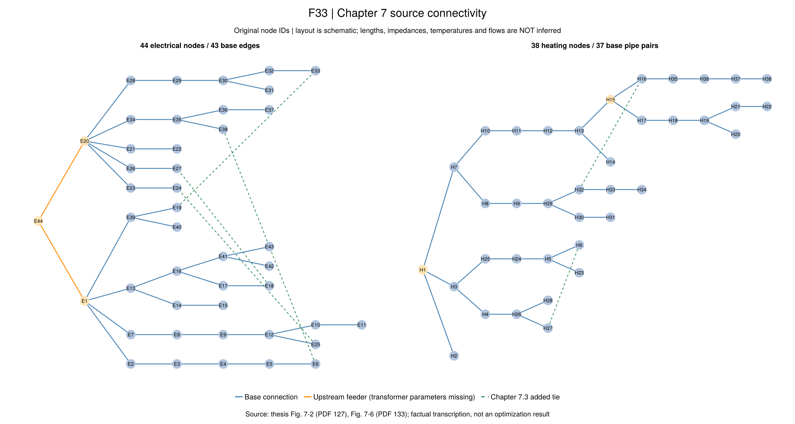

# R9：示范区输入与迁移起点

第7章将前面的方法放到一个44电节点、38热节点的系统中，分别研究光伏消纳、交易、备用和保供。
本批核读原PDF127–143（印刷110–126页），把图7-2、表7-1至7-19的相关输入和结果分开登记。
DOCX只作定位；原扫描及渲染图不随仓库发布。

来源、连接、单位和表格核查已经完成；随后已在明确替代输入上推进到
[四模式直接参考](ch07-flow-results.md)及[显式固定流量子问题](ch07-fixed.md)。
变流量已有原物理合格候选，可信对偶和PG外层尚未闭合；7.3–7.5尚待迁移，原始同输入仍不完整。
已有连接图不等于完整算例：线路阻抗、变压器、逐管几何、节点时序和部分边界仍缺。
权威记录和全部输入缺口见[生成索引](ch07-inputs-generated.md)。



连线来自图7-2和图7-6，位置是按树生成的示意布局；不表示真实长度或潮流。
黄色节点为变电站地点E1/E20/E44及基准热源端口H1/H15；绿色虚线仅属于7.3新增联络线。

## 四组问题怎样接回已有实现？

| 原文场景 | 要回答的问题 | 已有基础 | 迁移时特别核对 |
|---|---|---|---|
| 7.2，CF/CT、CF/VT、VF/CT、VF/VT | 流量和温度调节能否减少弃光、降低费用？ | R2/R3详细热模型与四模式 | E22光伏增为6 MW；启停、24小时历史及终端 |
| 7.3，2A/2B/2C | 交易与网络协调能否创造并分配剩余？ | R4集中、议价、分布及重构 | 八聚合商、设备替换、负荷放大和支付口径 |
| 7.4，3A/3B/3C | 风险处理怎样影响备用收入和实际交付？ | R5内部风险调度、R6统计流程 | 此处是价格接受者，不能带入策略出清KKT |
| 7.5，4A/4B/4C | 正常费用与关键负荷保供怎样权衡？ | R7/R8正常—故障状态与资源比较 | 独立CHP配置、10元/kWh罚价、事件时轴 |

四组都从7.1独立修改。它们不是逐节叠加的同一个输入；例如7.3的1.5倍负荷不自动进入7.2。
迁移逐项规则保存在 `docs/reading/ch07/migration.toml`，当前为7.2部分实施并保留数值缺口。

## 先把单位和含义讲清楚

原表电锅炉容量是**额定制热量**。输入电功率与人民币能量单价应分别换算：

```math
P^{\mathrm{EB,max}}=\frac{H^{\mathrm{EB,max}}}{\eta^{\mathrm{EB}}},\qquad
c_{\mathrm{CNY/MWh}}=1000c_{\mathrm{CNY/kWh}}.
\tag{R9-I1}
```

这里 ``H^{\mathrm{EB,max}}`` 和 ``P^{\mathrm{EB,max}}`` 的单位均为MW；效率无量纲。
台账代码键为 `H_max_MW`、`eta`，派生电容量由 [`audit_r9_sources`](@ref) 返回。
第7.5节的10元/kWh等于10000元/MWh，不能把第6章500 USD/MWh原样移用。

原文电峰值是视在功率 ``S^{\max}=45.67\,\mathrm{MVA}``。在给定功率因数的条件下才有：

```math
P=S\cos\varphi,\qquad Q=S\sin\varphi.
\tag{R9-I2}
```

``P,Q,S`` 分别用MW、Mvar、MVA，功率因数尚未给出；不能把45.67直接当MW负荷。
这些R9-I编号是项目换算说明，不是论文新公式号。

## 已发现的原文疑点怎么处理？

- 表列CHP与电锅炉按热电比合计9.0 MW，正文写8.1 MW。保留两者，未缩放设备去凑总数。
- 表7-10与7-11的部分聚合商收益总数不同。先登记比较口径未明，不把跨表差直接定性为算错。
- 表7-19费用相对4A重算约3.27%和1.06%，正文写4.31%和1.68%。原值与重算值分开保留。
- 表7-17标题与周边文字使用不同方案标签；事件窗口和一项失供值也有冲突。
- 第7.4节备用价格正文与图轴的单位不同，P2H额定容量的输入/输出基准未明。

算术检查仅比较显示精度允许的误差。若同一单位的加和有 ``n`` 个数，各保留 ``d`` 位小数，则采用：

```math
\left|\sum_{k=1}^{n}a_k-b\right|\le (n+1)\frac{10^{-d}}{2}.
\tag{R9-I3}
```

这不是物理残差门槛，不替代A1/A2。跨表口径、额定设备与正文描述仍需语义判断。
完整诊断保存在 `results/summaries/r9-inputs-20260920-v1`，包括通过、尾数误差和未决差异。

## 怎样补齐可计算输入？

优先保留原图44/38连接和设备位置。对缺失字段另行冻结公开来源或合成替代值，逐字段写明出处、
缩放、单位和假设；不通过拟合作者费用或消纳率倒推数据。根节点重编号必须保留原节点映射。
原图含110 kV馈线和10 kV配网，变电站地点不等于同一电压节点；等值变压器若被采用，需要显式说明。

7.2已建立容量、稳态历史和边界可检查的24小时基准，原失败及后续参考结果分别保留。
第3章目标式（3-1）不含启停项，已有R2/R3沿用这一结构；表7-2又列出启动费。
因此先确认7.2的实际费用口径及初始开机状态，不能仅凭设备表给连续梯度子问题加入二元启停。
单独研究启停时应另立版本，费用对照继续区分共同变动成本与启动成本。
当前先迁移7.3八聚合商的主体/节点映射及集中交易基准，再接价格接受者备用和灾害规划。
7.2可信对偶与终端参数导数保留为局部开放问题，不作为其余三节的统一阻断。
缺失作者数据只限制同输入数值复现，
不阻止来源明确的机制和规模替代实验。

文献[157]已定位[出版社记录](https://www.sciencedirect.com/science/article/pii/S0306261921006474)，
直接全文访问返回403；本次没有取得参数附件，也不能据此断言附件不存在。

## Julia与VS Code入口

```sh
julia +1.12.6 --startup-file=no --project=. scripts/test_r9_sources.jl
julia +1.12.6 --startup-file=no --project=. scripts/test_r9_report.jl
julia +1.12.6 --startup-file=no --project=. scripts/check_r9_inputs.jl
julia +1.12.6 --startup-file=no --project=. scripts/audit_r9_inputs.jl check results/summaries/r9-inputs-20260920-v1
```

重新产生审计须用 `write NEW_DIRECTORY`，拒绝覆盖。重读会核验文件哈希、用冻结源码重新计算、
并对照CSV和TOML；不需要论文原件或商业求解器许可，也不重新优化。
VS Code的“R9”任务提供相同入口。测试位置为 `test/r9_sources.jl`、`scripts/test_r9_report.jl`。
F33可用docs环境中的 `scripts/plot_r9_inputs.jl REPORT NEW_FIGURES` 重绘，
节点/边CSV和绘图脚本保存在 `results/summaries/r9-input-figures-20260920-v1`。

```@index
Pages = ["ch07-inputs.md"]
```

```@docs
load_r9_sources
r9_tariff
r9_original_input_gate
audit_r9_sources
```
