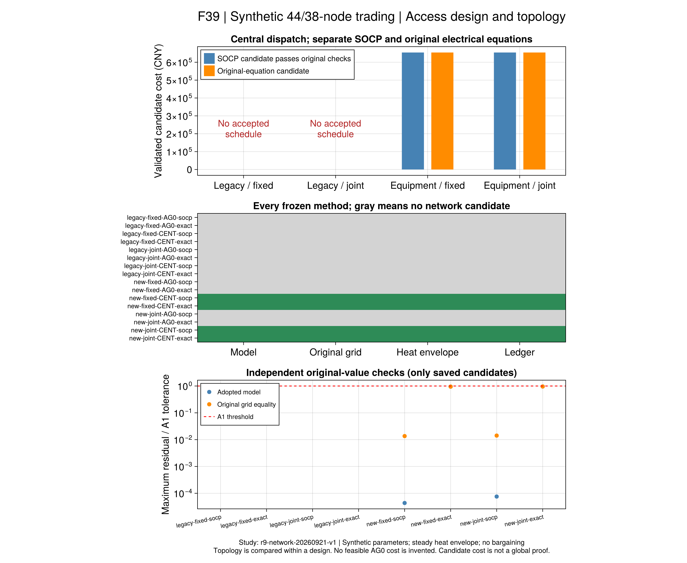
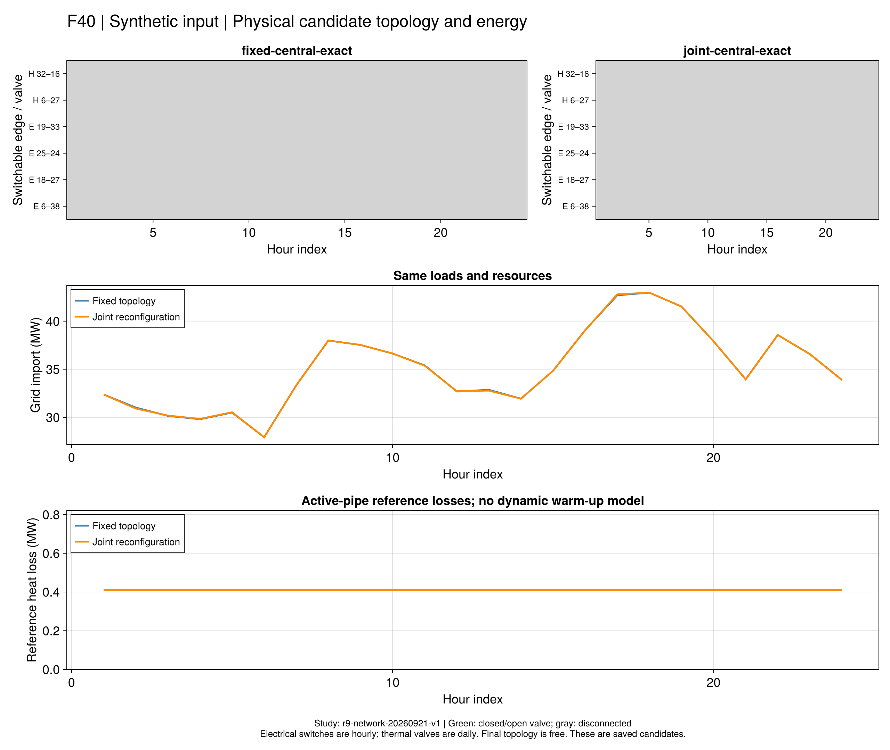

# 第7.3节：接入参数、网络重构与独立供热缺口

**本轮取得了规模集中调度候选，也解释了独立运营失败的一个充分原因；
尚未取得重构收益或可实施的独立运营收益基线。**
对象为44电节点、38热节点、八聚合商与一个运营商、24小时的合成替代输入。
设备和连接参考论文，缺失网络参数、价格和控制规则按[采用解释](ch07-network.md)补全。
这些结果不能写成作者同输入数值复现。

## 1. 怎样比较

批次`r9-network-20260921-v1`先冻结输入、源码、环境、16项方法和600秒完整进程预算。
清单SHA-256为`2a312e0e3086047a13febf9608aa3ef5449220d185b721a5a96cd382d6daad50`。

- `legacy`保留旧网络参数；`equipment`按全部接入设备和负荷上界重新生成参数。
  后者同时改变容量、阻抗和参考散热，跨设计只能称参数组合对照，不是纯增容或投资收益。
- 同一设计内，固定拓扑`fixed`与允许电热重构`joint`的支路参数和核心输入相同。
- 每个组合分别运行独立运营、集中调度，以及SOCP与原电网支路等式两个版本。
- 独立运营先接受各主体局部计划，再固定实际控制校核网络；网络失败时不暗中重调。
  本批没有PG、分布算法、议价或参考解初值注入。

## 2. 十六项结果

| 网络设计 | 拓扑策略 | 独立运营：SOCP / 原等式 | 集中调度：SOCP / 原等式 |
|---|---|---|---|
| legacy | fixed | 各8局部通过，网络均不可行 | 均报告不可行 |
| legacy | joint | 各8局部通过，网络均不可行 | 均报告不可行 |
| equipment | fixed | 各8局部通过，网络均不可行 | 两候选均通过本批检查 |
| equipment | joint | 各8局部通过，网络均不可行 | 两候选均通过本批检查 |

`infeasible_certified`是原记录的求解器状态。旧固定树的[精确热割](ch07-trading-results.md)
不能直接用于可切换的新候选图。本节第4部分另给出独立运营固定计划的全网必要矛盾。

四个集中候选的独立重算费用如下。下界属于各自模型，候选费用差不作为最优间隙。

| 策略／电网 | 费用 CNY | 求解器下界 CNY | 有效相对间隙 | 完整进程秒 |
|---|---:|---:|---:|---:|
| fixed / SOCP | 654505.252717 | 654504.149253 | 1.6860e-6 | 32.35 |
| fixed / 原等式 | 654504.868731 | 654462.289728 | 6.5055e-5 | 169.67 |
| joint / SOCP | 654519.851026 | 654504.102484 | 2.4061e-5 | 32.53 |
| joint / 原等式 | 654504.785933 | 654462.467356 | 6.4657e-5 | 144.90 |

所有16项完整运行都在600秒内。JIT及同期工程检查影响墙钟，不能作算法速度倍数结论。
两个原等式候选的最大归一化A1残差分别为0.9480和0.9585，接近但没有超过门槛1；
SOCP候选回代原等式的最大归一化残差为0.01357和0.01416。
费用完成、模型约束、电网原关系、声明的热能量/质量关系与账本均分别保存。
热网通过不代表温度混合、水压、输运时延和暖管动态已认证。



## 3. 没有出现重构收益

四个候选的开关动作、动作费用均为零，保留初始拓扑。
原等式模型中joint候选比fixed低0.082798 CNY；SOCP中joint反而高14.598309 CNY。
固定零动作解可嵌入joint的可行域，因此自由策略理论最优费用不会更高。
实际较差的候选反映当前求解精度与界，不能说明重构有害；
极小的较低候选也没有使用重构，不能作为重构收益。
原等式候选略低于对应SOCP候选的数值次序同样保留，不推导严格松弛最优关系。

这批设备接入参数下，固定拓扑已能支撑集中调度。没有必要为了得到原文的正收益
事后缩窄支路或调整负荷。本结果允许“当前替代输入未显示重构收益”成为正式结论。



## 4. 独立运营为什么仍失败

`independent-heat`是求解结束后新增的只读诊断，未重新优化或修改局部计划。
将全网热平衡相加，忽略全部非负管损、流量及网络限制，得到更宽松的必要条件：

```math
H^{\mathrm{required}}_{\mathrm{DSO},t}
=H^{\mathrm{background}}_t+
\sum_{i\in\mathrm{AG}}\left(
H^{\mathrm{load}}_{i,t}+H^{\mathrm{device,in}}_{i,t}
-H^{\mathrm{device,out}}_{i,t}\right)
\le \sum_{g\in\mathrm{DSO}}\overline H_g .
\tag{R9-AG0-H1}
```

从冻结模型实际变量上界得到运营商CHP1为4.8 MW，EB1、EB4各1 MW，共6.8 MW。
八项独立运营运行的保存计划在20/24个时段都违反该必要条件；
第8时段所需运营商热量为8.6900071895 MW，至少短缺1.8900071895 MW。
192行检查中160行正缺口来自八次相同计划的重复核对，不是160个不同物理反例。
精确分子/分母基于保存的二进制数及实际模型上界，避免仅依赖打印小数判断正负。

**即使输送线路无限宽、完全无热损耗，也无法由运营商承接该固定计划。**
因此增容与重构不能单独修复本次AG0。集中调度允许聚合商与运营商共同改变出力，
在equipment参数下有合格候选；固定独立计划的矛盾不意味着集中模型无解。
这也不证明任何零售价格或独立运营制度一般无效，结论限于本输入与冻结计划。

没有网络可实施AG0费用，就不能用它计算两个可实施计划之间的协同节约率。
议价若采用带违约/罚项的反事实分歧效用，须像[既有TSPA解释](ch04-tspa.md)那样单独定义；
它仍可能用于机制研究，但罚项变化不能称资源节约。
不能用未交付的独立计划费用作分母，更不能把求解器“局部成功”当系统成功。

## 5. 与原文的关系与下一步

原PDF133–134（印刷116–117）的图7-6/7-8展示联络热管投入与供热范围调整。
本批具备对应的拓扑决策能力，却没有重现这一机制在当前输入下的收益。
网络参数和替代边界不同，不能由本负结果反驳原文，也不能反推作者未公开数据。

接下来分开处理：

1. **交易基线：**先核对独立运营零售供热承诺、运营商可供容量及不平衡处理的制度解释。
   若增加接入合同或可交付额度，须另立模型版本、事前冻结规则；不能把集中重调冒充旧AG0。
   可实施基线与带明确罚项的反事实分歧点分别评价；本批尚未进行规模议价。
2. **规模算法：**已有集中结果可作为独立校核目标。八主体分布协调须单独迁移、检查实际消息、
   整数选择与停止条件，不将集中求解算作分布算法成功。
3. **全文主线：**第7.4节备用风险、第7.5节保供可按各自输入独立推进；不再为使当前重构收益变正反复调参。
   第7.2节可信对偶与PG迁移仍是局部开放问题，全文覆盖见[清单](reproduction-coverage.md)。

## 6. 重读与复现入口

公开包`results/summaries/r9-network-20260921-v1/`保存完整输入、原值、源代码、
80个阶段、171400条独立残差及原文件分片。没有候选的记录仍完整保留，日志不进入公开包。
图源CSV、绘图源码、运行ID、单位与哈希随F39/F40保存；重绘不启动求解器。

从仓库根目录执行（路径可直接用于VS Code的对应任务）：

```sh
julia +1.12.6 --startup-file=no --project=. results/summaries/r9-network-20260921-v1/code/scripts/r9_network_evidence.jl check results/summaries/r9-network-20260921-v1
julia +1.12.6 --startup-file=no --project=. results/summaries/r9-network-20260921-v1/independent-heat/audit-source.jl check results/summaries/r9-network-20260921-v1 results/summaries/r9-network-20260921-v1/independent-heat
julia +1.12.6 --startup-file=no --project=. scripts/check_r9_network_delivery.jl results/summaries/r9-network-20260921-v1 docs/src/assets/r9-network-20260921-v1
julia +1.12.6 --startup-file=no --project=docs scripts/plot_r9_network.jl results/summaries/r9-network-20260921-v1 results/runs/r9-network-redraw-new
```

正式冻结源码沿用当时局部标签`R9-N1…N5`。它们与早先数值章节命名冲突，
当前维护源码改为`R9-RN1…RN5`；八个完整模型的每条数学表达式与目标已逐项核对相同。
这是标签迁移，原包、残差ID及历史判定不改写；它不涉及重新求解。
