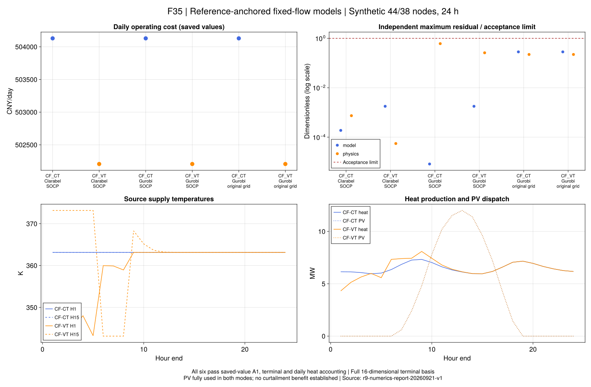

# R9：前向表示与终端数值解释

本页解释固定流量的数值收尾。物理来源仍是第3章核查版WMM和第7章替代输入；
拓扑、负荷、设备、初始历史及A1/A2均不变。`terminal=:literal`保留字面终端，
`terminal=:reference_anchored`是明确命名的项目数值解释，不能静默替换旧结果。
这里只覆盖固定正向管流；VF及其终端灵敏度尚未接入。

## 1. 为什么固定流量可以前向计算？

流量已知后，热功率和混合不再是未知量之间的乘积。供水沿树向下计算，负荷回水温度由需求决定，
回水再沿反向树混合。热源供温是剩余独立热变量。

```math
T^R_{j,t}=T^S_{j,t}-\frac{10^6H_{j,t}}{c_pm_{j,t}},\qquad
T^{mix}_{j,t}=\sum_{a\in\mathcal I_j}\frac{m_{a,t}}{\sum_bm_{b,t}}T_{a,t}.
\tag{R9-N1}
```

``H``为MW、``m``为kg/s、``c_p``为J/(kg K)，所以温差为K。
这不是把管道改成无损或即时传热：原WMM的历史、权重、停留时间和衰减仍逐项保留。
代码使用相对温度，避免大绝对温度反复相减：

```math
\theta=T-T_c,\qquad
\theta^{star}_t=\sum_s w_{s,t}\theta^{in}_{t-s}
 +T_c\left(\sum_s w_{s,t}-1\right).
\tag{R9-N2}
```

浮点权重的和不一定恰好为1，最后一项不能省略或通过静默归一化消除。
所有设备、电网和温区边界仍在模型中。只含常数的关系先检查并登记；舍入残差不冒称严格为零。

## 2. 水压辅助量为什么可以直接构造？

本输入为固定方向树，目标不含水压成本，采用约束只有压力边界、沿边压降下界和供压不低于回压。
令根到节点的压降下界之和为``d_j``：

```math
\kappa_p=\mu_pm_p^2,\quad d_j=\sum_{p\in path(1,j)}\kappa_p,\quad
\Phi_j^S=\Phi^{max}-d_j,\quad\Phi_j^R=d_j.
\tag{R9-N3}
```

存在这样的压力见证当且仅当``2\max_jd_j\leq\Phi^{max}``。
必要性由供、回路径压降和``\Phi_j^S\geq\Phi_j^R``相加得到；上式直接给出充分性。
若增加泵功率、节点指定压力或环网，这个结论须重新推导。

## 3. 逐式通过之外，还要核算整日能量

```math
\Delta E=\Delta t_h\sum_t\left[
\sum_{j\in\mathcal S}H_{j,t}-\sum_{j\in\mathcal L}H_{j,t}
-10^{-6}c_p\sum_{p,\sigma\in\{S,R\}}m_{p,t}
(T^{\sigma,in}_{p,t}-T^{\sigma,out}_{p,t})\right].
\tag{R9-N4}
```

该式与此前的R9-A1整日恒等式相同，门槛继续为``10^{-6}\max(1,E_{source})`` MWh。
管道入口和出口热量之差包含库存变化；终端状态另行通过后才能解释为周期损耗。

## 4. 原模型确实存在微小的精确不相容

对冻结建模器产生的每个二进制系数转为精确有理数，只使用固定变量和线性等式作消元。
独立脚本再次核对证书中每个系数与冻结原模型一致，而非只重算一个人工简化例。

| 模式 | 证书所需固定量 | 线性关系数 | 最终不相容量 |
|---|---:|---:|---:|
| CF-CT | 1 | 13 | 约3.2494×10⁻¹⁴ K |
| CF-VT | 0 | 14 | 约5.9334×10⁻¹³ K |

恒温证书来自末时段热负荷、终端供回温及管道衰减；变温证书由两条分支的终端历史反推同一个节点温度，
得到略不相同的精确值。证书等价于：

```math
A x=b,\qquad y^\mathsf T A=0,\qquad y^\mathsf T b\ne0.
\tag{R9-N5}
```

这证明的是**储存的浮点系数作为精确实数时不能全部严格成立**，不是物理系统缺热或论文模型错误。
容差内可行见证与精确不相容可以同时存在；固定变量消元会影响误差如何分布。
[Gurobi官方容差说明](https://docs.gurobi.com/projects/optimizer/en/current/concepts/numericguide/tolerances_scaling.html)
解释了这一现象。原求解器状态和旧A1判定都保留，证书也不冒称最小IIS。

## 5. 有界锚定与完整自由空间

终端前向关系写作``A\theta=b``。冻结CF-CT参考源温为``\bar\theta``；
先记录``A\bar\theta-b``，仅允许每行不超过``10^{-10}`` K的舍入修正。
然后采用明确的新解释：

```math
\begin{aligned}
A(\theta-\bar\theta)&=0,& A N&=0,\\
\theta&=\bar\theta+U y,& U&=\operatorname{fl}(\operatorname{orth}_{512}(N)).
\end{aligned}
\tag{R9-N6}
```

第一行是采用模型的数学目标；第二行的浮点实现允许且显式控制下面的转换误差。
``N``由精确有理数消元得到，不以奇异值阈值裁剪秩；512位正交化后转换为Float64的``U``。
转换后的列仍保持独立，但不宣称``AU``在精确算术下严格为零。
所有源温边界仍施加在重构的源温上。由源温盒约束和正交误差推出``y``的保守范数界，
再以原系数精确计算``A U``并给出所有允许``y``的终端误差上界；该界也必须小于``10^{-10}`` K。
本案例48个源温坐标、精确秩32，保留16个自由方向。不能把非零列全部固定，因为它们之间存在可耦合自由度。

此处的秩属于已储存的二进制系数，不宣称未舍入的理想模型一定具有相同秩。
新模型修正了原终端常数，因此不能称为字面浮点矩阵的完全等价求解。
输入、改动量、完整基底及误差界分别保存；旧字面结果、前向字面结果和新锚定结果分别比较。
微小终端误差可能允许不同控制方向，旧1.062%候选差异不能自动沿用到本解释。

## 6. 正式六项说明了什么？

六项使用同一份44电节点/38热节点、24小时替代输入，在优化前冻结全部26个科学源码文件；
采用`reference_anchored`新解释。原字面运行与失败不改写。

| 模式 | 求解器与电网形式 | 费用（CNY/日） | 原值物理/终端/整日能量 |
|---|---|---:|---|
| CF-CT | Clarabel SOCP | 504129.233634 | 全部通过 |
| CF-CT | Gurobi SOCP | 504129.237537 | 全部通过 |
| CF-CT | Gurobi 原支路等式 | 504129.185331 | 全部通过 |
| CF-VT | Clarabel SOCP | 502206.745934 | 全部通过 |
| CF-VT | Gurobi SOCP | 502206.750989 | 全部通过 |
| CF-VT | Gurobi 原支路等式 | 502206.705805 | 全部通过 |

两组同SOCP求解器差小于0.006元，相对差约``10^{-8}``，满足A2的``10^{-4}``。
六项均有保存的有效数值界，报告间隙不超过``2.6\times10^{-8}``；
但原等式候选费用比SOCP数值下界低约0.05元，严格集合包含意义下不应出现这个次序。
该差相对约``10^{-7}``，在A2内，仍须保留为数值精度边界，不能把这些浮点结果拼成精确全局证明。
整日热量残差最大约``5.51\times10^{-14}`` MWh，旧门槛保持。

同为Clarabel的费用变化如下：

| 项目 | CF-CT | CF-VT |
|---|---:|---:|
| 外购电费用（CNY） | 387329.197924 | 386959.232038 |
| CHP费用（CNY） | 112538.085710 | 110985.563896 |
| PV费用（CNY） | 4261.950001 | 4261.950000 |
| 交付热负荷（MWh） | 147.347400 | 147.347400 |
| 热源产热（MWh） | 155.599476 | 155.067520 |
| 周期管道净热差（MWh） | 8.252076 | 7.720120 |

固定流量下，允许源温调整的采用模型约节省1922.487700元，约**0.381348%**。
这支持“温度调节能改变本替代系统的运行费用”，没有分离热源分配、时移和温度相关损耗的各自贡献。
两模式均在A1内利用全部83.16 MWh光伏，**没有减少弃光的证据**。
输入仍含合成线路/管道参数，终端锚定也是项目解释；不是作者同输入收益复现。

旧1.062%差异来自另一组字面数值候选，其中变温整日核算未过；不能继续作为本批收益。
本批没有为了贴近作者结果更改数据、筛除自由方向或放宽容差。
实际耗时约7.4–44.4秒，编译/JIT状态不同，不用于宣称算法速度倍数。



图从保存原值重绘。残差纵轴除以各自验收门槛，红线1为失败边界；为对数显示而设的绘图下限不改变CSV。
冻结证据均位于`results/summaries/`：

- `r9-numerics-20260921-v2`：输入、环境、26个科学源码和六项原值；
- `r9-numerics-report-20260921-v1`：310092条独立残差、144条逐时轨迹；
- `r9-numerics-audit-20260921-v1`：精确证书、逐步推导、终端矩阵和完整零空间；
- `r9-numerics-cost-20260921-v1`：费用/能量分项、同模型与跨模型比较；
- `r9-numerics-figures-20260921-v1`：F35、图源CSV、绘图源码与哈希。

**下一步**是在保持同输入和历史的条件下接入变流量，明确终端流量记忆及分段导数。
当前固定模式的终端空间依赖流量，不能直接复制到VF；先完成这一接口，再迁移7.3–7.5与全文教程。
不能对每个新流量重新锚定到旧CF-CT源温，使真实的终端偏差被当作舍入消除。
后续必须先冻结数值修正规则，并共同检查末段流量和温度记忆是否恢复原热状态。

## 7. 如何运行与检查

先使用VS Code的R9数值测试和冻结任务；运行时明确选择锚定解释。旧入口的默认行为不变。

```julia
model = build_r9_reduced_model(case; mode=:CF_VT, terminal=:reference_anchored)
report = validate_r9_reduced_solution(case, saved_run)
```

测试`test/r9_reduced.jl`覆盖独立累计质量回放、全部旧热关系、能量、完整零空间、极小非零秩和错误拒绝。
`scripts/check_r9_affine_certificate.jl`核对原证书；`scripts/test_r9_numerics_evidence.jl`检查冻结依赖及篡改拒绝。
保存结果的物理验证不读取求解器绿色标志。终端系数重建用于核对证据身份，物理残差仍从数值独立计算。

从仓库根目录重验公开原值，不需要原PDF或商业许可：

```sh
julia +1.12.6 --startup-file=no --project=. scripts/check_r9_numerics_results.jl results/summaries/r9-numerics-20260921-v2 results/summaries/r9-numerics-report-20260921-v1
```

重新运行须先冻结到新目录，再选择Clarabel或Gurobi；每项600秒，运行脚本拒绝覆盖。
VS Code任务提供冻结、测试、报告、原值核查和F35重绘；重绘仅使用报告CSV。

```@index
Pages = ["ch07-numerics.md"]
```

```@docs
build_r9_reduced_model
solve_r9_reduced_case
validate_r9_reduced_solution
r9_daily_heat_balance
```
