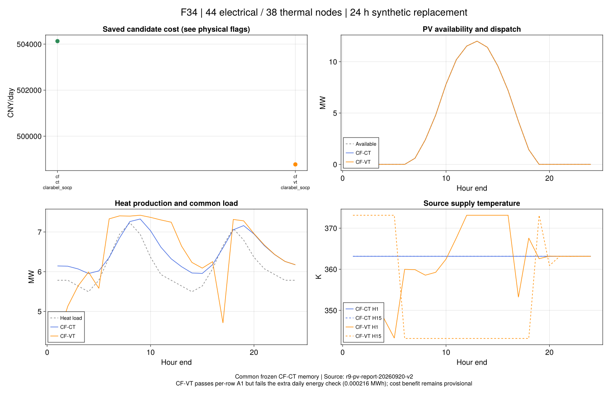

# R9固定模式结果：规模迁移与数值边界

本批第一次在44电节点、38热节点、24小时系统上执行第7.2节调度。连接和设备来自原文，
缺失字段使用[预先声明的替代输入](ch07-pv.md)。目标仍是四模式及第7章全部场景；本批只完成固定流量的两个模式。

## 六项正式运行

| 模式与求解方式 | 运行费用（CNY） | 原记录与独立核查 |
|---|---:|---|
| CF-CT，Clarabel SOCP | 504129.233976 | 模型、声明原关系、终端记忆通过 |
| CF-VT，Clarabel SOCP | 498774.230396 | 逐式A1和终端记忆通过；下述新增整日核算未通过 |
| CF-CT，Gurobi SOCP | — | 原求解器报告INFEASIBLE |
| CF-VT，Gurobi SOCP | — | 原求解器报告INFEASIBLE |
| CF-CT，Gurobi原电网等式 | — | 原求解器报告INFEASIBLE |
| CF-VT，Gurobi原电网等式 | — | 原求解器报告INFEASIBLE |

两项Clarabel求解各有同模型费用界，原记录相对间隙约6.5×10⁻¹¹和5.5×10⁻¹⁰。
但求解器状态与界不能替代完整物理核算。`physical_pass`只覆盖声明的原支路等式、κ重构、
采用WMM热关系及边界，不包含实际变压器损耗、连续网络PDE或尚未执行的整日汇总检查。

可用光伏83.16 MWh，两项Clarabel候选均在容差内全部利用。因而本输入没有提供减少弃光的对照证据，
不能把成本候选差异解释成光伏消纳增益，也不通过降低负荷或增大光伏去拟合原表7-5。

## 成本差异仍是候选结果

CF-VT候选费用低5355.003580 CNY，约1.062%。同一保存调度的费用拆分如下：

| 项目 | CF-CT | CF-VT |
|---|---:|---:|
| 外购电费用（CNY） | 387329.198270 | 381079.867034 |
| CHP燃料费用（CNY） | 112538.085706 | 113432.413362 |
| PV费用（CNY） | 4261.950000 | 4261.950000 |
| 产热（MWh） | 155.599476 | 155.153586 |
| 交付负荷（MWh） | 147.347400 | 147.347400 |
| 管道净热差积分（MWh） | 8.252076 | 7.805970 |

温度调节同时改变时序、热源分配及损耗，不能把费用差单归因于储热。
更关键的是，新增整日恒等式检查尚未完全闭合：

```math
\Delta E_{\mathrm{day}}=
\Delta t_h\sum_t\left[
\sum_{j\in\mathcal S}H_{j,t}-\sum_{j\in\mathcal L}H_{j,t}
-\frac{c_p}{10^6}\sum_{p,\sigma\in\{S,R\}}m_{p,t}
(T^{\sigma,in}_{p,t}-T^{\sigma,out}_{p,t})\right].
\tag{R9-A1}
```

本输入流量恒定，周期记忆恢复后，管道净热差积分可用于整日损耗核算。
CF-CT残差约9.4×10⁻¹⁴ MWh；CF-VT约0.000216403 MWh。
本次原值审计新增的门槛为 ``10^{-6}\max(1,E_{source})`` MWh，CF-VT未通过。
该门槛是新增汇总诊断，不改写原六项的逐式A1历史标志，也没有事后放宽门槛。

进一步回代实际JuMP约束，CF-VT最大距离约3.4×10⁻⁵，主要出现在温度关系；
它可以低于既有1×10⁻⁴ K逐式门槛，累计后仍使整日核算失败。
因此目前不能把上述1.062%写成已完成物理闭合的周期经济收益。

## 为什么Gurobi给出不同状态？

CF-CT保存原值加912个由线性等式确定的匿名辅助量后，回代全部26016个变量、65378条实际约束，
最大欧氏约束距离约5.2926×10⁻¹¹。所有原控制量保持不变。
这提供很强的数值可行见证；原始`infeasible_certified`字段仍保留为旧状态分类结果，
不能在存在矛盾见证时据此宣称物理模型无解。
实际约束距离表只保存严格大于零的行；未列出的行在此次全约束回代中距离为零，不能以CSV行数代替模型约束总数。

按照[Gurobi数值诊断指南](https://docs.gurobi.com/projects/optimizer/en/current/concepts/numericguide/numeric_parameters.html)，
另行冻结单因素对照：仅将`Presolve`设为0，其余方程、输入和容差不变。

| 关闭预处理后的方式 | 结果 |
|---|---|
| CF-CT SOCP | 得到模型可行候选504129.254684 CNY；原关系检查未全通过 |
| CF-VT SOCP | 得到模型可行候选499383.336264 CNY；缺有效费用界，原关系检查未全通过 |
| 两项原电网等式 | 仍报告INFEASIBLE |

这支持“预处理参与了SOCP状态矛盾”，没有证明全部问题已由预处理解释。
CF-VT的候选费用也未与Clarabel达到A2同模型一致性，不能只凭OPTIMAL标签宣布费用完成。
原电网等式及固定流量/温度系数的数值表示须继续诊断，不能反复挑选参数只保留成功运行。

一次60秒IIS诊断产生了非最小集合提示，但读取冲突属性时出现`OptimizeNotCalled()`；
实际总耗时约60.377秒。日志/错误保留，未把它登记为已取得可核查的IIS证书，也不把轻微超预算写为通过。

## 图表与证据



橙色费用点提示新增整日核算仍需处理；无候选的四项没有费用点，不能当成零成本。
图源来自保存结果，不重新求解。冻结证据：

- `results/summaries/r9-pv-batch-20260920-v4`：正式六项、输入、环境和最小依赖源码；
- `r9-pv-report-20260920-v2`：逐式残差、费用、轨迹及独立报告源码；
- `r9-pv-presolve-20260920-v1`：另行冻结的四项预处理对照；
- `r9-pv-solver-audit-20260920-v1`、`r9-pv-vt-witness-20260920-v1`：实际约束距离与辅助量重构；
- `r9-pv-attribution-20260920-v1`：费用/热量恒等式原值，含未通过记录。

初次启动的相对路径、Julia动态绑定和冻结依赖错误保留在本地失败目录。
前两批未进入优化，第三批在验证阶段中断；正式v4保持相同输入，不通过重选数据修复数值结果。
初版报告的来源字段含本机路径，保留本地；可移植v2只保存批次名称和哈希，按相同冻结原值重放。
图件v2也只重绘，费用、轨迹和逐式残差未改变。

## 后续进展入口

2026-09-21的新[前向表示与终端数值解释](ch07-numerics.md)已经完成独立六项对照：
先以精确有理数确认原浮点终端的小矛盾，再显式采用参考锚定和完整零空间。
新六项通过原关系、终端和整日能量，费用差约0.381%；原等式/SOCP的微小数值次序差仍保留。
本页以下内容为当时开发与后续验收计划，旧候选、状态和约1.062%历史差异不改写。

## 当时的下一步

### 9月21日开发补证：尚未替代正式六项

固定流量前向代入后，CF-CT变量由26016减为4488，CF-VT为4536。
同一冻结输入的两个Gurobi开发候选分别为504129.237537和500521.964802 CNY，
均通过原验证器的模型、声明原关系、终端和新增整日热量检查。
这支持继续核验数值表示，也说明旧INFEASIBLE不能直接解释为物理无解。
完整代数等价性及费用界尚未闭合；不以这两次开发运行改写历史结论。

Clarabel变温开发例为`ALMOST_OPTIMAL / NEARLY_FEASIBLE_POINT`，不是不可行证书。
原接口未接纳它；另存原值回代后，11项式（3-11）电压降残差超过既定1e-6门槛，
最大约1.77533e-6，而整日热量残差约1.92e-13 MWh已通过。
因此不能只凭热量核算通过将该点升级为合格调度，也不能只凭另一求解器的OPTIMAL标签认为费用已认证。
这些记录仍属开发证据，保存于本地`tmp/r9-pv/reduced-*`，尚未成为可移植正式运行包。

### 后续验收

先处理固定流量下的等价代入、温度坐标/系数尺度和整日能量恒等式，保存旧负结果并核验等价性。
取得同输入可信的固定模式对照后，接入VF-CT、VF-VT及相应终端灵敏度，再继续7.3–7.5。
无需为得到论文相同百分比调整输入；R9、R10和全文复现仍未完成。

下一批先验收三个问题：

1. 固定流量、输运权重和乘积辅助量的等价代入能否保持全部采用关系，并降低冗余与系数跨度？
2. 两个固定模式能否同时通过逐式A1、整日能量及终端检查；同一模型的可信费用是否达到A2一致性？
3. Gurobi的原等式状态矛盾能否得到可重现解释？若仍未解决，须保留最小反例和未决判定。

尺度处理属于数值表示问题，不改变输入、物理边界或验收容差。
[官方容差与缩放说明](https://docs.gurobi.com/projects/optimizer/en/current/concepts/numericguide/tolerances_scaling.html)
解释了固定变量、预处理与有限精度可能造成的状态矛盾；它提供诊断方向，不证明本例根因已经确定。
