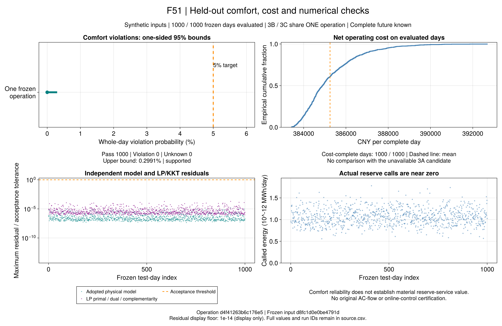

# 训练合格之后：新一天的备用与舒适评价

本页接续[同模型紧凑表示](ch07-compact-risk.md)。有限支持训练合格，还不能证明方案遇到新的光伏和备用调用时可靠。
本节点沿用已冻结的测试操作，不重选半径、初值或天气。全部数据仍为合成替代，不能推广到作者实际输入。

## 1. 首先锁定什么？

3A在预算内没有候选，保留`training_candidate_unavailable`。3B/C各100情景候选分别通过原模型、风险及费用回代，
训练费用最优性均未完成。两者的日前购电、上下备用、温区、价格、训练代表及全部舒适分支相同。
保留两个父身份，完整操作数据及哈希相同才共用计算。

```math
x^\star=(P_t^{\mathrm{DA}},R_t^{\mathrm{up}},R_t^{\mathrm{down}})_{t=1}^{T},
\qquad z_j^\star\in\{0,1\}.
\tag{R9-OS1}
```

MW原值和`z⋆`来自保存的训练解。不能将很小的备用裁成零、给3A注入共同见证，或用测试结果重选解。
固定原教学价格及CNY币种，没有重新策略出清。这里是项目操作解释，不冒用论文新式号。

## 2. 新一天怎样运行？

每个新日包含24小时的PV比例`a`和有符号调用`u`。沿用原RMS距离，等距取冻结顺序最早代表：
其它不确定字段或同一时段同时上下调用不属于该表示，提取时明确拒绝，不能静默丢掉输入。

```math
j(\xi)=\mathop{\arg\min}_{j}^{\mathrm{first}}
\sqrt{\frac{1}{2T}\sum_{t=1}^{T}
\left[(a_t-a_{jt})^2+\left(\frac{u_t-u_{jt}}{2}\right)^2\right]},
\qquad z(\xi)=z_{j(\xi)}^\star.
\tag{R9-OS2}
```

`z=0`保持原舒适温区；`z=1`使用训练风险模型已声明的较宽物理温区。标签不是实际违约事件，
也不会把有限支持风险保证自动延伸至新日。固定该分支后最小化全天补救费用：

```math
y^\star(\xi)\in\arg\min_y C(x^\star,y;\xi),\qquad
y\in\mathcal F(x^\star,\xi,z(\xi)).
\tag{R9-OS3}
```

`F`沿用固定流量、显式历史的补救物理模型。只替换光伏和调用，不改成交、负荷、设备、价格或边界。
电网采用第5章线性化关系，热网保留固定流节点法及建筑温度动态；检查通过不认证交流损耗、水压或CHP启停。
操作知道全天未来轨迹，因此不是在线控制；不执行舒适优先修复或重新分配标签。

## 3. 怎样判断可靠性？

由原变量和原始乘子独立重建物理关系、LP原始/对偶可行性、互补和费用。规定操作完成后，
才按A1的`1e-4 K`判断任一建筑/时段的实际舒适违约。不可行、超时无完整解、对偶缺失或KKT失败均记未知。

```math
N=N_{\mathrm{pass}}+N_{\mathrm{violation}}+N_{\mathrm{unknown}},\qquad
\underline p=\mathrm{CP}_{L}(N_{\mathrm{violation}},N),\quad
\overline p=\mathrm{CP}_{U}(N_{\mathrm{violation}}+N_{\mathrm{unknown}},N).
\tag{R9-OS4}
```

`CP`复用已验证的单侧95%二项界。上界≤5%才支持、下界>5%才拒绝，否则未决。
未知留在分母并全部计入保守上界；完整日是样本，不把小时当独立样本。费用缺失只报已完成日的条件分布。
费用全部完成后，均费区间沿用原轨迹协议的整日百分位自助抽样：2000次、种子2026092104、置信水平95%。
这是固定操作在合成分布下的描述性均值区间，不是训练最优性界；3B/C相同操作不能产生独立费用优势比较。
两个相同操作不是两项独立效果证据。当前备用约1e-13 MW，即使舒适通过，也不能宣称已验证有效备用服务收益。

例如，独立采样的三天没有观测到违约，单侧95%上界仍约63.2%；这说明为什么不能用前三日代替完整验收。
这个计算要求没有未知日；正式批次仍按预声明1000日评价，不按途中显著性提前停止。

```jldoctest
julia> using PaperRebuild

julia> round(r6_binomial_bounds(0, 3).upper; digits=3)
0.632
```

## 4. Julia入口与证据

```@index
Pages = ["ch07-reserve-evaluation.md"]
```

```@docs
R9ReservePolicy
r9_reserve_policy_from_training
r9_reserve_support_label
r9_reserve_evaluation_day
evaluate_r9_reserve_day
validate_r9_reserve_day
save_r9_reserve_day
read_r9_reserve_day
summarize_r9_reserve_days
```

`configs/r9/reserve-evaluation.toml`先锁定三训练槽、1000原测试日、公共源码及环境。
逐日求解与第一次核验共享60秒，装载/存档另报实际耗时；预算超出也保留。默认每次追加50日，
前三日作为同一正式样本的吞吐前缀，不能换样本。断点先核对原字节，完整失败日不重试，最后整体数值重验。
原变量/对偶完整保存；数万条可重建残差保存分组计数及极值，重读再重建全部行核对。

```sh
julia +1.12.6 --startup-file=no --project=. scripts/test_r9_evaluation.jl
julia +1.12.6 --startup-file=no --project=. scripts/check_r9_evaluation.jl
julia +1.12.6 --startup-file=no --project=. scripts/r9_reserve_evaluation.jl freeze results/summaries/r9-common-input-20260921-v2 results/summaries/r9-compact-input-20260921-v1 results/summaries/r9-compact-evidence-20260921-v1 results/summaries/new-r9-heldout-input
julia +1.12.6 --startup-file=no --project=. scripts/r9_reserve_evaluation.jl run results/summaries/new-r9-heldout-input results/runs/new-r9-heldout 3
julia +1.12.6 --startup-file=no --project=. scripts/r9_reserve_evaluation.jl run results/summaries/new-r9-heldout-input results/runs/new-r9-heldout 50
julia +1.12.6 --startup-file=no --project=. scripts/r9_reserve_evaluation.jl check results/summaries/new-r9-heldout-input results/runs/new-r9-heldout
```

解析测试覆盖两种开放求解器、CNY、时间步、不可行/未知、缺失对偶和篡改拒绝。
正式输入`results/summaries/r9-heldout-input-20260922-v2`已核验并冻结全部训练槽和1000原测试日。
1000日已按原顺序求解保存，随后由冻结源码重建全部物理、LP/KKT、费用与舒适事件。
完整独立回放实际退出0，没有更换失败日、补选轨迹或重新优化。只读统计命令为：

```sh
julia +1.12.6 --startup-file=no --project=. scripts/report_r9_evaluation.jl results/summaries/r9-heldout-input-20260922-v2 results/runs/r9-heldout-20260922-v1 results/summaries/new-heldout-report
```

报告会核验完整原值；部分运行时未执行日仍写unknown，`formal_test_complete=false`。
完整原变量与乘子保留在本地`results/runs/r9-heldout-20260922-v1`。公开报告保存逐日摘要、原文件哈希、
报告源码、统计配置和父身份；它能复核统计与图表，不能在缺少本地原值时独立重算全部约束。

## 5. 1000日实际结果

正式报告为`results/summaries/r9-heldout-report-20260922-v1`，输入为前述冻结v2。
3B与3C共用一个完全相同的操作，统计量只计算一份；3A保留无训练候选，不能填入零费用或零违约率。

| 指标 | 实际结果 | 解释 |
| --- | --- | --- |
| 独立测试日 | 1000 | 每日24小时；不是24000个独立样本 |
| 模型、LP/KKT及费用完整 | 1000/1000 | 各日补救LP最优，不表示训练承诺已最优 |
| 舒适通过／违约／未知 | 1000／0／0 | 单侧95%违约概率上界0.299125%，支持该分布下5%目标 |
| 训练分支 | 全部`z=0` | 全部沿用硬舒适温区，没有使用放宽分支 |
| 平均净运行成本 | 385248.412776 CNY/日 | 全部费用完整；不与缺失的3A比较 |
| 均费95%自助区间 | [385163.870184, 385337.925696] CNY/日 | 整日抽样2000次，不是最优性界 |
| 日费用5%／中位／95%分位 | 383728.123764／384890.581570／387949.509348 CNY | 固定操作在冻结合成分布下的费用变化 |
| 最大归一化物理残差 | 1.447404e-5 | 每条残差除以其原验收阈值，合格上限为1 |
| 最大归一化LP/KKT残差 | 1.944067e-4 | 原乘子、符号及互补关系均重新核查 |
| 最大归一化有效间隙 | 4.464359e-9 | 仅对应逐日连续补救LP |
| 每日实际调用能量范围 | [5.581711e-13, 1.779590e-12] MWh | 原值保留，量级接近零，不能解释成实质备用服务 |
| 单日预算超出 | 0/1000 | 最大建模／求解／首次检查时间12.567秒，门槛60秒 |

两批运行累计墙钟2760.650秒，包含装载、求解、首次检查和存档；其中逐日评价累计1451.538秒，
批次装载14.245秒。完整数值回放和训练时间另计，不能据此宣称训练算法或端到端速度优势。



图表读取[逐日图源](assets/r9-heldout-v1/source.csv)、[汇总值](assets/r9-heldout-v1/summary.toml)和
[图配置](assets/r9-heldout-v1/figure-config.toml)，包含全部运行ID与输入哈希，不重新求解。
残差图的1e-14下限仅用于对数显示；验收仍读取未裁剪数值。

```sh
julia +1.12.6 --startup-file=no --project=. scripts/test_r9_heldout_report.jl results/summaries/r9-heldout-input-20260922-v2 results/summaries/r9-heldout-report-20260922-v1
julia +1.12.6 --startup-file=no --project=. scripts/check_r9_heldout_artifacts.jl results/summaries/r9-heldout-input-20260922-v2 results/summaries/r9-heldout-report-20260922-v1 docs/src/assets/r9-heldout-v1
julia +1.12.6 --startup-file=no --project=docs scripts/plot_r9_evaluation.jl results/summaries/r9-heldout-report-20260922-v1 results/runs/new-heldout-figures
```

摘要检查核对字节、统计、身份和声明；它与前面的完整原值回放职责不同。VS Code提供相应报告测试、
产物检查和F51重绘任务；目标目录必须新建，不能覆盖原图或原报告。

## 6. 这批实验说明什么？

**已支持：**在固定候选、冻结合成分布和完整未来已知的操作下，1000个新日都找到通过采用模型及LP最优性检查的补救调度。
硬舒适分支也全部可行，因而这批没有观察到实际舒适违约。费用分布和统计不确定性现在可以核查。

**尚未支持：**备用承诺接近零，所有日均沿硬舒适分支运行；这一成功没有展示“承担有意义的备用调用，
再以机会约束权衡舒适风险”的效果。它不能证明3B/C的风险设计等价，也不能比较它们的经济优势。
3A未取得候选、3B/C训练间隙未闭合、原交流和完整热水力未认证，这些限制并未因1000日通过而消失。

下一步将此负边界与正面可行证据共同归档，接续第7.3节的规模分布协调与全文交付。
若未来研究有效备用承诺，应先明确新的承诺或价格机制与预先冻结的对照，不能事后调整本批数据制造收益。
本节点任务为`docs/agent/tasks/2026-09-22-r9-heldout-results.md`；
R9其它规模范围及[全文覆盖](reproduction-coverage.md)仍未完成。
