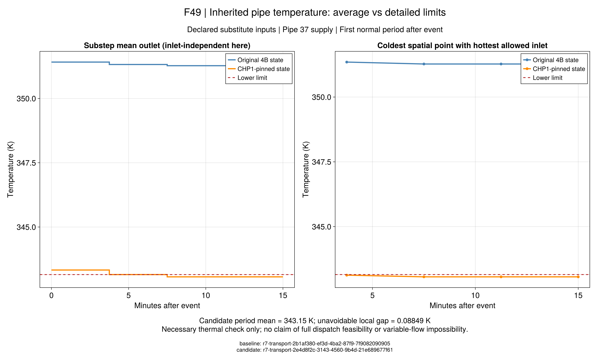

# 灾前热状态与详细恢复的相容性

前批的[温度反例](@ref r9-handoff-counterexample)显示：
15分钟出口平均达到70℃，仍可能留下低于70℃的水段。灾后入口的热水需要时间才能到达，
因此应在选择灾前轨迹时考虑恢复所需的温区，而不能等故障发生后任意重置初态。

本版本`r9_prescribed_detailed_preplan_v1`复用已验证的[R7共同详细规划](ch06-linked-planning.md)。
原`r9_prescribed_preplan_v1`及全部结果保留，二者代表不同的恢复模型。
原文6-70/71提供状态继承依据；完整水团、子步平均节点和管内空间温区属于本项目详细参考解释。
本改动不声称作者原近似模型应自动满足所有新增条件。

## 1. 什么仍然共用？

`x`是原正常期启停、出力和入口温度，`θ_s(x)`是从同一初始空间分布及正常历史回放的事件初态。
`m_{sf}`为显式给定的恢复流量，`y_{sf}`为该故障可独立调整的恢复决策。

```math
x\in\mathcal X_{\mathrm{prescribed}},\qquad
\theta_s=\Phi_s(x),\qquad
y_{sf}\in\mathcal Y^{\mathrm{detail}}_{sf}(\theta_s(x),x;m_{sf}).
\tag{R9-DP1}
```

正常模型、负荷、容量、费用和温区数值均保持。详细恢复块替换原聚合热块，
纳入逐管散热、供回水输运、子步混合与热源/负荷端口，以及每段管内温区。
它仍是给定流量、零节点热容的条件模型，未认证完整水力、连续节点动态或交流电网。
给定流量后热输运对入口温度是仿射关系，实际约束类型检查须确认LP或MILP。

## 2. 三种目标怎样比较？

沿用原4A/4B/4C的明确项目命名。4A只包含原正常基准；4B取同一事件各故障的最大关键失供；
4C用逐故障详细见证检查门槛。原标签冲突仍保留，故障不是同时发生，也没有补造故障概率。

```math
\begin{aligned}
\mathrm{4B_{detail}}:\quad &\min C(x)+\rho\sum_s\zeta_s,
&&0\le\zeta_s\le\overline E_s,\quad L_{sf}(y_{sf})\le\zeta_s;\\
\mathrm{4C_{detail}}:\quad &\min C(x),
&&L_{sf}(y_{sf})\le\overline L_s.
\end{aligned}
\tag{R9-DP2}
```

`C`和罚费使用输入币种，`L`、`ζ`及门槛为MWh。正常子记录只保存运行成本，
不把罚费混入设备费用；见证没有各自的失供最优下界。
不同热模型的目标差不是同模型最优性间隙，也不能只用这个差值解释储热收益。

## 3. 一个不需要优化的必要检查

非负散热和线性平流保持温度顺序。固定流量及初态后，分别以全最低、全最高合法入口回放，
得到`T⁻`、`T⁺`。任何可用入口在每个相同质量位置都被两者夹住。

```math
T^-\le T\le T^+,\qquad
\max\{\underline T-\min_{\xi}T^+(\xi),
\max_{\xi}T^-(\xi)-\overline T,0\}\le\varepsilon_T.
\tag{R9-DH1}
```

这里`ξ`是管道质量坐标，单位kg；温度为K，`ε_T=10^{-4}` K沿用A1。
出口子步平均另外按同样夹界检查。两个水团列表可能因为合并产生不同分段，
实现比较点态极值，不将两次回放的第几个水段直接配对。

最热入口下仍有过冷点，说明该继承状态和流量不能满足详细温区。
通过只表示没有这种必要条件冲突；设备容量、电网、混合和交付热量仍需独立验证。
可以用原不可行状态做检查，不要求先取得一套优化调度。

## 4. 怎样验证新计划？

```math
\widehat\theta_s=\Phi_s(\widehat x),\qquad
\widehat L_{sf}=\Delta t\sum_{t,\omega}p_\omega
\widehat P^{\mathrm{critical,shed}}_{sf,t,\omega},\qquad
\widehat J=\widehat C+\rho\sum_s\widehat\zeta_s.
\tag{R9-DP3}
```

验证器从保存数值重新回放完整历史，不读取建模矩阵；逐项检查历史连接、详细管温、设备与网络。
主问题中的恢复是存在性见证。取得新正常候选后，还要固定该计划并分别最小化三个故障的失供。
无解或超时状态保留，不能用旧经济计划替代，也不能将缺失失供记为零。

## 5. Julia入口

```@index
Pages = ["ch07-resilience-detailed.md"]
```

```@docs
r9_detailed_preplan_spec
build_r9_detailed_preplan
solve_r9_detailed_preplan
validate_r9_detailed_preplan
save_r9_detailed_preplan
read_r9_detailed_preplan
r9_handoff_temperature_check
```

```sh
julia +1.12.6 --startup-file=no --project=. scripts/test_r9_detailed_preplan.jl
julia +1.12.6 --startup-file=no --project=. scripts/check_r9_detailed_preplan.jl
julia +1.12.6 --startup-file=no --project=. scripts/r9_detailed_preplan_study.jl freeze results/runs/new-detailed-input
julia +1.12.6 --startup-file=no --project=tools/solvers scripts/run_r9_detailed_preplan.jl results/runs/new-detailed-input results/runs/new-detailed-penalty penalty
```

规格由`configs/r9/detailed-preplan-study.toml`冻结：原44电/38热节点、[10,14)窗口及三个故障不变，
恢复流量沿原正常值，罚值10000 CNY/MWh、门槛2 MWh、每15分钟4个子步。
先执行详细罚费与详细门槛两项，原经济基准保留，不重新调整参数来制造改善。
每方法从导入前开始共享600秒，主阶段至360秒、三项独立恢复至540秒，余下用于证据保存。
实际结果与未完成步骤同步记录于`docs/agent/tasks/2026-09-22-r9-detailed-preplan.md`。

## 6. 正式结果说明什么？

输入为44电/38热节点上的**合成替代数据**，不是作者完整原始输入。新输入在优化前冻结于
`results/summaries/r9-detailed-preplan-input-20260922-v1`，父输入、三个故障、流量和门槛保持。
罚费方案与门槛方案分别用179.636秒和82.687秒完成整个方法，均在600秒预算内。

### 6.1 详细恢复可以接入灾前决策，但保供门槛仍未达到

详细罚费方案的正常费用为498199.106444 CNY/日，罚费105521.906178 CNY，
总目标603721.012621 CNY；该给定流量MILP的上下界在数值精度内一致。
固定所得灾前计划，三个故障的独立详细恢复均为`solver_optimal`，通过采用模型、必要温区和有效间隙检查。

| 故障 | 原4B计划的独立详细失供（MWh） | 新详细规划的独立详细失供（MWh） | 新方案减少量（MWh） |
|---|---:|---:|---:|
| 仅外网中断 | 9.521441 | 10.141925 | −0.620483 |
| 外网中断及线路1–2故障 | 10.416971 | 10.437326 | −0.020355 |
| 外网中断及所选原文事件故障 | 10.682204 | 10.552191 | 0.130013 |

正常费用增加715.508570 CNY/日，最坏详细失供减少0.130013 MWh；另外两个故障略有变差。
这支持“以最坏故障为目标会在不同故障之间取舍”，不能表述为每个故障都改善。
比较表来自同一详细恢复口径；原聚合目标与新详细目标的差不能当作最优性间隙。
新计划重新选择了灾前出力和热历史，不是对原开机候选保持其他控制不变的单因素修补。

详细门槛方案正式返回`infeasible_certified`，没有候选；其三个独立恢复标记为
`primary_candidate_unavailable`，没有执行，失供保留缺失值。该状态说明在本次给定流量、
所选故障和采用模型内，2 MWh要求不可行，不证明任意流量、其他容量或真实系统均无法保供。
10.552191 MWh是费用加罚费最优计划的最坏失供，**不是详细模型的失供最小值下界**。

### 6.2 已解释一个热不可行原因，尚未解释电力失供下限

原强制CHP1开机候选的管37继承水段存在0.088490 K低温冲突；即使灾后入口始终取最高合法温度，
首时段该水段仍来不及被替换。15分钟出口平均343.15 K掩盖了343.061510 K的子步及空间低温。
必要检查在原4B状态发现零冲突，在原开机候选发现八条冲突；旧失败与原值保留。



F49来自已封存的旧状态反例，不是新详细规划的调度曲线。图源`source.csv`、生成脚本和配置与图片同目录保存。
图v1的清单写入时错误纳入了空清单自身，交付检查未通过；原图保留，新v2先计算哈希再写入清单，科学图源不变。
图中上下限采用同一A1；全幅温度差较大，低温差的精确值请结合上文数值和图源读取。
诊断包`results/summaries/r9-handoff-evidence-20260922-v1`保存原IIS、输入、冻结源码和独立回放，
68项文件哈希与移位重验已通过；这给出一个充分冲突，不声称IIS导出文件仅有两行。

原聚合最坏失供10.319838 MWh的网络或设备端口原因仍未解释。上述温区冲突不能替代电力原因，
也不能把新计划下的模型可行误写成零失供。

## 7. 证据重读与下一步

新正式包`results/summaries/r9-detailed-preplan-evidence-20260922-v1`保存两方案及三个独立恢复的原值，
`summary.csv`区分主问题CNY目标和恢复MWh目标，`comparison.csv`给出逐故障同口径比较。
168项文件哈希和冻结源码移位数值重验通过，无须重新优化。主问题行的`handoff_necessary_pass=false`
表示该独立预检未在主问题行执行；应读取三条详细恢复行，而不能据此覆盖完整模型检查。

```sh
julia +1.12.6 --startup-file=no --project=. scripts/check_r9_detailed_artifacts.jl
julia +1.12.6 --startup-file=no --project=. scripts/r9_handoff_evidence.jl check results/summaries/r9-handoff-evidence-20260922-v1 --replay
julia +1.12.6 --startup-file=no --project=. scripts/r9_detailed_preplan_evidence.jl check results/summaries/r9-detailed-preplan-evidence-20260922-v1 --replay
julia +1.12.6 --startup-file=no --project=docs scripts/plot_r9_handoff.jl results/summaries/r9-handoff-evidence-20260922-v1 results/runs/new-handoff-figure
```

下一步先从已保存最坏故障提取电力分区、可达发电、联络线路容量及CHP热端口限制，
形成可独立核验的供能下界。只有证据表明某个项目假设不合理时，才建立显式新版本对照。
随后按[全文覆盖清单](reproduction-coverage.md)推进剩余故障、规模算法和跨章教程；
不以继续加罚值、改变负荷或放宽温度阈值代替原因解释。
