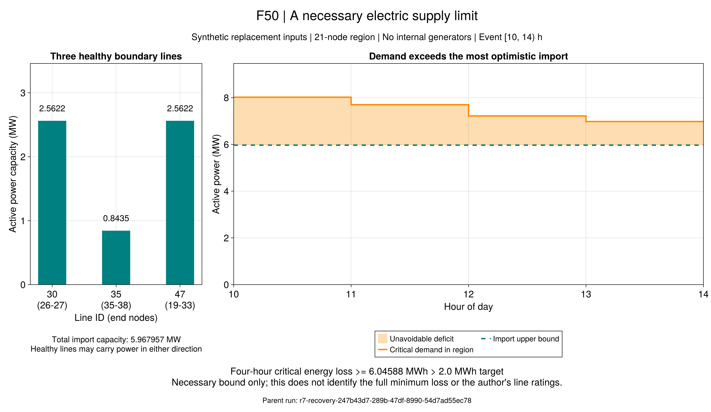

# 关键负荷为何仍有缺口：区域供能下界

本页接续[详细灾前规划](ch07-resilience-detailed.md)。2 MWh门槛没有达到，需要先判断输入中的网络能否送达足够电力。
方法从已采用的节点功率守恒出发，不改变调度、负荷、容量、罚值或验收阈值。
它不需要商用求解器；故障后管温、开机方案与算法搜索如何变化，都不能违反同一组硬容量界。

## 1. 把一个区域看作只有几个入口的用电区

用`U`表示一组电节点，`δγ(U)`表示连接该区域内外、且没有故障的线路。
先给系统更多能力：所有健康线路都允许双向使用，区域内CHP忽略启停和爬坡，电池每时段均可额定放电；
暂时忽略普通用电、电锅炉耗电、热网、电压、无功和径向拓扑约束。外部电网仍按R7恢复模型全断。

这个更宽的可行域包含原恢复域。若它也无法送达全部关键负荷，原模型至少存在同样的缺口。
这里没有假定原调度解的开关状态是唯一选择，也没有把复杂调度的求解失败当作下界。

```math
\begin{aligned}
\overline C_U(\gamma)&=\sum_{\ell\in\delta_\gamma(U)}\overline P_\ell,\\
\underline P^{\mathrm{shed}}_{U,t,\omega}
&=\left[\sum_{i\in U}P^{\mathrm{critical}}_{i,t}
-\overline G_{U,t,\omega}-\overline C_U(\gamma)\right]_+.
\end{aligned}
\tag{R9-EC1}
```

`[a]₊=max(a,0)`；各功率单位均为MW。`Ḡ`包括区域内CHP/GT的额定有功、降额后的情景PV、以及电池额定放电上界。
电池能量耗尽、CHP无法开机等只会进一步缩小真实供能能力，因此忽略这些条件仍可用于必要下界。
有向原线路也按双向处理，得到可能偏弱的安全下界。

依据是采用的节点有功平衡（6-19）、支路容量（6-24/25）及设备出力边界，另用项目R9-RL1区分关键与普通负荷。
区域内部支路的功率在求和时抵消；剩下的净进口不会超过健康边界容量之和。
原式的方向/开关解释仍见第6章台账，本页没有重新指定原式版本。

## 2. 从MW积分成MWh

```math
L^{\mathrm{critical}}\ge\underline L_U
=\Delta t\sum_{\omega}p_\omega\sum_t
\underline P^{\mathrm{shed}}_{U,t,\omega}.
\tag{R9-EC2}
```

`Δt`是小时，`pω`是原输入的场景概率，`L`为MWh。不能把功率差直接与2 MWh比较。
实现把保存的浮点输入转换为精确有理数计算积分，最终显示下界时向下舍入。
PV系数沿用模型中的浮点降额乘积。证书同时记录分子/分母，便于独立检查舍入方向。

`strict_threshold_excluded`表示严格数学下界超过门槛；`threshold_excluded`还要超过R7规划已有的
`1e-6 × (1 + max(1, limit))` MWh验收余量。两者分开，A1/A2均未放宽。
零下界不证明调度可行；正下界也不等于原问题的精确最小失供。

## 3. 区域与容量怎样选定？

开发最大流检查找到了一个21节点区域。正式协议`configs/r9/electric-cut-study.toml`将该区域明确固定，
并对原三个故障统一评价。它是**事后寻找并验证的确定性证书**，不是预注册统计效果实验。
任何合法区域都能给出上述必要条件，证书的正确性不依赖最大流算法，也不宣称本区域给出了所有可能区域中的最强界。

原论文拓扑与设备信息可追溯，但当前材料缺少完整逐线额定容量，见`docs/reading/ch07/inputs.toml`的R9-D01。
本输入的原树容量按正常绝对负荷与接入设备包络乘1.5构造，联络线容量取其原树路径上最小容量。
这些规则在本次分析前已经冻结；正常网络够用，不保证故障后仍能从联络线转供全部关键负荷。
因此，下界首先解释**这套替代系统**，不能据此否定作者使用其他容量的算例。

报告已逐条重算全部47条容量，最大差为0 MW，并用原构造记录的哈希核验协议和来源。
新证书与原聚合/详细恢复结果分别保存，不把后验诊断写回旧运行。

## 4. Julia接口与验证

```@index
Pages = ["ch07-resilience-electric-cut.md"]
```

```@docs
r9_electric_cut_bound
validate_r9_electric_cut_bound
```

```sh
julia +1.12.6 --startup-file=no --project=. scripts/test_r9_electric_cut.jl
julia +1.12.6 --startup-file=no --project=. scripts/check_r9_electric_cut.jl
julia +1.12.6 --startup-file=no --project=. scripts/r9_electric_cut_evidence.jl check results/summaries/r9-electric-cut-evidence-20260922-v1 --replay
julia +1.12.6 --startup-file=no --project=. scripts/check_r9_electric_cut_artifacts.jl
julia +1.12.6 --startup-file=no --project=docs scripts/plot_r9_electric_cut.jl results/summaries/r9-electric-cut-evidence-20260922-v1 results/runs/new-electric-cut-figure
```

专项检查覆盖手算、独立完整有功运输LP、不同故障、方向放松、储能能量放松、PV情景概率、时间步换算及保存后篡改。
证书重读只核对输入与这个明确公式；其独立性来自功率守恒推导和与原调度建模分开的网络LP对照。
完整热网、电压和无功仍需使用对应验证器，不能用网络割替代这些检查。

## 5. 结果：当前替代容量已经排除2 MWh门槛

正式证据包为`results/summaries/r9-electric-cut-evidence-20260922-v1`。三个父聚合恢复的原数值
经冻结代码重读均通过采用模型；新区域证书、容量来源和37项文件哈希的换目录重验通过。
没有重新优化原计划，也没有用新结论改写旧结果。

| 故障（均含外部电网中断） | 区域必要失供下界（MWh） | 原已存聚合恢复失供（MWh） | 此区域是否排除2 MWh |
| --- | ---: | ---: | --- |
| 内部线路健康 | 0 | 0 | 否，仅凭此界不能判定 |
| 线路1–2故障 | 0 | 9.447932 | 否，仅凭此界不能解释缺口 |
| 所选原文事件故障 | 6.045880 | 10.319838 | 是，且超过既有验收余量 |

所选事件后，该21节点区域没有内部发电，健康边界只剩线路30（26–27）、35（35–38）、47（19–33），
额定有功分别为2.562236、0.843486、2.562236 MW，总进口上限5.967957 MW。
10–14时的四个小时关键需求分别为8.020833、7.700000、7.218750、6.978125 MW，
每个小时都超过进口上限；原15分钟网格上的缺口积分为6.045880 MWh。



F50只读封存数值；`source.csv`保留全部16个时间步，`boundary.csv`保留三条线路的原容量，
图片同目录保存原绘图脚本、输入/父运行身份、配置及哈希。图中没有将原10.319838 MWh绘成容量证书。

### 5.1 支持哪些解释？

1. **该输入至少存在一个无法满足2 MWh要求的声明故障。** 下界来自守恒和容量，
   在同一负荷、源接入及健康线路容量下，增加区域外发电、调整热控制或搜索其他开关方案都不能绕过它。
   若要求所有声明故障均达标，一个这样的反例已足以排除该要求；它不计算全故障最坏值。
2. **原正常容量构造不等于故障后保供设计。** 原树按下游绝对负荷及全部设备包络设计，
   联络容量采用路径最小值；断开上游后可用转供能力可能不足。全部47条容量来源核验一致，
   因而这是当前已声明替代输入的限制，不是证书阶段偶然改小了线路。
3. **热继承冲突与电力送达能力是两个不同问题。** 上一批修复采用模型的详细热相容性后，
   新罚费计划最坏详细失供为10.552191 MWh；热核合格仍不能消除电力区域缺口。

### 5.2 仍然不能推出什么？

- 6.045880 MWh不是原问题精确最优值；它没有解释原聚合10.319838 MWh与该界之间约4.274 MWh的全部差额。
- 原文没有提供本项目已取得的完整逐线容量。此结果不证明作者输入也受同样限制，更不能据此否定作者方法。
- 同一区域在另两故障下给出零界，不代表它们没有其他容量、设备或拓扑约束。
- 三个声明故障、给定流量详细规划及本次必要电力界，不等于全部故障控制域、交流电网或完整热水力认证。

## 6. 接下来怎样推进？

本节点将“为何2 MWh未达标”的一个充分原因从求解状态提升为可独立重算的输入证据。
先封存解释、源码、原值和图表；不继续调整罚值或负荷来追赶作者数字。
若后续研究线路容量或资源接入变化，应先声明新的设计问题和参数版本，原负结果保持。

接续优先完成第7.4节已冻结训练候选的样本外评价，并在R10整理各章“已验证机制、采用假设、负结果、
尚未闭合的算法或数据”与可重复运行入口。第7.5节更完整控制域及第7.3节规模分布/议价仍按
[全文覆盖清单](reproduction-coverage.md)单列，不以本次原因解释宣布整章或全文完成。
工程收尾实时状态见`docs/agent/tasks/2026-09-22-r9-electric-cut.md`。
